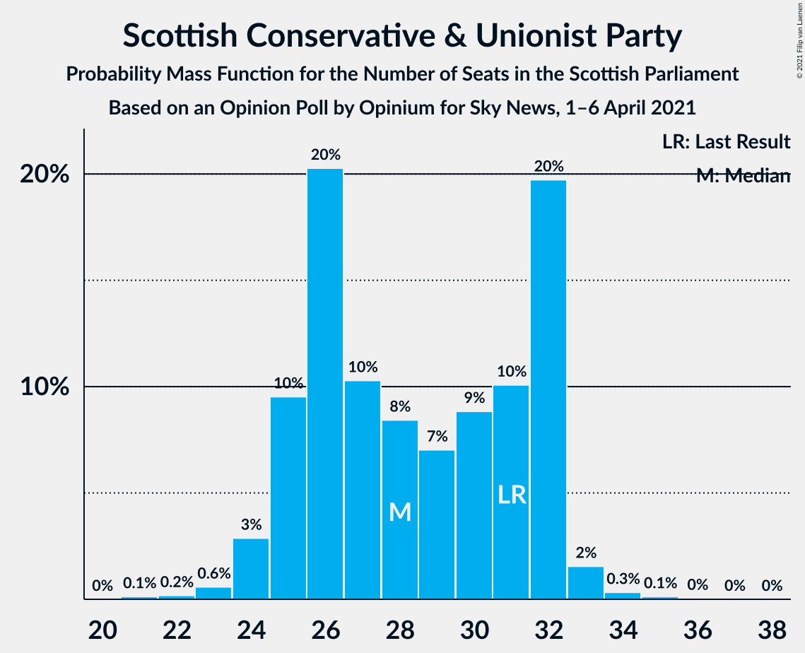

# Opinion Poll by Opinium for Sky News, 1–6 April 2021

<a href="#voting-intentions">Voting Intentions</a> | <a href="#seats">Seats</a> | <a href="#coalitions">Coalitions</a> | <a href="#technical-information">Technical Information</a>

## Voting Intentions

### Confidence Intervals

| Party | Last Result | Poll Result | 80% Confidence Interval | 90% Confidence Interval | 95% Confidence Interval | 99% Confidence Interval |
|:-----:|:-----------:|:-----------:|:-----------------------:|:-----------------------:|:-----------------------:|:-----------------------:|
| Scottish National Party | 41.7% | 44.0% | 42.0–46.0% |41.5–46.6% |41.0–47.1% |40.0–48.0% |
| Scottish Conservative & Unionist Party | 22.9% | 22.0% | 20.4–23.7% |20.0–24.2% |19.6–24.6% |18.8–25.5% |
| Scottish Labour | 19.1% | 17.0% | 15.6–18.6% |15.2–19.1% |14.8–19.4% |14.2–20.2% |
| Scottish Greens | 6.6% | 7.0% | 6.1–8.2% |5.8–8.5% |5.6–8.8% |5.2–9.4% |
| Scottish Liberal Democrats | 5.2% | 5.0% | 4.2–6.0% |4.0–6.2% |3.8–6.5% |3.5–7.0% |
| Alba Party | 0.0% | 2.0% | 1.5–2.6% |1.4–2.8% |1.3–3.0% |1.1–3.4% |

*Note:* The poll result column reflects the actual value used in the calculations. Published results may vary slightly, and in addition be rounded to fewer digits.

## Seats

### Confidence Intervals

| Party | Last Result | Median | 80% Confidence Interval | 90% Confidence Interval | 95% Confidence Interval | 99% Confidence Interval |
|:-----:|:-----------:|:------:|:-----------------------:|:-----------------------:|:-----------------------:|:-----------------------:|
| <a href="#scottish-national-party">Scottish National Party</a> | 63 | 68 | 65–72 |64–73 |64–73 |63–74 |
| <a href="#scottish-conservative-&-unionist-party">Scottish Conservative & Unionist Party</a> | 31 | 28 | 25–32 |25–32 |24–32 |23–34 |
| <a href="#scottish-labour">Scottish Labour</a> | 24 | 22 | 17–24 |17–24 |17–25 |17–27 |
| <a href="#scottish-greens">Scottish Greens</a> | 6 | 6 | 4–10 |3–10 |3–10 |3–10 |
| <a href="#scottish-liberal-democrats">Scottish Liberal Democrats</a> | 5 | 5 | 2–5 |2–5 |2–6 |2–6 |
| <a href="#alba-party">Alba Party</a> | 0 | 0 | 0 |0 |0 |0 |

### Scottish National Party

*For a full overview of the results for this party, see the [Scottish National Party](party-scottishnationalparty.html) page.*

| Number of Seats | Probability | Accumulated | Special Marks |
|:---------------:|:-----------:|:-----------:|:-------------:|
| 60 | 0.1% | 100% |  |
| 61 | 0.1% | 99.9% |  |
| 62 | 0.3% | 99.8% |  |
| 63 | 2% | 99.6% | Last Result |
| 64 | 5% | 98% |  |
| 65 | 19% | 93% | Majority |
| 66 | 9% | 74% |  |
| 67 | 11% | 65% |  |
| 68 | 7% | 54% | Median |
| 69 | 9% | 47% |  |
| 70 | 9% | 38% |  |
| 71 | 17% | 29% |  |
| 72 | 6% | 11% |  |
| 73 | 5% | 6% |  |
| 74 | 1.1% | 1.2% |  |
| 75 | 0.1% | 0.1% |  |
| 76 | 0% | 0% |  |

### Scottish Conservative & Unionist Party

*For a full overview of the results for this party, see the [Scottish Conservative & Unionist Party](party-scottishconservativeunionistparty.html) page.*

| Number of Seats | Probability | Accumulated | Special Marks |
|:---------------:|:-----------:|:-----------:|:-------------:|
| 21 | 0.1% | 100% |  |
| 22 | 0.2% | 99.9% |  |
| 23 | 0.6% | 99.7% |  |
| 24 | 3% | 99.1% |  |
| 25 | 10% | 96% |  |
| 26 | 20% | 87% |  |
| 27 | 10% | 66% |  |
| 28 | 8% | 56% | Median |
| 29 | 7% | 48% |  |
| 30 | 9% | 41% |  |
| 31 | 10% | 32% | Last Result |
| 32 | 20% | 22% |  |
| 33 | 2% | 2% |  |
| 34 | 0.3% | 0.5% |  |
| 35 | 0.1% | 0.2% |  |
| 36 | 0% | 0.1% |  |
| 37 | 0% | 0% |  |

### Scottish Labour

*For a full overview of the results for this party, see the [Scottish Labour](party-scottishlabour.html) page.*

| Number of Seats | Probability | Accumulated | Special Marks |
|:---------------:|:-----------:|:-----------:|:-------------:|
| 16 | 0.1% | 100% |  |
| 17 | 12% | 99.9% |  |
| 18 | 9% | 88% |  |
| 19 | 8% | 79% |  |
| 20 | 7% | 71% |  |
| 21 | 7% | 64% |  |
| 22 | 29% | 57% | Median |
| 23 | 12% | 28% |  |
| 24 | 12% | 17% | Last Result |
| 25 | 3% | 5% |  |
| 26 | 1.3% | 2% |  |
| 27 | 0.5% | 0.6% |  |
| 28 | 0.1% | 0.1% |  |
| 29 | 0% | 0% |  |

### Scottish Greens

*For a full overview of the results for this party, see the [Scottish Greens](party-scottishgreens.html) page.*

| Number of Seats | Probability | Accumulated | Special Marks |
|:---------------:|:-----------:|:-----------:|:-------------:|
| 2 | 0.1% | 100% |  |
| 3 | 5% | 99.9% |  |
| 4 | 11% | 94% |  |
| 5 | 27% | 84% |  |
| 6 | 10% | 57% | Last Result, Median |
| 7 | 6% | 47% |  |
| 8 | 5% | 41% |  |
| 9 | 7% | 36% |  |
| 10 | 29% | 29% |  |
| 11 | 0.2% | 0.2% |  |
| 12 | 0% | 0% |  |

### Scottish Liberal Democrats

*For a full overview of the results for this party, see the [Scottish Liberal Democrats](party-scottishliberaldemocrats.html) page.*

| Number of Seats | Probability | Accumulated | Special Marks |
|:---------------:|:-----------:|:-----------:|:-------------:|
| 2 | 11% | 100% |  |
| 3 | 10% | 89% |  |
| 4 | 16% | 79% |  |
| 5 | 59% | 63% | Last Result, Median |
| 6 | 4% | 4% |  |
| 7 | 0.2% | 0.4% |  |
| 8 | 0.1% | 0.1% |  |
| 9 | 0% | 0% |  |

### Alba Party

*For a full overview of the results for this party, see the [Alba Party](party-albaparty.html) page.*

| Number of Seats | Probability | Accumulated | Special Marks |
|:---------------:|:-----------:|:-----------:|:-------------:|
| 0 | 100% | 100% | Last Result, Median |

## Coalitions

### Confidence Intervals

| Coalition | Last Result | Median | Majority? | 80% Confidence Interval | 90% Confidence Interval | 95% Confidence Interval | 99% Confidence Interval |
|:---------:|:-----------:|:------:|:---------:|:-----------------------:|:-----------------------:|:-----------------------:|:-----------------------:|
| Scottish National Party – Scottish Greens – Alba Party | 69 | 75 | 100% | 70–80 | 69–81 | 69–82 | 68–83 |
| Scottish National Party – Scottish Greens | 69 | 75 | 100% | 70–80 | 69–81 | 69–82 | 68–83 |
| Scottish National Party – Alba Party | 63 | 68 | 93% | 65–72 | 64–73 | 64–73 | 63–74 |
| Scottish National Party | 63 | 68 | 93% | 65–72 | 64–73 | 64–73 | 63–74 |
| Scottish Conservative & Unionist Party – Scottish Labour – Scottish Liberal Democrats | 60 | 54 | 0% | 49–59 | 48–60 | 47–60 | 46–61 |
| Scottish Conservative & Unionist Party – Scottish Labour | 55 | 49 | 0% | 45–54 | 44–55 | 43–55 | 43–57 |
| Scottish Labour – Scottish Greens – Scottish Liberal Democrats | 35 | 32 | 0% | 29–35 | 28–37 | 27–38 | 25–39 |
| Scottish Conservative & Unionist Party – Scottish Liberal Democrats | 36 | 33 | 0% | 29–37 | 28–37 | 28–37 | 26–38 |
| Scottish Labour – Scottish Liberal Democrats | 29 | 26 | 0% | 22–29 | 21–29 | 21–30 | 19–32 |

### Scottish National Party – Scottish Greens – Alba Party

| Number of Seats | Probability | Accumulated | Special Marks |
|:---------------:|:-----------:|:-----------:|:-------------:|
| 66 | 0.1% | 100% |  |
| 67 | 0.3% | 99.9% |  |
| 68 | 1.3% | 99.6% |  |
| 69 | 4% | 98% | Last Result |
| 70 | 10% | 94% |  |
| 71 | 4% | 85% |  |
| 72 | 6% | 80% |  |
| 73 | 6% | 75% |  |
| 74 | 8% | 68% | Median |
| 75 | 15% | 60% |  |
| 76 | 13% | 45% |  |
| 77 | 8% | 32% |  |
| 78 | 6% | 24% |  |
| 79 | 5% | 18% |  |
| 80 | 5% | 13% |  |
| 81 | 5% | 8% |  |
| 82 | 2% | 3% |  |
| 83 | 0.9% | 1.0% |  |
| 84 | 0.1% | 0.1% |  |
| 85 | 0% | 0% |  |

### Scottish National Party – Scottish Greens

| Number of Seats | Probability | Accumulated | Special Marks |
|:---------------:|:-----------:|:-----------:|:-------------:|
| 66 | 0.1% | 100% |  |
| 67 | 0.3% | 99.9% |  |
| 68 | 1.3% | 99.6% |  |
| 69 | 4% | 98% | Last Result |
| 70 | 10% | 94% |  |
| 71 | 4% | 85% |  |
| 72 | 6% | 80% |  |
| 73 | 6% | 75% |  |
| 74 | 8% | 68% | Median |
| 75 | 15% | 60% |  |
| 76 | 13% | 45% |  |
| 77 | 8% | 32% |  |
| 78 | 6% | 24% |  |
| 79 | 5% | 18% |  |
| 80 | 5% | 13% |  |
| 81 | 5% | 8% |  |
| 82 | 2% | 3% |  |
| 83 | 0.9% | 1.0% |  |
| 84 | 0.1% | 0.1% |  |
| 85 | 0% | 0% |  |

### Scottish National Party – Alba Party

| Number of Seats | Probability | Accumulated | Special Marks |
|:---------------:|:-----------:|:-----------:|:-------------:|
| 60 | 0.1% | 100% |  |
| 61 | 0.1% | 99.9% |  |
| 62 | 0.3% | 99.8% |  |
| 63 | 2% | 99.6% | Last Result |
| 64 | 5% | 98% |  |
| 65 | 19% | 93% | Majority |
| 66 | 9% | 74% |  |
| 67 | 11% | 65% |  |
| 68 | 7% | 54% | Median |
| 69 | 9% | 47% |  |
| 70 | 9% | 38% |  |
| 71 | 17% | 29% |  |
| 72 | 6% | 11% |  |
| 73 | 5% | 6% |  |
| 74 | 1.1% | 1.2% |  |
| 75 | 0.1% | 0.1% |  |
| 76 | 0% | 0% |  |

### Scottish National Party

| Number of Seats | Probability | Accumulated | Special Marks |
|:---------------:|:-----------:|:-----------:|:-------------:|
| 60 | 0.1% | 100% |  |
| 61 | 0.1% | 99.9% |  |
| 62 | 0.3% | 99.8% |  |
| 63 | 2% | 99.6% | Last Result |
| 64 | 5% | 98% |  |
| 65 | 19% | 93% | Majority |
| 66 | 9% | 74% |  |
| 67 | 11% | 65% |  |
| 68 | 7% | 54% | Median |
| 69 | 9% | 47% |  |
| 70 | 9% | 38% |  |
| 71 | 17% | 29% |  |
| 72 | 6% | 11% |  |
| 73 | 5% | 6% |  |
| 74 | 1.1% | 1.2% |  |
| 75 | 0.1% | 0.1% |  |
| 76 | 0% | 0% |  |

### Scottish Conservative & Unionist Party – Scottish Labour – Scottish Liberal Democrats

| Number of Seats | Probability | Accumulated | Special Marks |
|:---------------:|:-----------:|:-----------:|:-------------:|
| 45 | 0.1% | 100% |  |
| 46 | 0.9% | 99.9% |  |
| 47 | 2% | 99.0% |  |
| 48 | 5% | 97% |  |
| 49 | 5% | 92% |  |
| 50 | 5% | 87% |  |
| 51 | 6% | 82% |  |
| 52 | 8% | 76% |  |
| 53 | 13% | 68% |  |
| 54 | 15% | 55% |  |
| 55 | 8% | 40% | Median |
| 56 | 6% | 32% |  |
| 57 | 6% | 25% |  |
| 58 | 4% | 20% |  |
| 59 | 10% | 15% |  |
| 60 | 4% | 6% | Last Result |
| 61 | 1.3% | 2% |  |
| 62 | 0.3% | 0.4% |  |
| 63 | 0.1% | 0.1% |  |
| 64 | 0% | 0% |  |

### Scottish Conservative & Unionist Party – Scottish Labour

| Number of Seats | Probability | Accumulated | Special Marks |
|:---------------:|:-----------:|:-----------:|:-------------:|
| 41 | 0.1% | 100% |  |
| 42 | 0.4% | 99.9% |  |
| 43 | 3% | 99.6% |  |
| 44 | 5% | 96% |  |
| 45 | 5% | 92% |  |
| 46 | 5% | 87% |  |
| 47 | 6% | 82% |  |
| 48 | 13% | 76% |  |
| 49 | 17% | 64% |  |
| 50 | 11% | 47% | Median |
| 51 | 6% | 36% |  |
| 52 | 7% | 30% |  |
| 53 | 4% | 23% |  |
| 54 | 12% | 19% |  |
| 55 | 5% | 7% | Last Result |
| 56 | 2% | 2% |  |
| 57 | 0.5% | 0.7% |  |
| 58 | 0.1% | 0.2% |  |
| 59 | 0% | 0% |  |

### Scottish Labour – Scottish Greens – Scottish Liberal Democrats

| Number of Seats | Probability | Accumulated | Special Marks |
|:---------------:|:-----------:|:-----------:|:-------------:|
| 24 | 0.1% | 100% |  |
| 25 | 0.5% | 99.9% |  |
| 26 | 0.6% | 99.4% |  |
| 27 | 2% | 98.8% |  |
| 28 | 2% | 97% |  |
| 29 | 6% | 95% |  |
| 30 | 7% | 89% |  |
| 31 | 10% | 82% |  |
| 32 | 31% | 72% |  |
| 33 | 17% | 42% | Median |
| 34 | 10% | 25% |  |
| 35 | 6% | 15% | Last Result |
| 36 | 3% | 9% |  |
| 37 | 3% | 6% |  |
| 38 | 2% | 3% |  |
| 39 | 0.9% | 1.1% |  |
| 40 | 0.1% | 0.2% |  |
| 41 | 0% | 0% |  |

### Scottish Conservative & Unionist Party – Scottish Liberal Democrats

| Number of Seats | Probability | Accumulated | Special Marks |
|:---------------:|:-----------:|:-----------:|:-------------:|
| 25 | 0.1% | 100% |  |
| 26 | 0.5% | 99.8% |  |
| 27 | 2% | 99.4% |  |
| 28 | 4% | 98% |  |
| 29 | 8% | 94% |  |
| 30 | 9% | 86% |  |
| 31 | 16% | 77% |  |
| 32 | 9% | 61% |  |
| 33 | 10% | 51% | Median |
| 34 | 8% | 41% |  |
| 35 | 9% | 34% |  |
| 36 | 8% | 25% | Last Result |
| 37 | 16% | 17% |  |
| 38 | 1.0% | 1.4% |  |
| 39 | 0.3% | 0.4% |  |
| 40 | 0.1% | 0.1% |  |
| 41 | 0% | 0% |  |

### Scottish Labour – Scottish Liberal Democrats

| Number of Seats | Probability | Accumulated | Special Marks |
|:---------------:|:-----------:|:-----------:|:-------------:|
| 19 | 1.3% | 100% |  |
| 20 | 1.1% | 98.7% |  |
| 21 | 4% | 98% |  |
| 22 | 12% | 94% |  |
| 23 | 9% | 82% |  |
| 24 | 11% | 73% |  |
| 25 | 7% | 62% |  |
| 26 | 9% | 55% |  |
| 27 | 24% | 46% | Median |
| 28 | 9% | 22% |  |
| 29 | 9% | 13% | Last Result |
| 30 | 2% | 4% |  |
| 31 | 0.9% | 1.4% |  |
| 32 | 0.5% | 0.6% |  |
| 33 | 0.1% | 0.1% |  |
| 34 | 0% | 0% |  |

## Technical Information

### Opinion Poll

+ **Polling firm:** Opinium
+ **Commissioner(s):** Sky News
+ **Fieldwork period:** 1–6 April 2021

### Calculations

+ **Sample size:** 1023
+ **Simulations done:** 1,048,576
+ **Error estimate:** 0.55%

