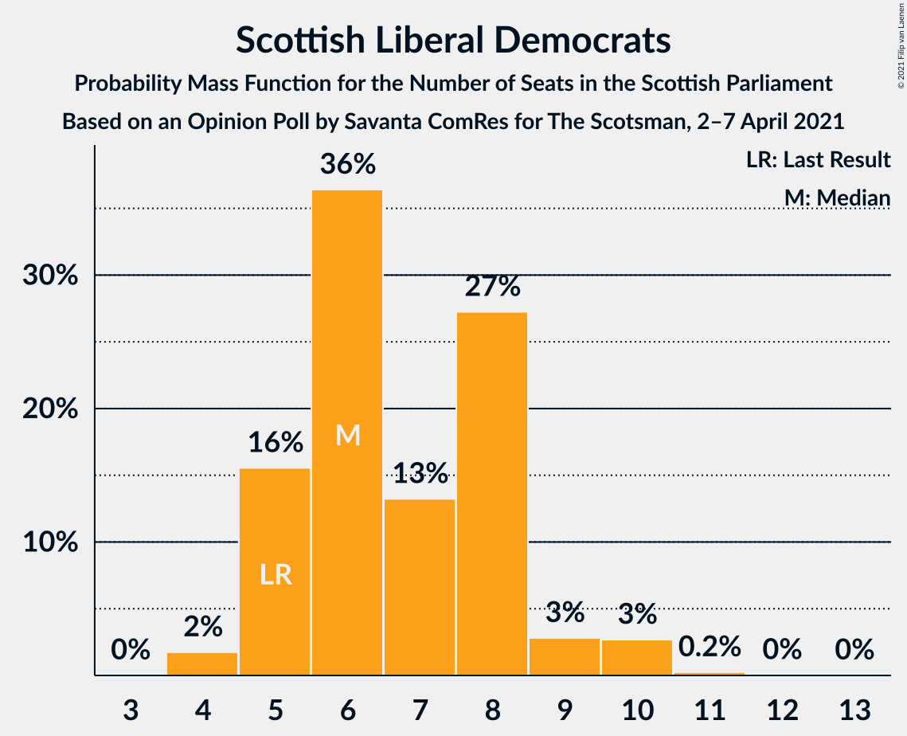
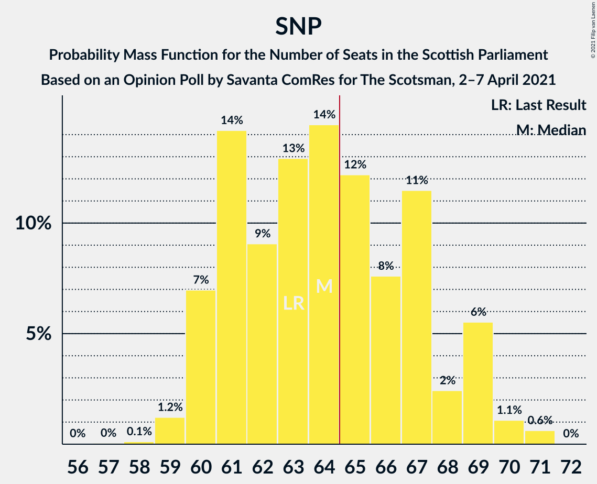

# Opinion Poll by Savanta ComRes for The Scotsman, 2–7 April 2021

<a href="#voting-intentions">Voting Intentions</a> | <a href="#seats">Seats</a> | <a href="#coalitions">Coalitions</a> | <a href="#technical-information">Technical Information</a>

## Voting Intentions

### Confidence Intervals

| Party | Last Result | Poll Result | 80% Confidence Interval | 90% Confidence Interval | 95% Confidence Interval | 99% Confidence Interval |
|:-----:|:-----------:|:-----------:|:-----------------------:|:-----------------------:|:-----------------------:|:-----------------------:|
| Scottish National Party | 41.7% | 39.6% | 37.7–41.6% |37.1–42.2% |36.6–42.7% |35.7–43.7% |
| Scottish Conservative & Unionist Party | 22.9% | 20.8% | 19.2–22.5% |18.7–23.0% |18.4–23.4% |17.6–24.2% |
| Scottish Labour | 19.1% | 17.8% | 16.3–19.4% |15.9–19.9% |15.5–20.3% |14.8–21.1% |
| Scottish Greens | 6.6% | 8.9% | 7.9–10.2% |7.6–10.5% |7.3–10.9% |6.8–11.5% |
| Scottish Liberal Democrats | 5.2% | 7.0% | 6.0–8.1% |5.8–8.4% |5.5–8.7% |5.1–9.3% |
| Alba Party | 0.0% | 3.0% | 2.4–3.8% |2.2–4.0% |2.1–4.2% |1.8–4.6% |

*Note:* The poll result column reflects the actual value used in the calculations. Published results may vary slightly, and in addition be rounded to fewer digits.

## Seats

### Confidence Intervals

| Party | Last Result | Median | 80% Confidence Interval | 90% Confidence Interval | 95% Confidence Interval | 99% Confidence Interval |
|:-----:|:-----------:|:------:|:-----------------------:|:-----------------------:|:-----------------------:|:-----------------------:|
| <a href="#scottish-national-party">Scottish National Party</a> | 63 | 64 | 61–67 |60–69 |60–69 |59–71 |
| <a href="#scottish-conservative-&-unionist-party">Scottish Conservative & Unionist Party</a> | 31 | 26 | 23–29 |22–30 |22–31 |21–33 |
| <a href="#scottish-labour">Scottish Labour</a> | 24 | 22 | 19–25 |18–26 |18–26 |17–27 |
| <a href="#scottish-greens">Scottish Greens</a> | 6 | 10 | 10–11 |9–12 |8–12 |6–13 |
| <a href="#scottish-liberal-democrats">Scottish Liberal Democrats</a> | 5 | 6 | 5–8 |5–9 |5–10 |4–10 |
| <a href="#alba-party">Alba Party</a> | 0 | 0 | 0 |0 |0 |0 |

### Scottish National Party

*For a full overview of the results for this party, see the [Scottish National Party](party-scottishnationalparty.html) page.*

| Number of Seats | Probability | Accumulated | Special Marks |
|:---------------:|:-----------:|:-----------:|:-------------:|
| 56 | 0% | 100% |  |
| 57 | 0% | 99.9% |  |
| 58 | 0.1% | 99.9% |  |
| 59 | 1.2% | 99.8% |  |
| 60 | 7% | 98.6% |  |
| 61 | 14% | 92% |  |
| 62 | 9% | 77% |  |
| 63 | 13% | 68% | Last Result |
| 64 | 14% | 55% | Median |
| 65 | 12% | 41% | Majority |
| 66 | 8% | 29% |  |
| 67 | 11% | 21% |  |
| 68 | 2% | 10% |  |
| 69 | 6% | 7% |  |
| 70 | 1.1% | 2% |  |
| 71 | 0.6% | 0.6% |  |
| 72 | 0% | 0% |  |

### Scottish Conservative & Unionist Party

*For a full overview of the results for this party, see the [Scottish Conservative & Unionist Party](party-scottishconservativeunionistparty.html) page.*

| Number of Seats | Probability | Accumulated | Special Marks |
|:---------------:|:-----------:|:-----------:|:-------------:|
| 20 | 0.2% | 100% |  |
| 21 | 2% | 99.8% |  |
| 22 | 4% | 98% |  |
| 23 | 10% | 94% |  |
| 24 | 14% | 84% |  |
| 25 | 17% | 70% |  |
| 26 | 17% | 53% | Median |
| 27 | 13% | 36% |  |
| 28 | 8% | 23% |  |
| 29 | 6% | 14% |  |
| 30 | 5% | 9% |  |
| 31 | 2% | 4% | Last Result |
| 32 | 1.1% | 2% |  |
| 33 | 0.7% | 0.7% |  |
| 34 | 0% | 0.1% |  |
| 35 | 0% | 0% |  |

### Scottish Labour

*For a full overview of the results for this party, see the [Scottish Labour](party-scottishlabour.html) page.*

| Number of Seats | Probability | Accumulated | Special Marks |
|:---------------:|:-----------:|:-----------:|:-------------:|
| 17 | 2% | 100% |  |
| 18 | 6% | 98% |  |
| 19 | 8% | 92% |  |
| 20 | 6% | 85% |  |
| 21 | 13% | 79% |  |
| 22 | 15% | 65% | Median |
| 23 | 15% | 50% |  |
| 24 | 15% | 35% | Last Result |
| 25 | 13% | 19% |  |
| 26 | 6% | 6% |  |
| 27 | 0.4% | 0.6% |  |
| 28 | 0.1% | 0.2% |  |
| 29 | 0.1% | 0.1% |  |
| 30 | 0% | 0% |  |

### Scottish Greens

*For a full overview of the results for this party, see the [Scottish Greens](party-scottishgreens.html) page.*

| Number of Seats | Probability | Accumulated | Special Marks |
|:---------------:|:-----------:|:-----------:|:-------------:|
| 4 | 0.1% | 100% |  |
| 5 | 0.3% | 99.9% |  |
| 6 | 0.8% | 99.6% | Last Result |
| 7 | 0.7% | 98.8% |  |
| 8 | 2% | 98% |  |
| 9 | 6% | 97% |  |
| 10 | 72% | 90% | Median |
| 11 | 11% | 19% |  |
| 12 | 7% | 8% |  |
| 13 | 0.9% | 1.1% |  |
| 14 | 0.1% | 0.2% |  |
| 15 | 0% | 0% |  |

### Scottish Liberal Democrats

*For a full overview of the results for this party, see the [Scottish Liberal Democrats](party-scottishliberaldemocrats.html) page.*

| Number of Seats | Probability | Accumulated | Special Marks |
|:---------------:|:-----------:|:-----------:|:-------------:|
| 4 | 2% | 100% |  |
| 5 | 16% | 98% | Last Result |
| 6 | 36% | 83% | Median |
| 7 | 13% | 46% |  |
| 8 | 27% | 33% |  |
| 9 | 3% | 6% |  |
| 10 | 3% | 3% |  |
| 11 | 0.2% | 0.3% |  |
| 12 | 0% | 0.1% |  |
| 13 | 0% | 0% |  |

### Alba Party

*For a full overview of the results for this party, see the [Alba Party](party-albaparty.html) page.*

| Number of Seats | Probability | Accumulated | Special Marks |
|:---------------:|:-----------:|:-----------:|:-------------:|
| 0 | 99.6% | 100% | Last Result, Median |
| 1 | 0.2% | 0.4% |  |
| 2 | 0.1% | 0.1% |  |
| 3 | 0% | 0.1% |  |
| 4 | 0% | 0% |  |

## Coalitions

### Confidence Intervals

| Coalition | Last Result | Median | Majority? | 80% Confidence Interval | 90% Confidence Interval | 95% Confidence Interval | 99% Confidence Interval |
|:---------:|:-----------:|:------:|:---------:|:-----------------------:|:-----------------------:|:-----------------------:|:-----------------------:|
| Scottish National Party – Scottish Greens – Alba Party | 69 | 74 | 100% | 71–78 | 70–79 | 70–79 | 68–81 |
| Scottish National Party – Scottish Greens | 69 | 74 | 100% | 71–78 | 70–79 | 70–79 | 68–81 |
| Scottish National Party – Alba Party | 63 | 64 | 41% | 61–67 | 60–69 | 60–69 | 59–71 |
| Scottish National Party | 63 | 64 | 41% | 61–67 | 60–69 | 60–69 | 59–71 |
| Scottish Conservative & Unionist Party – Scottish Labour – Scottish Liberal Democrats | 60 | 55 | 0% | 51–58 | 50–59 | 50–59 | 48–61 |
| Scottish Conservative & Unionist Party – Scottish Labour | 55 | 48 | 0% | 44–52 | 44–52 | 43–53 | 42–55 |
| Scottish Labour – Scottish Greens – Scottish Liberal Democrats | 35 | 39 | 0% | 35–43 | 35–43 | 34–44 | 33–44 |
| Scottish Conservative & Unionist Party – Scottish Liberal Democrats | 36 | 33 | 0% | 29–36 | 29–37 | 28–38 | 26–39 |
| Scottish Labour – Scottish Liberal Democrats | 29 | 29 | 0% | 25–32 | 25–33 | 24–34 | 23–34 |

### Scottish National Party – Scottish Greens – Alba Party

| Number of Seats | Probability | Accumulated | Special Marks |
|:---------------:|:-----------:|:-----------:|:-------------:|
| 66 | 0.1% | 100% |  |
| 67 | 0.2% | 99.9% |  |
| 68 | 0.4% | 99.7% |  |
| 69 | 1.3% | 99.3% | Last Result |
| 70 | 5% | 98% |  |
| 71 | 12% | 93% |  |
| 72 | 10% | 81% |  |
| 73 | 13% | 71% |  |
| 74 | 16% | 58% | Median |
| 75 | 12% | 42% |  |
| 76 | 7% | 29% |  |
| 77 | 12% | 22% |  |
| 78 | 3% | 10% |  |
| 79 | 5% | 7% |  |
| 80 | 2% | 2% |  |
| 81 | 0.6% | 0.7% |  |
| 82 | 0.1% | 0.1% |  |
| 83 | 0% | 0% |  |

### Scottish National Party – Scottish Greens

| Number of Seats | Probability | Accumulated | Special Marks |
|:---------------:|:-----------:|:-----------:|:-------------:|
| 66 | 0.1% | 100% |  |
| 67 | 0.2% | 99.9% |  |
| 68 | 0.4% | 99.7% |  |
| 69 | 1.3% | 99.3% | Last Result |
| 70 | 5% | 98% |  |
| 71 | 12% | 93% |  |
| 72 | 10% | 81% |  |
| 73 | 13% | 71% |  |
| 74 | 16% | 58% | Median |
| 75 | 12% | 42% |  |
| 76 | 7% | 29% |  |
| 77 | 12% | 22% |  |
| 78 | 3% | 10% |  |
| 79 | 5% | 7% |  |
| 80 | 1.5% | 2% |  |
| 81 | 0.6% | 0.7% |  |
| 82 | 0.1% | 0.1% |  |
| 83 | 0% | 0% |  |

### Scottish National Party – Alba Party

| Number of Seats | Probability | Accumulated | Special Marks |
|:---------------:|:-----------:|:-----------:|:-------------:|
| 56 | 0% | 100% |  |
| 57 | 0% | 99.9% |  |
| 58 | 0.1% | 99.9% |  |
| 59 | 1.2% | 99.8% |  |
| 60 | 7% | 98.6% |  |
| 61 | 14% | 92% |  |
| 62 | 9% | 77% |  |
| 63 | 13% | 68% | Last Result |
| 64 | 14% | 55% | Median |
| 65 | 12% | 41% | Majority |
| 66 | 8% | 29% |  |
| 67 | 11% | 21% |  |
| 68 | 2% | 10% |  |
| 69 | 6% | 7% |  |
| 70 | 1.1% | 2% |  |
| 71 | 0.6% | 0.7% |  |
| 72 | 0% | 0% |  |

### Scottish National Party

| Number of Seats | Probability | Accumulated | Special Marks |
|:---------------:|:-----------:|:-----------:|:-------------:|
| 56 | 0% | 100% |  |
| 57 | 0% | 99.9% |  |
| 58 | 0.1% | 99.9% |  |
| 59 | 1.2% | 99.8% |  |
| 60 | 7% | 98.6% |  |
| 61 | 14% | 92% |  |
| 62 | 9% | 77% |  |
| 63 | 13% | 68% | Last Result |
| 64 | 14% | 55% | Median |
| 65 | 12% | 41% | Majority |
| 66 | 8% | 29% |  |
| 67 | 11% | 21% |  |
| 68 | 2% | 10% |  |
| 69 | 6% | 7% |  |
| 70 | 1.1% | 2% |  |
| 71 | 0.6% | 0.6% |  |
| 72 | 0% | 0% |  |

### Scottish Conservative & Unionist Party – Scottish Labour – Scottish Liberal Democrats

| Number of Seats | Probability | Accumulated | Special Marks |
|:---------------:|:-----------:|:-----------:|:-------------:|
| 47 | 0.1% | 100% |  |
| 48 | 0.6% | 99.9% |  |
| 49 | 2% | 99.3% |  |
| 50 | 5% | 98% |  |
| 51 | 3% | 93% |  |
| 52 | 12% | 90% |  |
| 53 | 7% | 78% |  |
| 54 | 12% | 71% | Median |
| 55 | 16% | 58% |  |
| 56 | 13% | 42% |  |
| 57 | 10% | 29% |  |
| 58 | 12% | 19% |  |
| 59 | 5% | 7% |  |
| 60 | 1.3% | 2% | Last Result |
| 61 | 0.4% | 0.7% |  |
| 62 | 0.2% | 0.3% |  |
| 63 | 0.1% | 0.1% |  |
| 64 | 0% | 0% |  |

### Scottish Conservative & Unionist Party – Scottish Labour

| Number of Seats | Probability | Accumulated | Special Marks |
|:---------------:|:-----------:|:-----------:|:-------------:|
| 41 | 0.3% | 100% |  |
| 42 | 1.4% | 99.7% |  |
| 43 | 2% | 98% |  |
| 44 | 8% | 97% |  |
| 45 | 4% | 89% |  |
| 46 | 12% | 85% |  |
| 47 | 9% | 73% |  |
| 48 | 17% | 64% | Median |
| 49 | 17% | 46% |  |
| 50 | 10% | 29% |  |
| 51 | 9% | 20% |  |
| 52 | 6% | 11% |  |
| 53 | 3% | 4% |  |
| 54 | 1.1% | 2% |  |
| 55 | 0.4% | 0.7% | Last Result |
| 56 | 0.1% | 0.2% |  |
| 57 | 0.1% | 0.1% |  |
| 58 | 0% | 0% |  |

### Scottish Labour – Scottish Greens – Scottish Liberal Democrats

| Number of Seats | Probability | Accumulated | Special Marks |
|:---------------:|:-----------:|:-----------:|:-------------:|
| 32 | 0.3% | 100% |  |
| 33 | 1.2% | 99.7% |  |
| 34 | 3% | 98% |  |
| 35 | 6% | 96% | Last Result |
| 36 | 7% | 89% |  |
| 37 | 9% | 82% |  |
| 38 | 13% | 73% | Median |
| 39 | 17% | 60% |  |
| 40 | 11% | 43% |  |
| 41 | 10% | 32% |  |
| 42 | 12% | 22% |  |
| 43 | 6% | 10% |  |
| 44 | 4% | 4% |  |
| 45 | 0.4% | 0.4% |  |
| 46 | 0.1% | 0.1% |  |
| 47 | 0% | 0% |  |

### Scottish Conservative & Unionist Party – Scottish Liberal Democrats

| Number of Seats | Probability | Accumulated | Special Marks |
|:---------------:|:-----------:|:-----------:|:-------------:|
| 25 | 0.2% | 100% |  |
| 26 | 0.3% | 99.8% |  |
| 27 | 0.8% | 99.5% |  |
| 28 | 3% | 98.6% |  |
| 29 | 6% | 96% |  |
| 30 | 11% | 90% |  |
| 31 | 14% | 78% |  |
| 32 | 13% | 64% | Median |
| 33 | 13% | 51% |  |
| 34 | 15% | 38% |  |
| 35 | 11% | 22% |  |
| 36 | 6% | 11% | Last Result |
| 37 | 3% | 5% |  |
| 38 | 1.2% | 3% |  |
| 39 | 1.0% | 1.5% |  |
| 40 | 0.4% | 0.4% |  |
| 41 | 0.1% | 0.1% |  |
| 42 | 0% | 0% |  |

### Scottish Labour – Scottish Liberal Democrats

| Number of Seats | Probability | Accumulated | Special Marks |
|:---------------:|:-----------:|:-----------:|:-------------:|
| 22 | 0.4% | 100% |  |
| 23 | 1.3% | 99.6% |  |
| 24 | 3% | 98% |  |
| 25 | 6% | 95% |  |
| 26 | 8% | 89% |  |
| 27 | 9% | 82% |  |
| 28 | 13% | 73% | Median |
| 29 | 18% | 60% | Last Result |
| 30 | 13% | 42% |  |
| 31 | 9% | 29% |  |
| 32 | 11% | 20% |  |
| 33 | 5% | 9% |  |
| 34 | 3% | 3% |  |
| 35 | 0.3% | 0.3% |  |
| 36 | 0% | 0.1% |  |
| 37 | 0% | 0% |  |

## Technical Information

### Opinion Poll

+ **Polling firm:** Savanta ComRes
+ **Commissioner(s):** The Scotsman
+ **Fieldwork period:** 2–7 April 2021

### Calculations

+ **Sample size:** 1007
+ **Simulations done:** 1,048,576
+ **Error estimate:** 0.49%

