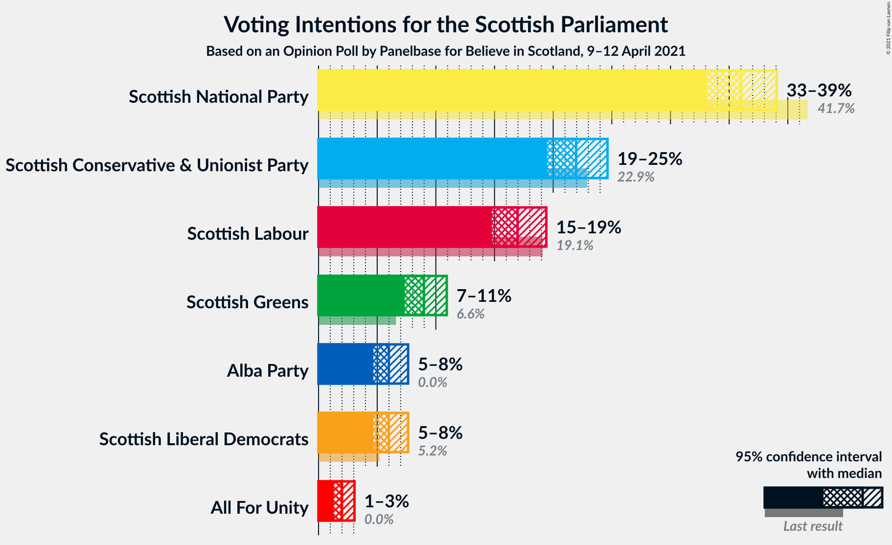
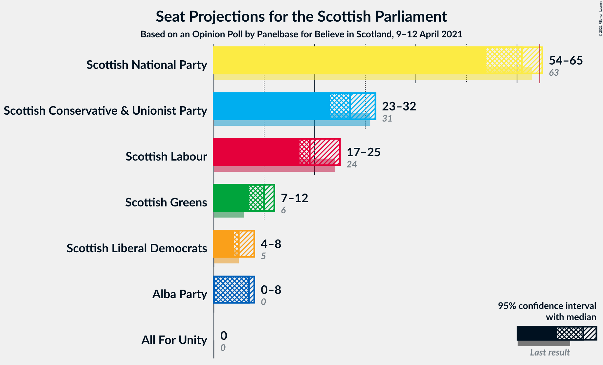
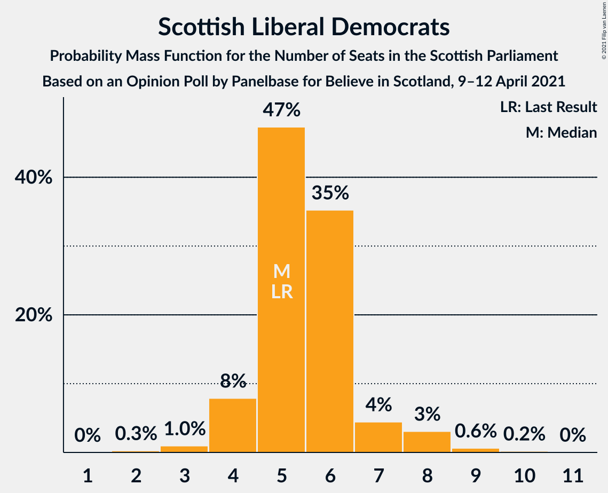
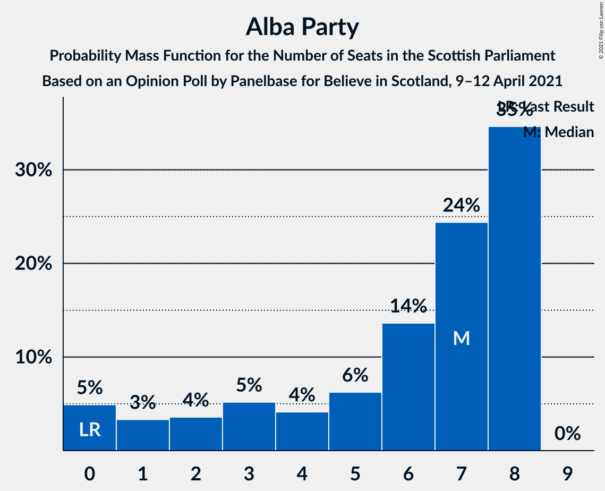
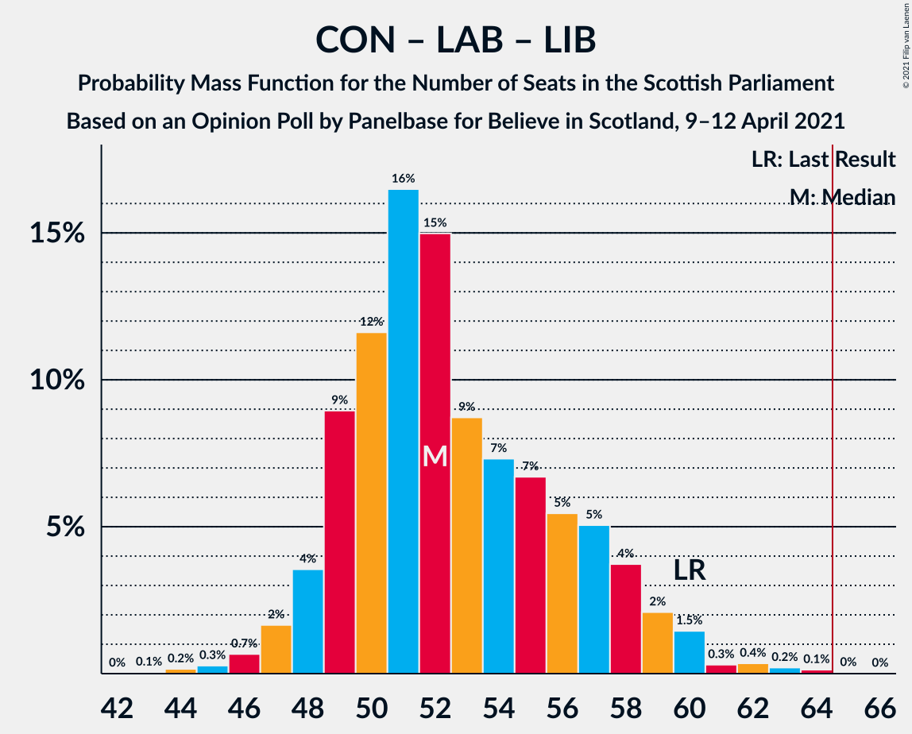

# Opinion Poll by Panelbase for Believe in Scotland, 9–12 April 2021

<a href="#voting-intentions">Voting Intentions</a> | <a href="#seats">Seats</a> | <a href="#coalitions">Coalitions</a> | <a href="#technical-information">Technical Information</a>

## Voting Intentions

### Confidence Intervals

| Party | Last Result | Poll Result | 80% Confidence Interval | 90% Confidence Interval | 95% Confidence Interval | 99% Confidence Interval |
|:-----:|:-----------:|:-----------:|:-----------------------:|:-----------------------:|:-----------------------:|:-----------------------:|
| Scottish National Party | 41.7% | 36.0% | 34.1–38.0% |33.6–38.6% |33.1–39.1% |32.2–40.0% |
| Scottish Conservative & Unionist Party | 22.9% | 22.0% | 20.3–23.7% |19.9–24.2% |19.5–24.6% |18.7–25.5% |
| Scottish Labour | 19.1% | 17.0% | 15.5–18.6% |15.1–19.0% |14.8–19.4% |14.1–20.2% |
| Scottish Greens | 6.6% | 9.0% | 7.9–10.2% |7.6–10.6% |7.4–10.9% |6.9–11.6% |
| Scottish Liberal Democrats | 5.2% | 6.0% | 5.1–7.1% |4.9–7.4% |4.7–7.6% |4.3–8.2% |
| Alba Party | 0.0% | 6.0% | 5.1–7.1% |4.9–7.4% |4.7–7.6% |4.3–8.2% |
| All For Unity | 0.0% | 2.0% | 1.5–2.7% |1.4–2.9% |1.3–3.1% |1.1–3.4% |

*Note:* The poll result column reflects the actual value used in the calculations. Published results may vary slightly, and in addition be rounded to fewer digits.

## Seats

### Confidence Intervals

| Party | Last Result | Median | 80% Confidence Interval | 90% Confidence Interval | 95% Confidence Interval | 99% Confidence Interval |
|:-----:|:-----------:|:------:|:-----------------------:|:-----------------------:|:-----------------------:|:-----------------------:|
| <a href="#scottish-national-party">Scottish National Party</a> | 63 | 61 | 58–63 |55–64 |54–65 |53–67 |
| <a href="#scottish-conservative-&-unionist-party">Scottish Conservative & Unionist Party</a> | 31 | 27 | 24–31 |24–32 |23–32 |22–34 |
| <a href="#scottish-labour">Scottish Labour</a> | 24 | 19 | 17–23 |17–24 |17–25 |16–26 |
| <a href="#scottish-greens">Scottish Greens</a> | 6 | 10 | 9–11 |7–12 |7–12 |5–13 |
| <a href="#scottish-liberal-democrats">Scottish Liberal Democrats</a> | 5 | 5 | 5–6 |4–7 |4–8 |3–9 |
| <a href="#alba-party">Alba Party</a> | 0 | 7 | 2–8 |1–8 |0–8 |0–8 |
| <a href="#all-for-unity">All For Unity</a> | 0 | 0 | 0 |0 |0 |0 |

### Scottish National Party

*For a full overview of the results for this party, see the [Scottish National Party](party-scottishnationalparty.html) page.*

| Number of Seats | Probability | Accumulated | Special Marks |
|:---------------:|:-----------:|:-----------:|:-------------:|
| 51 | 0% | 100% |  |
| 52 | 0.3% | 99.9% |  |
| 53 | 2% | 99.7% |  |
| 54 | 2% | 98% |  |
| 55 | 2% | 96% |  |
| 56 | 2% | 94% |  |
| 57 | 2% | 93% |  |
| 58 | 4% | 90% |  |
| 59 | 13% | 86% |  |
| 60 | 21% | 73% |  |
| 61 | 23% | 52% | Median |
| 62 | 13% | 29% |  |
| 63 | 7% | 16% | Last Result |
| 64 | 5% | 9% |  |
| 65 | 3% | 4% | Majority |
| 66 | 0.6% | 2% |  |
| 67 | 0.6% | 1.0% |  |
| 68 | 0.2% | 0.4% |  |
| 69 | 0.2% | 0.2% |  |
| 70 | 0% | 0% |  |

### Scottish Conservative & Unionist Party

*For a full overview of the results for this party, see the [Scottish Conservative & Unionist Party](party-scottishconservativeunionistparty.html) page.*

| Number of Seats | Probability | Accumulated | Special Marks |
|:---------------:|:-----------:|:-----------:|:-------------:|
| 20 | 0% | 100% |  |
| 21 | 0.2% | 99.9% |  |
| 22 | 0.5% | 99.8% |  |
| 23 | 3% | 99.2% |  |
| 24 | 14% | 97% |  |
| 25 | 12% | 82% |  |
| 26 | 12% | 70% |  |
| 27 | 13% | 59% | Median |
| 28 | 14% | 46% |  |
| 29 | 11% | 32% |  |
| 30 | 9% | 20% |  |
| 31 | 5% | 12% | Last Result |
| 32 | 4% | 6% |  |
| 33 | 2% | 2% |  |
| 34 | 0.3% | 0.6% |  |
| 35 | 0.2% | 0.3% |  |
| 36 | 0.1% | 0.1% |  |
| 37 | 0% | 0% |  |

### Scottish Labour

*For a full overview of the results for this party, see the [Scottish Labour](party-scottishlabour.html) page.*

| Number of Seats | Probability | Accumulated | Special Marks |
|:---------------:|:-----------:|:-----------:|:-------------:|
| 15 | 0.2% | 100% |  |
| 16 | 0.8% | 99.8% |  |
| 17 | 10% | 99.1% |  |
| 18 | 18% | 89% |  |
| 19 | 29% | 72% | Median |
| 20 | 12% | 43% |  |
| 21 | 11% | 31% |  |
| 22 | 7% | 20% |  |
| 23 | 5% | 13% |  |
| 24 | 4% | 8% | Last Result |
| 25 | 3% | 4% |  |
| 26 | 1.2% | 1.2% |  |
| 27 | 0% | 0.1% |  |
| 28 | 0% | 0% |  |

### Scottish Greens

*For a full overview of the results for this party, see the [Scottish Greens](party-scottishgreens.html) page.*

| Number of Seats | Probability | Accumulated | Special Marks |
|:---------------:|:-----------:|:-----------:|:-------------:|
| 3 | 0.1% | 100% |  |
| 4 | 0.1% | 99.9% |  |
| 5 | 0.4% | 99.8% |  |
| 6 | 1.3% | 99.4% | Last Result |
| 7 | 4% | 98% |  |
| 8 | 3% | 94% |  |
| 9 | 8% | 90% |  |
| 10 | 55% | 83% | Median |
| 11 | 20% | 28% |  |
| 12 | 7% | 8% |  |
| 13 | 0.6% | 0.8% |  |
| 14 | 0.1% | 0.1% |  |
| 15 | 0% | 0% |  |

### Scottish Liberal Democrats

*For a full overview of the results for this party, see the [Scottish Liberal Democrats](party-scottishliberaldemocrats.html) page.*

| Number of Seats | Probability | Accumulated | Special Marks |
|:---------------:|:-----------:|:-----------:|:-------------:|
| 2 | 0.3% | 100% |  |
| 3 | 1.0% | 99.7% |  |
| 4 | 8% | 98.8% |  |
| 5 | 47% | 91% | Last Result, Median |
| 6 | 35% | 44% |  |
| 7 | 4% | 8% |  |
| 8 | 3% | 4% |  |
| 9 | 0.6% | 0.9% |  |
| 10 | 0.2% | 0.2% |  |
| 11 | 0% | 0% |  |

### Alba Party

*For a full overview of the results for this party, see the [Alba Party](party-albaparty.html) page.*

| Number of Seats | Probability | Accumulated | Special Marks |
|:---------------:|:-----------:|:-----------:|:-------------:|
| 0 | 5% | 100% | Last Result |
| 1 | 3% | 95% |  |
| 2 | 4% | 92% |  |
| 3 | 5% | 88% |  |
| 4 | 4% | 83% |  |
| 5 | 6% | 79% |  |
| 6 | 14% | 73% |  |
| 7 | 24% | 59% | Median |
| 8 | 35% | 35% |  |
| 9 | 0% | 0% |  |

### All For Unity

*For a full overview of the results for this party, see the [All For Unity](party-allforunity.html) page.*

| Number of Seats | Probability | Accumulated | Special Marks |
|:---------------:|:-----------:|:-----------:|:-------------:|
| 0 | 100% | 100% | Last Result, Median |

## Coalitions

### Confidence Intervals

| Coalition | Last Result | Median | Majority? | 80% Confidence Interval | 90% Confidence Interval | 95% Confidence Interval | 99% Confidence Interval |
|:---------:|:-----------:|:------:|:---------:|:-----------------------:|:-----------------------:|:-----------------------:|:-----------------------:|
| Scottish National Party – Scottish Greens – Alba Party | 69 | 77 | 100% | 72–80 | 71–81 | 69–82 | 67–84 |
| Scottish National Party – Scottish Greens | 69 | 71 | 96% | 67–74 | 65–75 | 64–75 | 62–77 |
| Scottish National Party – Alba Party | 63 | 67 | 76% | 62–70 | 60–71 | 59–72 | 57–73 |
| Scottish National Party | 63 | 61 | 4% | 58–63 | 55–64 | 54–65 | 53–67 |
| Scottish Conservative & Unionist Party – Scottish Labour – Scottish Liberal Democrats | 60 | 52 | 0% | 49–57 | 48–58 | 47–60 | 45–62 |
| Scottish Conservative & Unionist Party – Scottish Labour | 55 | 47 | 0% | 44–52 | 43–53 | 42–54 | 41–57 |
| Scottish Labour – Scottish Greens – Scottish Liberal Democrats | 35 | 35 | 0% | 33–38 | 32–40 | 31–41 | 30–42 |
| Scottish Conservative & Unionist Party – Scottish Liberal Democrats | 36 | 33 | 0% | 29–36 | 29–37 | 28–38 | 27–40 |
| Scottish Labour – Scottish Liberal Democrats | 29 | 25 | 0% | 23–29 | 22–30 | 22–31 | 21–32 |

### Scottish National Party – Scottish Greens – Alba Party

| Number of Seats | Probability | Accumulated | Special Marks |
|:---------------:|:-----------:|:-----------:|:-------------:|
| 65 | 0.1% | 100% | Majority |
| 66 | 0.2% | 99.8% |  |
| 67 | 0.4% | 99.6% |  |
| 68 | 0.3% | 99.3% |  |
| 69 | 1.5% | 99.0% | Last Result |
| 70 | 2% | 97% |  |
| 71 | 4% | 95% |  |
| 72 | 5% | 92% |  |
| 73 | 5% | 87% |  |
| 74 | 7% | 81% |  |
| 75 | 7% | 74% |  |
| 76 | 9% | 67% |  |
| 77 | 15% | 58% |  |
| 78 | 16% | 43% | Median |
| 79 | 12% | 27% |  |
| 80 | 9% | 15% |  |
| 81 | 4% | 6% |  |
| 82 | 2% | 3% |  |
| 83 | 0.7% | 1.2% |  |
| 84 | 0.3% | 0.5% |  |
| 85 | 0.2% | 0.2% |  |
| 86 | 0.1% | 0.1% |  |
| 87 | 0% | 0% |  |

### Scottish National Party – Scottish Greens

| Number of Seats | Probability | Accumulated | Special Marks |
|:---------------:|:-----------:|:-----------:|:-------------:|
| 61 | 0.2% | 100% |  |
| 62 | 0.4% | 99.8% |  |
| 63 | 1.5% | 99.4% |  |
| 64 | 2% | 98% |  |
| 65 | 2% | 96% | Majority |
| 66 | 2% | 94% |  |
| 67 | 4% | 91% |  |
| 68 | 6% | 87% |  |
| 69 | 11% | 82% | Last Result |
| 70 | 18% | 71% |  |
| 71 | 18% | 53% | Median |
| 72 | 16% | 34% |  |
| 73 | 8% | 19% |  |
| 74 | 5% | 10% |  |
| 75 | 4% | 6% |  |
| 76 | 0.9% | 2% |  |
| 77 | 0.6% | 1.0% |  |
| 78 | 0.2% | 0.5% |  |
| 79 | 0.2% | 0.2% |  |
| 80 | 0% | 0% |  |

### Scottish National Party – Alba Party

| Number of Seats | Probability | Accumulated | Special Marks |
|:---------------:|:-----------:|:-----------:|:-------------:|
| 55 | 0.2% | 100% |  |
| 56 | 0.2% | 99.8% |  |
| 57 | 0.3% | 99.6% |  |
| 58 | 0.3% | 99.3% |  |
| 59 | 2% | 99.0% |  |
| 60 | 2% | 97% |  |
| 61 | 4% | 95% |  |
| 62 | 5% | 91% |  |
| 63 | 4% | 86% | Last Result |
| 64 | 6% | 82% |  |
| 65 | 7% | 76% | Majority |
| 66 | 11% | 69% |  |
| 67 | 15% | 59% |  |
| 68 | 18% | 44% | Median |
| 69 | 13% | 26% |  |
| 70 | 7% | 13% |  |
| 71 | 3% | 6% |  |
| 72 | 2% | 3% |  |
| 73 | 0.5% | 1.0% |  |
| 74 | 0.3% | 0.5% |  |
| 75 | 0.1% | 0.2% |  |
| 76 | 0% | 0.1% |  |
| 77 | 0% | 0% |  |

### Scottish National Party

| Number of Seats | Probability | Accumulated | Special Marks |
|:---------------:|:-----------:|:-----------:|:-------------:|
| 51 | 0% | 100% |  |
| 52 | 0.3% | 99.9% |  |
| 53 | 2% | 99.7% |  |
| 54 | 2% | 98% |  |
| 55 | 2% | 96% |  |
| 56 | 2% | 94% |  |
| 57 | 2% | 93% |  |
| 58 | 4% | 90% |  |
| 59 | 13% | 86% |  |
| 60 | 21% | 73% |  |
| 61 | 23% | 52% | Median |
| 62 | 13% | 29% |  |
| 63 | 7% | 16% | Last Result |
| 64 | 5% | 9% |  |
| 65 | 3% | 4% | Majority |
| 66 | 0.6% | 2% |  |
| 67 | 0.6% | 1.0% |  |
| 68 | 0.2% | 0.4% |  |
| 69 | 0.2% | 0.2% |  |
| 70 | 0% | 0% |  |

### Scottish Conservative & Unionist Party – Scottish Labour – Scottish Liberal Democrats

| Number of Seats | Probability | Accumulated | Special Marks |
|:---------------:|:-----------:|:-----------:|:-------------:|
| 43 | 0.1% | 100% |  |
| 44 | 0.2% | 99.9% |  |
| 45 | 0.3% | 99.8% |  |
| 46 | 0.7% | 99.5% |  |
| 47 | 2% | 98.8% |  |
| 48 | 4% | 97% |  |
| 49 | 9% | 94% |  |
| 50 | 12% | 85% |  |
| 51 | 16% | 73% | Median |
| 52 | 15% | 57% |  |
| 53 | 9% | 42% |  |
| 54 | 7% | 33% |  |
| 55 | 7% | 26% |  |
| 56 | 5% | 19% |  |
| 57 | 5% | 13% |  |
| 58 | 4% | 8% |  |
| 59 | 2% | 5% |  |
| 60 | 1.5% | 3% | Last Result |
| 61 | 0.3% | 1.0% |  |
| 62 | 0.4% | 0.7% |  |
| 63 | 0.2% | 0.4% |  |
| 64 | 0.1% | 0.2% |  |
| 65 | 0% | 0% | Majority |

### Scottish Conservative & Unionist Party – Scottish Labour

| Number of Seats | Probability | Accumulated | Special Marks |
|:---------------:|:-----------:|:-----------:|:-------------:|
| 38 | 0.1% | 100% |  |
| 39 | 0.2% | 99.9% |  |
| 40 | 0.2% | 99.8% |  |
| 41 | 1.1% | 99.5% |  |
| 42 | 2% | 98% |  |
| 43 | 6% | 96% |  |
| 44 | 10% | 90% |  |
| 45 | 14% | 80% |  |
| 46 | 15% | 66% | Median |
| 47 | 13% | 51% |  |
| 48 | 9% | 38% |  |
| 49 | 7% | 29% |  |
| 50 | 7% | 22% |  |
| 51 | 5% | 15% |  |
| 52 | 5% | 10% |  |
| 53 | 3% | 6% |  |
| 54 | 1.3% | 3% |  |
| 55 | 0.9% | 2% | Last Result |
| 56 | 0.3% | 0.8% |  |
| 57 | 0.3% | 0.5% |  |
| 58 | 0.2% | 0.2% |  |
| 59 | 0% | 0.1% |  |
| 60 | 0% | 0% |  |

### Scottish Labour – Scottish Greens – Scottish Liberal Democrats

| Number of Seats | Probability | Accumulated | Special Marks |
|:---------------:|:-----------:|:-----------:|:-------------:|
| 28 | 0.1% | 100% |  |
| 29 | 0.3% | 99.8% |  |
| 30 | 0.7% | 99.5% |  |
| 31 | 2% | 98.9% |  |
| 32 | 6% | 97% |  |
| 33 | 13% | 91% |  |
| 34 | 18% | 79% | Median |
| 35 | 19% | 60% | Last Result |
| 36 | 16% | 41% |  |
| 37 | 10% | 25% |  |
| 38 | 6% | 15% |  |
| 39 | 4% | 9% |  |
| 40 | 3% | 6% |  |
| 41 | 2% | 3% |  |
| 42 | 1.1% | 1.5% |  |
| 43 | 0.3% | 0.4% |  |
| 44 | 0.1% | 0.1% |  |
| 45 | 0% | 0% |  |

### Scottish Conservative & Unionist Party – Scottish Liberal Democrats

| Number of Seats | Probability | Accumulated | Special Marks |
|:---------------:|:-----------:|:-----------:|:-------------:|
| 25 | 0.1% | 100% |  |
| 26 | 0.3% | 99.9% |  |
| 27 | 0.5% | 99.6% |  |
| 28 | 3% | 99.1% |  |
| 29 | 9% | 96% |  |
| 30 | 11% | 87% |  |
| 31 | 11% | 76% |  |
| 32 | 11% | 65% | Median |
| 33 | 16% | 54% |  |
| 34 | 12% | 37% |  |
| 35 | 10% | 25% |  |
| 36 | 6% | 16% | Last Result |
| 37 | 5% | 10% |  |
| 38 | 2% | 5% |  |
| 39 | 1.4% | 2% |  |
| 40 | 0.5% | 0.7% |  |
| 41 | 0.2% | 0.3% |  |
| 42 | 0.1% | 0.1% |  |
| 43 | 0% | 0% |  |

### Scottish Labour – Scottish Liberal Democrats

| Number of Seats | Probability | Accumulated | Special Marks |
|:---------------:|:-----------:|:-----------:|:-------------:|
| 20 | 0.4% | 100% |  |
| 21 | 1.1% | 99.5% |  |
| 22 | 7% | 98% |  |
| 23 | 11% | 91% |  |
| 24 | 24% | 81% | Median |
| 25 | 18% | 57% |  |
| 26 | 13% | 39% |  |
| 27 | 9% | 25% |  |
| 28 | 5% | 16% |  |
| 29 | 5% | 11% | Last Result |
| 30 | 3% | 6% |  |
| 31 | 2% | 3% |  |
| 32 | 0.8% | 1.1% |  |
| 33 | 0.2% | 0.3% |  |
| 34 | 0.1% | 0.1% |  |
| 35 | 0% | 0% |  |

## Technical Information

### Opinion Poll

+ **Polling firm:** Panelbase
+ **Commissioner(s):** Believe in Scotland
+ **Fieldwork period:** 9–12 April 2021

### Calculations

+ **Sample size:** 1002
+ **Simulations done:** 1,048,576
+ **Error estimate:** 0.78%

