# Opinion Poll by Lord Ashcroft, 7–19 April 2021

<a href="#voting-intentions">Voting Intentions</a> | <a href="#seats">Seats</a> | <a href="#coalitions">Coalitions</a> | <a href="#technical-information">Technical Information</a>

## Voting Intentions

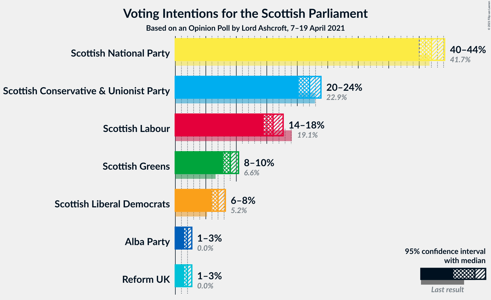

### Confidence Intervals

| Party | Last Result | Poll Result | 80% Confidence Interval | 90% Confidence Interval | 95% Confidence Interval | 99% Confidence Interval |
|:-----:|:-----------:|:-----------:|:-----------------------:|:-----------------------:|:-----------------------:|:-----------------------:|
| Scottish National Party | 41.7% | 42.0% | 40.6–43.4% |40.2–43.8% |39.9–44.2% |39.2–44.9% |
| Scottish Conservative & Unionist Party | 22.9% | 22.0% | 20.9–23.2% |20.5–23.6% |20.3–23.9% |19.7–24.5% |
| Scottish Labour | 19.1% | 16.0% | 15.0–17.1% |14.7–17.4% |14.5–17.7% |14.0–18.2% |
| Scottish Greens | 6.6% | 9.0% | 8.2–9.9% |8.0–10.2% |7.8–10.4% |7.5–10.8% |
| Scottish Liberal Democrats | 5.2% | 7.0% | 6.3–7.8% |6.1–8.0% |6.0–8.2% |5.6–8.6% |
| Alba Party | 0.0% | 2.0% | 1.6–2.5% |1.5–2.6% |1.4–2.7% |1.3–2.9% |
| Reform UK | 0.0% | 2.0% | 1.6–2.5% |1.5–2.6% |1.4–2.7% |1.3–2.9% |

*Note:* The poll result column reflects the actual value used in the calculations. Published results may vary slightly, and in addition be rounded to fewer digits.

## Seats

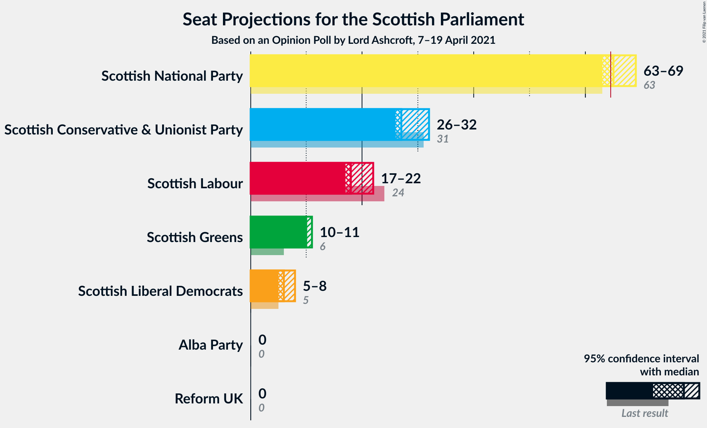

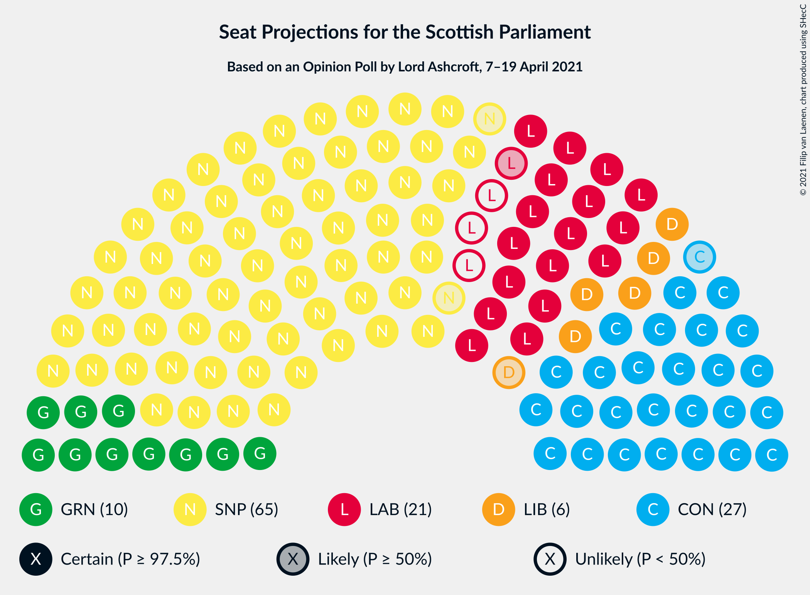

### Confidence Intervals

| Party | Last Result | Median | 80% Confidence Interval | 90% Confidence Interval | 95% Confidence Interval | 99% Confidence Interval |
|:-----:|:-----------:|:------:|:-----------------------:|:-----------------------:|:-----------------------:|:-----------------------:|
| <a href="#scottish-national-party">Scottish National Party</a> | 63 | 65 | 64–67 |63–68 |63–69 |61–70 |
| <a href="#scottish-conservative-&-unionist-party">Scottish Conservative & Unionist Party</a> | 31 | 27 | 26–31 |26–31 |26–32 |25–32 |
| <a href="#scottish-labour">Scottish Labour</a> | 24 | 18 | 17–21 |17–22 |17–22 |17–23 |
| <a href="#scottish-greens">Scottish Greens</a> | 6 | 10 | 10 |10 |10–11 |9–12 |
| <a href="#scottish-liberal-democrats">Scottish Liberal Democrats</a> | 5 | 6 | 5–8 |5–8 |5–8 |5–8 |
| <a href="#alba-party">Alba Party</a> | 0 | 0 | 0 |0 |0 |0 |
| <a href="#reform-uk">Reform UK</a> | 0 | 0 | 0 |0 |0 |0 |

### Scottish National Party

*For a full overview of the results for this party, see the [Scottish National Party](party-scottishnationalparty.html) page.*

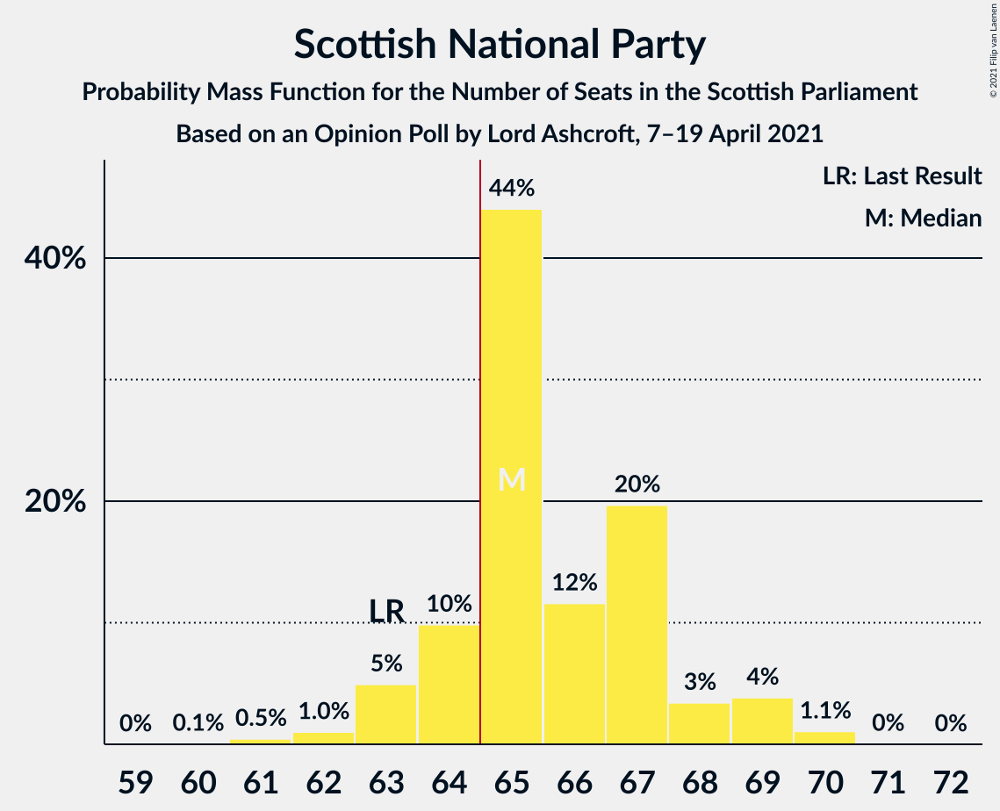

| Number of Seats | Probability | Accumulated | Special Marks |
|:---------------:|:-----------:|:-----------:|:-------------:|
| 60 | 0.1% | 100% |  |
| 61 | 0.5% | 99.9% |  |
| 62 | 1.0% | 99.5% |  |
| 63 | 5% | 98% | Last Result |
| 64 | 10% | 94% |  |
| 65 | 44% | 84% | Median, Majority |
| 66 | 12% | 40% |  |
| 67 | 20% | 28% |  |
| 68 | 3% | 8% |  |
| 69 | 4% | 5% |  |
| 70 | 1.1% | 1.1% |  |
| 71 | 0% | 0.1% |  |
| 72 | 0% | 0% |  |

### Scottish Conservative & Unionist Party

*For a full overview of the results for this party, see the [Scottish Conservative & Unionist Party](party-scottishconservativeunionistparty.html) page.*

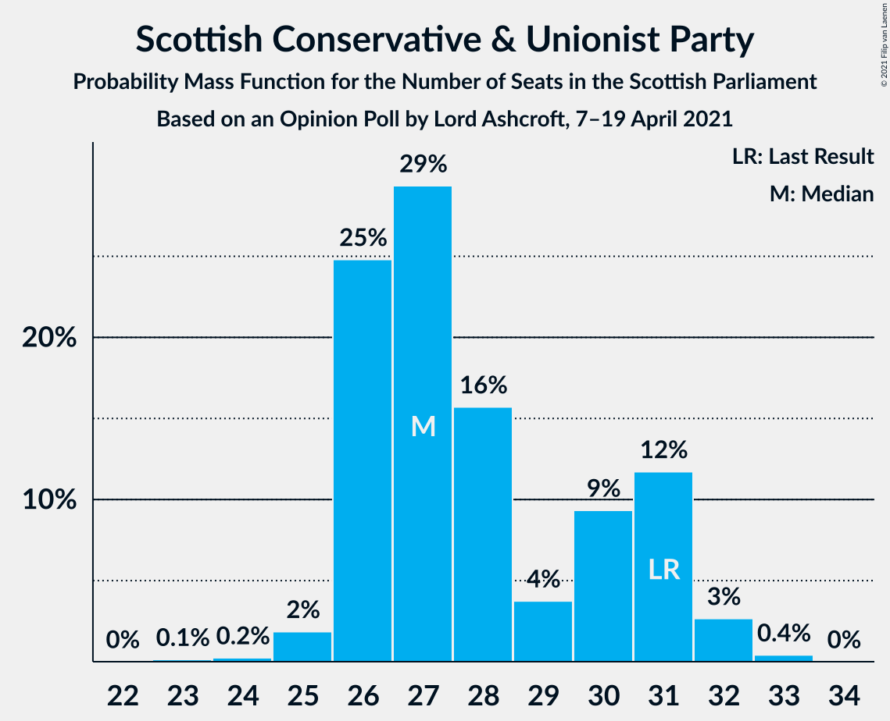

| Number of Seats | Probability | Accumulated | Special Marks |
|:---------------:|:-----------:|:-----------:|:-------------:|
| 23 | 0.1% | 100% |  |
| 24 | 0.2% | 99.9% |  |
| 25 | 2% | 99.6% |  |
| 26 | 25% | 98% |  |
| 27 | 29% | 73% | Median |
| 28 | 16% | 44% |  |
| 29 | 4% | 28% |  |
| 30 | 9% | 24% |  |
| 31 | 12% | 15% | Last Result |
| 32 | 3% | 3% |  |
| 33 | 0.4% | 0.4% |  |
| 34 | 0% | 0% |  |

### Scottish Labour

*For a full overview of the results for this party, see the [Scottish Labour](party-scottishlabour.html) page.*

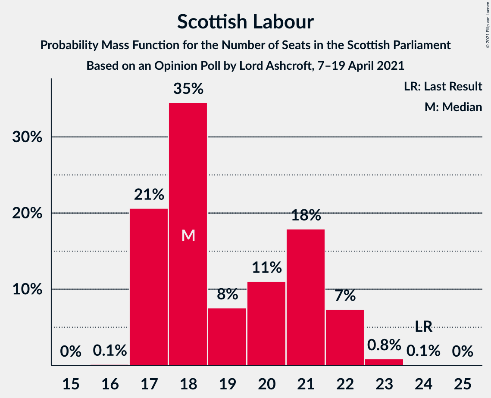

| Number of Seats | Probability | Accumulated | Special Marks |
|:---------------:|:-----------:|:-----------:|:-------------:|
| 16 | 0.1% | 100% |  |
| 17 | 21% | 99.9% |  |
| 18 | 35% | 79% | Median |
| 19 | 8% | 45% |  |
| 20 | 11% | 37% |  |
| 21 | 18% | 26% |  |
| 22 | 7% | 8% |  |
| 23 | 0.8% | 0.9% |  |
| 24 | 0.1% | 0.1% | Last Result |
| 25 | 0% | 0% |  |

### Scottish Greens

*For a full overview of the results for this party, see the [Scottish Greens](party-scottishgreens.html) page.*

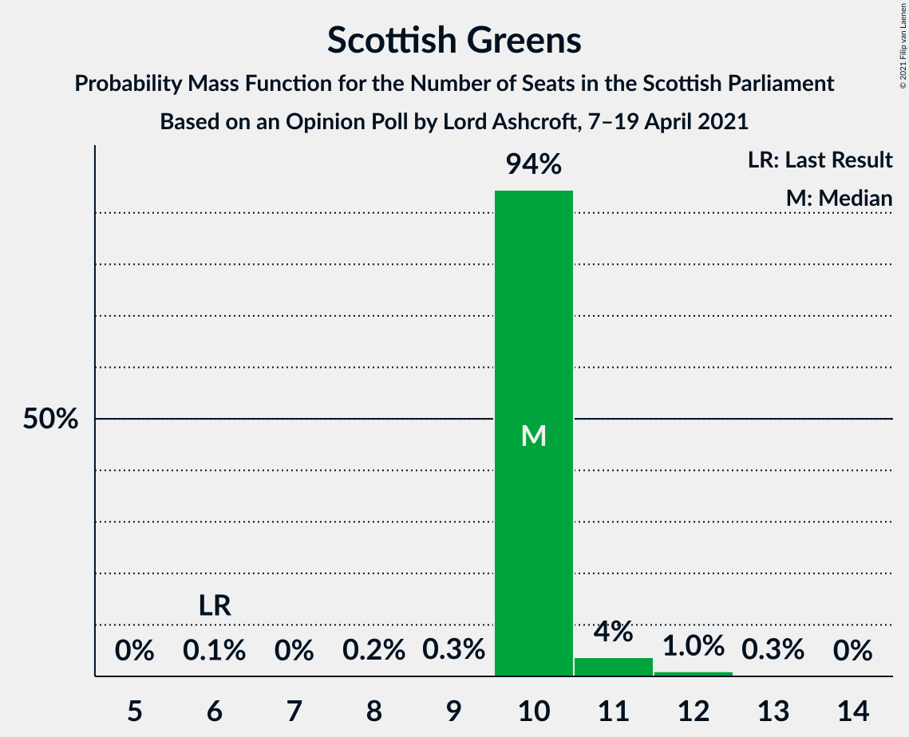

| Number of Seats | Probability | Accumulated | Special Marks |
|:---------------:|:-----------:|:-----------:|:-------------:|
| 6 | 0.1% | 100% | Last Result |
| 7 | 0% | 99.9% |  |
| 8 | 0.2% | 99.9% |  |
| 9 | 0.3% | 99.7% |  |
| 10 | 94% | 99.4% | Median |
| 11 | 4% | 5% |  |
| 12 | 1.0% | 1.2% |  |
| 13 | 0.3% | 0.3% |  |
| 14 | 0% | 0% |  |

### Scottish Liberal Democrats

*For a full overview of the results for this party, see the [Scottish Liberal Democrats](party-scottishliberaldemocrats.html) page.*

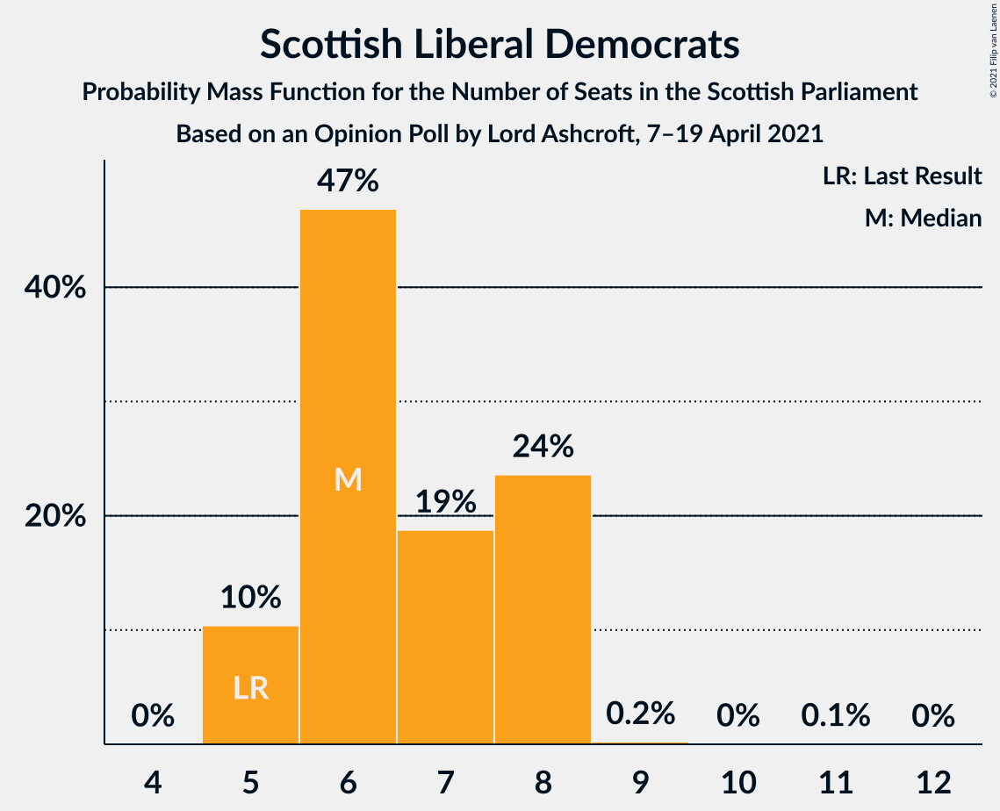

| Number of Seats | Probability | Accumulated | Special Marks |
|:---------------:|:-----------:|:-----------:|:-------------:|
| 5 | 10% | 100% | Last Result |
| 6 | 47% | 90% | Median |
| 7 | 19% | 43% |  |
| 8 | 24% | 24% |  |
| 9 | 0.2% | 0.3% |  |
| 10 | 0% | 0.1% |  |
| 11 | 0.1% | 0.1% |  |
| 12 | 0% | 0% |  |

### Alba Party

*For a full overview of the results for this party, see the [Alba Party](party-albaparty.html) page.*

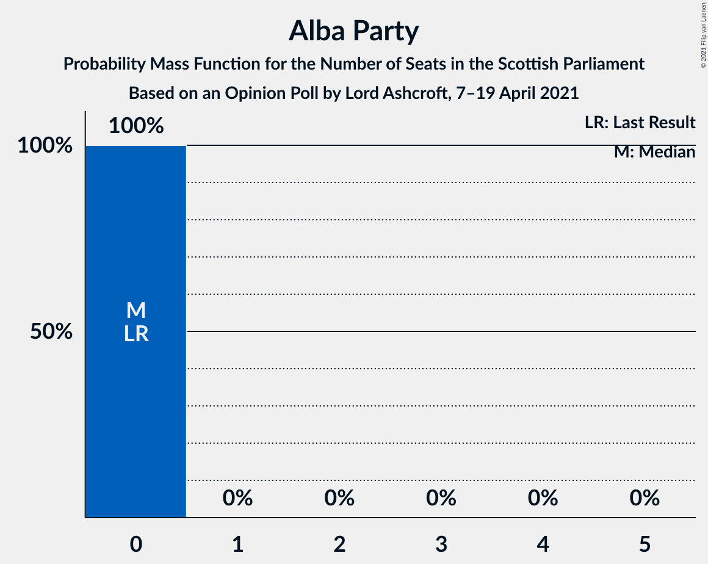

| Number of Seats | Probability | Accumulated | Special Marks |
|:---------------:|:-----------:|:-----------:|:-------------:|
| 0 | 100% | 100% | Last Result, Median |

### Reform UK

*For a full overview of the results for this party, see the [Reform UK](party-reformuk.html) page.*

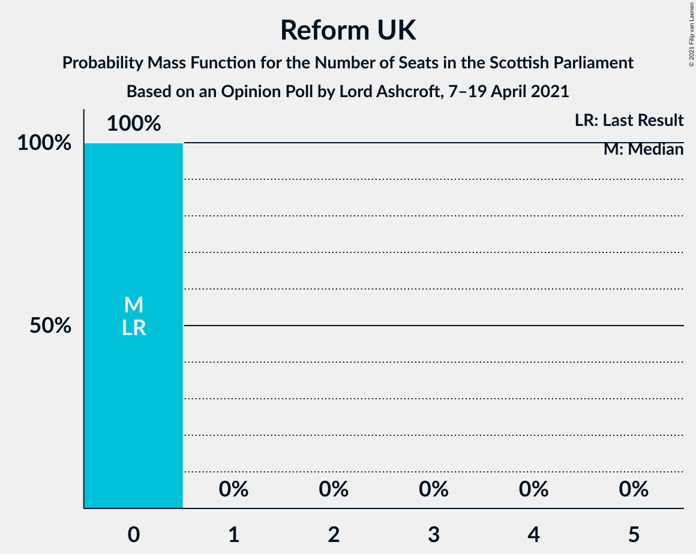

| Number of Seats | Probability | Accumulated | Special Marks |
|:---------------:|:-----------:|:-----------:|:-------------:|
| 0 | 100% | 100% | Last Result, Median |

## Coalitions

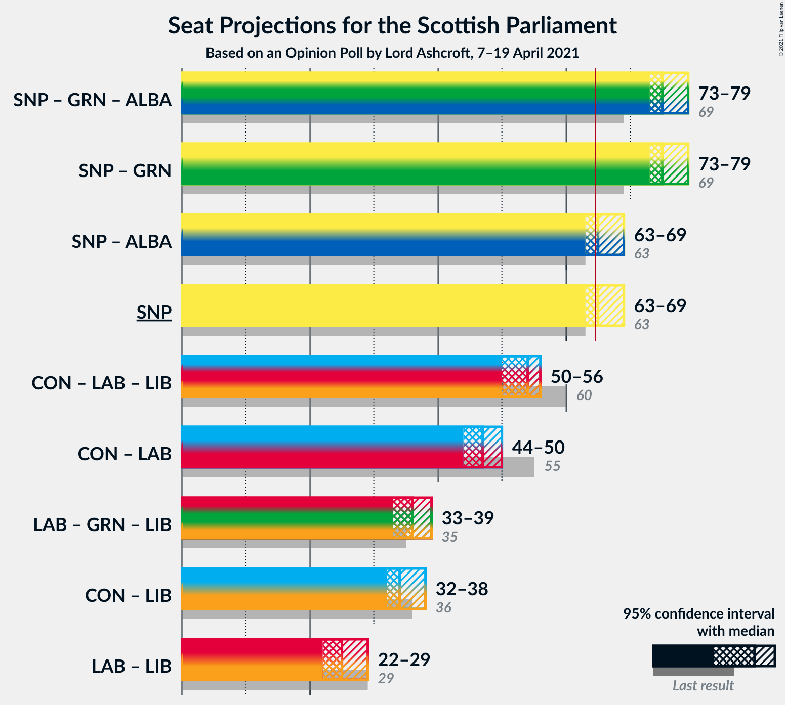

### Confidence Intervals

| Coalition | Last Result | Median | Majority? | 80% Confidence Interval | 90% Confidence Interval | 95% Confidence Interval | 99% Confidence Interval |
|:---------:|:-----------:|:------:|:---------:|:-----------------------:|:-----------------------:|:-----------------------:|:-----------------------:|
| Scottish National Party – Scottish Greens – Alba Party | 69 | 75 | 100% | 74–77 | 73–79 | 73–79 | 72–80 |
| Scottish National Party – Scottish Greens | 69 | 75 | 100% | 74–77 | 73–79 | 73–79 | 72–80 |
| Scottish National Party – Alba Party | 63 | 65 | 84% | 64–67 | 63–68 | 63–69 | 61–70 |
| Scottish National Party | 63 | 65 | 84% | 64–67 | 63–68 | 63–69 | 61–70 |
| Scottish Conservative & Unionist Party – Scottish Labour – Scottish Liberal Democrats | 60 | 54 | 0% | 52–55 | 50–56 | 50–56 | 49–57 |
| Scottish Conservative & Unionist Party – Scottish Labour | 55 | 47 | 0% | 44–49 | 44–49 | 44–50 | 43–51 |
| Scottish Labour – Scottish Greens – Scottish Liberal Democrats | 35 | 36 | 0% | 33–38 | 33–38 | 33–39 | 32–40 |
| Scottish Conservative & Unionist Party – Scottish Liberal Democrats | 36 | 34 | 0% | 33–37 | 32–37 | 32–38 | 31–39 |
| Scottish Labour – Scottish Liberal Democrats | 29 | 25 | 0% | 23–28 | 23–28 | 22–29 | 22–30 |

### Scottish National Party – Scottish Greens – Alba Party

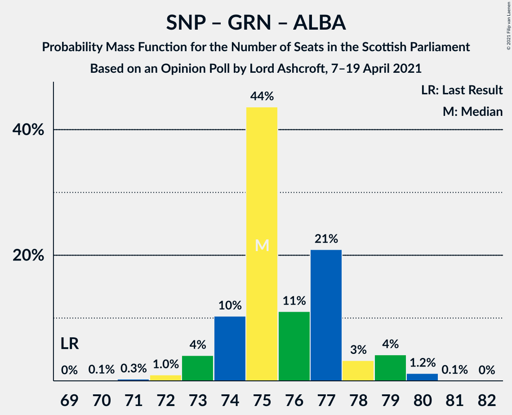

| Number of Seats | Probability | Accumulated | Special Marks |
|:---------------:|:-----------:|:-----------:|:-------------:|
| 69 | 0% | 100% | Last Result |
| 70 | 0.1% | 100% |  |
| 71 | 0.3% | 99.9% |  |
| 72 | 1.0% | 99.6% |  |
| 73 | 4% | 98.6% |  |
| 74 | 10% | 95% |  |
| 75 | 44% | 84% | Median |
| 76 | 11% | 41% |  |
| 77 | 21% | 30% |  |
| 78 | 3% | 9% |  |
| 79 | 4% | 5% |  |
| 80 | 1.2% | 1.3% |  |
| 81 | 0.1% | 0.1% |  |
| 82 | 0% | 0% |  |

### Scottish National Party – Scottish Greens

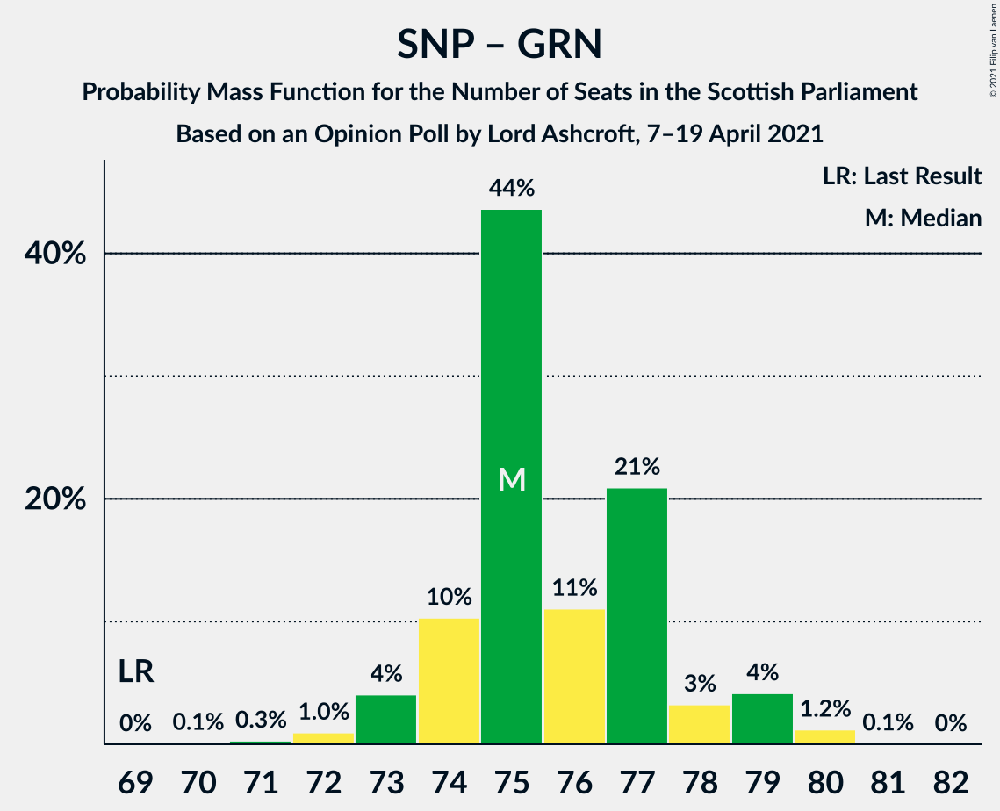

| Number of Seats | Probability | Accumulated | Special Marks |
|:---------------:|:-----------:|:-----------:|:-------------:|
| 69 | 0% | 100% | Last Result |
| 70 | 0.1% | 100% |  |
| 71 | 0.3% | 99.9% |  |
| 72 | 1.0% | 99.6% |  |
| 73 | 4% | 98.6% |  |
| 74 | 10% | 95% |  |
| 75 | 44% | 84% | Median |
| 76 | 11% | 41% |  |
| 77 | 21% | 30% |  |
| 78 | 3% | 9% |  |
| 79 | 4% | 5% |  |
| 80 | 1.2% | 1.3% |  |
| 81 | 0.1% | 0.1% |  |
| 82 | 0% | 0% |  |

### Scottish National Party – Alba Party

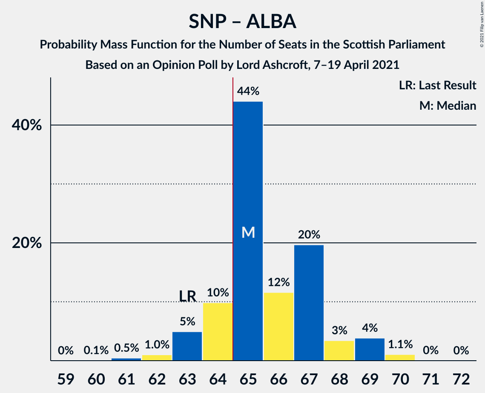

| Number of Seats | Probability | Accumulated | Special Marks |
|:---------------:|:-----------:|:-----------:|:-------------:|
| 60 | 0.1% | 100% |  |
| 61 | 0.5% | 99.9% |  |
| 62 | 1.0% | 99.5% |  |
| 63 | 5% | 98% | Last Result |
| 64 | 10% | 94% |  |
| 65 | 44% | 84% | Median, Majority |
| 66 | 12% | 40% |  |
| 67 | 20% | 28% |  |
| 68 | 3% | 8% |  |
| 69 | 4% | 5% |  |
| 70 | 1.1% | 1.1% |  |
| 71 | 0% | 0.1% |  |
| 72 | 0% | 0% |  |

### Scottish National Party

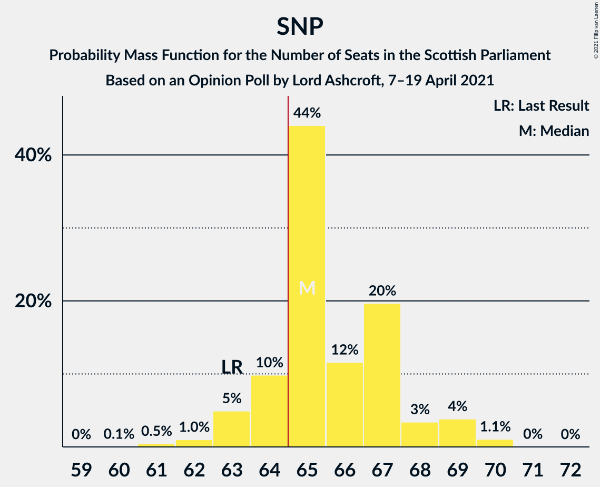

| Number of Seats | Probability | Accumulated | Special Marks |
|:---------------:|:-----------:|:-----------:|:-------------:|
| 60 | 0.1% | 100% |  |
| 61 | 0.5% | 99.9% |  |
| 62 | 1.0% | 99.5% |  |
| 63 | 5% | 98% | Last Result |
| 64 | 10% | 94% |  |
| 65 | 44% | 84% | Median, Majority |
| 66 | 12% | 40% |  |
| 67 | 20% | 28% |  |
| 68 | 3% | 8% |  |
| 69 | 4% | 5% |  |
| 70 | 1.1% | 1.1% |  |
| 71 | 0% | 0.1% |  |
| 72 | 0% | 0% |  |

### Scottish Conservative & Unionist Party – Scottish Labour – Scottish Liberal Democrats

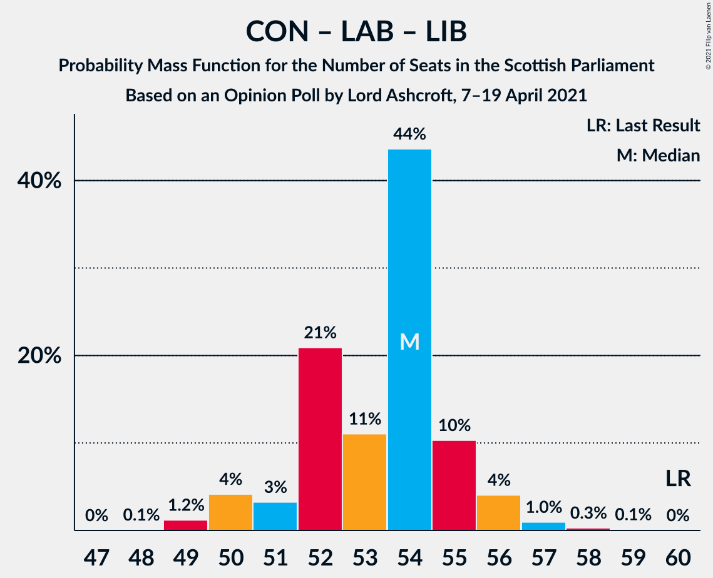

| Number of Seats | Probability | Accumulated | Special Marks |
|:---------------:|:-----------:|:-----------:|:-------------:|
| 48 | 0.1% | 100% |  |
| 49 | 1.2% | 99.9% |  |
| 50 | 4% | 98.7% |  |
| 51 | 3% | 95% | Median |
| 52 | 21% | 91% |  |
| 53 | 11% | 70% |  |
| 54 | 44% | 59% |  |
| 55 | 10% | 16% |  |
| 56 | 4% | 5% |  |
| 57 | 1.0% | 1.4% |  |
| 58 | 0.3% | 0.4% |  |
| 59 | 0.1% | 0.1% |  |
| 60 | 0% | 0% | Last Result |

### Scottish Conservative & Unionist Party – Scottish Labour

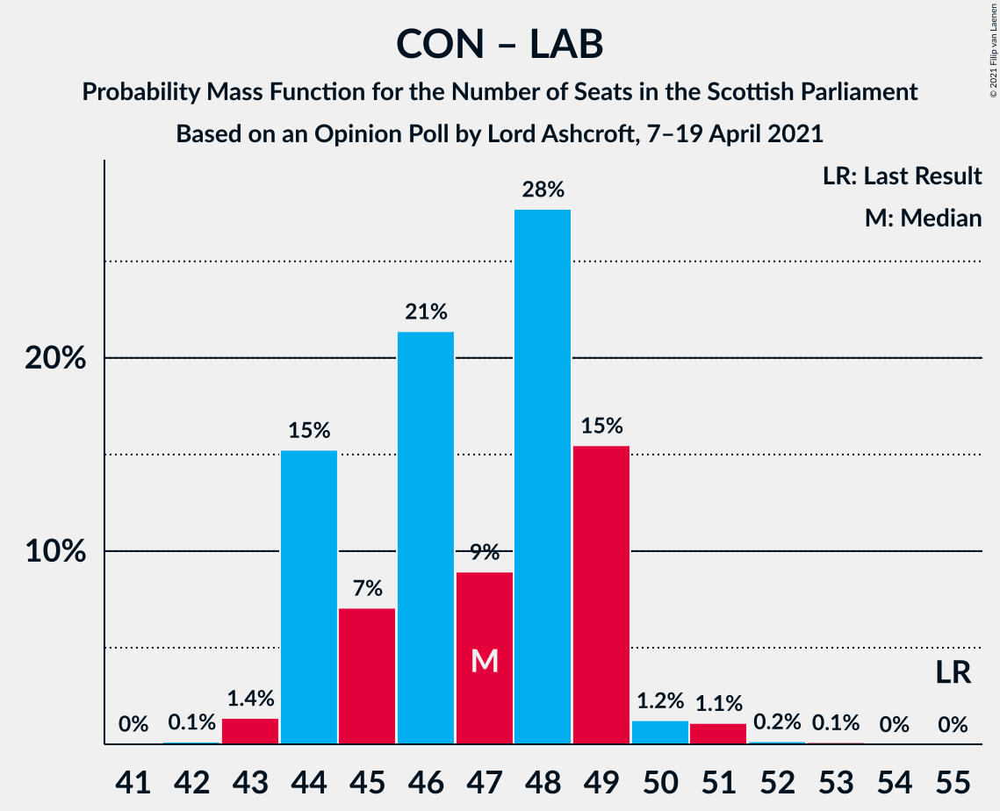

| Number of Seats | Probability | Accumulated | Special Marks |
|:---------------:|:-----------:|:-----------:|:-------------:|
| 42 | 0.1% | 100% |  |
| 43 | 1.4% | 99.8% |  |
| 44 | 15% | 98% |  |
| 45 | 7% | 83% | Median |
| 46 | 21% | 76% |  |
| 47 | 9% | 55% |  |
| 48 | 28% | 46% |  |
| 49 | 15% | 18% |  |
| 50 | 1.2% | 3% |  |
| 51 | 1.1% | 1.4% |  |
| 52 | 0.2% | 0.3% |  |
| 53 | 0.1% | 0.1% |  |
| 54 | 0% | 0% |  |
| 55 | 0% | 0% | Last Result |

### Scottish Labour – Scottish Greens – Scottish Liberal Democrats

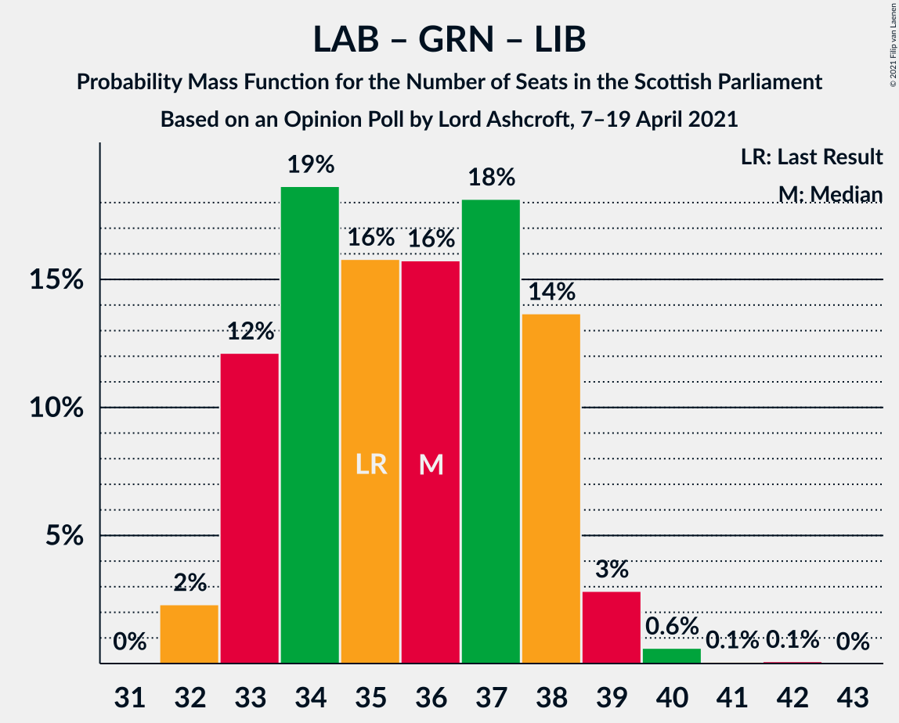

| Number of Seats | Probability | Accumulated | Special Marks |
|:---------------:|:-----------:|:-----------:|:-------------:|
| 32 | 2% | 100% |  |
| 33 | 12% | 98% |  |
| 34 | 19% | 86% | Median |
| 35 | 16% | 67% | Last Result |
| 36 | 16% | 51% |  |
| 37 | 18% | 35% |  |
| 38 | 14% | 17% |  |
| 39 | 3% | 4% |  |
| 40 | 0.6% | 0.8% |  |
| 41 | 0.1% | 0.2% |  |
| 42 | 0.1% | 0.1% |  |
| 43 | 0% | 0% |  |

### Scottish Conservative & Unionist Party – Scottish Liberal Democrats

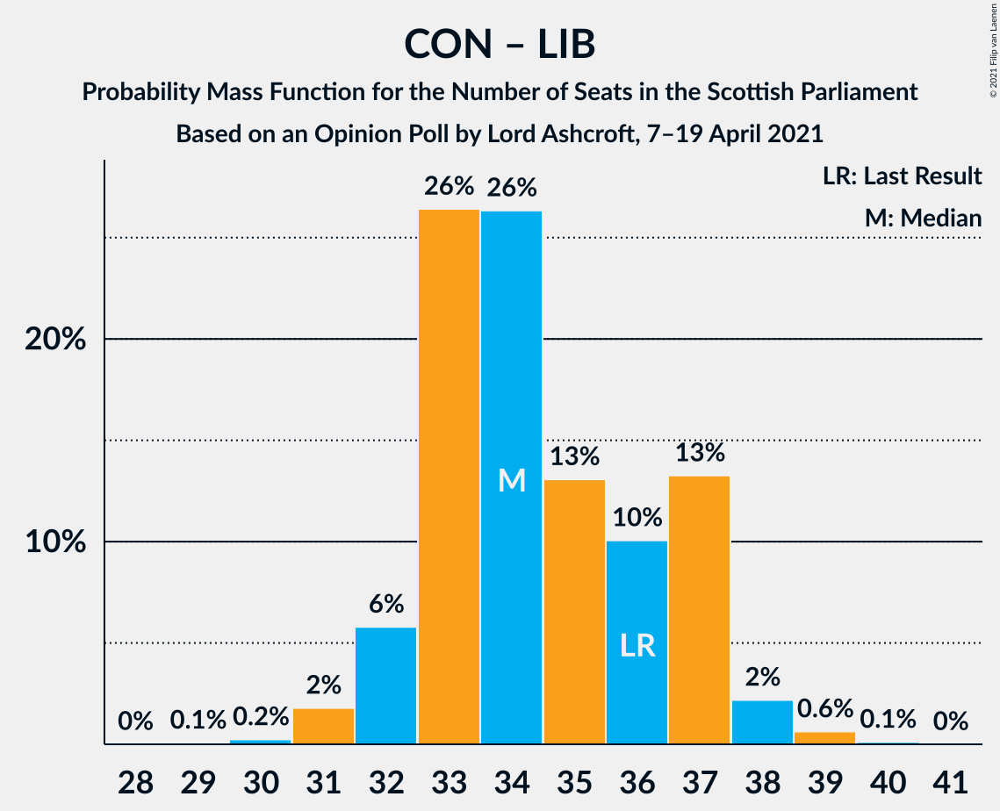

| Number of Seats | Probability | Accumulated | Special Marks |
|:---------------:|:-----------:|:-----------:|:-------------:|
| 29 | 0.1% | 100% |  |
| 30 | 0.2% | 99.9% |  |
| 31 | 2% | 99.7% |  |
| 32 | 6% | 98% |  |
| 33 | 26% | 92% | Median |
| 34 | 26% | 66% |  |
| 35 | 13% | 39% |  |
| 36 | 10% | 26% | Last Result |
| 37 | 13% | 16% |  |
| 38 | 2% | 3% |  |
| 39 | 0.6% | 0.7% |  |
| 40 | 0.1% | 0.1% |  |
| 41 | 0% | 0% |  |

### Scottish Labour – Scottish Liberal Democrats

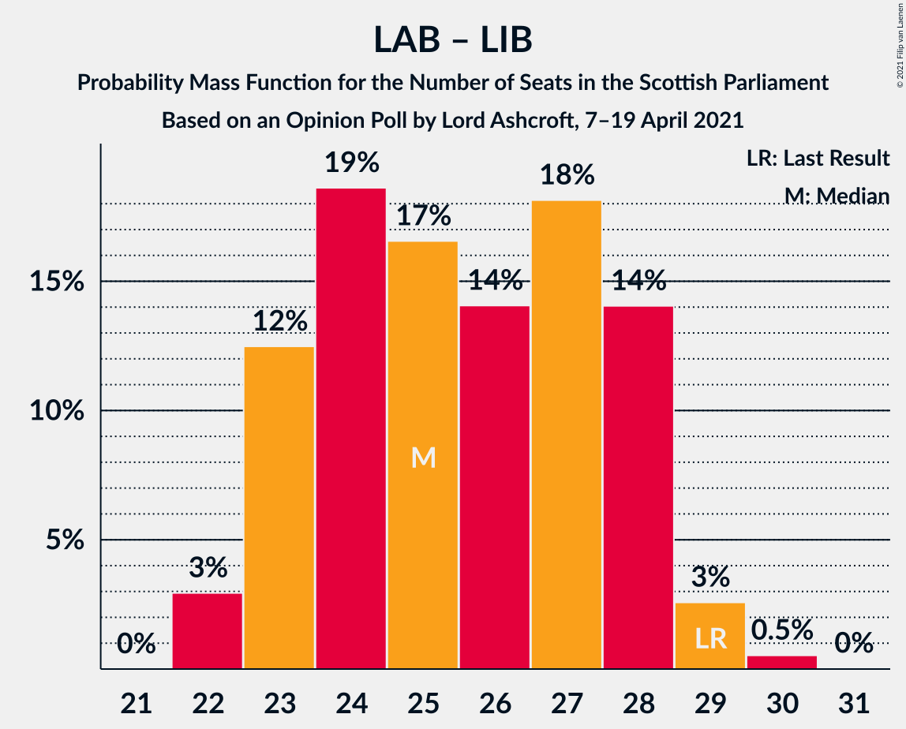

| Number of Seats | Probability | Accumulated | Special Marks |
|:---------------:|:-----------:|:-----------:|:-------------:|
| 22 | 3% | 100% |  |
| 23 | 12% | 97% |  |
| 24 | 19% | 85% | Median |
| 25 | 17% | 66% |  |
| 26 | 14% | 49% |  |
| 27 | 18% | 35% |  |
| 28 | 14% | 17% |  |
| 29 | 3% | 3% | Last Result |
| 30 | 0.5% | 0.6% |  |
| 31 | 0% | 0% |  |

## Technical Information

### Opinion Poll

+ **Polling firm:** Lord Ashcroft
+ **Commissioner(s):** —
+ **Fieldwork period:** 7–19 April 2021

### Calculations

+ **Sample size:** 2017
+ **Simulations done:** 1,048,576
+ **Error estimate:** 0.75%

