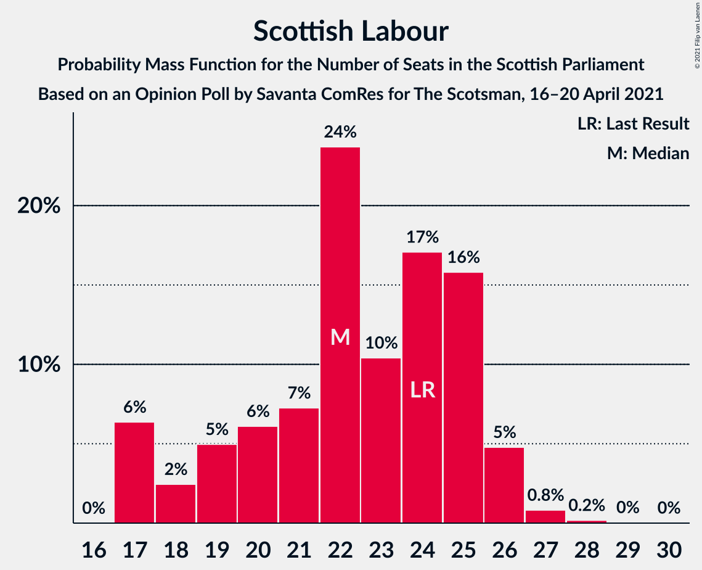
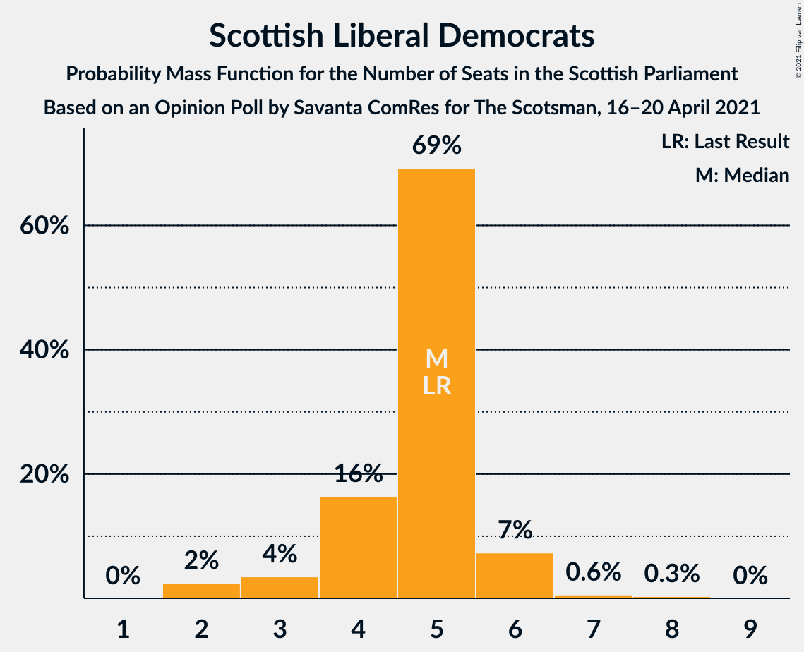

# Opinion Poll by Savanta ComRes for The Scotsman, 16–20 April 2021

<a href="#voting-intentions">Voting Intentions</a> | <a href="#seats">Seats</a> | <a href="#coalitions">Coalitions</a> | <a href="#technical-information">Technical Information</a>

## Voting Intentions

### Confidence Intervals

| Party | Last Result | Poll Result | 80% Confidence Interval | 90% Confidence Interval | 95% Confidence Interval | 99% Confidence Interval |
|:-----:|:-----------:|:-----------:|:-----------------------:|:-----------------------:|:-----------------------:|:-----------------------:|
| Scottish National Party | 41.7% | 38.8% | 36.8–40.8% |36.3–41.3% |35.8–41.8% |34.9–42.8% |
| Scottish Conservative & Unionist Party | 22.9% | 23.5% | 21.8–25.3% |21.4–25.8% |20.9–26.2% |20.2–27.1% |
| Scottish Labour | 19.1% | 17.4% | 15.9–19.0% |15.5–19.5% |15.2–19.9% |14.5–20.7% |
| Scottish Greens | 6.6% | 7.2% | 6.2–8.4% |6.0–8.7% |5.7–9.0% |5.3–9.6% |
| Scottish Liberal Democrats | 5.2% | 5.1% | 4.3–6.1% |4.1–6.4% |3.9–6.6% |3.6–7.2% |
| Alba Party | 0.0% | 1.0% | 0.7–1.5% |0.6–1.7% |0.5–1.8% |0.4–2.1% |

*Note:* The poll result column reflects the actual value used in the calculations. Published results may vary slightly, and in addition be rounded to fewer digits.

## Seats

### Confidence Intervals

| Party | Last Result | Median | 80% Confidence Interval | 90% Confidence Interval | 95% Confidence Interval | 99% Confidence Interval |
|:-----:|:-----------:|:------:|:-----------------------:|:-----------------------:|:-----------------------:|:-----------------------:|
| <a href="#scottish-national-party">Scottish National Party</a> | 63 | 63 | 60–65 |59–66 |57–67 |56–68 |
| <a href="#scottish-conservative-&-unionist-party">Scottish Conservative & Unionist Party</a> | 31 | 32 | 29–34 |28–35 |27–36 |25–37 |
| <a href="#scottish-labour">Scottish Labour</a> | 24 | 22 | 19–25 |17–26 |17–26 |17–27 |
| <a href="#scottish-greens">Scottish Greens</a> | 6 | 7 | 5–10 |4–10 |4–10 |3–11 |
| <a href="#scottish-liberal-democrats">Scottish Liberal Democrats</a> | 5 | 5 | 4–5 |3–6 |3–6 |2–7 |
| <a href="#alba-party">Alba Party</a> | 0 | 0 | 0 |0 |0 |0 |

### Scottish National Party

*For a full overview of the results for this party, see the [Scottish National Party](party-scottishnationalparty.html) page.*

| Number of Seats | Probability | Accumulated | Special Marks |
|:---------------:|:-----------:|:-----------:|:-------------:|
| 55 | 0.2% | 100% |  |
| 56 | 1.1% | 99.8% |  |
| 57 | 2% | 98.7% |  |
| 58 | 2% | 97% |  |
| 59 | 3% | 95% |  |
| 60 | 13% | 92% |  |
| 61 | 13% | 79% |  |
| 62 | 14% | 66% |  |
| 63 | 16% | 52% | Last Result, Median |
| 64 | 15% | 36% |  |
| 65 | 14% | 21% | Majority |
| 66 | 4% | 7% |  |
| 67 | 2% | 3% |  |
| 68 | 0.3% | 0.8% |  |
| 69 | 0.2% | 0.4% |  |
| 70 | 0.1% | 0.2% |  |
| 71 | 0.1% | 0.1% |  |
| 72 | 0% | 0% |  |

### Scottish Conservative & Unionist Party

*For a full overview of the results for this party, see the [Scottish Conservative & Unionist Party](party-scottishconservativeunionistparty.html) page.*

| Number of Seats | Probability | Accumulated | Special Marks |
|:---------------:|:-----------:|:-----------:|:-------------:|
| 24 | 0.4% | 100% |  |
| 25 | 0.9% | 99.6% |  |
| 26 | 1.2% | 98.7% |  |
| 27 | 2% | 98% |  |
| 28 | 3% | 95% |  |
| 29 | 4% | 92% |  |
| 30 | 9% | 88% |  |
| 31 | 10% | 80% | Last Result |
| 32 | 40% | 69% | Median |
| 33 | 17% | 29% |  |
| 34 | 5% | 12% |  |
| 35 | 4% | 7% |  |
| 36 | 2% | 3% |  |
| 37 | 0.9% | 1.3% |  |
| 38 | 0.3% | 0.4% |  |
| 39 | 0% | 0.1% |  |
| 40 | 0% | 0% |  |

### Scottish Labour

*For a full overview of the results for this party, see the [Scottish Labour](party-scottishlabour.html) page.*

| Number of Seats | Probability | Accumulated | Special Marks |
|:---------------:|:-----------:|:-----------:|:-------------:|
| 17 | 6% | 100% |  |
| 18 | 2% | 94% |  |
| 19 | 5% | 91% |  |
| 20 | 6% | 86% |  |
| 21 | 7% | 80% |  |
| 22 | 24% | 73% | Median |
| 23 | 10% | 49% |  |
| 24 | 17% | 39% | Last Result |
| 25 | 16% | 22% |  |
| 26 | 5% | 6% |  |
| 27 | 0.8% | 1.1% |  |
| 28 | 0.2% | 0.2% |  |
| 29 | 0% | 0.1% |  |
| 30 | 0% | 0% |  |

### Scottish Greens

*For a full overview of the results for this party, see the [Scottish Greens](party-scottishgreens.html) page.*

| Number of Seats | Probability | Accumulated | Special Marks |
|:---------------:|:-----------:|:-----------:|:-------------:|
| 3 | 2% | 100% |  |
| 4 | 5% | 98% |  |
| 5 | 10% | 92% |  |
| 6 | 19% | 82% | Last Result |
| 7 | 14% | 63% | Median |
| 8 | 9% | 49% |  |
| 9 | 9% | 40% |  |
| 10 | 30% | 31% |  |
| 11 | 0.6% | 0.7% |  |
| 12 | 0.1% | 0.1% |  |
| 13 | 0% | 0% |  |

### Scottish Liberal Democrats

*For a full overview of the results for this party, see the [Scottish Liberal Democrats](party-scottishliberaldemocrats.html) page.*

| Number of Seats | Probability | Accumulated | Special Marks |
|:---------------:|:-----------:|:-----------:|:-------------:|
| 2 | 2% | 100% |  |
| 3 | 4% | 98% |  |
| 4 | 16% | 94% |  |
| 5 | 69% | 78% | Last Result, Median |
| 6 | 7% | 8% |  |
| 7 | 0.6% | 1.0% |  |
| 8 | 0.3% | 0.4% |  |
| 9 | 0% | 0% |  |

### Alba Party

*For a full overview of the results for this party, see the [Alba Party](party-albaparty.html) page.*

| Number of Seats | Probability | Accumulated | Special Marks |
|:---------------:|:-----------:|:-----------:|:-------------:|
| 0 | 100% | 100% | Last Result, Median |

## Coalitions

### Confidence Intervals

| Coalition | Last Result | Median | Majority? | 80% Confidence Interval | 90% Confidence Interval | 95% Confidence Interval | 99% Confidence Interval |
|:---------:|:-----------:|:------:|:---------:|:-----------------------:|:-----------------------:|:-----------------------:|:-----------------------:|
| Scottish National Party – Scottish Greens – Alba Party | 69 | 70 | 97% | 67–74 | 66–75 | 64–76 | 62–77 |
| Scottish National Party – Scottish Greens | 69 | 70 | 97% | 67–74 | 66–75 | 64–76 | 62–77 |
| Scottish National Party – Alba Party | 63 | 63 | 21% | 60–65 | 59–66 | 57–67 | 56–68 |
| Scottish National Party | 63 | 63 | 21% | 60–65 | 59–66 | 57–67 | 56–68 |
| Scottish Conservative & Unionist Party – Scottish Labour – Scottish Liberal Democrats | 60 | 59 | 3% | 55–62 | 54–63 | 53–65 | 52–67 |
| Scottish Conservative & Unionist Party – Scottish Labour | 55 | 54 | 0% | 50–57 | 49–59 | 49–60 | 47–61 |
| Scottish Conservative & Unionist Party – Scottish Liberal Democrats | 36 | 37 | 0% | 34–39 | 32–40 | 31–41 | 29–43 |
| Scottish Labour – Scottish Greens – Scottish Liberal Democrats | 35 | 35 | 0% | 32–38 | 31–39 | 31–39 | 29–41 |
| Scottish Labour – Scottish Liberal Democrats | 29 | 27 | 0% | 23–30 | 22–31 | 22–31 | 21–32 |

### Scottish National Party – Scottish Greens – Alba Party

| Number of Seats | Probability | Accumulated | Special Marks |
|:---------------:|:-----------:|:-----------:|:-------------:|
| 62 | 0.5% | 100% |  |
| 63 | 0.8% | 99.5% |  |
| 64 | 2% | 98.7% |  |
| 65 | 2% | 97% | Majority |
| 66 | 4% | 95% |  |
| 67 | 12% | 91% |  |
| 68 | 11% | 79% |  |
| 69 | 11% | 68% | Last Result |
| 70 | 18% | 57% | Median |
| 71 | 9% | 39% |  |
| 72 | 8% | 30% |  |
| 73 | 6% | 22% |  |
| 74 | 6% | 16% |  |
| 75 | 7% | 10% |  |
| 76 | 1.5% | 3% |  |
| 77 | 1.3% | 2% |  |
| 78 | 0.1% | 0.3% |  |
| 79 | 0.1% | 0.2% |  |
| 80 | 0.1% | 0.1% |  |
| 81 | 0% | 0% |  |

### Scottish National Party – Scottish Greens

| Number of Seats | Probability | Accumulated | Special Marks |
|:---------------:|:-----------:|:-----------:|:-------------:|
| 62 | 0.5% | 100% |  |
| 63 | 0.8% | 99.5% |  |
| 64 | 2% | 98.7% |  |
| 65 | 2% | 97% | Majority |
| 66 | 4% | 95% |  |
| 67 | 12% | 91% |  |
| 68 | 11% | 79% |  |
| 69 | 11% | 68% | Last Result |
| 70 | 18% | 57% | Median |
| 71 | 9% | 39% |  |
| 72 | 8% | 30% |  |
| 73 | 6% | 22% |  |
| 74 | 6% | 16% |  |
| 75 | 7% | 10% |  |
| 76 | 1.5% | 3% |  |
| 77 | 1.3% | 2% |  |
| 78 | 0.1% | 0.3% |  |
| 79 | 0.1% | 0.2% |  |
| 80 | 0.1% | 0.1% |  |
| 81 | 0% | 0% |  |

### Scottish National Party – Alba Party

| Number of Seats | Probability | Accumulated | Special Marks |
|:---------------:|:-----------:|:-----------:|:-------------:|
| 55 | 0.2% | 100% |  |
| 56 | 1.1% | 99.8% |  |
| 57 | 2% | 98.7% |  |
| 58 | 2% | 97% |  |
| 59 | 3% | 95% |  |
| 60 | 13% | 92% |  |
| 61 | 13% | 79% |  |
| 62 | 14% | 66% |  |
| 63 | 16% | 52% | Last Result, Median |
| 64 | 15% | 36% |  |
| 65 | 14% | 21% | Majority |
| 66 | 4% | 7% |  |
| 67 | 2% | 3% |  |
| 68 | 0.3% | 0.8% |  |
| 69 | 0.2% | 0.4% |  |
| 70 | 0.1% | 0.2% |  |
| 71 | 0.1% | 0.1% |  |
| 72 | 0% | 0% |  |

### Scottish National Party

| Number of Seats | Probability | Accumulated | Special Marks |
|:---------------:|:-----------:|:-----------:|:-------------:|
| 55 | 0.2% | 100% |  |
| 56 | 1.1% | 99.8% |  |
| 57 | 2% | 98.7% |  |
| 58 | 2% | 97% |  |
| 59 | 3% | 95% |  |
| 60 | 13% | 92% |  |
| 61 | 13% | 79% |  |
| 62 | 14% | 66% |  |
| 63 | 16% | 52% | Last Result, Median |
| 64 | 15% | 36% |  |
| 65 | 14% | 21% | Majority |
| 66 | 4% | 7% |  |
| 67 | 2% | 3% |  |
| 68 | 0.3% | 0.8% |  |
| 69 | 0.2% | 0.4% |  |
| 70 | 0.1% | 0.2% |  |
| 71 | 0.1% | 0.1% |  |
| 72 | 0% | 0% |  |

### Scottish Conservative & Unionist Party – Scottish Labour – Scottish Liberal Democrats

| Number of Seats | Probability | Accumulated | Special Marks |
|:---------------:|:-----------:|:-----------:|:-------------:|
| 49 | 0.1% | 100% |  |
| 50 | 0.1% | 99.9% |  |
| 51 | 0.1% | 99.8% |  |
| 52 | 1.3% | 99.7% |  |
| 53 | 1.5% | 98% |  |
| 54 | 7% | 97% |  |
| 55 | 6% | 90% |  |
| 56 | 6% | 84% |  |
| 57 | 8% | 78% |  |
| 58 | 9% | 70% |  |
| 59 | 18% | 61% | Median |
| 60 | 11% | 43% | Last Result |
| 61 | 11% | 32% |  |
| 62 | 12% | 21% |  |
| 63 | 4% | 9% |  |
| 64 | 2% | 5% |  |
| 65 | 2% | 3% | Majority |
| 66 | 0.8% | 1.3% |  |
| 67 | 0.5% | 0.5% |  |
| 68 | 0% | 0% |  |

### Scottish Conservative & Unionist Party – Scottish Labour

| Number of Seats | Probability | Accumulated | Special Marks |
|:---------------:|:-----------:|:-----------:|:-------------:|
| 45 | 0.1% | 100% |  |
| 46 | 0.1% | 99.9% |  |
| 47 | 0.3% | 99.8% |  |
| 48 | 1.3% | 99.5% |  |
| 49 | 5% | 98% |  |
| 50 | 7% | 93% |  |
| 51 | 7% | 86% |  |
| 52 | 7% | 79% |  |
| 53 | 6% | 72% |  |
| 54 | 19% | 66% | Median |
| 55 | 15% | 47% | Last Result |
| 56 | 10% | 32% |  |
| 57 | 13% | 22% |  |
| 58 | 4% | 9% |  |
| 59 | 2% | 5% |  |
| 60 | 2% | 3% |  |
| 61 | 0.9% | 1.3% |  |
| 62 | 0.4% | 0.4% |  |
| 63 | 0% | 0.1% |  |
| 64 | 0% | 0% |  |

### Scottish Conservative & Unionist Party – Scottish Liberal Democrats

| Number of Seats | Probability | Accumulated | Special Marks |
|:---------------:|:-----------:|:-----------:|:-------------:|
| 27 | 0.1% | 100% |  |
| 28 | 0.4% | 99.9% |  |
| 29 | 0.4% | 99.6% |  |
| 30 | 0.9% | 99.2% |  |
| 31 | 2% | 98% |  |
| 32 | 2% | 97% |  |
| 33 | 4% | 95% |  |
| 34 | 5% | 91% |  |
| 35 | 12% | 86% |  |
| 36 | 12% | 74% | Last Result |
| 37 | 34% | 62% | Median |
| 38 | 14% | 27% |  |
| 39 | 6% | 13% |  |
| 40 | 4% | 7% |  |
| 41 | 2% | 3% |  |
| 42 | 0.9% | 1.4% |  |
| 43 | 0.4% | 0.5% |  |
| 44 | 0% | 0.1% |  |
| 45 | 0% | 0% |  |

### Scottish Labour – Scottish Greens – Scottish Liberal Democrats

| Number of Seats | Probability | Accumulated | Special Marks |
|:---------------:|:-----------:|:-----------:|:-------------:|
| 28 | 0.1% | 100% |  |
| 29 | 0.4% | 99.9% |  |
| 30 | 1.5% | 99.4% |  |
| 31 | 4% | 98% |  |
| 32 | 15% | 94% |  |
| 33 | 15% | 79% |  |
| 34 | 12% | 65% | Median |
| 35 | 14% | 52% | Last Result |
| 36 | 12% | 39% |  |
| 37 | 12% | 27% |  |
| 38 | 8% | 14% |  |
| 39 | 4% | 6% |  |
| 40 | 1.3% | 2% |  |
| 41 | 0.4% | 0.5% |  |
| 42 | 0.1% | 0.1% |  |
| 43 | 0% | 0% |  |

### Scottish Labour – Scottish Liberal Democrats

| Number of Seats | Probability | Accumulated | Special Marks |
|:---------------:|:-----------:|:-----------:|:-------------:|
| 20 | 0.2% | 100% |  |
| 21 | 0.6% | 99.8% |  |
| 22 | 6% | 99.1% |  |
| 23 | 3% | 93% |  |
| 24 | 6% | 90% |  |
| 25 | 7% | 84% |  |
| 26 | 9% | 77% |  |
| 27 | 20% | 68% | Median |
| 28 | 11% | 47% |  |
| 29 | 17% | 36% | Last Result |
| 30 | 14% | 19% |  |
| 31 | 5% | 6% |  |
| 32 | 0.9% | 1.2% |  |
| 33 | 0.3% | 0.4% |  |
| 34 | 0.1% | 0.1% |  |
| 35 | 0% | 0% |  |

## Technical Information

### Opinion Poll

+ **Polling firm:** Savanta ComRes
+ **Commissioner(s):** The Scotsman
+ **Fieldwork period:** 16–20 April 2021

### Calculations

+ **Sample size:** 1001
+ **Simulations done:** 1,048,576
+ **Error estimate:** 0.85%

