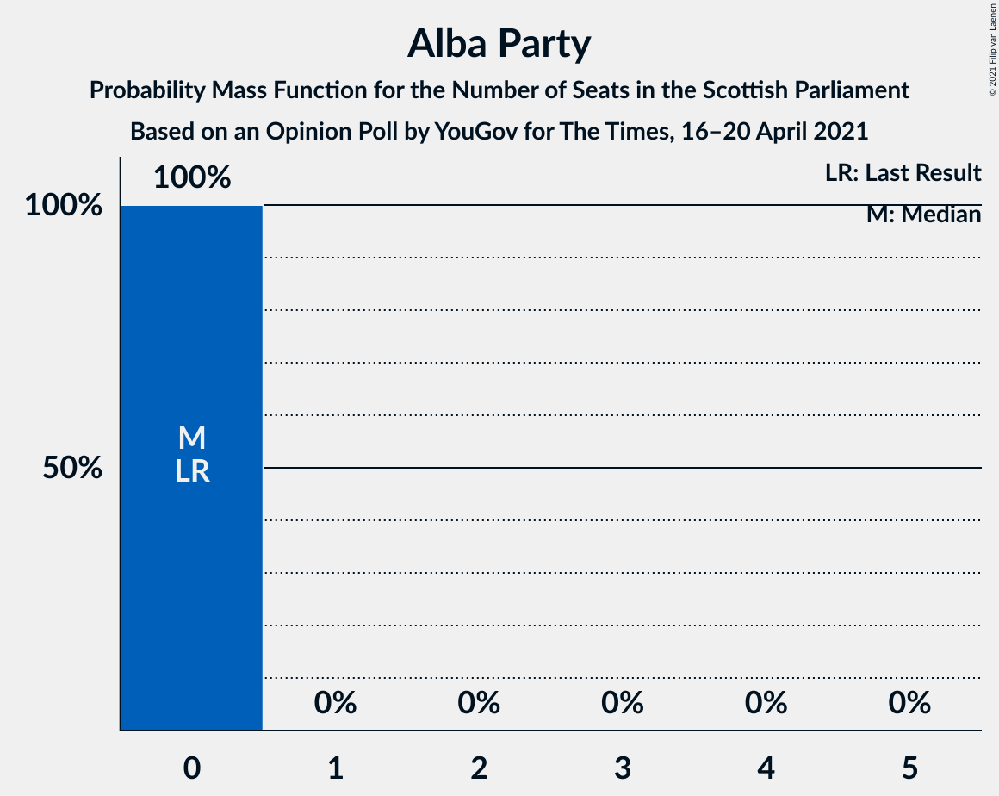

# Opinion Poll by YouGov for The Times, 16–20 April 2021

<a href="#voting-intentions">Voting Intentions</a> | <a href="#seats">Seats</a> | <a href="#coalitions">Coalitions</a> | <a href="#technical-information">Technical Information</a>

## Voting Intentions

### Confidence Intervals

| Party | Last Result | Poll Result | 80% Confidence Interval | 90% Confidence Interval | 95% Confidence Interval | 99% Confidence Interval |
|:-----:|:-----------:|:-----------:|:-----------------------:|:-----------------------:|:-----------------------:|:-----------------------:|
| Scottish National Party | 41.7% | 39.8% | 38.0–41.6% |37.5–42.1% |37.1–42.6% |36.2–43.5% |
| Scottish Conservative & Unionist Party | 22.9% | 22.4% | 20.9–24.0% |20.5–24.5% |20.1–24.9% |19.5–25.7% |
| Scottish Labour | 19.1% | 17.4% | 16.0–18.8% |15.6–19.3% |15.3–19.6% |14.7–20.3% |
| Scottish Greens | 6.6% | 10.2% | 9.2–11.4% |8.9–11.8% |8.6–12.1% |8.2–12.7% |
| Scottish Liberal Democrats | 5.2% | 5.1% | 4.3–6.0% |4.1–6.2% |4.0–6.5% |3.6–6.9% |
| Alba Party | 0.0% | 2.1% | 1.6–2.7% |1.5–2.9% |1.4–3.0% |1.2–3.4% |
| Reform UK | 0.0% | 1.0% | 0.7–1.5% |0.6–1.6% |0.6–1.7% |0.5–2.0% |

*Note:* The poll result column reflects the actual value used in the calculations. Published results may vary slightly, and in addition be rounded to fewer digits.

## Seats

### Confidence Intervals

| Party | Last Result | Median | 80% Confidence Interval | 90% Confidence Interval | 95% Confidence Interval | 99% Confidence Interval |
|:-----:|:-----------:|:------:|:-----------------------:|:-----------------------:|:-----------------------:|:-----------------------:|
| <a href="#scottish-national-party">Scottish National Party</a> | 63 | 63 | 60–67 |59–69 |59–70 |57–71 |
| <a href="#scottish-conservative-&-unionist-party">Scottish Conservative & Unionist Party</a> | 31 | 29 | 26–32 |25–33 |25–33 |24–34 |
| <a href="#scottish-labour">Scottish Labour</a> | 24 | 21 | 18–24 |17–25 |17–25 |17–26 |
| <a href="#scottish-greens">Scottish Greens</a> | 6 | 11 | 10–13 |10–13 |10–13 |10–14 |
| <a href="#scottish-liberal-democrats">Scottish Liberal Democrats</a> | 5 | 5 | 3–5 |3–5 |2–6 |2–6 |
| <a href="#alba-party">Alba Party</a> | 0 | 0 | 0 |0 |0 |0 |
| <a href="#reform-uk">Reform UK</a> | 0 | 0 | 0 |0 |0 |0 |

### Scottish National Party

*For a full overview of the results for this party, see the [Scottish National Party](party-scottishnationalparty.html) page.*

| Number of Seats | Probability | Accumulated | Special Marks |
|:---------------:|:-----------:|:-----------:|:-------------:|
| 55 | 0.1% | 100% |  |
| 56 | 0.1% | 99.8% |  |
| 57 | 0.3% | 99.8% |  |
| 58 | 0.2% | 99.5% |  |
| 59 | 6% | 99.3% |  |
| 60 | 12% | 94% |  |
| 61 | 11% | 81% |  |
| 62 | 10% | 71% |  |
| 63 | 18% | 61% | Last Result, Median |
| 64 | 14% | 43% |  |
| 65 | 12% | 29% | Majority |
| 66 | 6% | 17% |  |
| 67 | 4% | 11% |  |
| 68 | 3% | 8% |  |
| 69 | 2% | 5% |  |
| 70 | 2% | 3% |  |
| 71 | 1.3% | 1.4% |  |
| 72 | 0.1% | 0.1% |  |
| 73 | 0% | 0% |  |

### Scottish Conservative & Unionist Party

*For a full overview of the results for this party, see the [Scottish Conservative & Unionist Party](party-scottishconservativeunionistparty.html) page.*

| Number of Seats | Probability | Accumulated | Special Marks |
|:---------------:|:-----------:|:-----------:|:-------------:|
| 22 | 0.1% | 100% |  |
| 23 | 0.4% | 99.9% |  |
| 24 | 2% | 99.5% |  |
| 25 | 7% | 98% |  |
| 26 | 7% | 91% |  |
| 27 | 17% | 84% |  |
| 28 | 13% | 67% |  |
| 29 | 12% | 54% | Median |
| 30 | 15% | 42% |  |
| 31 | 15% | 26% | Last Result |
| 32 | 5% | 11% |  |
| 33 | 5% | 6% |  |
| 34 | 0.4% | 0.6% |  |
| 35 | 0.1% | 0.2% |  |
| 36 | 0% | 0% |  |

### Scottish Labour

*For a full overview of the results for this party, see the [Scottish Labour](party-scottishlabour.html) page.*

| Number of Seats | Probability | Accumulated | Special Marks |
|:---------------:|:-----------:|:-----------:|:-------------:|
| 17 | 7% | 100% |  |
| 18 | 9% | 93% |  |
| 19 | 8% | 83% |  |
| 20 | 10% | 75% |  |
| 21 | 18% | 65% | Median |
| 22 | 16% | 47% |  |
| 23 | 11% | 31% |  |
| 24 | 14% | 20% | Last Result |
| 25 | 5% | 6% |  |
| 26 | 0.6% | 0.6% |  |
| 27 | 0% | 0% |  |

### Scottish Greens

*For a full overview of the results for this party, see the [Scottish Greens](party-scottishgreens.html) page.*

| Number of Seats | Probability | Accumulated | Special Marks |
|:---------------:|:-----------:|:-----------:|:-------------:|
| 6 | 0% | 100% | Last Result |
| 7 | 0% | 100% |  |
| 8 | 0% | 100% |  |
| 9 | 0.3% | 99.9% |  |
| 10 | 28% | 99.7% |  |
| 11 | 36% | 72% | Median |
| 12 | 24% | 36% |  |
| 13 | 10% | 12% |  |
| 14 | 2% | 2% |  |
| 15 | 0.3% | 0.3% |  |
| 16 | 0% | 0% |  |

### Scottish Liberal Democrats

*For a full overview of the results for this party, see the [Scottish Liberal Democrats](party-scottishliberaldemocrats.html) page.*

| Number of Seats | Probability | Accumulated | Special Marks |
|:---------------:|:-----------:|:-----------:|:-------------:|
| 2 | 4% | 100% |  |
| 3 | 6% | 96% |  |
| 4 | 25% | 90% |  |
| 5 | 61% | 65% | Last Result, Median |
| 6 | 3% | 3% |  |
| 7 | 0.1% | 0.2% |  |
| 8 | 0.1% | 0.1% |  |
| 9 | 0% | 0% |  |

### Alba Party

*For a full overview of the results for this party, see the [Alba Party](party-albaparty.html) page.*

| Number of Seats | Probability | Accumulated | Special Marks |
|:---------------:|:-----------:|:-----------:|:-------------:|
| 0 | 100% | 100% | Last Result, Median |

### Reform UK

*For a full overview of the results for this party, see the [Reform UK](party-reformuk.html) page.*

| Number of Seats | Probability | Accumulated | Special Marks |
|:---------------:|:-----------:|:-----------:|:-------------:|
| 0 | 100% | 100% | Last Result, Median |

## Coalitions

### Confidence Intervals

| Coalition | Last Result | Median | Majority? | 80% Confidence Interval | 90% Confidence Interval | 95% Confidence Interval | 99% Confidence Interval |
|:---------:|:-----------:|:------:|:---------:|:-----------------------:|:-----------------------:|:-----------------------:|:-----------------------:|
| Scottish National Party – Scottish Greens – Alba Party | 69 | 74 | 100% | 71–78 | 70–79 | 70–81 | 69–82 |
| Scottish National Party – Scottish Greens | 69 | 74 | 100% | 71–78 | 70–79 | 70–81 | 69–82 |
| Scottish National Party – Alba Party | 63 | 63 | 29% | 60–67 | 59–69 | 59–70 | 57–71 |
| Scottish National Party | 63 | 63 | 29% | 60–67 | 59–69 | 59–70 | 57–71 |
| Scottish Conservative & Unionist Party – Scottish Labour – Scottish Liberal Democrats | 60 | 55 | 0% | 51–58 | 50–59 | 48–59 | 47–60 |
| Scottish Conservative & Unionist Party – Scottish Labour | 55 | 50 | 0% | 47–53 | 46–54 | 44–55 | 43–56 |
| Scottish Labour – Scottish Greens – Scottish Liberal Democrats | 35 | 37 | 0% | 34–40 | 33–41 | 32–42 | 30–42 |
| Scottish Conservative & Unionist Party – Scottish Liberal Democrats | 36 | 33 | 0% | 30–36 | 29–37 | 28–38 | 27–39 |
| Scottish Labour – Scottish Liberal Democrats | 29 | 26 | 0% | 22–29 | 22–29 | 22–30 | 20–31 |

### Scottish National Party – Scottish Greens – Alba Party

| Number of Seats | Probability | Accumulated | Special Marks |
|:---------------:|:-----------:|:-----------:|:-------------:|
| 66 | 0% | 100% |  |
| 67 | 0.2% | 99.9% |  |
| 68 | 0.1% | 99.8% |  |
| 69 | 0.9% | 99.7% | Last Result |
| 70 | 5% | 98.8% |  |
| 71 | 9% | 94% |  |
| 72 | 10% | 85% |  |
| 73 | 13% | 75% |  |
| 74 | 12% | 62% | Median |
| 75 | 19% | 50% |  |
| 76 | 11% | 31% |  |
| 77 | 9% | 20% |  |
| 78 | 4% | 12% |  |
| 79 | 3% | 8% |  |
| 80 | 2% | 5% |  |
| 81 | 2% | 3% |  |
| 82 | 1.4% | 1.4% |  |
| 83 | 0% | 0% |  |

### Scottish National Party – Scottish Greens

| Number of Seats | Probability | Accumulated | Special Marks |
|:---------------:|:-----------:|:-----------:|:-------------:|
| 66 | 0% | 100% |  |
| 67 | 0.2% | 99.9% |  |
| 68 | 0.1% | 99.8% |  |
| 69 | 0.9% | 99.7% | Last Result |
| 70 | 5% | 98.8% |  |
| 71 | 9% | 94% |  |
| 72 | 10% | 85% |  |
| 73 | 13% | 75% |  |
| 74 | 12% | 62% | Median |
| 75 | 19% | 50% |  |
| 76 | 11% | 31% |  |
| 77 | 9% | 20% |  |
| 78 | 4% | 12% |  |
| 79 | 3% | 8% |  |
| 80 | 2% | 5% |  |
| 81 | 2% | 3% |  |
| 82 | 1.4% | 1.4% |  |
| 83 | 0% | 0% |  |

### Scottish National Party – Alba Party

| Number of Seats | Probability | Accumulated | Special Marks |
|:---------------:|:-----------:|:-----------:|:-------------:|
| 55 | 0.1% | 100% |  |
| 56 | 0.1% | 99.8% |  |
| 57 | 0.3% | 99.8% |  |
| 58 | 0.2% | 99.5% |  |
| 59 | 6% | 99.3% |  |
| 60 | 12% | 94% |  |
| 61 | 11% | 81% |  |
| 62 | 10% | 71% |  |
| 63 | 18% | 61% | Last Result, Median |
| 64 | 14% | 43% |  |
| 65 | 12% | 29% | Majority |
| 66 | 6% | 17% |  |
| 67 | 4% | 11% |  |
| 68 | 3% | 8% |  |
| 69 | 2% | 5% |  |
| 70 | 2% | 3% |  |
| 71 | 1.3% | 1.4% |  |
| 72 | 0.1% | 0.1% |  |
| 73 | 0% | 0% |  |

### Scottish National Party

| Number of Seats | Probability | Accumulated | Special Marks |
|:---------------:|:-----------:|:-----------:|:-------------:|
| 55 | 0.1% | 100% |  |
| 56 | 0.1% | 99.8% |  |
| 57 | 0.3% | 99.8% |  |
| 58 | 0.2% | 99.5% |  |
| 59 | 6% | 99.3% |  |
| 60 | 12% | 94% |  |
| 61 | 11% | 81% |  |
| 62 | 10% | 71% |  |
| 63 | 18% | 61% | Last Result, Median |
| 64 | 14% | 43% |  |
| 65 | 12% | 29% | Majority |
| 66 | 6% | 17% |  |
| 67 | 4% | 11% |  |
| 68 | 3% | 8% |  |
| 69 | 2% | 5% |  |
| 70 | 2% | 3% |  |
| 71 | 1.3% | 1.4% |  |
| 72 | 0.1% | 0.1% |  |
| 73 | 0% | 0% |  |

### Scottish Conservative & Unionist Party – Scottish Labour – Scottish Liberal Democrats

| Number of Seats | Probability | Accumulated | Special Marks |
|:---------------:|:-----------:|:-----------:|:-------------:|
| 47 | 1.4% | 100% |  |
| 48 | 2% | 98.6% |  |
| 49 | 2% | 97% |  |
| 50 | 3% | 95% |  |
| 51 | 4% | 92% |  |
| 52 | 9% | 88% |  |
| 53 | 11% | 80% |  |
| 54 | 19% | 69% |  |
| 55 | 12% | 50% | Median |
| 56 | 13% | 38% |  |
| 57 | 10% | 25% |  |
| 58 | 9% | 15% |  |
| 59 | 5% | 6% |  |
| 60 | 0.9% | 1.2% | Last Result |
| 61 | 0.1% | 0.3% |  |
| 62 | 0.2% | 0.2% |  |
| 63 | 0% | 0.1% |  |
| 64 | 0% | 0% |  |

### Scottish Conservative & Unionist Party – Scottish Labour

| Number of Seats | Probability | Accumulated | Special Marks |
|:---------------:|:-----------:|:-----------:|:-------------:|
| 43 | 0.8% | 100% |  |
| 44 | 2% | 99.2% |  |
| 45 | 2% | 97% |  |
| 46 | 4% | 95% |  |
| 47 | 7% | 91% |  |
| 48 | 10% | 84% |  |
| 49 | 18% | 74% |  |
| 50 | 14% | 56% | Median |
| 51 | 13% | 42% |  |
| 52 | 10% | 29% |  |
| 53 | 10% | 19% |  |
| 54 | 5% | 9% |  |
| 55 | 3% | 4% | Last Result |
| 56 | 0.4% | 0.6% |  |
| 57 | 0.2% | 0.2% |  |
| 58 | 0% | 0% |  |

### Scottish Labour – Scottish Greens – Scottish Liberal Democrats

| Number of Seats | Probability | Accumulated | Special Marks |
|:---------------:|:-----------:|:-----------:|:-------------:|
| 30 | 0.6% | 100% |  |
| 31 | 0.7% | 99.3% |  |
| 32 | 3% | 98.6% |  |
| 33 | 5% | 96% |  |
| 34 | 11% | 91% |  |
| 35 | 12% | 80% | Last Result |
| 36 | 11% | 68% |  |
| 37 | 11% | 57% | Median |
| 38 | 11% | 46% |  |
| 39 | 17% | 35% |  |
| 40 | 10% | 18% |  |
| 41 | 5% | 8% |  |
| 42 | 2% | 3% |  |
| 43 | 0.4% | 0.5% |  |
| 44 | 0.1% | 0.1% |  |
| 45 | 0% | 0% |  |

### Scottish Conservative & Unionist Party – Scottish Liberal Democrats

| Number of Seats | Probability | Accumulated | Special Marks |
|:---------------:|:-----------:|:-----------:|:-------------:|
| 26 | 0.1% | 100% |  |
| 27 | 0.7% | 99.9% |  |
| 28 | 2% | 99.2% |  |
| 29 | 4% | 97% |  |
| 30 | 6% | 93% |  |
| 31 | 9% | 87% |  |
| 32 | 16% | 78% |  |
| 33 | 14% | 63% |  |
| 34 | 13% | 48% | Median |
| 35 | 18% | 35% |  |
| 36 | 7% | 17% | Last Result |
| 37 | 5% | 10% |  |
| 38 | 4% | 4% |  |
| 39 | 0.4% | 0.6% |  |
| 40 | 0.1% | 0.2% |  |
| 41 | 0% | 0% |  |

### Scottish Labour – Scottish Liberal Democrats

| Number of Seats | Probability | Accumulated | Special Marks |
|:---------------:|:-----------:|:-----------:|:-------------:|
| 19 | 0.1% | 100% |  |
| 20 | 0.9% | 99.9% |  |
| 21 | 1.3% | 98.9% |  |
| 22 | 9% | 98% |  |
| 23 | 12% | 89% |  |
| 24 | 9% | 77% |  |
| 25 | 10% | 68% |  |
| 26 | 16% | 58% | Median |
| 27 | 15% | 42% |  |
| 28 | 12% | 27% |  |
| 29 | 11% | 15% | Last Result |
| 30 | 4% | 4% |  |
| 31 | 0.5% | 0.6% |  |
| 32 | 0.1% | 0.1% |  |
| 33 | 0% | 0% |  |

## Technical Information

### Opinion Poll

+ **Polling firm:** YouGov
+ **Commissioner(s):** The Times
+ **Fieldwork period:** 16–20 April 2021

### Calculations

+ **Sample size:** 1204
+ **Simulations done:** 1,048,576
+ **Error estimate:** 0.78%

