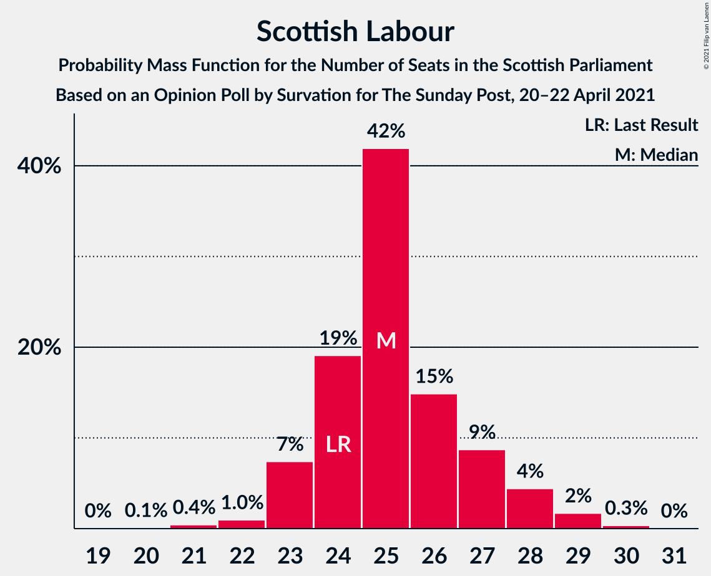
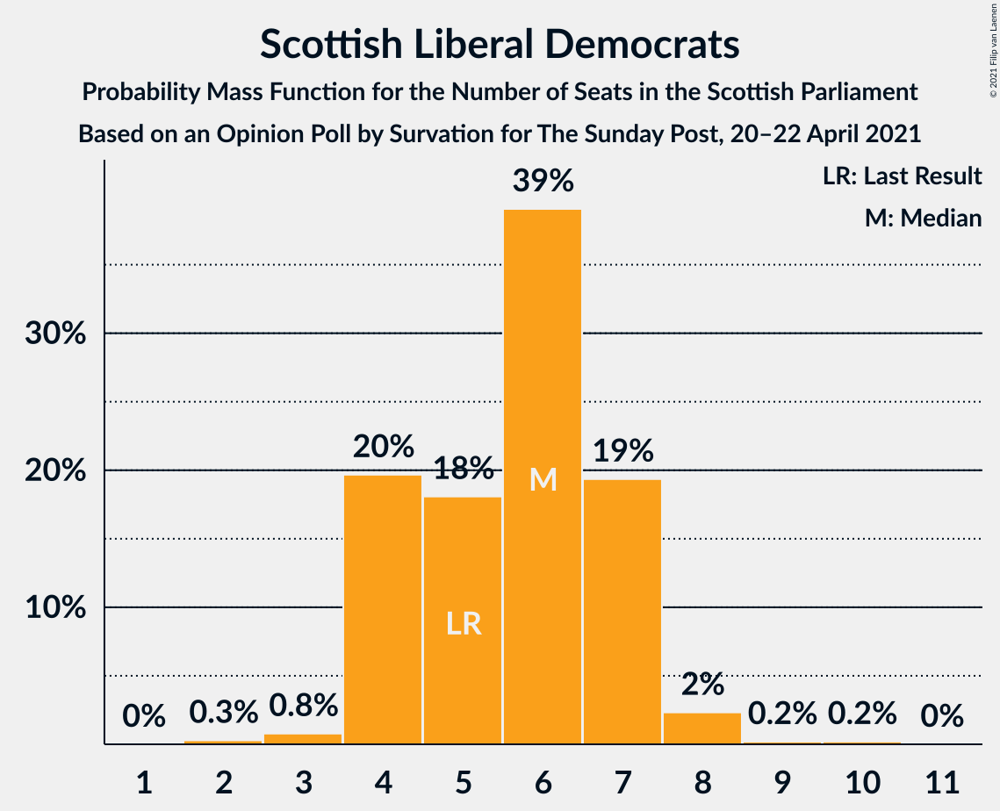
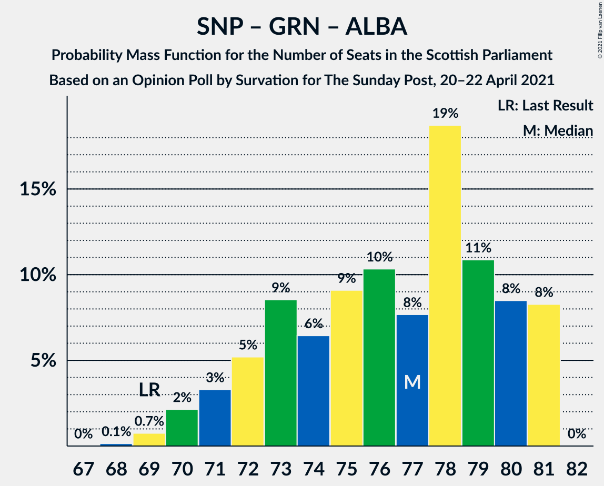
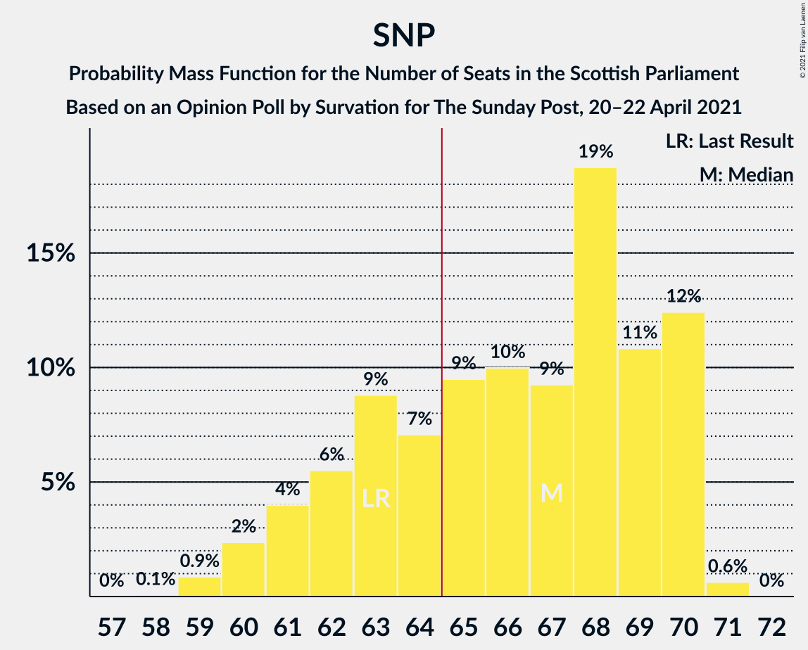

# Opinion Poll by Survation for The Sunday Post, 20–22 April 2021

<a href="#voting-intentions">Voting Intentions</a> | <a href="#seats">Seats</a> | <a href="#coalitions">Coalitions</a> | <a href="#technical-information">Technical Information</a>

## Voting Intentions

### Confidence Intervals

| Party | Last Result | Poll Result | 80% Confidence Interval | 90% Confidence Interval | 95% Confidence Interval | 99% Confidence Interval |
|:-----:|:-----------:|:-----------:|:-----------------------:|:-----------------------:|:-----------------------:|:-----------------------:|
| Scottish National Party | 41.7% | 35.4% | 33.5–37.3% |33.0–37.9% |32.5–38.4% |31.6–39.3% |
| Scottish Labour | 19.1% | 22.2% | 20.6–23.9% |20.1–24.4% |19.8–24.8% |19.0–25.7% |
| Scottish Conservative & Unionist Party | 22.9% | 20.2% | 18.6–21.8% |18.2–22.3% |17.8–22.7% |17.1–23.5% |
| Scottish Greens | 6.6% | 10.1% | 9.0–11.4% |8.7–11.8% |8.4–12.1% |7.9–12.8% |
| Scottish Liberal Democrats | 5.2% | 7.0% | 6.1–8.2% |5.9–8.5% |5.6–8.8% |5.2–9.3% |
| Alba Party | 0.0% | 3.0% | 2.4–3.8% |2.2–4.0% |2.1–4.2% |1.9–4.6% |

*Note:* The poll result column reflects the actual value used in the calculations. Published results may vary slightly, and in addition be rounded to fewer digits.

## Seats

### Confidence Intervals

| Party | Last Result | Median | 80% Confidence Interval | 90% Confidence Interval | 95% Confidence Interval | 99% Confidence Interval |
|:-----:|:-----------:|:------:|:-----------------------:|:-----------------------:|:-----------------------:|:-----------------------:|
| <a href="#scottish-national-party">Scottish National Party</a> | 63 | 67 | 62–70 |61–70 |60–70 |59–71 |
| <a href="#scottish-labour">Scottish Labour</a> | 24 | 25 | 24–27 |23–28 |23–28 |21–29 |
| <a href="#scottish-conservative-&-unionist-party">Scottish Conservative & Unionist Party</a> | 31 | 21 | 20–24 |19–25 |19–26 |18–27 |
| <a href="#scottish-greens">Scottish Greens</a> | 6 | 10 | 10–11 |9–12 |8–12 |7–13 |
| <a href="#scottish-liberal-democrats">Scottish Liberal Democrats</a> | 5 | 6 | 4–7 |4–7 |4–8 |3–8 |
| <a href="#alba-party">Alba Party</a> | 0 | 0 | 0 |0 |0 |0 |

### Scottish National Party

*For a full overview of the results for this party, see the [Scottish National Party](party-scottishnationalparty.html) page.*

| Number of Seats | Probability | Accumulated | Special Marks |
|:---------------:|:-----------:|:-----------:|:-------------:|
| 58 | 0.1% | 100% |  |
| 59 | 0.9% | 99.9% |  |
| 60 | 2% | 99.0% |  |
| 61 | 4% | 97% |  |
| 62 | 5% | 93% |  |
| 63 | 9% | 87% | Last Result |
| 64 | 7% | 78% |  |
| 65 | 10% | 71% | Majority |
| 66 | 10% | 61% |  |
| 67 | 9% | 51% | Median |
| 68 | 19% | 43% |  |
| 69 | 11% | 24% |  |
| 70 | 12% | 13% |  |
| 71 | 0.6% | 0.6% |  |
| 72 | 0% | 0% |  |

### Scottish Labour

*For a full overview of the results for this party, see the [Scottish Labour](party-scottishlabour.html) page.*

| Number of Seats | Probability | Accumulated | Special Marks |
|:---------------:|:-----------:|:-----------:|:-------------:|
| 19 | 0% | 100% |  |
| 20 | 0.1% | 99.9% |  |
| 21 | 0.4% | 99.9% |  |
| 22 | 1.0% | 99.4% |  |
| 23 | 7% | 98% |  |
| 24 | 19% | 92% | Last Result |
| 25 | 42% | 72% | Median |
| 26 | 16% | 30% |  |
| 27 | 7% | 14% |  |
| 28 | 4% | 6% |  |
| 29 | 2% | 2% |  |
| 30 | 0.3% | 0.3% |  |
| 31 | 0% | 0% |  |

### Scottish Conservative & Unionist Party

*For a full overview of the results for this party, see the [Scottish Conservative & Unionist Party](party-scottishconservativeunionistparty.html) page.*

| Number of Seats | Probability | Accumulated | Special Marks |
|:---------------:|:-----------:|:-----------:|:-------------:|
| 17 | 0.1% | 100% |  |
| 18 | 1.1% | 99.9% |  |
| 19 | 7% | 98.7% |  |
| 20 | 25% | 91% |  |
| 21 | 20% | 66% | Median |
| 22 | 13% | 47% |  |
| 23 | 9% | 34% |  |
| 24 | 17% | 25% |  |
| 25 | 5% | 8% |  |
| 26 | 2% | 3% |  |
| 27 | 0.4% | 0.5% |  |
| 28 | 0.1% | 0.1% |  |
| 29 | 0% | 0% |  |
| 30 | 0% | 0% |  |
| 31 | 0% | 0% | Last Result |

### Scottish Greens

*For a full overview of the results for this party, see the [Scottish Greens](party-scottishgreens.html) page.*

| Number of Seats | Probability | Accumulated | Special Marks |
|:---------------:|:-----------:|:-----------:|:-------------:|
| 4 | 0.1% | 100% |  |
| 5 | 0.1% | 99.9% |  |
| 6 | 0.3% | 99.8% | Last Result |
| 7 | 0.5% | 99.5% |  |
| 8 | 2% | 99.0% |  |
| 9 | 4% | 97% |  |
| 10 | 59% | 93% | Median |
| 11 | 28% | 35% |  |
| 12 | 6% | 6% |  |
| 13 | 0.5% | 0.6% |  |
| 14 | 0% | 0% |  |

### Scottish Liberal Democrats

*For a full overview of the results for this party, see the [Scottish Liberal Democrats](party-scottishliberaldemocrats.html) page.*

| Number of Seats | Probability | Accumulated | Special Marks |
|:---------------:|:-----------:|:-----------:|:-------------:|
| 2 | 0.3% | 100% |  |
| 3 | 0.8% | 99.7% |  |
| 4 | 19% | 98.9% |  |
| 5 | 20% | 80% | Last Result |
| 6 | 38% | 60% | Median |
| 7 | 19% | 22% |  |
| 8 | 2% | 3% |  |
| 9 | 0.2% | 0.4% |  |
| 10 | 0.2% | 0.2% |  |
| 11 | 0% | 0% |  |

### Alba Party

*For a full overview of the results for this party, see the [Alba Party](party-albaparty.html) page.*

| Number of Seats | Probability | Accumulated | Special Marks |
|:---------------:|:-----------:|:-----------:|:-------------:|
| 0 | 100% | 100% | Last Result, Median |

## Coalitions

### Confidence Intervals

| Coalition | Last Result | Median | Majority? | 80% Confidence Interval | 90% Confidence Interval | 95% Confidence Interval | 99% Confidence Interval |
|:---------:|:-----------:|:------:|:---------:|:-----------------------:|:-----------------------:|:-----------------------:|:-----------------------:|
| Scottish National Party – Scottish Greens – Alba Party | 69 | 77 | 100% | 72–80 | 71–81 | 70–81 | 69–81 |
| Scottish National Party – Scottish Greens | 69 | 77 | 100% | 72–80 | 71–81 | 70–81 | 69–81 |
| Scottish National Party – Alba Party | 63 | 67 | 71% | 62–70 | 61–70 | 60–70 | 59–71 |
| Scottish National Party | 63 | 67 | 71% | 62–70 | 61–70 | 60–70 | 59–71 |
| Scottish Labour – Scottish Conservative & Unionist Party – Scottish Liberal Democrats | 60 | 52 | 0% | 49–57 | 48–58 | 48–59 | 48–60 |
| Scottish Labour – Scottish Conservative & Unionist Party | 55 | 46 | 0% | 44–50 | 44–51 | 44–52 | 43–53 |
| Scottish Labour – Scottish Greens – Scottish Liberal Democrats | 35 | 41 | 0% | 39–43 | 38–44 | 38–45 | 37–46 |
| Scottish Labour – Scottish Liberal Democrats | 29 | 31 | 0% | 28–33 | 28–34 | 27–35 | 27–36 |
| Scottish Conservative & Unionist Party – Scottish Liberal Democrats | 36 | 27 | 0% | 24–31 | 24–31 | 23–32 | 23–33 |

### Scottish National Party – Scottish Greens – Alba Party

| Number of Seats | Probability | Accumulated | Special Marks |
|:---------------:|:-----------:|:-----------:|:-------------:|
| 68 | 0.1% | 100% |  |
| 69 | 0.7% | 99.9% | Last Result |
| 70 | 2% | 99.1% |  |
| 71 | 3% | 97% |  |
| 72 | 6% | 94% |  |
| 73 | 9% | 88% |  |
| 74 | 7% | 80% |  |
| 75 | 9% | 73% |  |
| 76 | 10% | 64% |  |
| 77 | 8% | 54% | Median |
| 78 | 19% | 46% |  |
| 79 | 10% | 28% |  |
| 80 | 9% | 17% |  |
| 81 | 8% | 8% |  |
| 82 | 0% | 0% |  |

### Scottish National Party – Scottish Greens

| Number of Seats | Probability | Accumulated | Special Marks |
|:---------------:|:-----------:|:-----------:|:-------------:|
| 68 | 0.1% | 100% |  |
| 69 | 0.7% | 99.9% | Last Result |
| 70 | 2% | 99.1% |  |
| 71 | 3% | 97% |  |
| 72 | 6% | 94% |  |
| 73 | 9% | 88% |  |
| 74 | 7% | 80% |  |
| 75 | 9% | 73% |  |
| 76 | 10% | 64% |  |
| 77 | 8% | 54% | Median |
| 78 | 19% | 46% |  |
| 79 | 10% | 28% |  |
| 80 | 9% | 17% |  |
| 81 | 8% | 8% |  |
| 82 | 0% | 0% |  |

### Scottish National Party – Alba Party

| Number of Seats | Probability | Accumulated | Special Marks |
|:---------------:|:-----------:|:-----------:|:-------------:|
| 58 | 0.1% | 100% |  |
| 59 | 0.9% | 99.9% |  |
| 60 | 2% | 99.0% |  |
| 61 | 4% | 97% |  |
| 62 | 5% | 93% |  |
| 63 | 9% | 87% | Last Result |
| 64 | 7% | 78% |  |
| 65 | 10% | 71% | Majority |
| 66 | 10% | 61% |  |
| 67 | 9% | 51% | Median |
| 68 | 19% | 43% |  |
| 69 | 11% | 24% |  |
| 70 | 12% | 13% |  |
| 71 | 0.6% | 0.6% |  |
| 72 | 0% | 0% |  |

### Scottish National Party

| Number of Seats | Probability | Accumulated | Special Marks |
|:---------------:|:-----------:|:-----------:|:-------------:|
| 58 | 0.1% | 100% |  |
| 59 | 0.9% | 99.9% |  |
| 60 | 2% | 99.0% |  |
| 61 | 4% | 97% |  |
| 62 | 5% | 93% |  |
| 63 | 9% | 87% | Last Result |
| 64 | 7% | 78% |  |
| 65 | 10% | 71% | Majority |
| 66 | 10% | 61% |  |
| 67 | 9% | 51% | Median |
| 68 | 19% | 43% |  |
| 69 | 11% | 24% |  |
| 70 | 12% | 13% |  |
| 71 | 0.6% | 0.6% |  |
| 72 | 0% | 0% |  |

### Scottish Labour – Scottish Conservative & Unionist Party – Scottish Liberal Democrats

| Number of Seats | Probability | Accumulated | Special Marks |
|:---------------:|:-----------:|:-----------:|:-------------:|
| 48 | 8% | 100% |  |
| 49 | 9% | 92% |  |
| 50 | 10% | 83% |  |
| 51 | 19% | 72% |  |
| 52 | 8% | 54% | Median |
| 53 | 10% | 46% |  |
| 54 | 9% | 36% |  |
| 55 | 7% | 27% |  |
| 56 | 9% | 20% |  |
| 57 | 6% | 12% |  |
| 58 | 3% | 6% |  |
| 59 | 2% | 3% |  |
| 60 | 0.7% | 0.9% | Last Result |
| 61 | 0.1% | 0.1% |  |
| 62 | 0% | 0% |  |

### Scottish Labour – Scottish Conservative & Unionist Party

| Number of Seats | Probability | Accumulated | Special Marks |
|:---------------:|:-----------:|:-----------:|:-------------:|
| 41 | 0.1% | 100% |  |
| 42 | 0.4% | 99.9% |  |
| 43 | 1.2% | 99.5% |  |
| 44 | 17% | 98% |  |
| 45 | 23% | 81% |  |
| 46 | 10% | 59% | Median |
| 47 | 10% | 49% |  |
| 48 | 10% | 38% |  |
| 49 | 10% | 29% |  |
| 50 | 9% | 19% |  |
| 51 | 5% | 10% |  |
| 52 | 3% | 5% |  |
| 53 | 1.1% | 1.5% |  |
| 54 | 0.3% | 0.4% |  |
| 55 | 0.1% | 0.1% | Last Result |
| 56 | 0% | 0% |  |

### Scottish Labour – Scottish Greens – Scottish Liberal Democrats

| Number of Seats | Probability | Accumulated | Special Marks |
|:---------------:|:-----------:|:-----------:|:-------------:|
| 35 | 0.1% | 100% | Last Result |
| 36 | 0.2% | 99.9% |  |
| 37 | 0.8% | 99.7% |  |
| 38 | 5% | 98.9% |  |
| 39 | 13% | 93% |  |
| 40 | 18% | 80% |  |
| 41 | 23% | 62% | Median |
| 42 | 19% | 39% |  |
| 43 | 11% | 20% |  |
| 44 | 5% | 9% |  |
| 45 | 3% | 4% |  |
| 46 | 1.1% | 1.2% |  |
| 47 | 0.1% | 0.1% |  |
| 48 | 0% | 0% |  |

### Scottish Labour – Scottish Liberal Democrats

| Number of Seats | Probability | Accumulated | Special Marks |
|:---------------:|:-----------:|:-----------:|:-------------:|
| 25 | 0.1% | 100% |  |
| 26 | 0.3% | 99.9% |  |
| 27 | 3% | 99.6% |  |
| 28 | 10% | 97% |  |
| 29 | 13% | 87% | Last Result |
| 30 | 15% | 74% |  |
| 31 | 25% | 59% | Median |
| 32 | 17% | 34% |  |
| 33 | 9% | 17% |  |
| 34 | 4% | 8% |  |
| 35 | 2% | 3% |  |
| 36 | 0.9% | 1.0% |  |
| 37 | 0.1% | 0.1% |  |
| 38 | 0% | 0% |  |

### Scottish Conservative & Unionist Party – Scottish Liberal Democrats

| Number of Seats | Probability | Accumulated | Special Marks |
|:---------------:|:-----------:|:-----------:|:-------------:|
| 22 | 0.3% | 100% |  |
| 23 | 3% | 99.7% |  |
| 24 | 8% | 97% |  |
| 25 | 14% | 90% |  |
| 26 | 18% | 76% |  |
| 27 | 16% | 57% | Median |
| 28 | 8% | 41% |  |
| 29 | 9% | 33% |  |
| 30 | 9% | 23% |  |
| 31 | 11% | 15% |  |
| 32 | 3% | 4% |  |
| 33 | 0.8% | 1.1% |  |
| 34 | 0.3% | 0.4% |  |
| 35 | 0.1% | 0.1% |  |
| 36 | 0% | 0% | Last Result |

## Technical Information

### Opinion Poll

+ **Polling firm:** Survation
+ **Commissioner(s):** The Sunday Post
+ **Fieldwork period:** 20–22 April 2021

### Calculations

+ **Sample size:** 1037
+ **Simulations done:** 524,288
+ **Error estimate:** 0.38%

