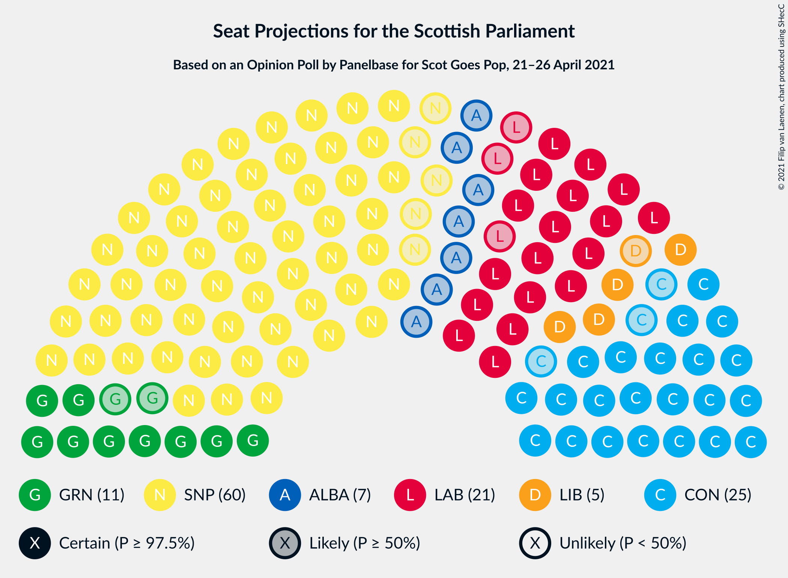

# Opinion Poll by Panelbase for Scot Goes Pop, 21–26 April 2021

<a href="#voting-intentions">Voting Intentions</a> | <a href="#seats">Seats</a> | <a href="#coalitions">Coalitions</a> | <a href="#technical-information">Technical Information</a>

## Voting Intentions

### Confidence Intervals

| Party | Last Result | Poll Result | 80% Confidence Interval | 90% Confidence Interval | 95% Confidence Interval | 99% Confidence Interval |
|:-----:|:-----------:|:-----------:|:-----------------------:|:-----------------------:|:-----------------------:|:-----------------------:|
| Scottish National Party | 41.7% | 36.0% | 34.2–37.9% |33.6–38.5% |33.2–38.9% |32.3–39.8% |
| Scottish Conservative & Unionist Party | 22.9% | 21.0% | 19.5–22.7% |19.1–23.2% |18.7–23.6% |18.0–24.4% |
| Scottish Labour | 19.1% | 18.0% | 16.6–19.6% |16.2–20.1% |15.9–20.5% |15.2–21.2% |
| Scottish Greens | 6.6% | 10.0% | 8.9–11.3% |8.6–11.7% |8.4–12.0% |7.9–12.6% |
| Scottish Liberal Democrats | 5.2% | 6.0% | 5.2–7.1% |5.0–7.4% |4.8–7.6% |4.4–8.2% |
| Alba Party | 0.0% | 6.0% | 5.2–7.1% |5.0–7.4% |4.8–7.6% |4.4–8.2% |
| All For Unity | 0.0% | 2.0% | 1.6–2.7% |1.5–2.9% |1.4–3.1% |1.2–3.4% |

*Note:* The poll result column reflects the actual value used in the calculations. Published results may vary slightly, and in addition be rounded to fewer digits.

## Seats

### Confidence Intervals

| Party | Last Result | Median | 80% Confidence Interval | 90% Confidence Interval | 95% Confidence Interval | 99% Confidence Interval |
|:-----:|:-----------:|:------:|:-----------------------:|:-----------------------:|:-----------------------:|:-----------------------:|
| <a href="#scottish-national-party">Scottish National Party</a> | 63 | 60 | 58–62 |57–64 |55–65 |53–66 |
| <a href="#scottish-conservative-&-unionist-party">Scottish Conservative & Unionist Party</a> | 31 | 25 | 23–29 |23–30 |22–30 |21–32 |
| <a href="#scottish-labour">Scottish Labour</a> | 24 | 21 | 19–24 |18–25 |18–26 |17–26 |
| <a href="#scottish-greens">Scottish Greens</a> | 6 | 11 | 10–12 |10–13 |9–13 |7–14 |
| <a href="#scottish-liberal-democrats">Scottish Liberal Democrats</a> | 5 | 5 | 4–6 |4–7 |4–8 |4–9 |
| <a href="#alba-party">Alba Party</a> | 0 | 7 | 2–8 |0–8 |0–8 |0–8 |
| <a href="#all-for-unity">All For Unity</a> | 0 | 0 | 0 |0 |0 |0 |

### Scottish National Party

*For a full overview of the results for this party, see the [Scottish National Party](party-scottishnationalparty.html) page.*

| Number of Seats | Probability | Accumulated | Special Marks |
|:---------------:|:-----------:|:-----------:|:-------------:|
| 51 | 0.1% | 100% |  |
| 52 | 0.2% | 99.9% |  |
| 53 | 1.4% | 99.7% |  |
| 54 | 0.5% | 98% |  |
| 55 | 0.9% | 98% |  |
| 56 | 0.9% | 97% |  |
| 57 | 2% | 96% |  |
| 58 | 7% | 94% |  |
| 59 | 22% | 87% |  |
| 60 | 36% | 65% | Median |
| 61 | 14% | 29% |  |
| 62 | 5% | 14% |  |
| 63 | 3% | 9% | Last Result |
| 64 | 3% | 6% |  |
| 65 | 2% | 3% | Majority |
| 66 | 0.9% | 1.4% |  |
| 67 | 0.3% | 0.5% |  |
| 68 | 0.1% | 0.1% |  |
| 69 | 0.1% | 0.1% |  |
| 70 | 0% | 0% |  |

### Scottish Conservative & Unionist Party

*For a full overview of the results for this party, see the [Scottish Conservative & Unionist Party](party-scottishconservativeunionistparty.html) page.*

| Number of Seats | Probability | Accumulated | Special Marks |
|:---------------:|:-----------:|:-----------:|:-------------:|
| 19 | 0.1% | 100% |  |
| 20 | 0.2% | 99.9% |  |
| 21 | 0.9% | 99.7% |  |
| 22 | 2% | 98.8% |  |
| 23 | 16% | 97% |  |
| 24 | 28% | 81% |  |
| 25 | 17% | 54% | Median |
| 26 | 8% | 37% |  |
| 27 | 7% | 28% |  |
| 28 | 7% | 21% |  |
| 29 | 6% | 13% |  |
| 30 | 5% | 7% |  |
| 31 | 2% | 2% | Last Result |
| 32 | 0.6% | 0.7% |  |
| 33 | 0.1% | 0.2% |  |
| 34 | 0% | 0% |  |

### Scottish Labour

*For a full overview of the results for this party, see the [Scottish Labour](party-scottishlabour.html) page.*

| Number of Seats | Probability | Accumulated | Special Marks |
|:---------------:|:-----------:|:-----------:|:-------------:|
| 16 | 0.1% | 100% |  |
| 17 | 2% | 99.9% |  |
| 18 | 7% | 98% |  |
| 19 | 17% | 91% |  |
| 20 | 9% | 74% |  |
| 21 | 21% | 64% | Median |
| 22 | 13% | 44% |  |
| 23 | 12% | 30% |  |
| 24 | 9% | 18% | Last Result |
| 25 | 6% | 9% |  |
| 26 | 2% | 3% |  |
| 27 | 0.3% | 0.5% |  |
| 28 | 0.1% | 0.2% |  |
| 29 | 0.1% | 0.1% |  |
| 30 | 0% | 0% |  |

### Scottish Greens

*For a full overview of the results for this party, see the [Scottish Greens](party-scottishgreens.html) page.*

| Number of Seats | Probability | Accumulated | Special Marks |
|:---------------:|:-----------:|:-----------:|:-------------:|
| 6 | 0% | 100% | Last Result |
| 7 | 0.9% | 100% |  |
| 8 | 0.8% | 99.1% |  |
| 9 | 2% | 98% |  |
| 10 | 38% | 96% |  |
| 11 | 24% | 58% | Median |
| 12 | 29% | 35% |  |
| 13 | 5% | 5% |  |
| 14 | 0.8% | 0.9% |  |
| 15 | 0.2% | 0.2% |  |
| 16 | 0% | 0% |  |

### Scottish Liberal Democrats

*For a full overview of the results for this party, see the [Scottish Liberal Democrats](party-scottishliberaldemocrats.html) page.*

| Number of Seats | Probability | Accumulated | Special Marks |
|:---------------:|:-----------:|:-----------:|:-------------:|
| 2 | 0.1% | 100% |  |
| 3 | 0.2% | 99.9% |  |
| 4 | 10% | 99.7% |  |
| 5 | 46% | 90% | Last Result, Median |
| 6 | 35% | 44% |  |
| 7 | 5% | 8% |  |
| 8 | 2% | 3% |  |
| 9 | 1.0% | 1.1% |  |
| 10 | 0.1% | 0.2% |  |
| 11 | 0% | 0% |  |

### Alba Party

*For a full overview of the results for this party, see the [Alba Party](party-albaparty.html) page.*

| Number of Seats | Probability | Accumulated | Special Marks |
|:---------------:|:-----------:|:-----------:|:-------------:|
| 0 | 6% | 100% | Last Result |
| 1 | 2% | 94% |  |
| 2 | 4% | 92% |  |
| 3 | 7% | 88% |  |
| 4 | 5% | 81% |  |
| 5 | 5% | 76% |  |
| 6 | 11% | 71% |  |
| 7 | 28% | 60% | Median |
| 8 | 32% | 32% |  |
| 9 | 0% | 0% |  |

### All For Unity

*For a full overview of the results for this party, see the [All For Unity](party-allforunity.html) page.*

| Number of Seats | Probability | Accumulated | Special Marks |
|:---------------:|:-----------:|:-----------:|:-------------:|
| 0 | 100% | 100% | Last Result, Median |

## Coalitions

### Confidence Intervals

| Coalition | Last Result | Median | Majority? | 80% Confidence Interval | 90% Confidence Interval | 95% Confidence Interval | 99% Confidence Interval |
|:---------:|:-----------:|:------:|:---------:|:-----------------------:|:-----------------------:|:-----------------------:|:-----------------------:|
| Scottish National Party – Scottish Greens – Alba Party | 69 | 77 | 100% | 72–80 | 71–81 | 70–82 | 69–84 |
| Scottish National Party – Scottish Greens | 69 | 71 | 98.8% | 69–73 | 68–75 | 66–76 | 63–78 |
| Scottish National Party – Alba Party | 63 | 66 | 73% | 62–69 | 60–70 | 59–71 | 58–73 |
| Scottish National Party | 63 | 60 | 3% | 58–62 | 57–64 | 55–65 | 53–66 |
| Scottish Conservative & Unionist Party – Scottish Labour – Scottish Liberal Democrats | 60 | 52 | 0% | 49–57 | 48–58 | 47–59 | 45–60 |
| Scottish Conservative & Unionist Party – Scottish Labour | 55 | 46 | 0% | 44–51 | 42–52 | 42–53 | 40–55 |
| Scottish Labour – Scottish Greens – Scottish Liberal Democrats | 35 | 37 | 0% | 34–41 | 34–42 | 33–43 | 33–44 |
| Scottish Conservative & Unionist Party – Scottish Liberal Democrats | 36 | 30 | 0% | 28–35 | 28–35 | 27–36 | 26–38 |
| Scottish Labour – Scottish Liberal Democrats | 29 | 27 | 0% | 24–30 | 23–31 | 23–31 | 22–33 |

### Scottish National Party – Scottish Greens – Alba Party

| Number of Seats | Probability | Accumulated | Special Marks |
|:---------------:|:-----------:|:-----------:|:-------------:|
| 66 | 0.1% | 100% |  |
| 67 | 0.1% | 99.9% |  |
| 68 | 0.3% | 99.8% |  |
| 69 | 0.8% | 99.5% | Last Result |
| 70 | 1.3% | 98.7% |  |
| 71 | 3% | 97% |  |
| 72 | 5% | 94% |  |
| 73 | 3% | 89% |  |
| 74 | 5% | 86% |  |
| 75 | 8% | 81% |  |
| 76 | 14% | 73% |  |
| 77 | 11% | 60% |  |
| 78 | 20% | 49% | Median |
| 79 | 17% | 29% |  |
| 80 | 5% | 12% |  |
| 81 | 3% | 7% |  |
| 82 | 2% | 4% |  |
| 83 | 1.0% | 2% |  |
| 84 | 0.8% | 1.0% |  |
| 85 | 0.1% | 0.2% |  |
| 86 | 0% | 0.1% |  |
| 87 | 0% | 0% |  |

### Scottish National Party – Scottish Greens

| Number of Seats | Probability | Accumulated | Special Marks |
|:---------------:|:-----------:|:-----------:|:-------------:|
| 61 | 0.1% | 100% |  |
| 62 | 0.1% | 99.9% |  |
| 63 | 0.5% | 99.8% |  |
| 64 | 0.5% | 99.3% |  |
| 65 | 1.3% | 98.8% | Majority |
| 66 | 1.1% | 98% |  |
| 67 | 1.2% | 96% |  |
| 68 | 5% | 95% |  |
| 69 | 13% | 91% | Last Result |
| 70 | 18% | 78% |  |
| 71 | 23% | 60% | Median |
| 72 | 20% | 36% |  |
| 73 | 7% | 17% |  |
| 74 | 4% | 10% |  |
| 75 | 2% | 6% |  |
| 76 | 2% | 3% |  |
| 77 | 1.1% | 2% |  |
| 78 | 0.4% | 0.5% |  |
| 79 | 0.1% | 0.2% |  |
| 80 | 0% | 0% |  |

### Scottish National Party – Alba Party

| Number of Seats | Probability | Accumulated | Special Marks |
|:---------------:|:-----------:|:-----------:|:-------------:|
| 54 | 0% | 100% |  |
| 55 | 0.1% | 99.9% |  |
| 56 | 0.1% | 99.9% |  |
| 57 | 0.2% | 99.7% |  |
| 58 | 0.4% | 99.5% |  |
| 59 | 2% | 99.1% |  |
| 60 | 4% | 97% |  |
| 61 | 3% | 93% |  |
| 62 | 5% | 90% |  |
| 63 | 7% | 86% | Last Result |
| 64 | 5% | 79% |  |
| 65 | 8% | 73% | Majority |
| 66 | 18% | 65% |  |
| 67 | 17% | 47% | Median |
| 68 | 14% | 30% |  |
| 69 | 9% | 16% |  |
| 70 | 2% | 7% |  |
| 71 | 3% | 5% |  |
| 72 | 1.4% | 2% |  |
| 73 | 0.5% | 0.8% |  |
| 74 | 0.2% | 0.3% |  |
| 75 | 0.1% | 0.1% |  |
| 76 | 0% | 0% |  |

### Scottish National Party

| Number of Seats | Probability | Accumulated | Special Marks |
|:---------------:|:-----------:|:-----------:|:-------------:|
| 51 | 0.1% | 100% |  |
| 52 | 0.2% | 99.9% |  |
| 53 | 1.4% | 99.7% |  |
| 54 | 0.5% | 98% |  |
| 55 | 0.9% | 98% |  |
| 56 | 0.9% | 97% |  |
| 57 | 2% | 96% |  |
| 58 | 7% | 94% |  |
| 59 | 22% | 87% |  |
| 60 | 36% | 65% | Median |
| 61 | 14% | 29% |  |
| 62 | 5% | 14% |  |
| 63 | 3% | 9% | Last Result |
| 64 | 3% | 6% |  |
| 65 | 2% | 3% | Majority |
| 66 | 0.9% | 1.4% |  |
| 67 | 0.3% | 0.5% |  |
| 68 | 0.1% | 0.1% |  |
| 69 | 0.1% | 0.1% |  |
| 70 | 0% | 0% |  |

### Scottish Conservative & Unionist Party – Scottish Labour – Scottish Liberal Democrats

| Number of Seats | Probability | Accumulated | Special Marks |
|:---------------:|:-----------:|:-----------:|:-------------:|
| 43 | 0% | 100% |  |
| 44 | 0.1% | 99.9% |  |
| 45 | 0.8% | 99.8% |  |
| 46 | 1.0% | 99.0% |  |
| 47 | 2% | 98% |  |
| 48 | 3% | 96% |  |
| 49 | 5% | 93% |  |
| 50 | 17% | 88% |  |
| 51 | 20% | 71% | Median |
| 52 | 11% | 51% |  |
| 53 | 14% | 40% |  |
| 54 | 8% | 27% |  |
| 55 | 5% | 19% |  |
| 56 | 3% | 14% |  |
| 57 | 5% | 11% |  |
| 58 | 3% | 6% |  |
| 59 | 1.3% | 3% |  |
| 60 | 0.8% | 1.3% | Last Result |
| 61 | 0.3% | 0.5% |  |
| 62 | 0.1% | 0.2% |  |
| 63 | 0.1% | 0.1% |  |
| 64 | 0% | 0% |  |

### Scottish Conservative & Unionist Party – Scottish Labour

| Number of Seats | Probability | Accumulated | Special Marks |
|:---------------:|:-----------:|:-----------:|:-------------:|
| 38 | 0.1% | 100% |  |
| 39 | 0.2% | 99.9% |  |
| 40 | 0.8% | 99.8% |  |
| 41 | 1.3% | 99.0% |  |
| 42 | 3% | 98% |  |
| 43 | 4% | 94% |  |
| 44 | 7% | 91% |  |
| 45 | 20% | 83% |  |
| 46 | 17% | 63% | Median |
| 47 | 14% | 46% |  |
| 48 | 9% | 32% |  |
| 49 | 6% | 23% |  |
| 50 | 5% | 17% |  |
| 51 | 4% | 11% |  |
| 52 | 4% | 7% |  |
| 53 | 2% | 3% |  |
| 54 | 1.0% | 2% |  |
| 55 | 0.3% | 0.7% | Last Result |
| 56 | 0.2% | 0.3% |  |
| 57 | 0.1% | 0.1% |  |
| 58 | 0% | 0% |  |

### Scottish Labour – Scottish Greens – Scottish Liberal Democrats

| Number of Seats | Probability | Accumulated | Special Marks |
|:---------------:|:-----------:|:-----------:|:-------------:|
| 31 | 0.1% | 100% |  |
| 32 | 0.4% | 99.9% |  |
| 33 | 2% | 99.5% |  |
| 34 | 8% | 97% |  |
| 35 | 9% | 90% | Last Result |
| 36 | 12% | 81% |  |
| 37 | 20% | 69% | Median |
| 38 | 14% | 49% |  |
| 39 | 13% | 35% |  |
| 40 | 7% | 22% |  |
| 41 | 7% | 15% |  |
| 42 | 6% | 9% |  |
| 43 | 2% | 3% |  |
| 44 | 0.6% | 1.0% |  |
| 45 | 0.4% | 0.4% |  |
| 46 | 0% | 0.1% |  |
| 47 | 0% | 0% |  |

### Scottish Conservative & Unionist Party – Scottish Liberal Democrats

| Number of Seats | Probability | Accumulated | Special Marks |
|:---------------:|:-----------:|:-----------:|:-------------:|
| 24 | 0.1% | 100% |  |
| 25 | 0.2% | 99.9% |  |
| 26 | 0.9% | 99.7% |  |
| 27 | 3% | 98.9% |  |
| 28 | 12% | 96% |  |
| 29 | 20% | 84% |  |
| 30 | 18% | 64% | Median |
| 31 | 11% | 46% |  |
| 32 | 9% | 35% |  |
| 33 | 8% | 26% |  |
| 34 | 8% | 18% |  |
| 35 | 6% | 10% |  |
| 36 | 3% | 4% | Last Result |
| 37 | 1.0% | 2% |  |
| 38 | 0.5% | 0.7% |  |
| 39 | 0.1% | 0.2% |  |
| 40 | 0.1% | 0.1% |  |
| 41 | 0% | 0% |  |

### Scottish Labour – Scottish Liberal Democrats

| Number of Seats | Probability | Accumulated | Special Marks |
|:---------------:|:-----------:|:-----------:|:-------------:|
| 21 | 0.1% | 100% |  |
| 22 | 2% | 99.9% |  |
| 23 | 4% | 98% |  |
| 24 | 13% | 94% |  |
| 25 | 10% | 81% |  |
| 26 | 16% | 70% | Median |
| 27 | 21% | 54% |  |
| 28 | 10% | 33% |  |
| 29 | 9% | 23% | Last Result |
| 30 | 8% | 14% |  |
| 31 | 4% | 6% |  |
| 32 | 2% | 2% |  |
| 33 | 0.5% | 0.8% |  |
| 34 | 0.2% | 0.3% |  |
| 35 | 0.1% | 0.1% |  |
| 36 | 0% | 0% |  |

## Technical Information

### Opinion Poll

+ **Polling firm:** Panelbase
+ **Commissioner(s):** Scot Goes Pop
+ **Fieldwork period:** 21–26 April 2021

### Calculations

+ **Sample size:** 1075
+ **Simulations done:** 1,048,576
+ **Error estimate:** 1.11%

