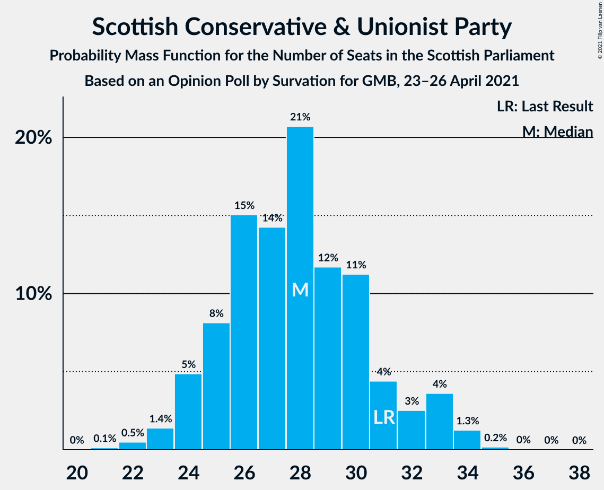
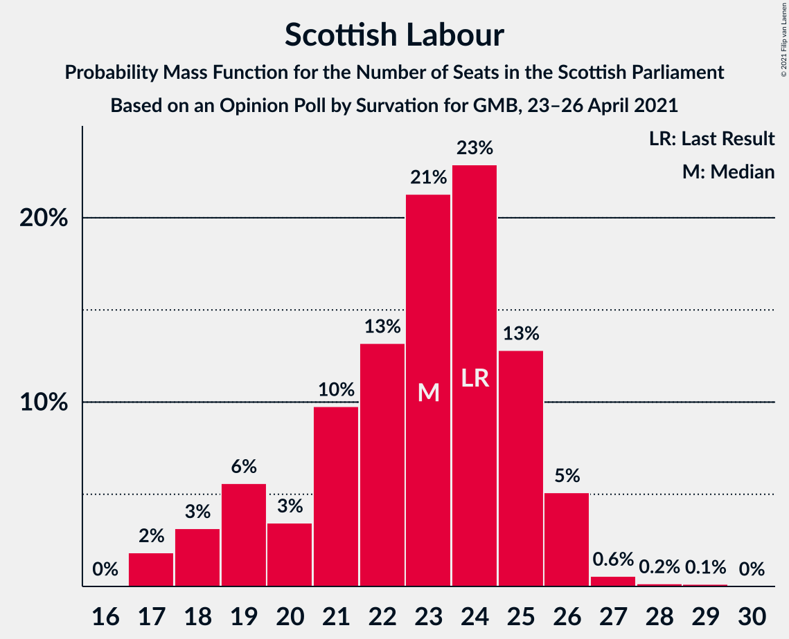

# Opinion Poll by Survation for GMB, 23–26 April 2021

<a href="#voting-intentions">Voting Intentions</a> | <a href="#seats">Seats</a> | <a href="#coalitions">Coalitions</a> | <a href="#technical-information">Technical Information</a>

## Voting Intentions

### Confidence Intervals

| Party | Last Result | Poll Result | 80% Confidence Interval | 90% Confidence Interval | 95% Confidence Interval | 99% Confidence Interval |
|:-----:|:-----------:|:-----------:|:-----------------------:|:-----------------------:|:-----------------------:|:-----------------------:|
| Scottish National Party | 41.7% | 37.8% | 35.9–39.8% |35.3–40.3% |34.8–40.8% |33.9–41.8% |
| Scottish Conservative & Unionist Party | 22.9% | 22.4% | 20.8–24.2% |20.3–24.7% |20.0–25.1% |19.2–26.0% |
| Scottish Labour | 19.1% | 18.4% | 16.9–20.0% |16.4–20.5% |16.1–20.9% |15.4–21.7% |
| Scottish Greens | 6.6% | 10.2% | 9.1–11.5% |8.8–11.9% |8.5–12.3% |8.0–12.9% |
| Scottish Liberal Democrats | 5.2% | 7.1% | 6.2–8.3% |5.9–8.6% |5.7–8.9% |5.3–9.5% |
| Alba Party | 0.0% | 2.1% | 1.6–2.8% |1.5–3.0% |1.4–3.2% |1.2–3.5% |
| Reform UK | 0.0% | 1.0% | 0.7–1.5% |0.6–1.7% |0.5–1.8% |0.4–2.1% |

*Note:* The poll result column reflects the actual value used in the calculations. Published results may vary slightly, and in addition be rounded to fewer digits.

## Seats

### Confidence Intervals

| Party | Last Result | Median | 80% Confidence Interval | 90% Confidence Interval | 95% Confidence Interval | 99% Confidence Interval |
|:-----:|:-----------:|:------:|:-----------------------:|:-----------------------:|:-----------------------:|:-----------------------:|
| <a href="#scottish-national-party">Scottish National Party</a> | 63 | 63 | 61–68 |60–68 |60–69 |59–70 |
| <a href="#scottish-conservative-&-unionist-party">Scottish Conservative & Unionist Party</a> | 31 | 27 | 24–30 |23–31 |22–32 |21–33 |
| <a href="#scottish-labour">Scottish Labour</a> | 24 | 21 | 18–24 |18–25 |17–25 |17–26 |
| <a href="#scottish-greens">Scottish Greens</a> | 6 | 10 | 10–12 |10–12 |10–13 |8–13 |
| <a href="#scottish-liberal-democrats">Scottish Liberal Democrats</a> | 5 | 6 | 5–8 |5–8 |4–9 |4–10 |
| <a href="#alba-party">Alba Party</a> | 0 | 0 | 0 |0 |0 |0 |
| <a href="#reform-uk">Reform UK</a> | 0 | 0 | 0 |0 |0 |0 |

### Scottish National Party

*For a full overview of the results for this party, see the [Scottish National Party](party-scottishnationalparty.html) page.*

| Number of Seats | Probability | Accumulated | Special Marks |
|:---------------:|:-----------:|:-----------:|:-------------:|
| 56 | 0% | 100% |  |
| 57 | 0% | 99.9% |  |
| 58 | 0.4% | 99.9% |  |
| 59 | 1.4% | 99.6% |  |
| 60 | 4% | 98% |  |
| 61 | 14% | 94% |  |
| 62 | 18% | 80% |  |
| 63 | 19% | 62% | Last Result, Median |
| 64 | 8% | 42% |  |
| 65 | 5% | 34% | Majority |
| 66 | 4% | 29% |  |
| 67 | 12% | 25% |  |
| 68 | 9% | 14% |  |
| 69 | 4% | 5% |  |
| 70 | 0.6% | 1.0% |  |
| 71 | 0.5% | 0.5% |  |
| 72 | 0% | 0% |  |

### Scottish Conservative & Unionist Party

*For a full overview of the results for this party, see the [Scottish Conservative & Unionist Party](party-scottishconservativeunionistparty.html) page.*

| Number of Seats | Probability | Accumulated | Special Marks |
|:---------------:|:-----------:|:-----------:|:-------------:|
| 20 | 0.1% | 100% |  |
| 21 | 0.8% | 99.9% |  |
| 22 | 2% | 99.1% |  |
| 23 | 4% | 97% |  |
| 24 | 9% | 92% |  |
| 25 | 7% | 83% |  |
| 26 | 23% | 76% |  |
| 27 | 12% | 53% | Median |
| 28 | 12% | 41% |  |
| 29 | 17% | 29% |  |
| 30 | 5% | 12% |  |
| 31 | 2% | 7% | Last Result |
| 32 | 4% | 5% |  |
| 33 | 0.6% | 0.7% |  |
| 34 | 0.1% | 0.1% |  |
| 35 | 0% | 0% |  |

### Scottish Labour

*For a full overview of the results for this party, see the [Scottish Labour](party-scottishlabour.html) page.*

| Number of Seats | Probability | Accumulated | Special Marks |
|:---------------:|:-----------:|:-----------:|:-------------:|
| 17 | 5% | 100% |  |
| 18 | 9% | 95% |  |
| 19 | 16% | 87% |  |
| 20 | 8% | 70% |  |
| 21 | 19% | 63% | Median |
| 22 | 11% | 44% |  |
| 23 | 9% | 33% |  |
| 24 | 15% | 24% | Last Result |
| 25 | 7% | 9% |  |
| 26 | 1.0% | 1.1% |  |
| 27 | 0.1% | 0.2% |  |
| 28 | 0% | 0.1% |  |
| 29 | 0% | 0% |  |

### Scottish Greens

*For a full overview of the results for this party, see the [Scottish Greens](party-scottishgreens.html) page.*

| Number of Seats | Probability | Accumulated | Special Marks |
|:---------------:|:-----------:|:-----------:|:-------------:|
| 6 | 0.1% | 100% | Last Result |
| 7 | 0.2% | 99.9% |  |
| 8 | 0.6% | 99.8% |  |
| 9 | 1.3% | 99.2% |  |
| 10 | 50% | 98% | Median |
| 11 | 34% | 48% |  |
| 12 | 11% | 14% |  |
| 13 | 3% | 3% |  |
| 14 | 0.4% | 0.5% |  |
| 15 | 0.1% | 0.1% |  |
| 16 | 0% | 0% |  |

### Scottish Liberal Democrats

*For a full overview of the results for this party, see the [Scottish Liberal Democrats](party-scottishliberaldemocrats.html) page.*

| Number of Seats | Probability | Accumulated | Special Marks |
|:---------------:|:-----------:|:-----------:|:-------------:|
| 3 | 0.3% | 100% |  |
| 4 | 3% | 99.7% |  |
| 5 | 16% | 97% | Last Result |
| 6 | 48% | 81% | Median |
| 7 | 13% | 33% |  |
| 8 | 17% | 20% |  |
| 9 | 1.5% | 3% |  |
| 10 | 1.1% | 1.1% |  |
| 11 | 0% | 0% |  |

### Alba Party

*For a full overview of the results for this party, see the [Alba Party](party-albaparty.html) page.*

| Number of Seats | Probability | Accumulated | Special Marks |
|:---------------:|:-----------:|:-----------:|:-------------:|
| 0 | 100% | 100% | Last Result, Median |

### Reform UK

*For a full overview of the results for this party, see the [Reform UK](party-reformuk.html) page.*

| Number of Seats | Probability | Accumulated | Special Marks |
|:---------------:|:-----------:|:-----------:|:-------------:|
| 0 | 100% | 100% | Last Result, Median |

## Coalitions

### Confidence Intervals

| Coalition | Last Result | Median | Majority? | 80% Confidence Interval | 90% Confidence Interval | 95% Confidence Interval | 99% Confidence Interval |
|:---------:|:-----------:|:------:|:---------:|:-----------------------:|:-----------------------:|:-----------------------:|:-----------------------:|
| Scottish National Party – Scottish Greens – Alba Party | 69 | 74 | 100% | 72–78 | 71–79 | 71–79 | 69–81 |
| Scottish National Party – Scottish Greens | 69 | 74 | 100% | 72–78 | 71–79 | 71–79 | 69–81 |
| Scottish National Party – Alba Party | 63 | 63 | 34% | 61–68 | 60–68 | 60–69 | 59–70 |
| Scottish National Party | 63 | 63 | 34% | 61–68 | 60–68 | 60–69 | 59–70 |
| Scottish Conservative & Unionist Party – Scottish Labour – Scottish Liberal Democrats | 60 | 55 | 0% | 51–57 | 50–58 | 50–58 | 48–60 |
| Scottish Conservative & Unionist Party – Scottish Labour | 55 | 49 | 0% | 45–52 | 44–52 | 44–52 | 42–55 |
| Scottish Labour – Scottish Greens – Scottish Liberal Democrats | 35 | 38 | 0% | 35–42 | 34–42 | 34–43 | 33–44 |
| Scottish Conservative & Unionist Party – Scottish Liberal Democrats | 36 | 33 | 0% | 30–36 | 29–38 | 28–38 | 27–40 |
| Scottish Labour – Scottish Liberal Democrats | 29 | 28 | 0% | 24–31 | 24–32 | 23–33 | 22–33 |

### Scottish National Party – Scottish Greens – Alba Party

| Number of Seats | Probability | Accumulated | Special Marks |
|:---------------:|:-----------:|:-----------:|:-------------:|
| 67 | 0.1% | 100% |  |
| 68 | 0.1% | 99.9% |  |
| 69 | 1.1% | 99.8% | Last Result |
| 70 | 1.0% | 98.7% |  |
| 71 | 8% | 98% |  |
| 72 | 19% | 90% |  |
| 73 | 18% | 71% | Median |
| 74 | 15% | 53% |  |
| 75 | 4% | 38% |  |
| 76 | 5% | 34% |  |
| 77 | 3% | 29% |  |
| 78 | 17% | 25% |  |
| 79 | 6% | 8% |  |
| 80 | 0.7% | 2% |  |
| 81 | 0.6% | 1.1% |  |
| 82 | 0.5% | 0.5% |  |
| 83 | 0% | 0% |  |

### Scottish National Party – Scottish Greens

| Number of Seats | Probability | Accumulated | Special Marks |
|:---------------:|:-----------:|:-----------:|:-------------:|
| 67 | 0.1% | 100% |  |
| 68 | 0.1% | 99.9% |  |
| 69 | 1.1% | 99.8% | Last Result |
| 70 | 1.0% | 98.7% |  |
| 71 | 8% | 98% |  |
| 72 | 19% | 90% |  |
| 73 | 18% | 71% | Median |
| 74 | 15% | 53% |  |
| 75 | 4% | 38% |  |
| 76 | 5% | 34% |  |
| 77 | 3% | 29% |  |
| 78 | 17% | 25% |  |
| 79 | 6% | 8% |  |
| 80 | 0.7% | 2% |  |
| 81 | 0.6% | 1.1% |  |
| 82 | 0.5% | 0.5% |  |
| 83 | 0% | 0% |  |

### Scottish National Party – Alba Party

| Number of Seats | Probability | Accumulated | Special Marks |
|:---------------:|:-----------:|:-----------:|:-------------:|
| 56 | 0% | 100% |  |
| 57 | 0% | 99.9% |  |
| 58 | 0.4% | 99.9% |  |
| 59 | 1.4% | 99.6% |  |
| 60 | 4% | 98% |  |
| 61 | 14% | 94% |  |
| 62 | 18% | 80% |  |
| 63 | 19% | 62% | Last Result, Median |
| 64 | 8% | 42% |  |
| 65 | 5% | 34% | Majority |
| 66 | 4% | 29% |  |
| 67 | 12% | 25% |  |
| 68 | 9% | 14% |  |
| 69 | 4% | 5% |  |
| 70 | 0.6% | 1.0% |  |
| 71 | 0.5% | 0.5% |  |
| 72 | 0% | 0% |  |

### Scottish National Party

| Number of Seats | Probability | Accumulated | Special Marks |
|:---------------:|:-----------:|:-----------:|:-------------:|
| 56 | 0% | 100% |  |
| 57 | 0% | 99.9% |  |
| 58 | 0.4% | 99.9% |  |
| 59 | 1.4% | 99.6% |  |
| 60 | 4% | 98% |  |
| 61 | 14% | 94% |  |
| 62 | 18% | 80% |  |
| 63 | 19% | 62% | Last Result, Median |
| 64 | 8% | 42% |  |
| 65 | 5% | 34% | Majority |
| 66 | 4% | 29% |  |
| 67 | 12% | 25% |  |
| 68 | 9% | 14% |  |
| 69 | 4% | 5% |  |
| 70 | 0.6% | 1.0% |  |
| 71 | 0.5% | 0.5% |  |
| 72 | 0% | 0% |  |

### Scottish Conservative & Unionist Party – Scottish Labour – Scottish Liberal Democrats

| Number of Seats | Probability | Accumulated | Special Marks |
|:---------------:|:-----------:|:-----------:|:-------------:|
| 47 | 0.5% | 100% |  |
| 48 | 0.6% | 99.5% |  |
| 49 | 0.7% | 98.9% |  |
| 50 | 6% | 98% |  |
| 51 | 17% | 92% |  |
| 52 | 3% | 75% |  |
| 53 | 5% | 71% |  |
| 54 | 4% | 66% | Median |
| 55 | 15% | 62% |  |
| 56 | 18% | 47% |  |
| 57 | 19% | 29% |  |
| 58 | 8% | 10% |  |
| 59 | 1.0% | 2% |  |
| 60 | 1.1% | 1.3% | Last Result |
| 61 | 0.1% | 0.2% |  |
| 62 | 0.1% | 0.1% |  |
| 63 | 0% | 0% |  |

### Scottish Conservative & Unionist Party – Scottish Labour

| Number of Seats | Probability | Accumulated | Special Marks |
|:---------------:|:-----------:|:-----------:|:-------------:|
| 41 | 0.3% | 100% |  |
| 42 | 0.5% | 99.7% |  |
| 43 | 1.4% | 99.2% |  |
| 44 | 8% | 98% |  |
| 45 | 18% | 90% |  |
| 46 | 3% | 72% |  |
| 47 | 6% | 69% |  |
| 48 | 11% | 63% | Median |
| 49 | 16% | 52% |  |
| 50 | 13% | 36% |  |
| 51 | 8% | 23% |  |
| 52 | 13% | 15% |  |
| 53 | 1.3% | 2% |  |
| 54 | 0.3% | 0.8% |  |
| 55 | 0.5% | 0.5% | Last Result |
| 56 | 0.1% | 0.1% |  |
| 57 | 0% | 0% |  |

### Scottish Labour – Scottish Greens – Scottish Liberal Democrats

| Number of Seats | Probability | Accumulated | Special Marks |
|:---------------:|:-----------:|:-----------:|:-------------:|
| 32 | 0.2% | 100% |  |
| 33 | 0.8% | 99.8% |  |
| 34 | 7% | 99.1% |  |
| 35 | 6% | 92% | Last Result |
| 36 | 13% | 86% |  |
| 37 | 16% | 73% | Median |
| 38 | 9% | 56% |  |
| 39 | 18% | 48% |  |
| 40 | 8% | 29% |  |
| 41 | 10% | 21% |  |
| 42 | 7% | 11% |  |
| 43 | 3% | 4% |  |
| 44 | 1.0% | 1.2% |  |
| 45 | 0.3% | 0.3% |  |
| 46 | 0% | 0% |  |

### Scottish Conservative & Unionist Party – Scottish Liberal Democrats

| Number of Seats | Probability | Accumulated | Special Marks |
|:---------------:|:-----------:|:-----------:|:-------------:|
| 26 | 0.1% | 100% |  |
| 27 | 2% | 99.9% |  |
| 28 | 1.0% | 98% |  |
| 29 | 3% | 97% |  |
| 30 | 9% | 94% |  |
| 31 | 6% | 86% |  |
| 32 | 19% | 79% |  |
| 33 | 14% | 60% | Median |
| 34 | 14% | 46% |  |
| 35 | 15% | 32% |  |
| 36 | 9% | 17% | Last Result |
| 37 | 2% | 8% |  |
| 38 | 3% | 6% |  |
| 39 | 2% | 2% |  |
| 40 | 0.4% | 0.5% |  |
| 41 | 0.1% | 0.1% |  |
| 42 | 0% | 0% |  |

### Scottish Labour – Scottish Liberal Democrats

| Number of Seats | Probability | Accumulated | Special Marks |
|:---------------:|:-----------:|:-----------:|:-------------:|
| 21 | 0.1% | 100% |  |
| 22 | 0.6% | 99.9% |  |
| 23 | 2% | 99.3% |  |
| 24 | 8% | 97% |  |
| 25 | 18% | 90% |  |
| 26 | 8% | 72% |  |
| 27 | 11% | 63% | Median |
| 28 | 11% | 52% |  |
| 29 | 19% | 41% | Last Result |
| 30 | 10% | 22% |  |
| 31 | 6% | 12% |  |
| 32 | 3% | 6% |  |
| 33 | 2% | 3% |  |
| 34 | 0.4% | 0.4% |  |
| 35 | 0% | 0% |  |

## Technical Information

### Opinion Poll

+ **Polling firm:** Survation
+ **Commissioner(s):** GMB
+ **Fieldwork period:** 23–26 April 2021

### Calculations

+ **Sample size:** 1008
+ **Simulations done:** 131,072
+ **Error estimate:** 1.46%

