# Opinion Poll by Savanta ComRes for The Scotsman, 23–27 April 2021

<a href="#voting-intentions">Voting Intentions</a> | <a href="#seats">Seats</a> | <a href="#coalitions">Coalitions</a> | <a href="#technical-information">Technical Information</a>

## Voting Intentions

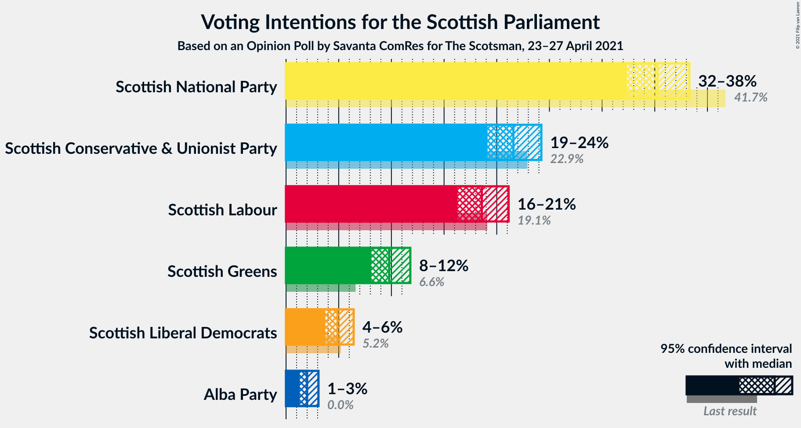

### Confidence Intervals

| Party | Last Result | Poll Result | 80% Confidence Interval | 90% Confidence Interval | 95% Confidence Interval | 99% Confidence Interval |
|:-----:|:-----------:|:-----------:|:-----------------------:|:-----------------------:|:-----------------------:|:-----------------------:|
| Scottish National Party | 41.7% | 35.3% | 33.4–37.2% |32.8–37.8% |32.4–38.3% |31.5–39.2% |
| Scottish Conservative & Unionist Party | 22.9% | 21.6% | 20.0–23.3% |19.5–23.8% |19.1–24.2% |18.4–25.1% |
| Scottish Labour | 19.1% | 18.6% | 17.1–20.2% |16.6–20.7% |16.3–21.1% |15.6–21.9% |
| Scottish Greens | 6.6% | 9.8% | 8.7–11.1% |8.4–11.5% |8.1–11.8% |7.6–12.5% |
| Scottish Liberal Democrats | 5.2% | 4.9% | 4.1–5.9% |3.9–6.2% |3.7–6.4% |3.4–6.9% |
| Alba Party | 0.0% | 2.0% | 1.5–2.7% |1.4–2.9% |1.3–3.1% |1.1–3.4% |

*Note:* The poll result column reflects the actual value used in the calculations. Published results may vary slightly, and in addition be rounded to fewer digits.

## Seats

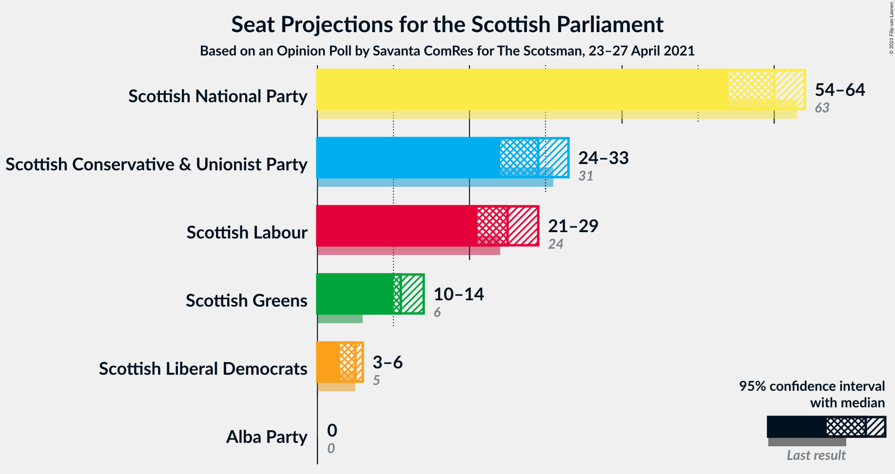

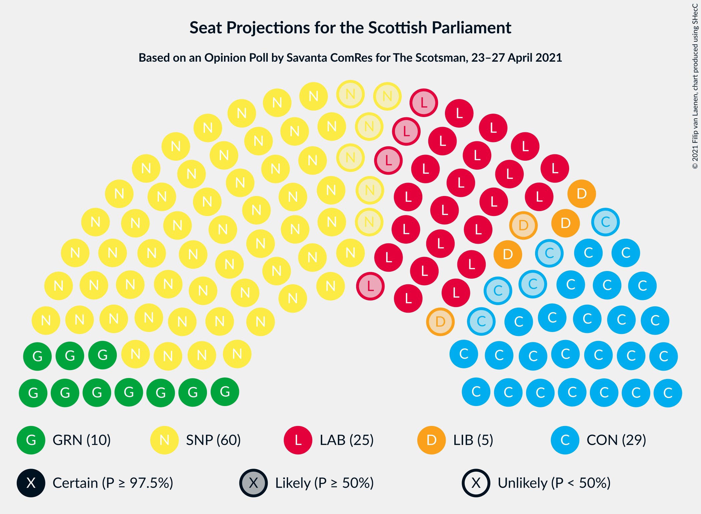

### Confidence Intervals

| Party | Last Result | Median | 80% Confidence Interval | 90% Confidence Interval | 95% Confidence Interval | 99% Confidence Interval |
|:-----:|:-----------:|:------:|:-----------------------:|:-----------------------:|:-----------------------:|:-----------------------:|
| <a href="#scottish-national-party">Scottish National Party</a> | 63 | 60 | 56–62 |55–63 |54–64 |52–66 |
| <a href="#scottish-conservative-&-unionist-party">Scottish Conservative & Unionist Party</a> | 31 | 29 | 26–32 |25–33 |24–33 |23–35 |
| <a href="#scottish-labour">Scottish Labour</a> | 24 | 25 | 23–26 |22–27 |21–29 |19–31 |
| <a href="#scottish-greens">Scottish Greens</a> | 6 | 11 | 10–12 |10–13 |10–14 |9–15 |
| <a href="#scottish-liberal-democrats">Scottish Liberal Democrats</a> | 5 | 5 | 4–5 |3–6 |3–6 |2–7 |
| <a href="#alba-party">Alba Party</a> | 0 | 0 | 0 |0 |0 |0 |

### Scottish National Party

*For a full overview of the results for this party, see the [Scottish National Party](party-scottishnationalparty.html) page.*

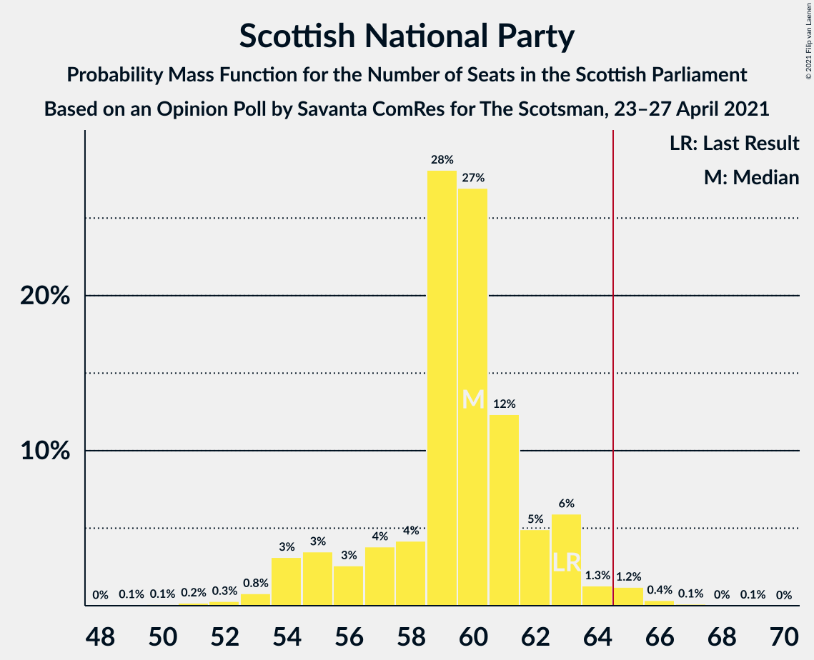

| Number of Seats | Probability | Accumulated | Special Marks |
|:---------------:|:-----------:|:-----------:|:-------------:|
| 49 | 0.1% | 100% |  |
| 50 | 0.1% | 99.9% |  |
| 51 | 0.2% | 99.8% |  |
| 52 | 0.3% | 99.6% |  |
| 53 | 0.8% | 99.3% |  |
| 54 | 3% | 98.5% |  |
| 55 | 3% | 95% |  |
| 56 | 3% | 92% |  |
| 57 | 4% | 89% |  |
| 58 | 4% | 85% |  |
| 59 | 28% | 81% |  |
| 60 | 27% | 53% | Median |
| 61 | 12% | 26% |  |
| 62 | 5% | 14% |  |
| 63 | 6% | 9% | Last Result |
| 64 | 1.3% | 3% |  |
| 65 | 1.2% | 2% | Majority |
| 66 | 0.4% | 0.6% |  |
| 67 | 0.1% | 0.2% |  |
| 68 | 0% | 0.1% |  |
| 69 | 0.1% | 0.1% |  |
| 70 | 0% | 0% |  |

### Scottish Conservative & Unionist Party

*For a full overview of the results for this party, see the [Scottish Conservative & Unionist Party](party-scottishconservativeunionistparty.html) page.*

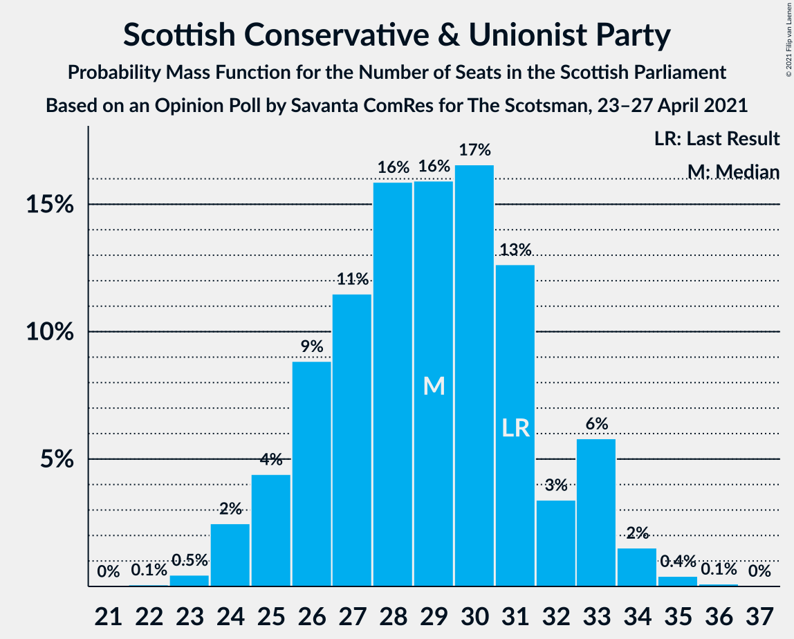

| Number of Seats | Probability | Accumulated | Special Marks |
|:---------------:|:-----------:|:-----------:|:-------------:|
| 22 | 0.1% | 100% |  |
| 23 | 0.5% | 99.9% |  |
| 24 | 2% | 99.5% |  |
| 25 | 4% | 97% |  |
| 26 | 9% | 93% |  |
| 27 | 11% | 84% |  |
| 28 | 16% | 72% |  |
| 29 | 16% | 56% | Median |
| 30 | 17% | 40% |  |
| 31 | 13% | 24% | Last Result |
| 32 | 3% | 11% |  |
| 33 | 6% | 8% |  |
| 34 | 2% | 2% |  |
| 35 | 0.4% | 0.6% |  |
| 36 | 0.1% | 0.1% |  |
| 37 | 0% | 0% |  |

### Scottish Labour

*For a full overview of the results for this party, see the [Scottish Labour](party-scottishlabour.html) page.*

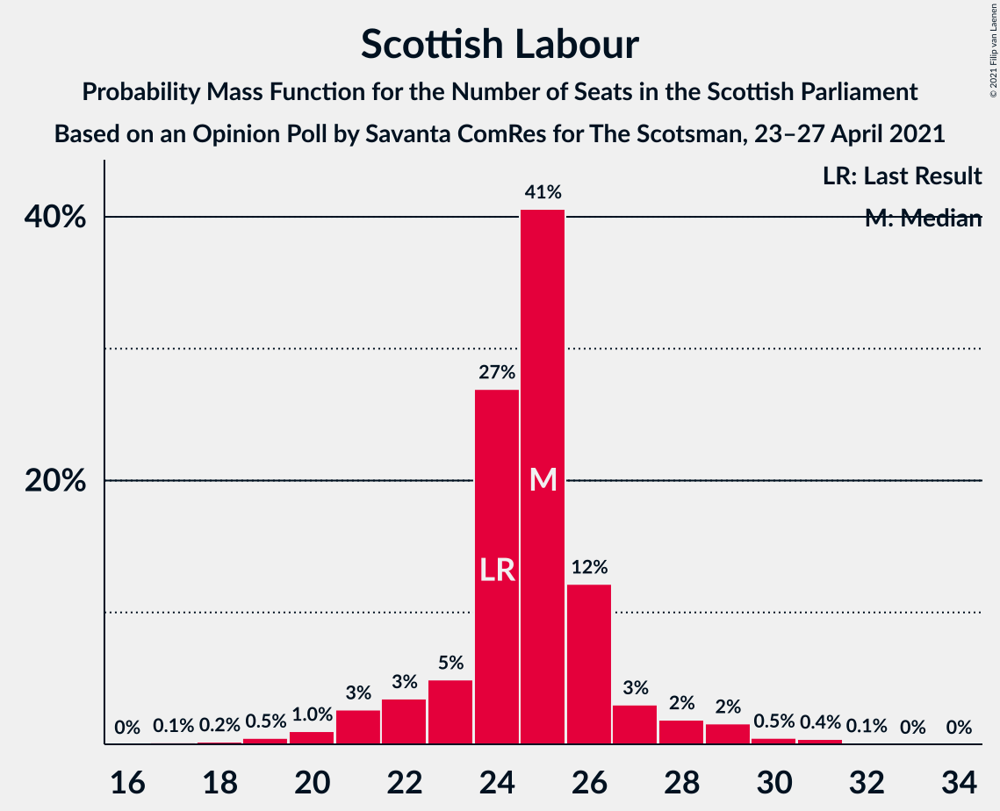

| Number of Seats | Probability | Accumulated | Special Marks |
|:---------------:|:-----------:|:-----------:|:-------------:|
| 17 | 0.1% | 100% |  |
| 18 | 0.2% | 99.9% |  |
| 19 | 0.5% | 99.7% |  |
| 20 | 1.0% | 99.2% |  |
| 21 | 3% | 98% |  |
| 22 | 3% | 96% |  |
| 23 | 5% | 92% |  |
| 24 | 27% | 87% | Last Result |
| 25 | 41% | 60% | Median |
| 26 | 12% | 20% |  |
| 27 | 3% | 7% |  |
| 28 | 2% | 4% |  |
| 29 | 2% | 3% |  |
| 30 | 0.5% | 1.0% |  |
| 31 | 0.4% | 0.5% |  |
| 32 | 0.1% | 0.1% |  |
| 33 | 0% | 0% |  |

### Scottish Greens

*For a full overview of the results for this party, see the [Scottish Greens](party-scottishgreens.html) page.*

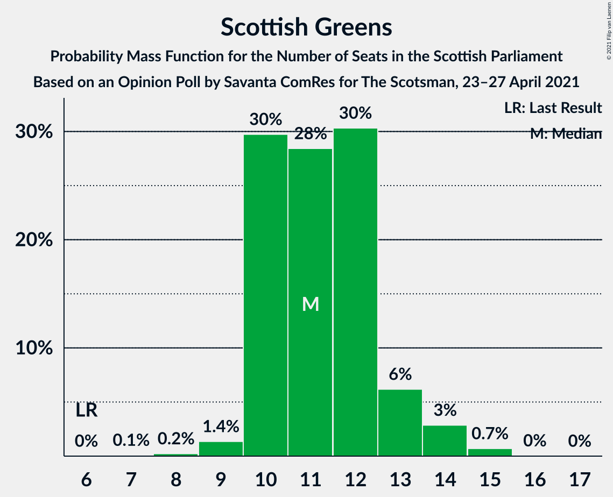

| Number of Seats | Probability | Accumulated | Special Marks |
|:---------------:|:-----------:|:-----------:|:-------------:|
| 6 | 0% | 100% | Last Result |
| 7 | 0.1% | 100% |  |
| 8 | 0.2% | 99.9% |  |
| 9 | 1.4% | 99.7% |  |
| 10 | 30% | 98% |  |
| 11 | 28% | 69% | Median |
| 12 | 30% | 40% |  |
| 13 | 6% | 10% |  |
| 14 | 3% | 4% |  |
| 15 | 0.7% | 0.8% |  |
| 16 | 0% | 0.1% |  |
| 17 | 0% | 0% |  |

### Scottish Liberal Democrats

*For a full overview of the results for this party, see the [Scottish Liberal Democrats](party-scottishliberaldemocrats.html) page.*

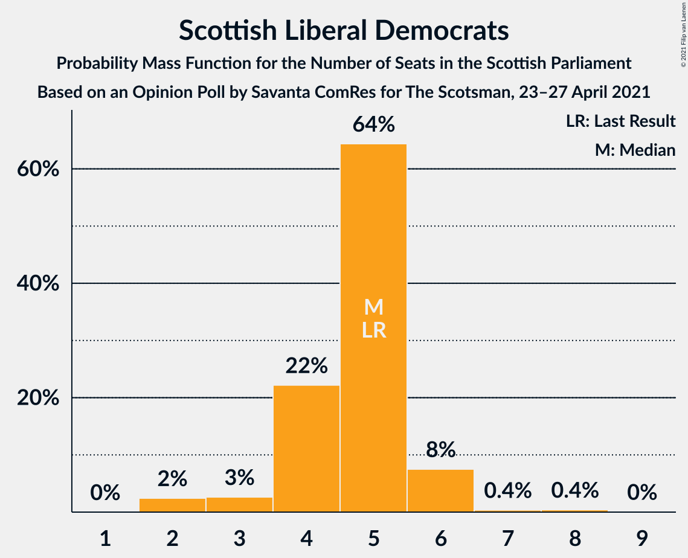

| Number of Seats | Probability | Accumulated | Special Marks |
|:---------------:|:-----------:|:-----------:|:-------------:|
| 2 | 2% | 100% |  |
| 3 | 3% | 98% |  |
| 4 | 22% | 95% |  |
| 5 | 64% | 73% | Last Result, Median |
| 6 | 8% | 8% |  |
| 7 | 0.4% | 0.8% |  |
| 8 | 0.4% | 0.5% |  |
| 9 | 0% | 0% |  |

### Alba Party

*For a full overview of the results for this party, see the [Alba Party](party-albaparty.html) page.*

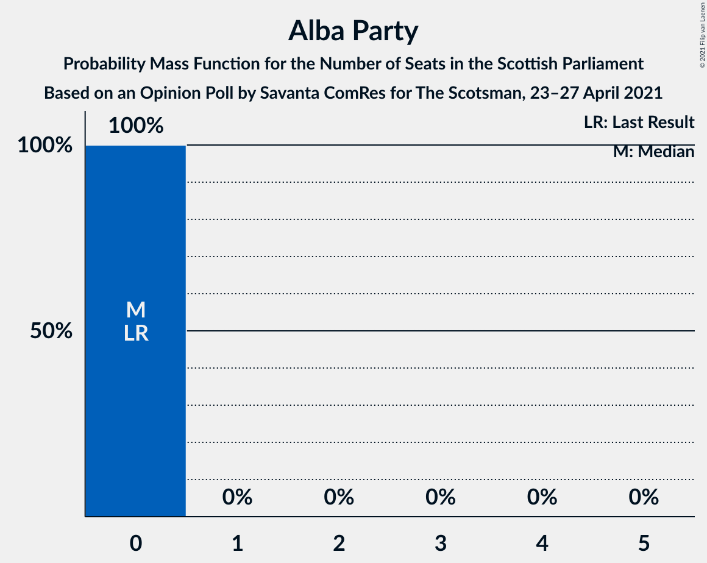

| Number of Seats | Probability | Accumulated | Special Marks |
|:---------------:|:-----------:|:-----------:|:-------------:|
| 0 | 100% | 100% | Last Result, Median |

## Coalitions

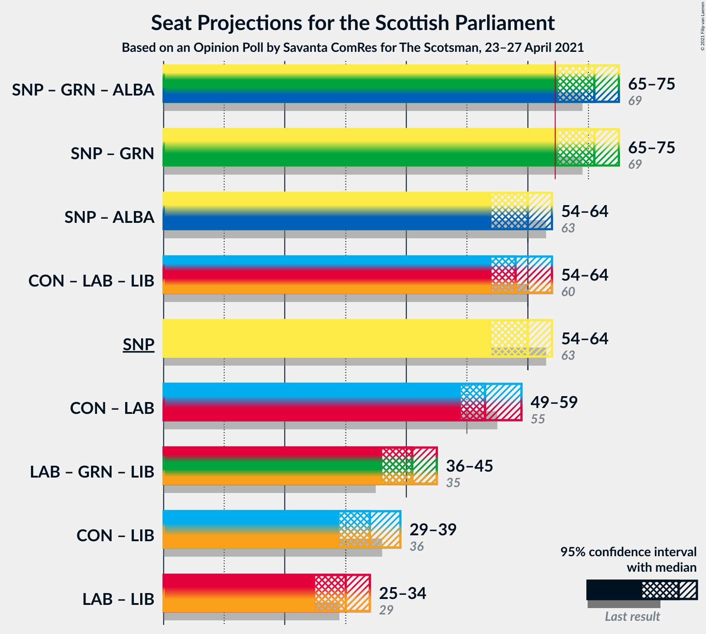

### Confidence Intervals

| Coalition | Last Result | Median | Majority? | 80% Confidence Interval | 90% Confidence Interval | 95% Confidence Interval | 99% Confidence Interval |
|:---------:|:-----------:|:------:|:---------:|:-----------------------:|:-----------------------:|:-----------------------:|:-----------------------:|
| Scottish National Party – Scottish Greens – Alba Party | 69 | 71 | 98% | 68–74 | 66–74 | 65–75 | 63–77 |
| Scottish National Party – Scottish Greens | 69 | 71 | 98% | 68–74 | 66–74 | 65–75 | 63–77 |
| Scottish National Party – Alba Party | 63 | 60 | 2% | 56–62 | 55–63 | 54–64 | 52–66 |
| Scottish Conservative & Unionist Party – Scottish Labour – Scottish Liberal Democrats | 60 | 58 | 2% | 55–61 | 55–63 | 54–64 | 52–66 |
| Scottish National Party | 63 | 60 | 2% | 56–62 | 55–63 | 54–64 | 52–66 |
| Scottish Conservative & Unionist Party – Scottish Labour | 55 | 53 | 0% | 51–57 | 50–58 | 49–59 | 47–61 |
| Scottish Labour – Scottish Greens – Scottish Liberal Democrats | 35 | 41 | 0% | 38–43 | 37–44 | 36–45 | 34–47 |
| Scottish Conservative & Unionist Party – Scottish Liberal Democrats | 36 | 34 | 0% | 31–37 | 30–38 | 29–39 | 28–40 |
| Scottish Labour – Scottish Liberal Democrats | 29 | 30 | 0% | 27–31 | 26–32 | 25–34 | 23–36 |

### Scottish National Party – Scottish Greens – Alba Party

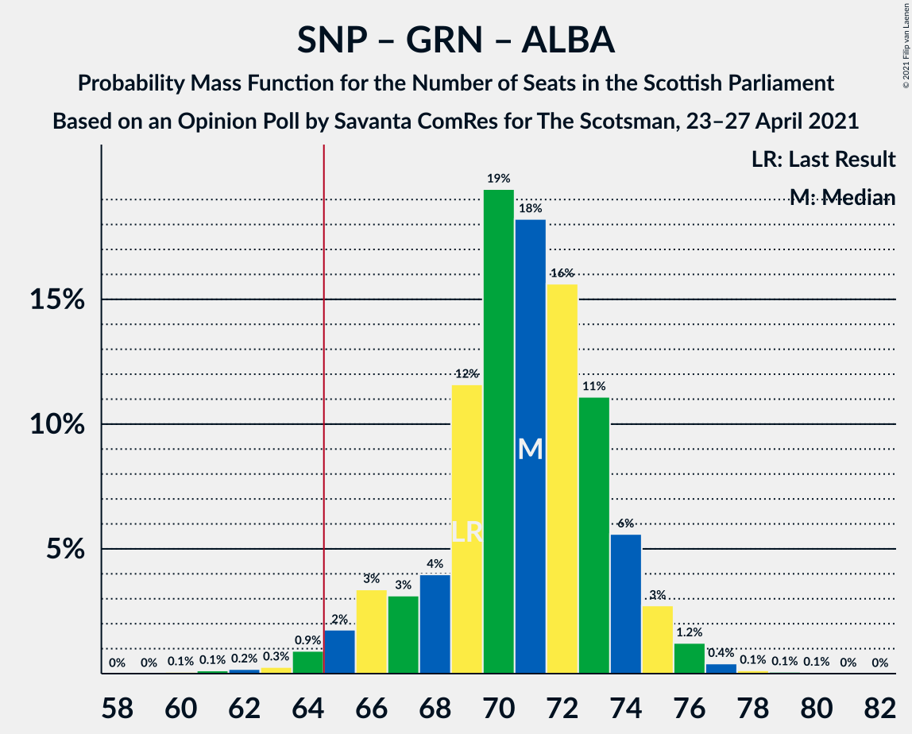

| Number of Seats | Probability | Accumulated | Special Marks |
|:---------------:|:-----------:|:-----------:|:-------------:|
| 60 | 0.1% | 100% |  |
| 61 | 0.1% | 99.9% |  |
| 62 | 0.2% | 99.8% |  |
| 63 | 0.3% | 99.6% |  |
| 64 | 0.9% | 99.3% |  |
| 65 | 2% | 98% | Majority |
| 66 | 3% | 97% |  |
| 67 | 3% | 93% |  |
| 68 | 4% | 90% |  |
| 69 | 12% | 86% | Last Result |
| 70 | 19% | 75% |  |
| 71 | 18% | 55% | Median |
| 72 | 16% | 37% |  |
| 73 | 11% | 21% |  |
| 74 | 6% | 10% |  |
| 75 | 3% | 5% |  |
| 76 | 1.2% | 2% |  |
| 77 | 0.4% | 0.7% |  |
| 78 | 0.1% | 0.3% |  |
| 79 | 0.1% | 0.1% |  |
| 80 | 0.1% | 0.1% |  |
| 81 | 0% | 0% |  |

### Scottish National Party – Scottish Greens

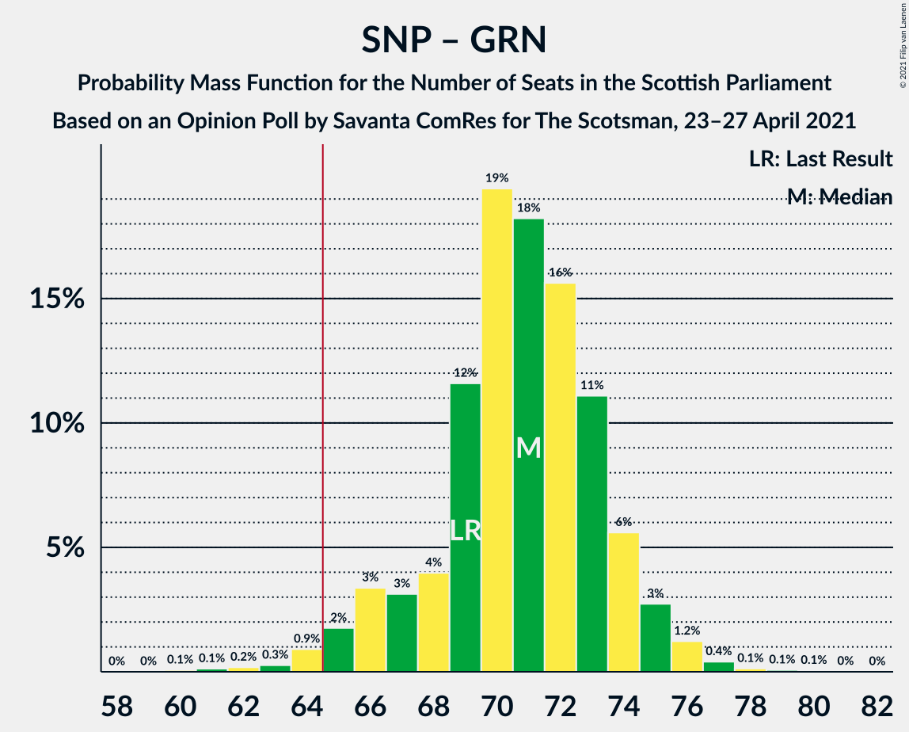

| Number of Seats | Probability | Accumulated | Special Marks |
|:---------------:|:-----------:|:-----------:|:-------------:|
| 60 | 0.1% | 100% |  |
| 61 | 0.1% | 99.9% |  |
| 62 | 0.2% | 99.8% |  |
| 63 | 0.3% | 99.6% |  |
| 64 | 0.9% | 99.3% |  |
| 65 | 2% | 98% | Majority |
| 66 | 3% | 97% |  |
| 67 | 3% | 93% |  |
| 68 | 4% | 90% |  |
| 69 | 12% | 86% | Last Result |
| 70 | 19% | 75% |  |
| 71 | 18% | 55% | Median |
| 72 | 16% | 37% |  |
| 73 | 11% | 21% |  |
| 74 | 6% | 10% |  |
| 75 | 3% | 5% |  |
| 76 | 1.2% | 2% |  |
| 77 | 0.4% | 0.7% |  |
| 78 | 0.1% | 0.3% |  |
| 79 | 0.1% | 0.1% |  |
| 80 | 0.1% | 0.1% |  |
| 81 | 0% | 0% |  |

### Scottish National Party – Alba Party

| Number of Seats | Probability | Accumulated | Special Marks |
|:---------------:|:-----------:|:-----------:|:-------------:|
| 49 | 0.1% | 100% |  |
| 50 | 0.1% | 99.9% |  |
| 51 | 0.2% | 99.8% |  |
| 52 | 0.3% | 99.6% |  |
| 53 | 0.8% | 99.3% |  |
| 54 | 3% | 98.5% |  |
| 55 | 3% | 95% |  |
| 56 | 3% | 92% |  |
| 57 | 4% | 89% |  |
| 58 | 4% | 85% |  |
| 59 | 28% | 81% |  |
| 60 | 27% | 53% | Median |
| 61 | 12% | 26% |  |
| 62 | 5% | 14% |  |
| 63 | 6% | 9% | Last Result |
| 64 | 1.3% | 3% |  |
| 65 | 1.2% | 2% | Majority |
| 66 | 0.4% | 0.6% |  |
| 67 | 0.1% | 0.2% |  |
| 68 | 0% | 0.1% |  |
| 69 | 0.1% | 0.1% |  |
| 70 | 0% | 0% |  |

### Scottish Conservative & Unionist Party – Scottish Labour – Scottish Liberal Democrats

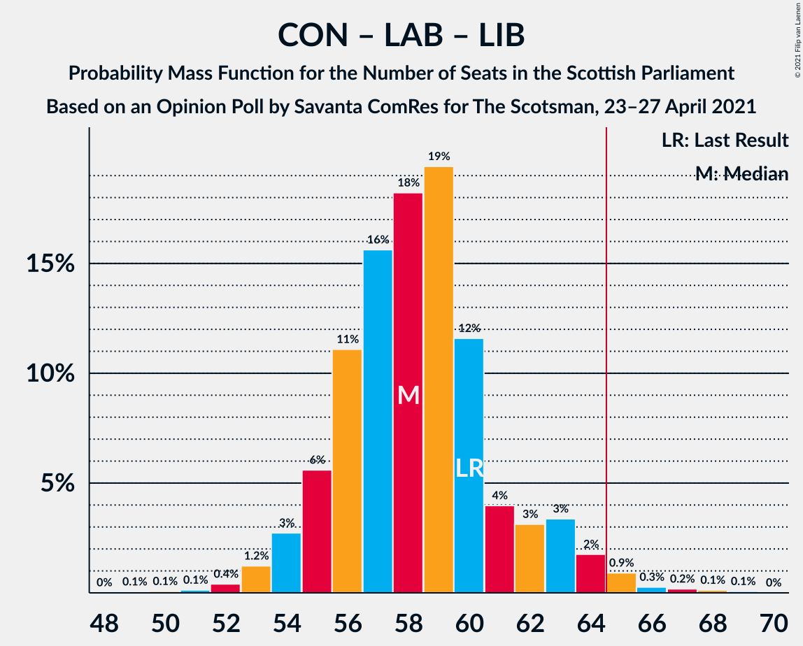

| Number of Seats | Probability | Accumulated | Special Marks |
|:---------------:|:-----------:|:-----------:|:-------------:|
| 49 | 0.1% | 100% |  |
| 50 | 0.1% | 99.9% |  |
| 51 | 0.1% | 99.9% |  |
| 52 | 0.4% | 99.7% |  |
| 53 | 1.2% | 99.3% |  |
| 54 | 3% | 98% |  |
| 55 | 6% | 95% |  |
| 56 | 11% | 90% |  |
| 57 | 16% | 79% |  |
| 58 | 18% | 63% |  |
| 59 | 19% | 45% | Median |
| 60 | 12% | 25% | Last Result |
| 61 | 4% | 14% |  |
| 62 | 3% | 10% |  |
| 63 | 3% | 7% |  |
| 64 | 2% | 3% |  |
| 65 | 0.9% | 2% | Majority |
| 66 | 0.3% | 0.7% |  |
| 67 | 0.2% | 0.4% |  |
| 68 | 0.1% | 0.2% |  |
| 69 | 0.1% | 0.1% |  |
| 70 | 0% | 0% |  |

### Scottish National Party

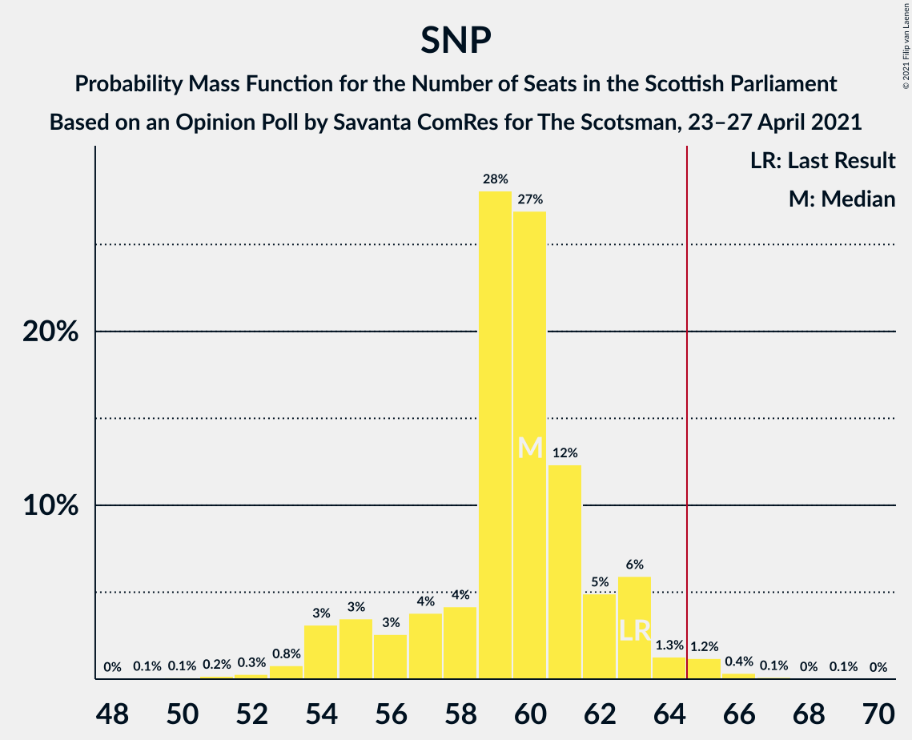

| Number of Seats | Probability | Accumulated | Special Marks |
|:---------------:|:-----------:|:-----------:|:-------------:|
| 49 | 0.1% | 100% |  |
| 50 | 0.1% | 99.9% |  |
| 51 | 0.2% | 99.8% |  |
| 52 | 0.3% | 99.6% |  |
| 53 | 0.8% | 99.3% |  |
| 54 | 3% | 98.5% |  |
| 55 | 3% | 95% |  |
| 56 | 3% | 92% |  |
| 57 | 4% | 89% |  |
| 58 | 4% | 85% |  |
| 59 | 28% | 81% |  |
| 60 | 27% | 53% | Median |
| 61 | 12% | 26% |  |
| 62 | 5% | 14% |  |
| 63 | 6% | 9% | Last Result |
| 64 | 1.3% | 3% |  |
| 65 | 1.2% | 2% | Majority |
| 66 | 0.4% | 0.6% |  |
| 67 | 0.1% | 0.2% |  |
| 68 | 0% | 0.1% |  |
| 69 | 0.1% | 0.1% |  |
| 70 | 0% | 0% |  |

### Scottish Conservative & Unionist Party – Scottish Labour

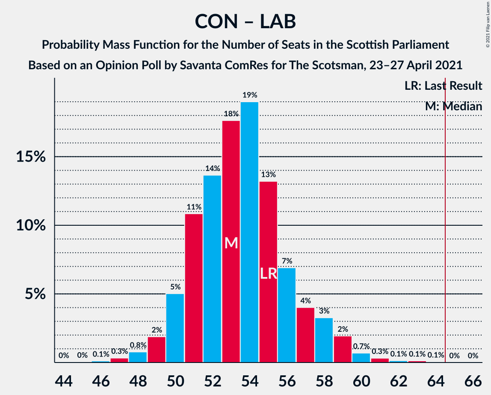

| Number of Seats | Probability | Accumulated | Special Marks |
|:---------------:|:-----------:|:-----------:|:-------------:|
| 45 | 0% | 100% |  |
| 46 | 0.1% | 99.9% |  |
| 47 | 0.3% | 99.8% |  |
| 48 | 0.8% | 99.5% |  |
| 49 | 2% | 98.7% |  |
| 50 | 5% | 97% |  |
| 51 | 11% | 92% |  |
| 52 | 14% | 81% |  |
| 53 | 18% | 67% |  |
| 54 | 19% | 50% | Median |
| 55 | 13% | 31% | Last Result |
| 56 | 7% | 17% |  |
| 57 | 4% | 11% |  |
| 58 | 3% | 7% |  |
| 59 | 2% | 3% |  |
| 60 | 0.7% | 1.3% |  |
| 61 | 0.3% | 0.7% |  |
| 62 | 0.1% | 0.3% |  |
| 63 | 0.1% | 0.2% |  |
| 64 | 0.1% | 0.1% |  |
| 65 | 0% | 0% | Majority |

### Scottish Labour – Scottish Greens – Scottish Liberal Democrats

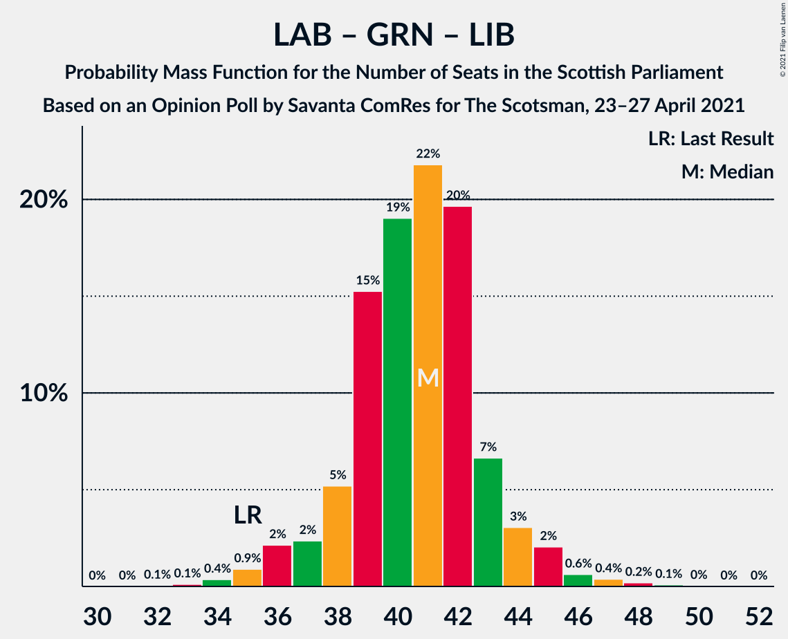

| Number of Seats | Probability | Accumulated | Special Marks |
|:---------------:|:-----------:|:-----------:|:-------------:|
| 32 | 0.1% | 100% |  |
| 33 | 0.1% | 99.9% |  |
| 34 | 0.4% | 99.8% |  |
| 35 | 0.9% | 99.5% | Last Result |
| 36 | 2% | 98.6% |  |
| 37 | 2% | 96% |  |
| 38 | 5% | 94% |  |
| 39 | 15% | 89% |  |
| 40 | 19% | 74% |  |
| 41 | 22% | 55% | Median |
| 42 | 20% | 33% |  |
| 43 | 7% | 13% |  |
| 44 | 3% | 6% |  |
| 45 | 2% | 3% |  |
| 46 | 0.6% | 1.4% |  |
| 47 | 0.4% | 0.7% |  |
| 48 | 0.2% | 0.3% |  |
| 49 | 0.1% | 0.1% |  |
| 50 | 0% | 0.1% |  |
| 51 | 0% | 0% |  |

### Scottish Conservative & Unionist Party – Scottish Liberal Democrats

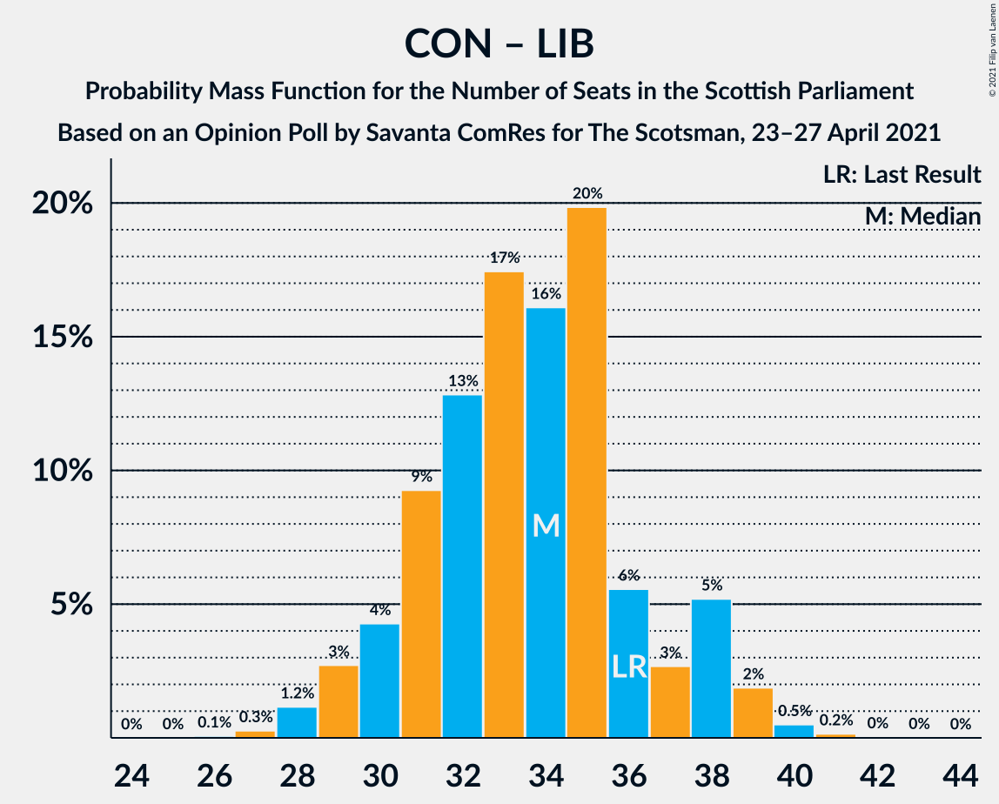

| Number of Seats | Probability | Accumulated | Special Marks |
|:---------------:|:-----------:|:-----------:|:-------------:|
| 26 | 0.1% | 100% |  |
| 27 | 0.3% | 99.9% |  |
| 28 | 1.2% | 99.7% |  |
| 29 | 3% | 98% |  |
| 30 | 4% | 96% |  |
| 31 | 9% | 92% |  |
| 32 | 13% | 82% |  |
| 33 | 17% | 69% |  |
| 34 | 16% | 52% | Median |
| 35 | 20% | 36% |  |
| 36 | 6% | 16% | Last Result |
| 37 | 3% | 10% |  |
| 38 | 5% | 8% |  |
| 39 | 2% | 3% |  |
| 40 | 0.5% | 0.7% |  |
| 41 | 0.2% | 0.2% |  |
| 42 | 0% | 0.1% |  |
| 43 | 0% | 0% |  |

### Scottish Labour – Scottish Liberal Democrats

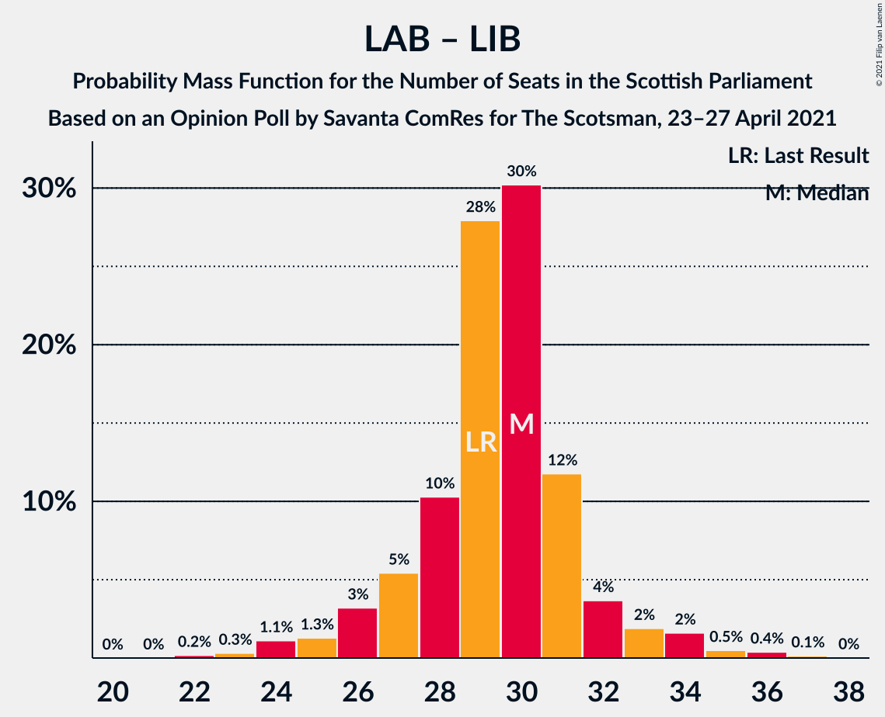

| Number of Seats | Probability | Accumulated | Special Marks |
|:---------------:|:-----------:|:-----------:|:-------------:|
| 22 | 0.2% | 100% |  |
| 23 | 0.3% | 99.8% |  |
| 24 | 1.1% | 99.5% |  |
| 25 | 1.3% | 98% |  |
| 26 | 3% | 97% |  |
| 27 | 5% | 94% |  |
| 28 | 10% | 88% |  |
| 29 | 28% | 78% | Last Result |
| 30 | 30% | 50% | Median |
| 31 | 12% | 20% |  |
| 32 | 4% | 8% |  |
| 33 | 2% | 5% |  |
| 34 | 2% | 3% |  |
| 35 | 0.5% | 1.1% |  |
| 36 | 0.4% | 0.6% |  |
| 37 | 0.1% | 0.2% |  |
| 38 | 0% | 0% |  |

## Technical Information

### Opinion Poll

+ **Polling firm:** Savanta ComRes
+ **Commissioner(s):** The Scotsman
+ **Fieldwork period:** 23–27 April 2021

### Calculations

+ **Sample size:** 1001
+ **Simulations done:** 1,048,576
+ **Error estimate:** 1.28%

