# Opinion Poll by BMG Research for The Herald, 27–30 April 2021

<a href="#voting-intentions">Voting Intentions</a> | <a href="#seats">Seats</a> | <a href="#coalitions">Coalitions</a> | <a href="#technical-information">Technical Information</a>

## Voting Intentions

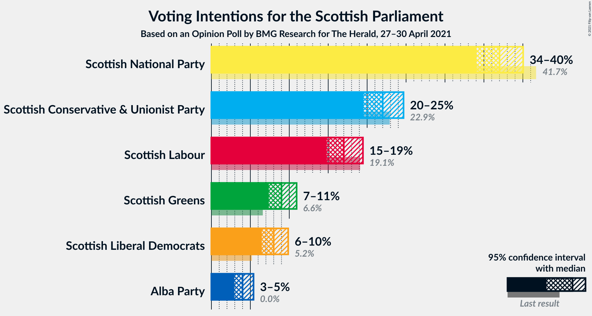

### Confidence Intervals

| Party | Last Result | Poll Result | 80% Confidence Interval | 90% Confidence Interval | 95% Confidence Interval | 99% Confidence Interval |
|:-----:|:-----------:|:-----------:|:-----------------------:|:-----------------------:|:-----------------------:|:-----------------------:|
| Scottish National Party | 41.7% | 37.0% | 35.1–39.0% |34.5–39.6% |34.0–40.0% |33.2–41.0% |
| Scottish Conservative & Unionist Party | 22.9% | 22.0% | 20.4–23.7% |19.9–24.2% |19.5–24.7% |18.8–25.5% |
| Scottish Labour | 19.1% | 17.0% | 15.5–18.6% |15.2–19.1% |14.8–19.5% |14.1–20.3% |
| Scottish Greens | 6.6% | 9.0% | 7.9–10.3% |7.6–10.6% |7.4–10.9% |6.9–11.6% |
| Scottish Liberal Democrats | 5.2% | 8.0% | 7.0–9.2% |6.7–9.6% |6.5–9.9% |6.0–10.5% |
| Alba Party | 0.0% | 4.0% | 3.3–4.9% |3.1–5.2% |2.9–5.4% |2.7–5.9% |

*Note:* The poll result column reflects the actual value used in the calculations. Published results may vary slightly, and in addition be rounded to fewer digits.

## Seats

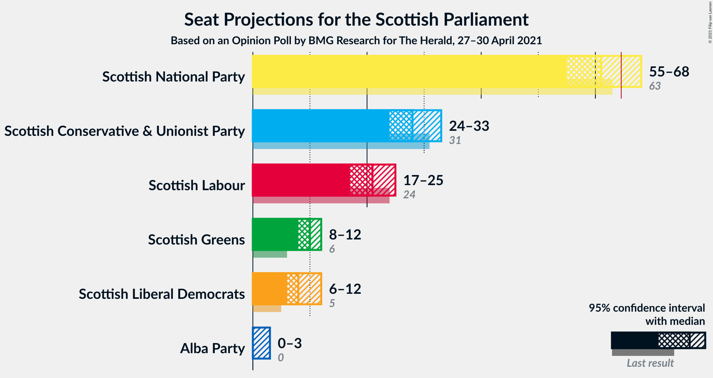

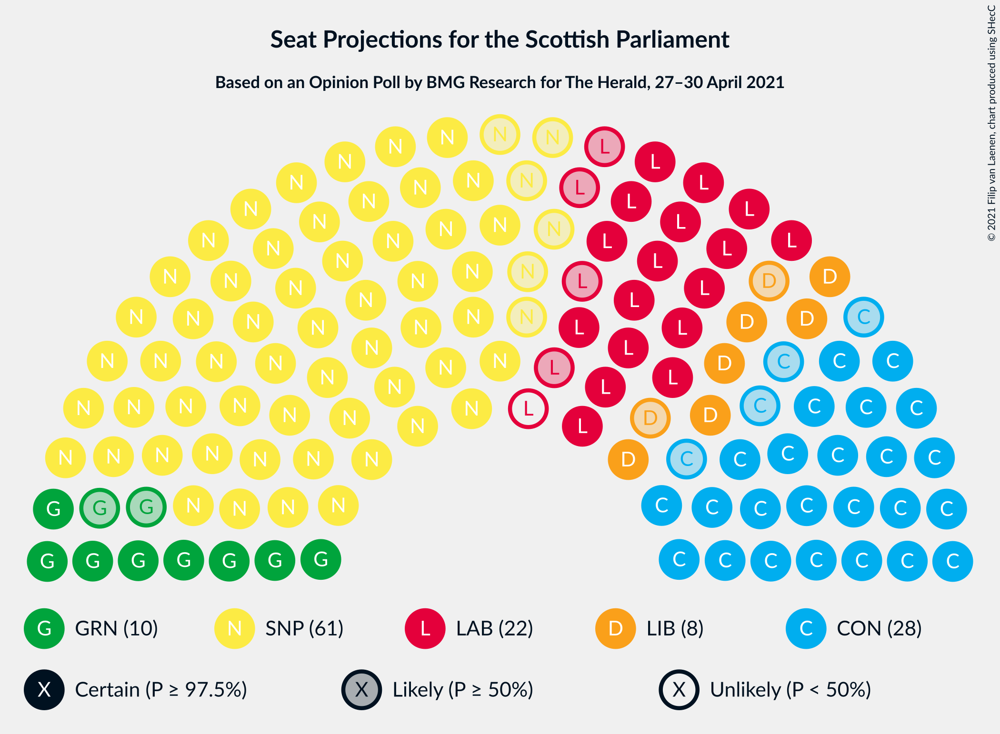

### Confidence Intervals

| Party | Last Result | Median | 80% Confidence Interval | 90% Confidence Interval | 95% Confidence Interval | 99% Confidence Interval |
|:-----:|:-----------:|:------:|:-----------------------:|:-----------------------:|:-----------------------:|:-----------------------:|
| <a href="#scottish-national-party">Scottish National Party</a> | 63 | 61 | 59–65 |57–68 |55–68 |53–69 |
| <a href="#scottish-conservative-&-unionist-party">Scottish Conservative & Unionist Party</a> | 31 | 28 | 25–32 |24–33 |24–33 |22–34 |
| <a href="#scottish-labour">Scottish Labour</a> | 24 | 21 | 18–24 |17–25 |17–25 |16–26 |
| <a href="#scottish-greens">Scottish Greens</a> | 6 | 10 | 10–11 |9–12 |8–12 |6–13 |
| <a href="#scottish-liberal-democrats">Scottish Liberal Democrats</a> | 5 | 8 | 6–10 |6–11 |6–12 |5–13 |
| <a href="#alba-party">Alba Party</a> | 0 | 0 | 0–1 |0–2 |0–3 |0–6 |

### Scottish National Party

*For a full overview of the results for this party, see the [Scottish National Party](party-scottishnationalparty.html) page.*

| Number of Seats | Probability | Accumulated | Special Marks |
|:---------------:|:-----------:|:-----------:|:-------------:|
| 52 | 0.1% | 100% |  |
| 53 | 1.1% | 99.9% |  |
| 54 | 0.7% | 98.8% |  |
| 55 | 1.1% | 98% |  |
| 56 | 1.0% | 97% |  |
| 57 | 2% | 96% |  |
| 58 | 3% | 94% |  |
| 59 | 12% | 90% |  |
| 60 | 20% | 78% |  |
| 61 | 21% | 58% | Median |
| 62 | 13% | 38% |  |
| 63 | 7% | 25% | Last Result |
| 64 | 4% | 17% |  |
| 65 | 4% | 13% | Majority |
| 66 | 3% | 9% |  |
| 67 | 1.3% | 7% |  |
| 68 | 4% | 5% |  |
| 69 | 1.1% | 1.2% |  |
| 70 | 0.1% | 0.1% |  |
| 71 | 0% | 0% |  |

### Scottish Conservative & Unionist Party

*For a full overview of the results for this party, see the [Scottish Conservative & Unionist Party](party-scottishconservativeunionistparty.html) page.*

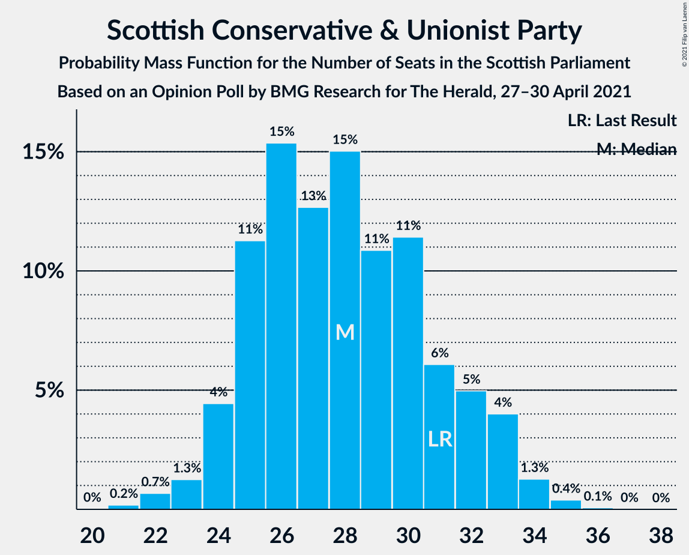

| Number of Seats | Probability | Accumulated | Special Marks |
|:---------------:|:-----------:|:-----------:|:-------------:|
| 21 | 0.2% | 100% |  |
| 22 | 0.7% | 99.8% |  |
| 23 | 1.3% | 99.1% |  |
| 24 | 4% | 98% |  |
| 25 | 11% | 93% |  |
| 26 | 15% | 82% |  |
| 27 | 13% | 67% |  |
| 28 | 15% | 54% | Median |
| 29 | 11% | 39% |  |
| 30 | 11% | 28% |  |
| 31 | 6% | 17% | Last Result |
| 32 | 5% | 11% |  |
| 33 | 4% | 6% |  |
| 34 | 1.3% | 2% |  |
| 35 | 0.4% | 0.5% |  |
| 36 | 0.1% | 0.1% |  |
| 37 | 0% | 0% |  |

### Scottish Labour

*For a full overview of the results for this party, see the [Scottish Labour](party-scottishlabour.html) page.*

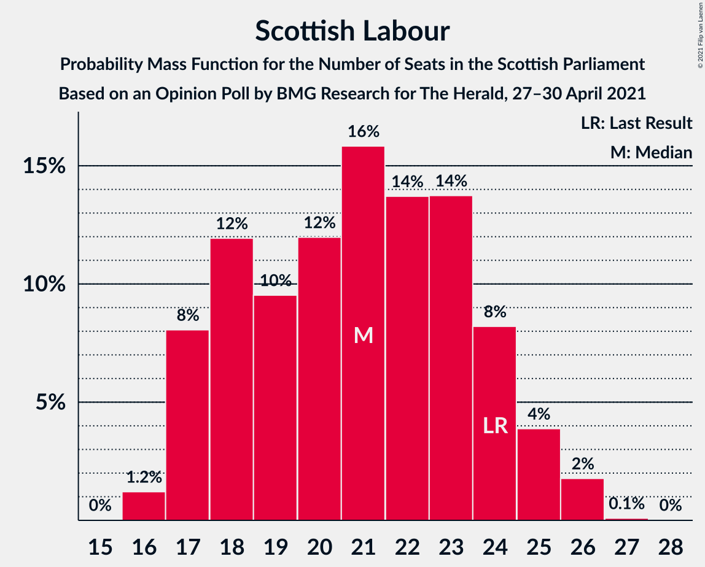

| Number of Seats | Probability | Accumulated | Special Marks |
|:---------------:|:-----------:|:-----------:|:-------------:|
| 16 | 1.2% | 100% |  |
| 17 | 8% | 98.8% |  |
| 18 | 12% | 91% |  |
| 19 | 10% | 79% |  |
| 20 | 12% | 69% |  |
| 21 | 16% | 57% | Median |
| 22 | 14% | 41% |  |
| 23 | 14% | 28% |  |
| 24 | 8% | 14% | Last Result |
| 25 | 4% | 6% |  |
| 26 | 2% | 2% |  |
| 27 | 0.1% | 0.1% |  |
| 28 | 0% | 0% |  |

### Scottish Greens

*For a full overview of the results for this party, see the [Scottish Greens](party-scottishgreens.html) page.*

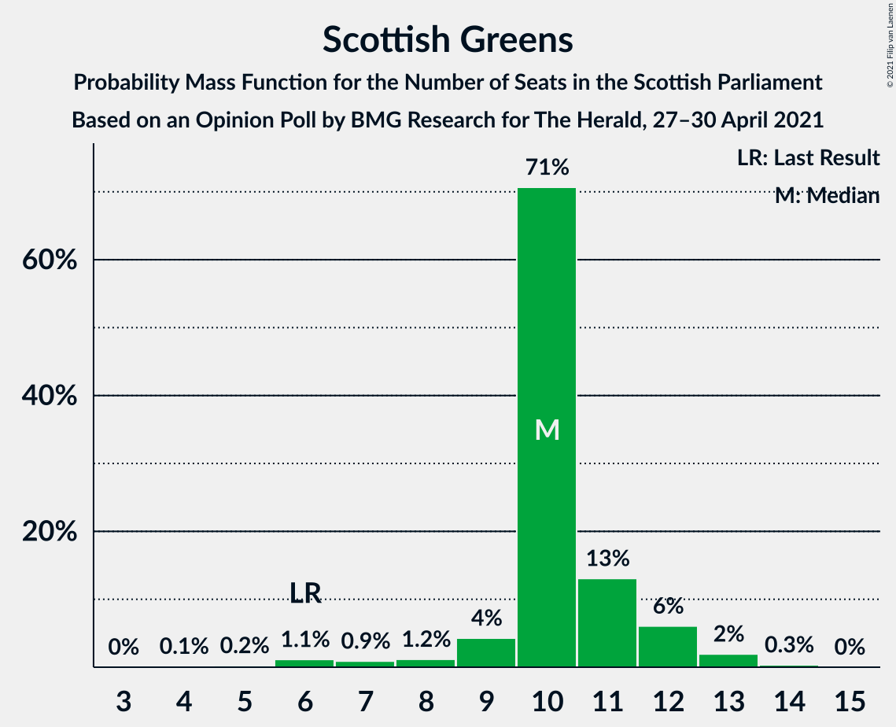

| Number of Seats | Probability | Accumulated | Special Marks |
|:---------------:|:-----------:|:-----------:|:-------------:|
| 4 | 0.1% | 100% |  |
| 5 | 0.2% | 99.8% |  |
| 6 | 1.1% | 99.6% | Last Result |
| 7 | 0.9% | 98% |  |
| 8 | 1.2% | 98% |  |
| 9 | 4% | 96% |  |
| 10 | 71% | 92% | Median |
| 11 | 13% | 21% |  |
| 12 | 6% | 8% |  |
| 13 | 2% | 2% |  |
| 14 | 0.3% | 0.4% |  |
| 15 | 0% | 0% |  |

### Scottish Liberal Democrats

*For a full overview of the results for this party, see the [Scottish Liberal Democrats](party-scottishliberaldemocrats.html) page.*

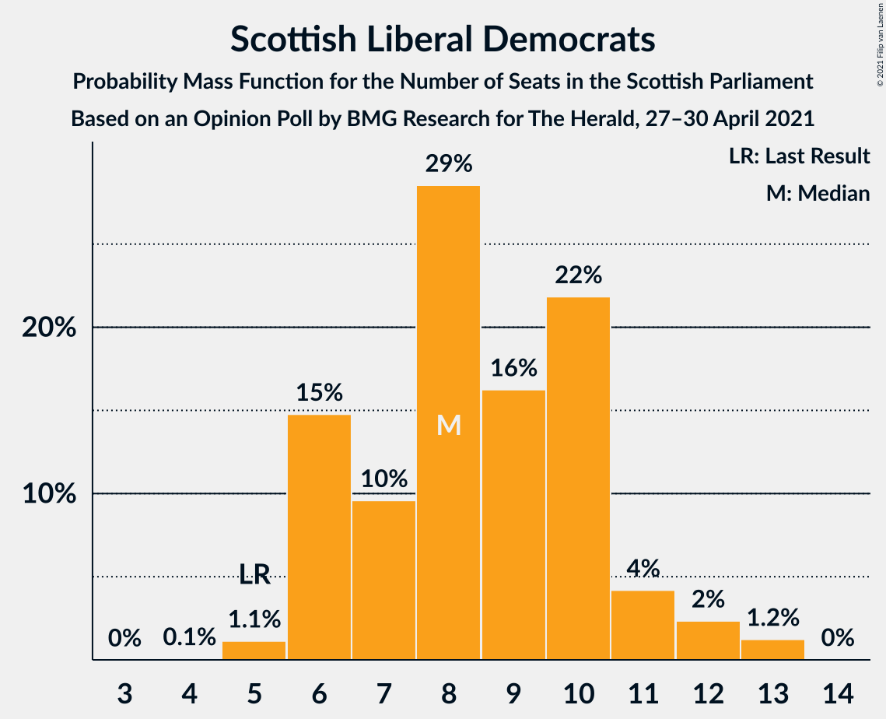

| Number of Seats | Probability | Accumulated | Special Marks |
|:---------------:|:-----------:|:-----------:|:-------------:|
| 4 | 0.1% | 100% |  |
| 5 | 1.1% | 99.9% | Last Result |
| 6 | 15% | 98.8% |  |
| 7 | 10% | 84% |  |
| 8 | 29% | 74% | Median |
| 9 | 16% | 46% |  |
| 10 | 22% | 30% |  |
| 11 | 4% | 8% |  |
| 12 | 2% | 4% |  |
| 13 | 1.2% | 1.3% |  |
| 14 | 0% | 0% |  |

### Alba Party

*For a full overview of the results for this party, see the [Alba Party](party-albaparty.html) page.*

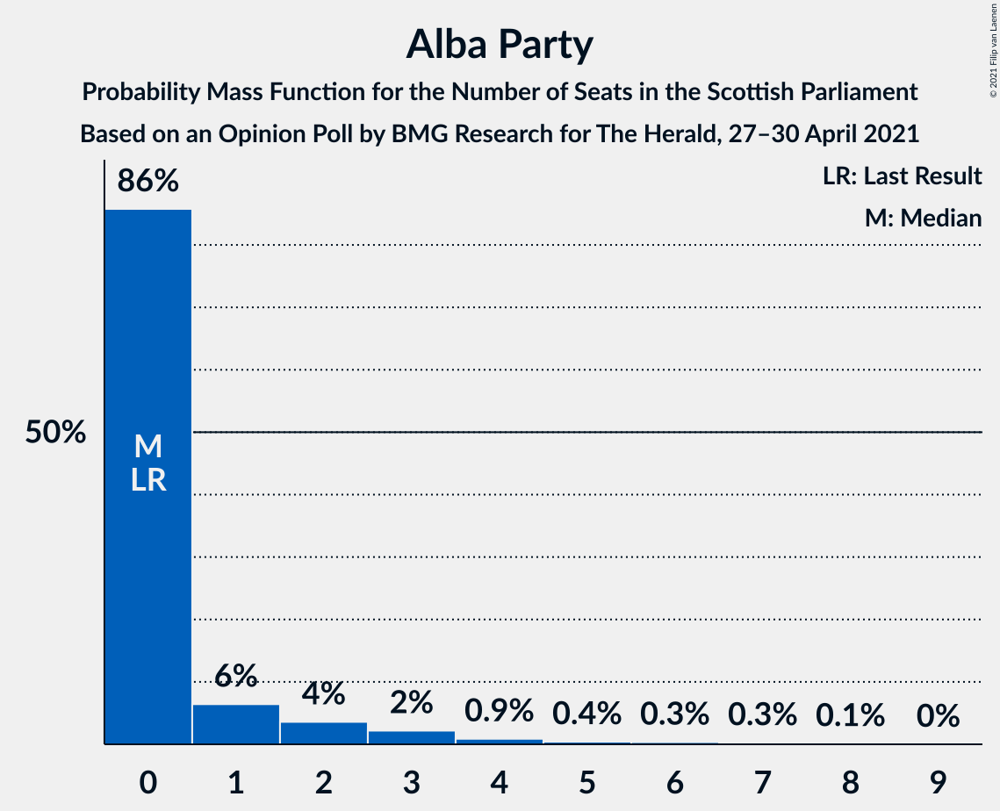

| Number of Seats | Probability | Accumulated | Special Marks |
|:---------------:|:-----------:|:-----------:|:-------------:|
| 0 | 86% | 100% | Last Result, Median |
| 1 | 6% | 14% |  |
| 2 | 4% | 8% |  |
| 3 | 2% | 4% |  |
| 4 | 0.9% | 2% |  |
| 5 | 0.4% | 1.1% |  |
| 6 | 0.3% | 0.7% |  |
| 7 | 0.3% | 0.4% |  |
| 8 | 0.1% | 0.1% |  |
| 9 | 0% | 0% |  |

## Coalitions

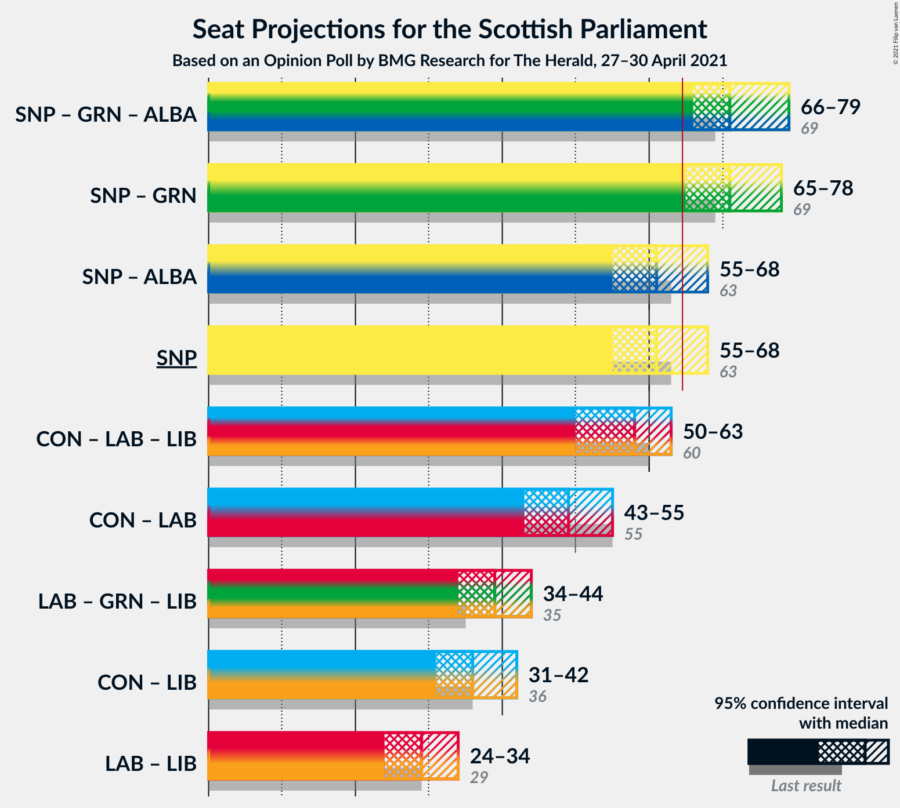

### Confidence Intervals

| Coalition | Last Result | Median | Majority? | 80% Confidence Interval | 90% Confidence Interval | 95% Confidence Interval | 99% Confidence Interval |
|:---------:|:-----------:|:------:|:---------:|:-----------------------:|:-----------------------:|:-----------------------:|:-----------------------:|
| Scottish National Party – Scottish Greens – Alba Party | 69 | 71 | 98.5% | 69–76 | 67–78 | 66–79 | 63–80 |
| Scottish National Party – Scottish Greens | 69 | 71 | 98% | 68–75 | 67–77 | 65–78 | 63–79 |
| Scottish National Party – Alba Party | 63 | 61 | 16% | 59–66 | 57–68 | 55–68 | 53–70 |
| Scottish National Party | 63 | 61 | 13% | 59–65 | 57–68 | 55–68 | 53–69 |
| Scottish Conservative & Unionist Party – Scottish Labour – Scottish Liberal Democrats | 60 | 58 | 1.5% | 53–60 | 51–62 | 50–63 | 49–66 |
| Scottish Conservative & Unionist Party – Scottish Labour | 55 | 49 | 0% | 45–52 | 44–54 | 43–55 | 41–56 |
| Scottish Labour – Scottish Greens – Scottish Liberal Democrats | 35 | 39 | 0% | 35–43 | 34–44 | 34–44 | 33–46 |
| Scottish Conservative & Unionist Party – Scottish Liberal Democrats | 36 | 36 | 0% | 33–40 | 32–41 | 31–42 | 29–44 |
| Scottish Labour – Scottish Liberal Democrats | 29 | 29 | 0% | 25–33 | 24–33 | 24–34 | 23–35 |

### Scottish National Party – Scottish Greens – Alba Party

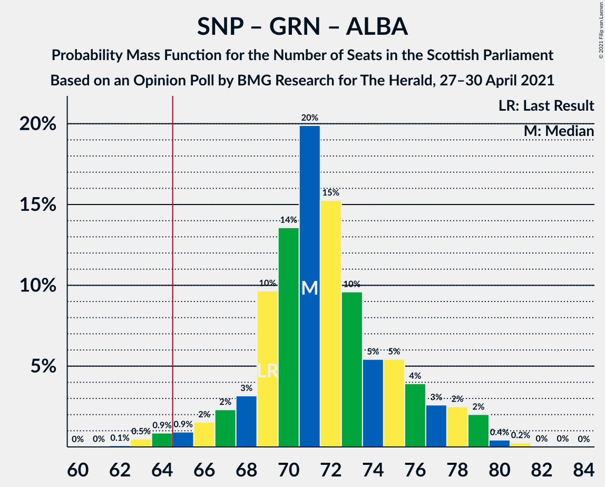

| Number of Seats | Probability | Accumulated | Special Marks |
|:---------------:|:-----------:|:-----------:|:-------------:|
| 62 | 0.1% | 100% |  |
| 63 | 0.5% | 99.9% |  |
| 64 | 0.9% | 99.4% |  |
| 65 | 0.9% | 98.5% | Majority |
| 66 | 2% | 98% |  |
| 67 | 2% | 96% |  |
| 68 | 3% | 94% |  |
| 69 | 10% | 91% | Last Result |
| 70 | 14% | 81% |  |
| 71 | 20% | 67% | Median |
| 72 | 15% | 47% |  |
| 73 | 10% | 32% |  |
| 74 | 5% | 23% |  |
| 75 | 5% | 17% |  |
| 76 | 4% | 12% |  |
| 77 | 3% | 8% |  |
| 78 | 2% | 5% |  |
| 79 | 2% | 3% |  |
| 80 | 0.4% | 0.8% |  |
| 81 | 0.2% | 0.3% |  |
| 82 | 0% | 0.1% |  |
| 83 | 0% | 0% |  |

### Scottish National Party – Scottish Greens

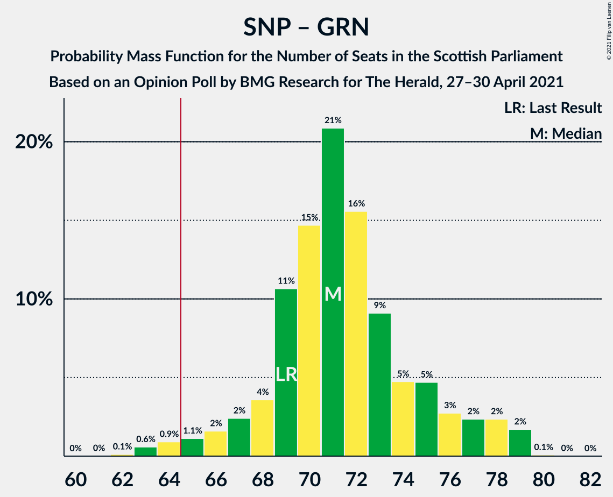

| Number of Seats | Probability | Accumulated | Special Marks |
|:---------------:|:-----------:|:-----------:|:-------------:|
| 62 | 0.1% | 100% |  |
| 63 | 0.6% | 99.9% |  |
| 64 | 0.9% | 99.3% |  |
| 65 | 1.1% | 98% | Majority |
| 66 | 2% | 97% |  |
| 67 | 2% | 96% |  |
| 68 | 4% | 93% |  |
| 69 | 11% | 90% | Last Result |
| 70 | 15% | 79% |  |
| 71 | 21% | 64% | Median |
| 72 | 16% | 43% |  |
| 73 | 9% | 28% |  |
| 74 | 5% | 19% |  |
| 75 | 5% | 14% |  |
| 76 | 3% | 9% |  |
| 77 | 2% | 7% |  |
| 78 | 2% | 4% |  |
| 79 | 2% | 2% |  |
| 80 | 0.1% | 0.1% |  |
| 81 | 0% | 0% |  |

### Scottish National Party – Alba Party

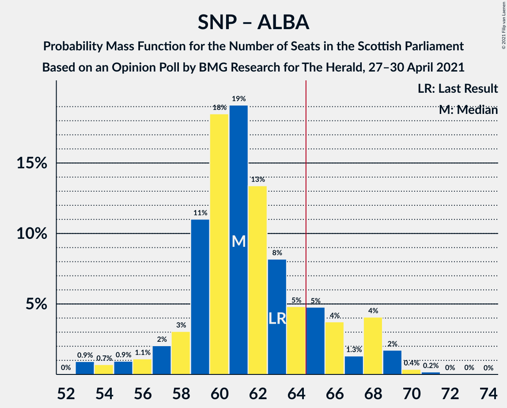

| Number of Seats | Probability | Accumulated | Special Marks |
|:---------------:|:-----------:|:-----------:|:-------------:|
| 53 | 0.9% | 100% |  |
| 54 | 0.7% | 99.0% |  |
| 55 | 0.9% | 98% |  |
| 56 | 1.1% | 97% |  |
| 57 | 2% | 96% |  |
| 58 | 3% | 94% |  |
| 59 | 11% | 91% |  |
| 60 | 18% | 80% |  |
| 61 | 19% | 62% | Median |
| 62 | 13% | 43% |  |
| 63 | 8% | 29% | Last Result |
| 64 | 5% | 21% |  |
| 65 | 5% | 16% | Majority |
| 66 | 4% | 11% |  |
| 67 | 1.3% | 8% |  |
| 68 | 4% | 6% |  |
| 69 | 2% | 2% |  |
| 70 | 0.4% | 0.6% |  |
| 71 | 0.2% | 0.3% |  |
| 72 | 0% | 0.1% |  |
| 73 | 0% | 0% |  |

### Scottish National Party

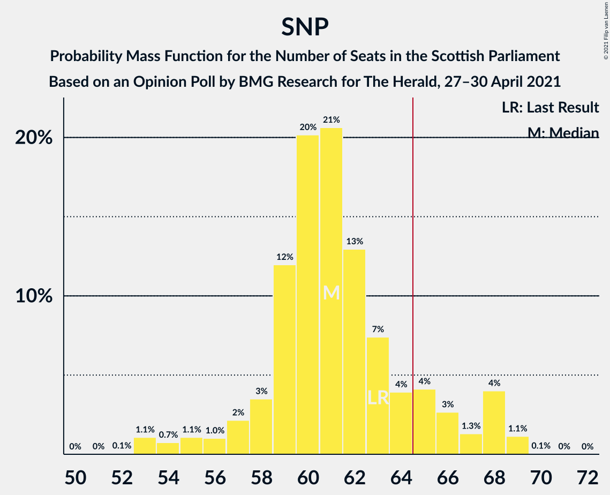

| Number of Seats | Probability | Accumulated | Special Marks |
|:---------------:|:-----------:|:-----------:|:-------------:|
| 52 | 0.1% | 100% |  |
| 53 | 1.1% | 99.9% |  |
| 54 | 0.7% | 98.8% |  |
| 55 | 1.1% | 98% |  |
| 56 | 1.0% | 97% |  |
| 57 | 2% | 96% |  |
| 58 | 3% | 94% |  |
| 59 | 12% | 90% |  |
| 60 | 20% | 78% |  |
| 61 | 21% | 58% | Median |
| 62 | 13% | 38% |  |
| 63 | 7% | 25% | Last Result |
| 64 | 4% | 17% |  |
| 65 | 4% | 13% | Majority |
| 66 | 3% | 9% |  |
| 67 | 1.3% | 7% |  |
| 68 | 4% | 5% |  |
| 69 | 1.1% | 1.2% |  |
| 70 | 0.1% | 0.1% |  |
| 71 | 0% | 0% |  |

### Scottish Conservative & Unionist Party – Scottish Labour – Scottish Liberal Democrats

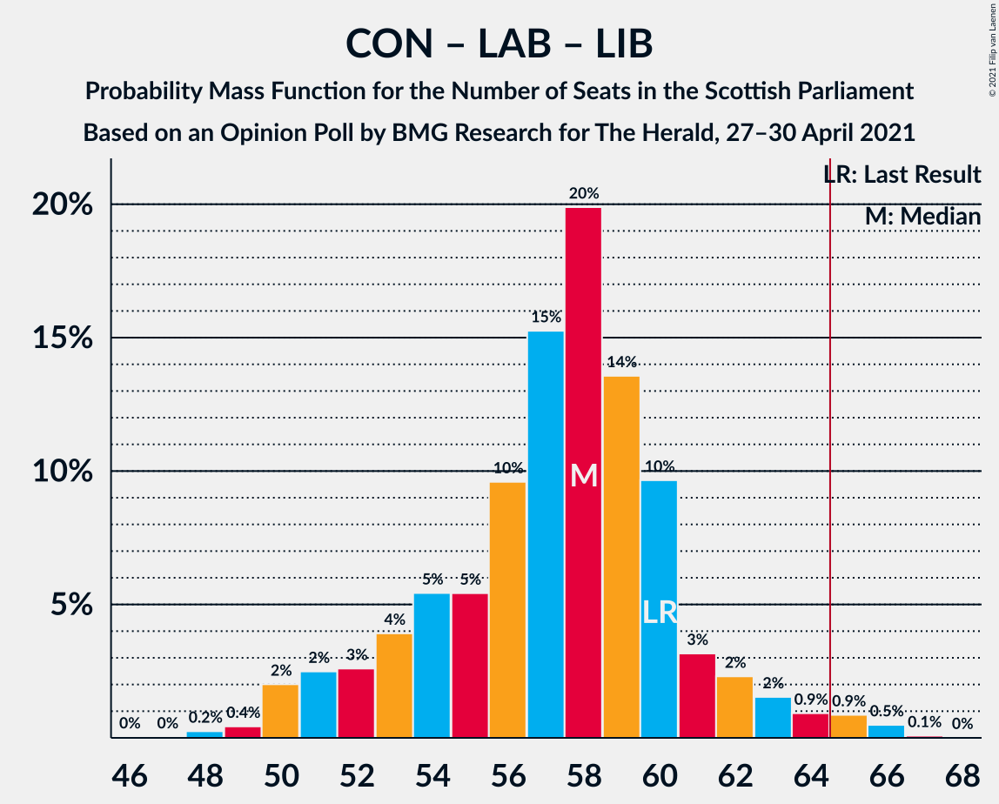

| Number of Seats | Probability | Accumulated | Special Marks |
|:---------------:|:-----------:|:-----------:|:-------------:|
| 47 | 0% | 100% |  |
| 48 | 0.2% | 99.9% |  |
| 49 | 0.4% | 99.7% |  |
| 50 | 2% | 99.2% |  |
| 51 | 2% | 97% |  |
| 52 | 3% | 95% |  |
| 53 | 4% | 92% |  |
| 54 | 5% | 88% |  |
| 55 | 5% | 83% |  |
| 56 | 10% | 77% |  |
| 57 | 15% | 68% | Median |
| 58 | 20% | 53% |  |
| 59 | 14% | 33% |  |
| 60 | 10% | 19% | Last Result |
| 61 | 3% | 9% |  |
| 62 | 2% | 6% |  |
| 63 | 2% | 4% |  |
| 64 | 0.9% | 2% |  |
| 65 | 0.9% | 1.5% | Majority |
| 66 | 0.5% | 0.6% |  |
| 67 | 0.1% | 0.1% |  |
| 68 | 0% | 0% |  |

### Scottish Conservative & Unionist Party – Scottish Labour

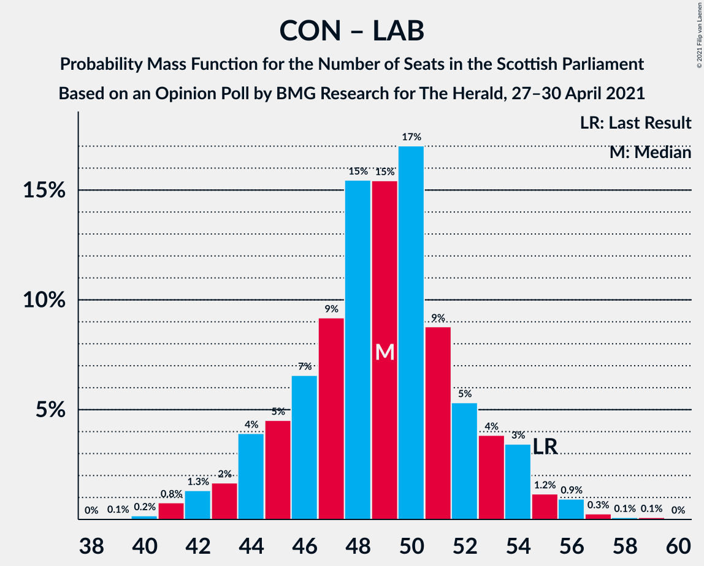

| Number of Seats | Probability | Accumulated | Special Marks |
|:---------------:|:-----------:|:-----------:|:-------------:|
| 39 | 0.1% | 100% |  |
| 40 | 0.2% | 99.9% |  |
| 41 | 0.8% | 99.8% |  |
| 42 | 1.3% | 99.0% |  |
| 43 | 2% | 98% |  |
| 44 | 4% | 96% |  |
| 45 | 5% | 92% |  |
| 46 | 7% | 88% |  |
| 47 | 9% | 81% |  |
| 48 | 15% | 72% |  |
| 49 | 15% | 56% | Median |
| 50 | 17% | 41% |  |
| 51 | 9% | 24% |  |
| 52 | 5% | 15% |  |
| 53 | 4% | 10% |  |
| 54 | 3% | 6% |  |
| 55 | 1.2% | 3% | Last Result |
| 56 | 0.9% | 1.4% |  |
| 57 | 0.3% | 0.5% |  |
| 58 | 0.1% | 0.2% |  |
| 59 | 0.1% | 0.1% |  |
| 60 | 0% | 0% |  |

### Scottish Labour – Scottish Greens – Scottish Liberal Democrats

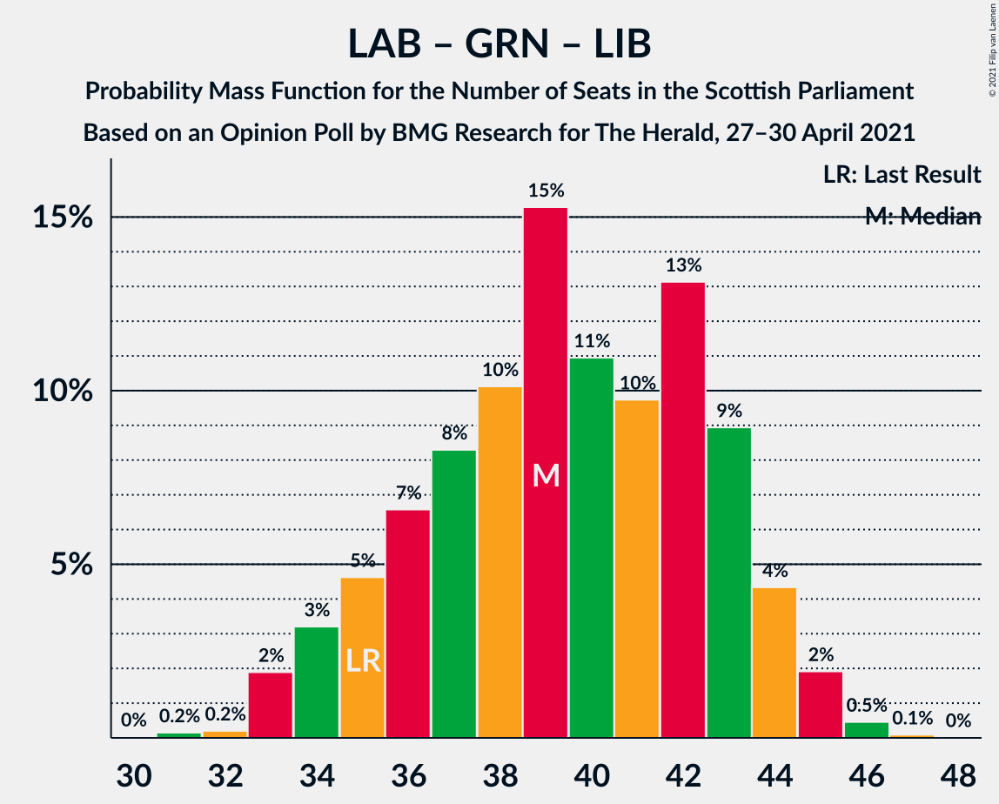

| Number of Seats | Probability | Accumulated | Special Marks |
|:---------------:|:-----------:|:-----------:|:-------------:|
| 31 | 0.2% | 100% |  |
| 32 | 0.2% | 99.8% |  |
| 33 | 2% | 99.6% |  |
| 34 | 3% | 98% |  |
| 35 | 5% | 95% | Last Result |
| 36 | 7% | 90% |  |
| 37 | 8% | 83% |  |
| 38 | 10% | 75% |  |
| 39 | 15% | 65% | Median |
| 40 | 11% | 50% |  |
| 41 | 10% | 39% |  |
| 42 | 13% | 29% |  |
| 43 | 9% | 16% |  |
| 44 | 4% | 7% |  |
| 45 | 2% | 2% |  |
| 46 | 0.5% | 0.6% |  |
| 47 | 0.1% | 0.1% |  |
| 48 | 0% | 0% |  |

### Scottish Conservative & Unionist Party – Scottish Liberal Democrats

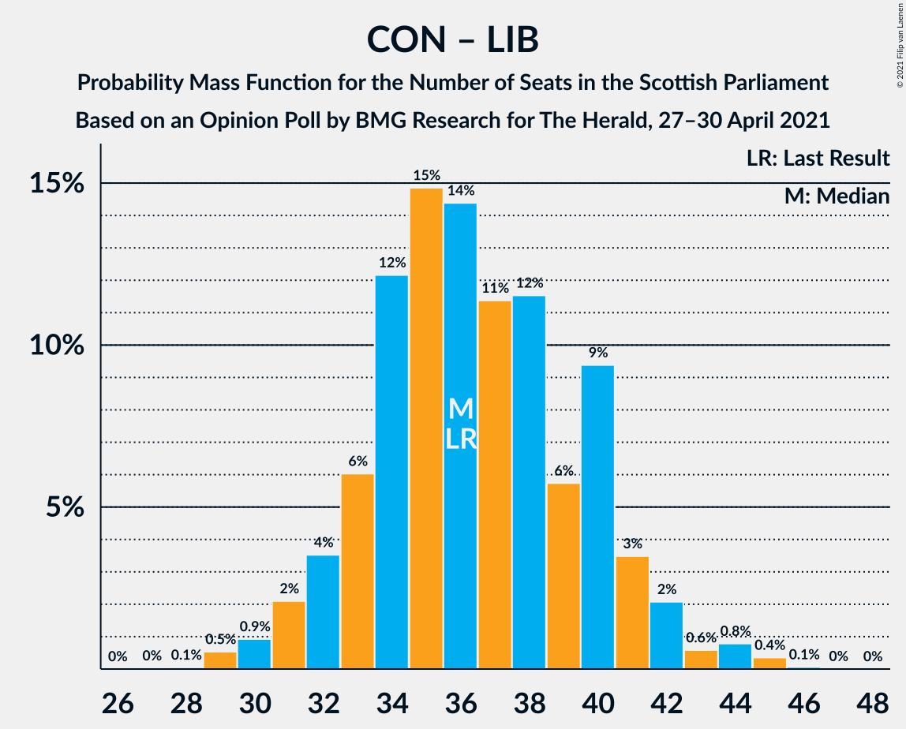

| Number of Seats | Probability | Accumulated | Special Marks |
|:---------------:|:-----------:|:-----------:|:-------------:|
| 28 | 0.1% | 100% |  |
| 29 | 0.5% | 99.9% |  |
| 30 | 0.9% | 99.4% |  |
| 31 | 2% | 98% |  |
| 32 | 4% | 96% |  |
| 33 | 6% | 93% |  |
| 34 | 12% | 87% |  |
| 35 | 15% | 75% |  |
| 36 | 14% | 60% | Last Result, Median |
| 37 | 11% | 45% |  |
| 38 | 12% | 34% |  |
| 39 | 6% | 22% |  |
| 40 | 9% | 17% |  |
| 41 | 3% | 7% |  |
| 42 | 2% | 4% |  |
| 43 | 0.6% | 2% |  |
| 44 | 0.8% | 1.2% |  |
| 45 | 0.4% | 0.4% |  |
| 46 | 0.1% | 0.1% |  |
| 47 | 0% | 0% |  |

### Scottish Labour – Scottish Liberal Democrats

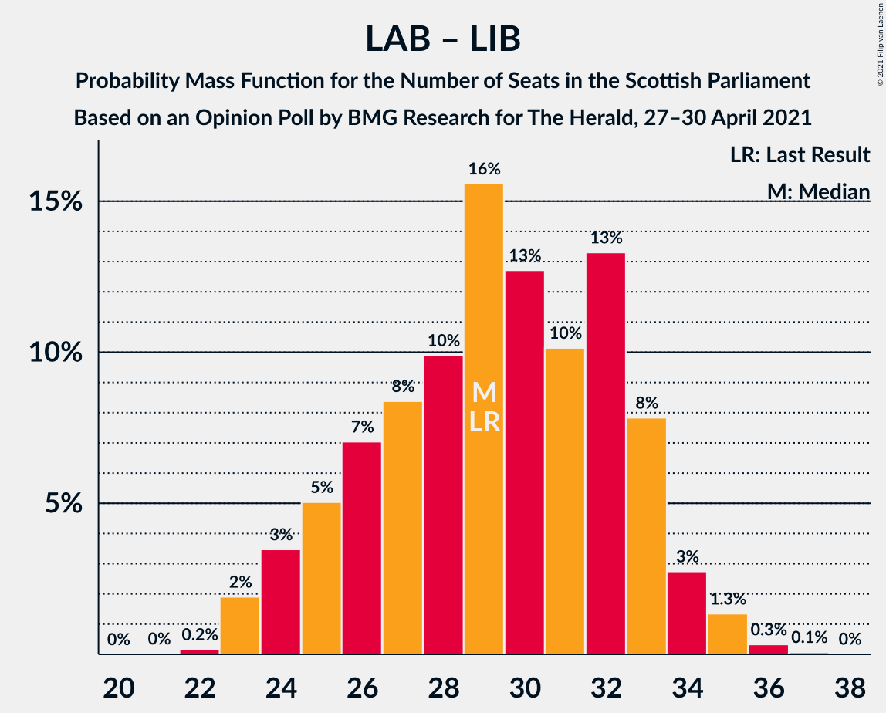

| Number of Seats | Probability | Accumulated | Special Marks |
|:---------------:|:-----------:|:-----------:|:-------------:|
| 22 | 0.2% | 100% |  |
| 23 | 2% | 99.8% |  |
| 24 | 3% | 98% |  |
| 25 | 5% | 94% |  |
| 26 | 7% | 89% |  |
| 27 | 8% | 82% |  |
| 28 | 10% | 74% |  |
| 29 | 16% | 64% | Last Result, Median |
| 30 | 13% | 49% |  |
| 31 | 10% | 36% |  |
| 32 | 13% | 26% |  |
| 33 | 8% | 12% |  |
| 34 | 3% | 5% |  |
| 35 | 1.3% | 2% |  |
| 36 | 0.3% | 0.4% |  |
| 37 | 0.1% | 0.1% |  |
| 38 | 0% | 0% |  |

## Technical Information

### Opinion Poll

+ **Polling firm:** BMG Research
+ **Commissioner(s):** The Herald
+ **Fieldwork period:** 27–30 April 2021

### Calculations

+ **Sample size:** 1000
+ **Simulations done:** 1,048,576
+ **Error estimate:** 0.82%

