# Opinion Poll by Panelbase for The Sunday Times, 28–30 April 2021

<a href="#voting-intentions">Voting Intentions</a> | <a href="#seats">Seats</a> | <a href="#coalitions">Coalitions</a> | <a href="#technical-information">Technical Information</a>

## Voting Intentions

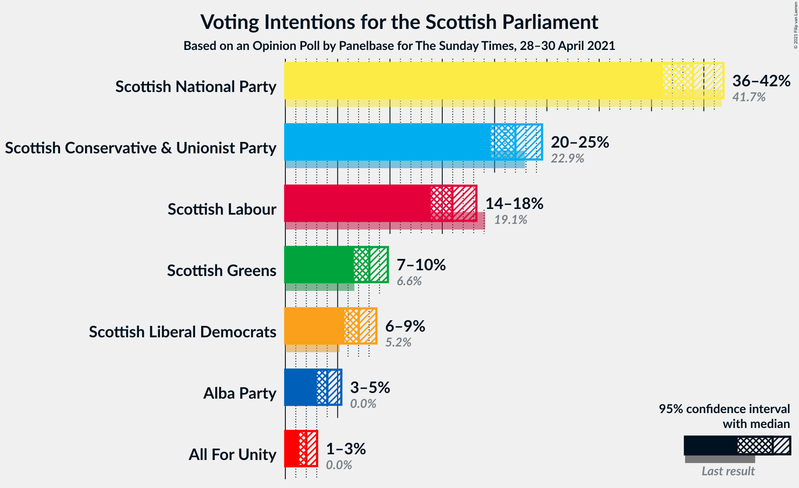

### Confidence Intervals

| Party | Last Result | Poll Result | 80% Confidence Interval | 90% Confidence Interval | 95% Confidence Interval | 99% Confidence Interval |
|:-----:|:-----------:|:-----------:|:-----------------------:|:-----------------------:|:-----------------------:|:-----------------------:|
| Scottish National Party | 41.7% | 39.0% | 37.1–40.9% |36.6–41.4% |36.1–41.9% |35.2–42.8% |
| Scottish Conservative & Unionist Party | 22.9% | 22.0% | 20.4–23.7% |20.0–24.1% |19.6–24.5% |18.9–25.4% |
| Scottish Labour | 19.1% | 16.0% | 14.6–17.5% |14.2–17.9% |13.9–18.3% |13.3–19.0% |
| Scottish Greens | 6.6% | 8.0% | 7.1–9.2% |6.8–9.5% |6.6–9.8% |6.1–10.4% |
| Scottish Liberal Democrats | 5.2% | 7.0% | 6.1–8.1% |5.9–8.4% |5.7–8.7% |5.2–9.3% |
| Alba Party | 0.0% | 4.0% | 3.3–4.9% |3.2–5.1% |3.0–5.3% |2.7–5.8% |
| All For Unity | 0.0% | 2.0% | 1.6–2.7% |1.4–2.9% |1.3–3.0% |1.1–3.4% |

*Note:* The poll result column reflects the actual value used in the calculations. Published results may vary slightly, and in addition be rounded to fewer digits.

## Seats

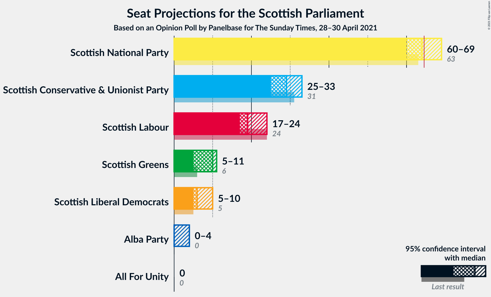

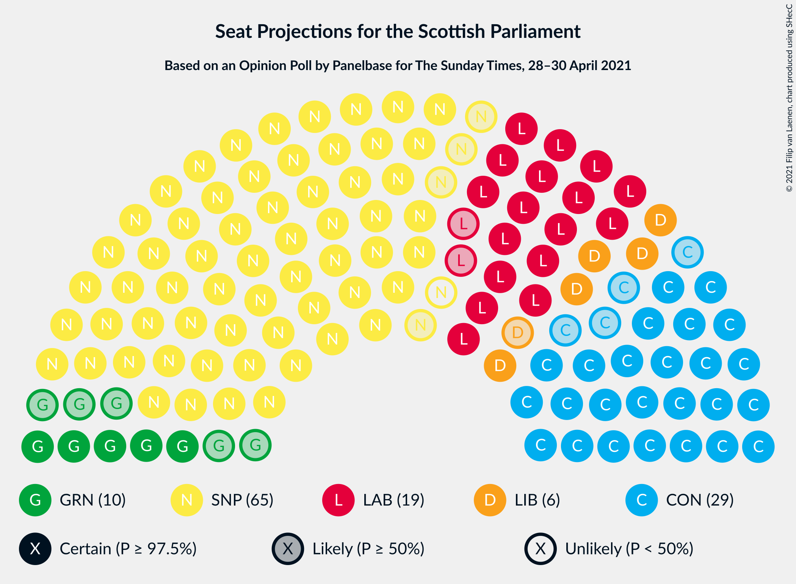

### Confidence Intervals

| Party | Last Result | Median | 80% Confidence Interval | 90% Confidence Interval | 95% Confidence Interval | 99% Confidence Interval |
|:-----:|:-----------:|:------:|:-----------------------:|:-----------------------:|:-----------------------:|:-----------------------:|
| <a href="#scottish-national-party">Scottish National Party</a> | 63 | 64 | 61–67 |60–68 |60–69 |58–70 |
| <a href="#scottish-conservative-&-unionist-party">Scottish Conservative & Unionist Party</a> | 31 | 29 | 26–32 |25–33 |25–33 |23–34 |
| <a href="#scottish-labour">Scottish Labour</a> | 24 | 19 | 17–22 |17–23 |17–24 |16–25 |
| <a href="#scottish-greens">Scottish Greens</a> | 6 | 10 | 7–10 |6–10 |5–11 |4–12 |
| <a href="#scottish-liberal-democrats">Scottish Liberal Democrats</a> | 5 | 6 | 5–8 |5–9 |5–10 |5–11 |
| <a href="#alba-party">Alba Party</a> | 0 | 0 | 0–2 |0–3 |0–4 |0–6 |
| <a href="#all-for-unity">All For Unity</a> | 0 | 0 | 0 |0 |0 |0 |

### Scottish National Party

*For a full overview of the results for this party, see the [Scottish National Party](party-scottishnationalparty.html) page.*

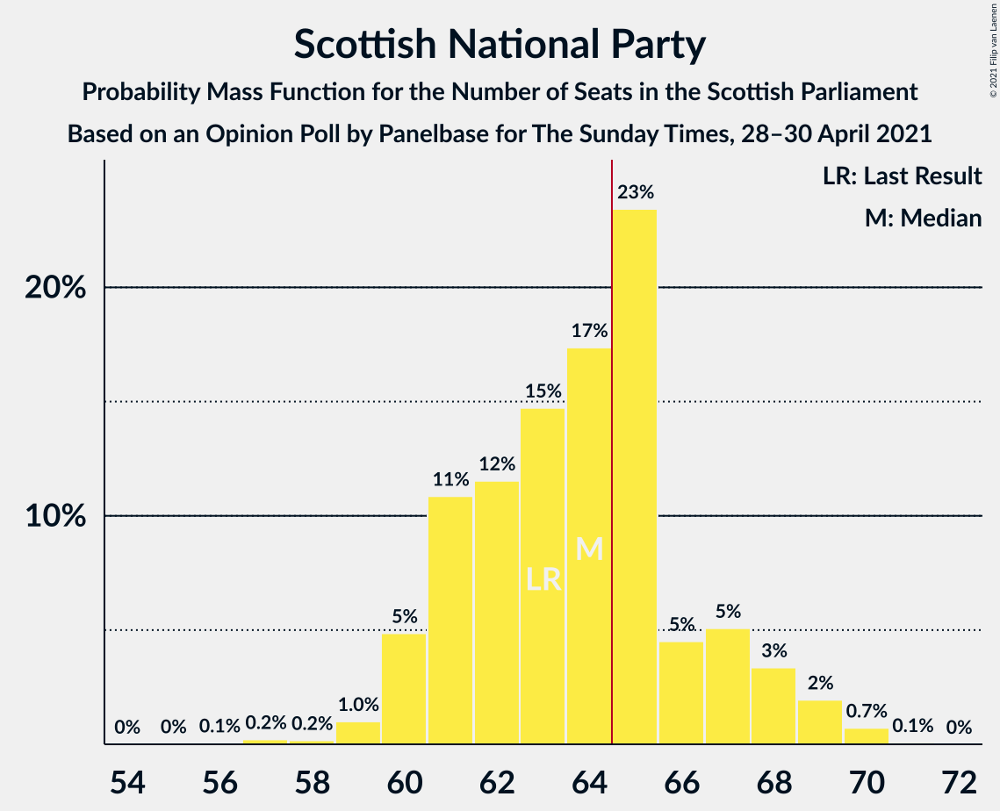

| Number of Seats | Probability | Accumulated | Special Marks |
|:---------------:|:-----------:|:-----------:|:-------------:|
| 56 | 0.1% | 100% |  |
| 57 | 0.2% | 99.9% |  |
| 58 | 0.2% | 99.7% |  |
| 59 | 1.0% | 99.5% |  |
| 60 | 5% | 98% |  |
| 61 | 11% | 94% |  |
| 62 | 12% | 83% |  |
| 63 | 15% | 71% | Last Result |
| 64 | 17% | 57% | Median |
| 65 | 23% | 39% | Majority |
| 66 | 5% | 16% |  |
| 67 | 5% | 11% |  |
| 68 | 3% | 6% |  |
| 69 | 2% | 3% |  |
| 70 | 0.7% | 0.8% |  |
| 71 | 0.1% | 0.1% |  |
| 72 | 0% | 0% |  |

### Scottish Conservative & Unionist Party

*For a full overview of the results for this party, see the [Scottish Conservative & Unionist Party](party-scottishconservativeunionistparty.html) page.*

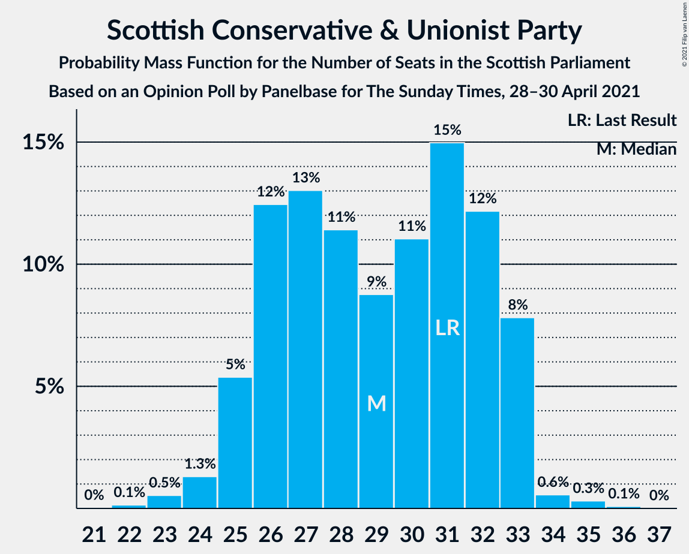

| Number of Seats | Probability | Accumulated | Special Marks |
|:---------------:|:-----------:|:-----------:|:-------------:|
| 22 | 0.1% | 100% |  |
| 23 | 0.5% | 99.8% |  |
| 24 | 1.3% | 99.3% |  |
| 25 | 5% | 98% |  |
| 26 | 12% | 93% |  |
| 27 | 13% | 80% |  |
| 28 | 11% | 67% |  |
| 29 | 9% | 56% | Median |
| 30 | 11% | 47% |  |
| 31 | 15% | 36% | Last Result |
| 32 | 12% | 21% |  |
| 33 | 8% | 9% |  |
| 34 | 0.6% | 1.0% |  |
| 35 | 0.3% | 0.4% |  |
| 36 | 0.1% | 0.1% |  |
| 37 | 0% | 0% |  |

### Scottish Labour

*For a full overview of the results for this party, see the [Scottish Labour](party-scottishlabour.html) page.*

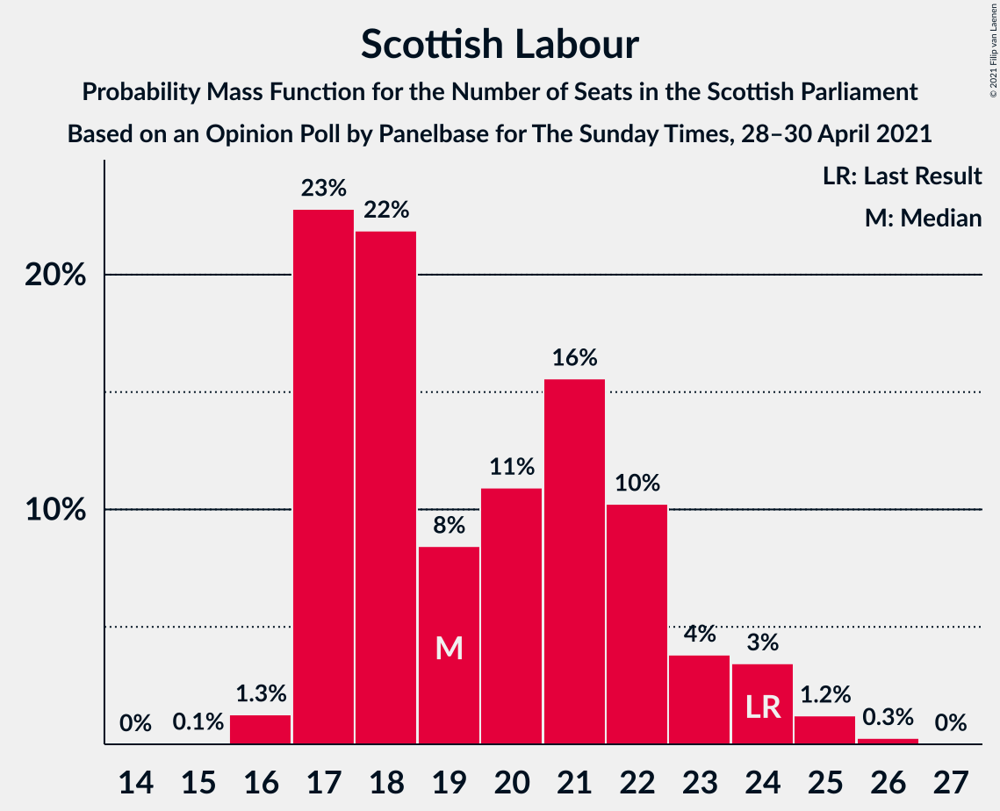

| Number of Seats | Probability | Accumulated | Special Marks |
|:---------------:|:-----------:|:-----------:|:-------------:|
| 15 | 0.1% | 100% |  |
| 16 | 1.3% | 99.9% |  |
| 17 | 23% | 98.7% |  |
| 18 | 22% | 76% |  |
| 19 | 8% | 54% | Median |
| 20 | 11% | 46% |  |
| 21 | 16% | 35% |  |
| 22 | 10% | 19% |  |
| 23 | 4% | 9% |  |
| 24 | 3% | 5% | Last Result |
| 25 | 1.2% | 2% |  |
| 26 | 0.3% | 0.3% |  |
| 27 | 0% | 0% |  |

### Scottish Greens

*For a full overview of the results for this party, see the [Scottish Greens](party-scottishgreens.html) page.*

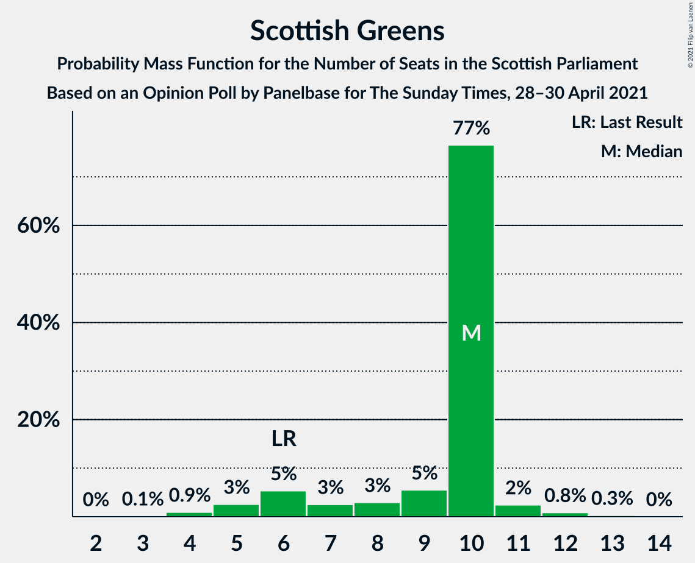

| Number of Seats | Probability | Accumulated | Special Marks |
|:---------------:|:-----------:|:-----------:|:-------------:|
| 3 | 0.1% | 100% |  |
| 4 | 0.9% | 99.9% |  |
| 5 | 3% | 98.9% |  |
| 6 | 5% | 96% | Last Result |
| 7 | 3% | 91% |  |
| 8 | 3% | 89% |  |
| 9 | 5% | 86% |  |
| 10 | 77% | 80% | Median |
| 11 | 2% | 4% |  |
| 12 | 0.8% | 1.1% |  |
| 13 | 0.3% | 0.3% |  |
| 14 | 0% | 0% |  |

### Scottish Liberal Democrats

*For a full overview of the results for this party, see the [Scottish Liberal Democrats](party-scottishliberaldemocrats.html) page.*

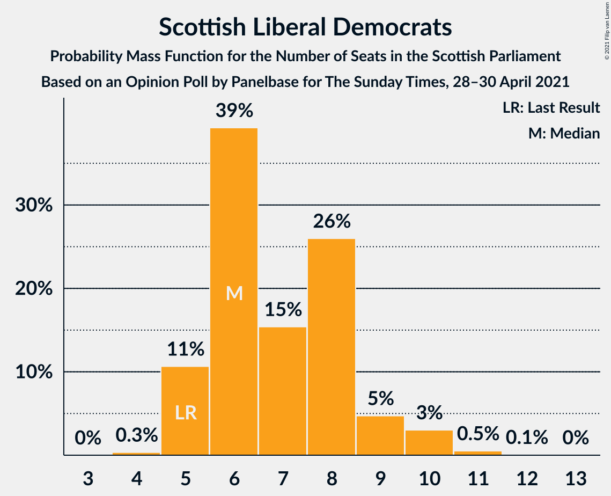

| Number of Seats | Probability | Accumulated | Special Marks |
|:---------------:|:-----------:|:-----------:|:-------------:|
| 4 | 0.3% | 100% |  |
| 5 | 11% | 99.7% | Last Result |
| 6 | 39% | 89% | Median |
| 7 | 15% | 50% |  |
| 8 | 26% | 34% |  |
| 9 | 5% | 8% |  |
| 10 | 3% | 4% |  |
| 11 | 0.5% | 0.6% |  |
| 12 | 0.1% | 0.1% |  |
| 13 | 0% | 0% |  |

### Alba Party

*For a full overview of the results for this party, see the [Alba Party](party-albaparty.html) page.*

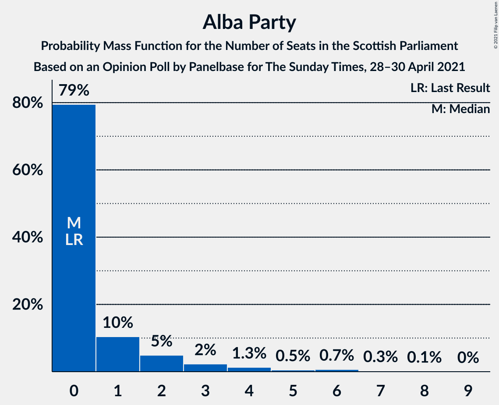

| Number of Seats | Probability | Accumulated | Special Marks |
|:---------------:|:-----------:|:-----------:|:-------------:|
| 0 | 79% | 100% | Last Result, Median |
| 1 | 10% | 21% |  |
| 2 | 5% | 10% |  |
| 3 | 2% | 5% |  |
| 4 | 1.3% | 3% |  |
| 5 | 0.5% | 2% |  |
| 6 | 0.7% | 1.0% |  |
| 7 | 0.3% | 0.4% |  |
| 8 | 0.1% | 0.1% |  |
| 9 | 0% | 0% |  |

### All For Unity

*For a full overview of the results for this party, see the [All For Unity](party-allforunity.html) page.*

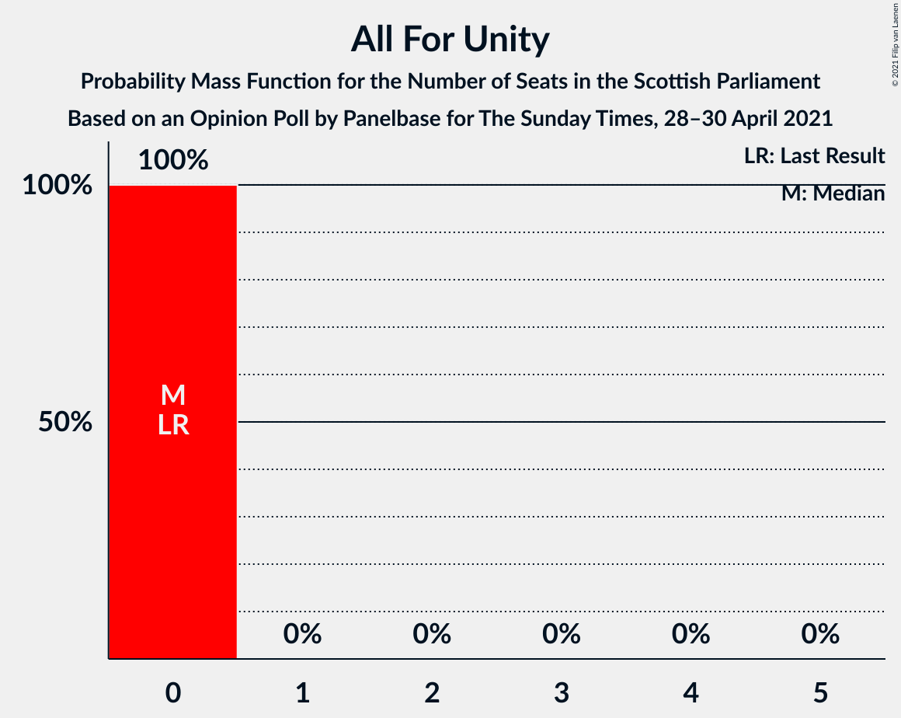

| Number of Seats | Probability | Accumulated | Special Marks |
|:---------------:|:-----------:|:-----------:|:-------------:|
| 0 | 100% | 100% | Last Result, Median |

## Coalitions

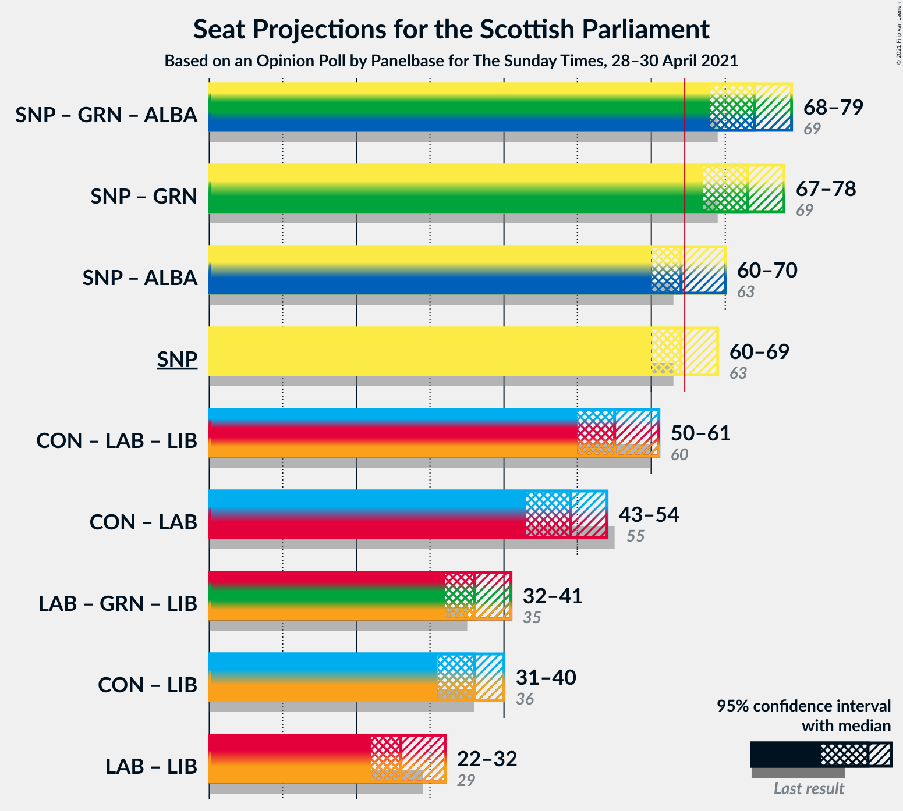

### Confidence Intervals

| Coalition | Last Result | Median | Majority? | 80% Confidence Interval | 90% Confidence Interval | 95% Confidence Interval | 99% Confidence Interval |
|:---------:|:-----------:|:------:|:---------:|:-----------------------:|:-----------------------:|:-----------------------:|:-----------------------:|
| Scottish National Party – Scottish Greens – Alba Party | 69 | 74 | 99.9% | 70–77 | 69–78 | 68–79 | 66–81 |
| Scottish National Party – Scottish Greens | 69 | 73 | 99.9% | 70–76 | 69–78 | 67–78 | 66–80 |
| Scottish National Party – Alba Party | 63 | 64 | 45% | 61–68 | 60–69 | 60–70 | 59–71 |
| Scottish National Party | 63 | 64 | 39% | 61–67 | 60–68 | 60–69 | 58–70 |
| Scottish Conservative & Unionist Party – Scottish Labour – Scottish Liberal Democrats | 60 | 55 | 0.1% | 52–59 | 51–60 | 50–61 | 48–63 |
| Scottish Conservative & Unionist Party – Scottish Labour | 55 | 49 | 0% | 45–52 | 44–53 | 43–54 | 42–56 |
| Scottish Labour – Scottish Greens – Scottish Liberal Democrats | 35 | 36 | 0% | 33–39 | 32–40 | 32–41 | 30–43 |
| Scottish Conservative & Unionist Party – Scottish Liberal Democrats | 36 | 36 | 0% | 33–39 | 32–40 | 31–40 | 30–41 |
| Scottish Labour – Scottish Liberal Democrats | 29 | 26 | 0% | 23–30 | 23–31 | 22–32 | 22–33 |

### Scottish National Party – Scottish Greens – Alba Party

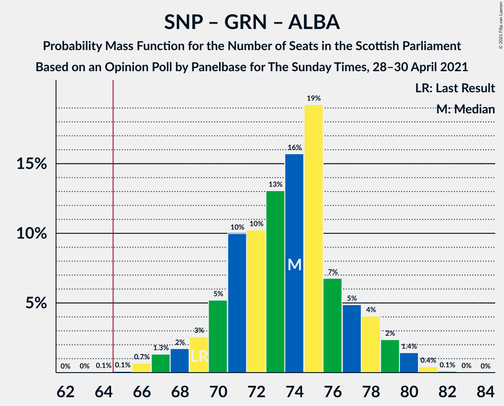

| Number of Seats | Probability | Accumulated | Special Marks |
|:---------------:|:-----------:|:-----------:|:-------------:|
| 64 | 0.1% | 100% |  |
| 65 | 0.1% | 99.9% | Majority |
| 66 | 0.7% | 99.8% |  |
| 67 | 1.3% | 99.2% |  |
| 68 | 2% | 98% |  |
| 69 | 3% | 96% | Last Result |
| 70 | 5% | 94% |  |
| 71 | 10% | 88% |  |
| 72 | 10% | 78% |  |
| 73 | 13% | 68% |  |
| 74 | 16% | 55% | Median |
| 75 | 19% | 39% |  |
| 76 | 7% | 20% |  |
| 77 | 5% | 13% |  |
| 78 | 4% | 8% |  |
| 79 | 2% | 4% |  |
| 80 | 1.4% | 2% |  |
| 81 | 0.4% | 0.6% |  |
| 82 | 0.1% | 0.2% |  |
| 83 | 0% | 0.1% |  |
| 84 | 0% | 0% |  |

### Scottish National Party – Scottish Greens

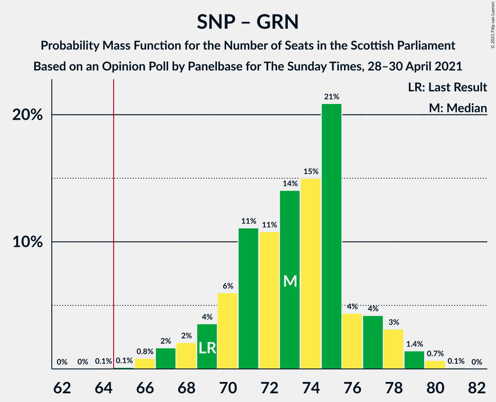

| Number of Seats | Probability | Accumulated | Special Marks |
|:---------------:|:-----------:|:-----------:|:-------------:|
| 64 | 0.1% | 100% |  |
| 65 | 0.1% | 99.9% | Majority |
| 66 | 0.8% | 99.8% |  |
| 67 | 2% | 98.9% |  |
| 68 | 2% | 97% |  |
| 69 | 4% | 95% | Last Result |
| 70 | 6% | 92% |  |
| 71 | 11% | 86% |  |
| 72 | 11% | 75% |  |
| 73 | 14% | 64% |  |
| 74 | 15% | 50% | Median |
| 75 | 21% | 35% |  |
| 76 | 4% | 14% |  |
| 77 | 4% | 9% |  |
| 78 | 3% | 5% |  |
| 79 | 1.4% | 2% |  |
| 80 | 0.7% | 0.7% |  |
| 81 | 0.1% | 0.1% |  |
| 82 | 0% | 0% |  |

### Scottish National Party – Alba Party

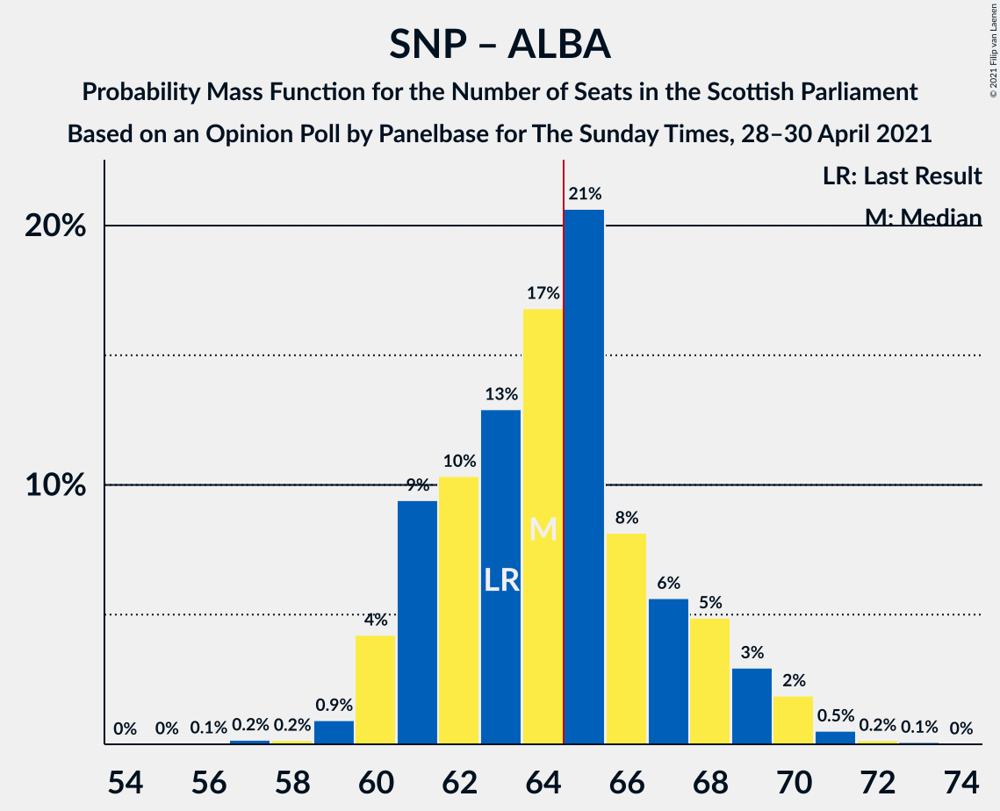

| Number of Seats | Probability | Accumulated | Special Marks |
|:---------------:|:-----------:|:-----------:|:-------------:|
| 56 | 0.1% | 100% |  |
| 57 | 0.2% | 99.9% |  |
| 58 | 0.2% | 99.7% |  |
| 59 | 0.9% | 99.6% |  |
| 60 | 4% | 98.6% |  |
| 61 | 9% | 94% |  |
| 62 | 10% | 85% |  |
| 63 | 13% | 75% | Last Result |
| 64 | 17% | 62% | Median |
| 65 | 21% | 45% | Majority |
| 66 | 8% | 24% |  |
| 67 | 6% | 16% |  |
| 68 | 5% | 11% |  |
| 69 | 3% | 6% |  |
| 70 | 2% | 3% |  |
| 71 | 0.5% | 0.8% |  |
| 72 | 0.2% | 0.3% |  |
| 73 | 0.1% | 0.1% |  |
| 74 | 0% | 0% |  |

### Scottish National Party

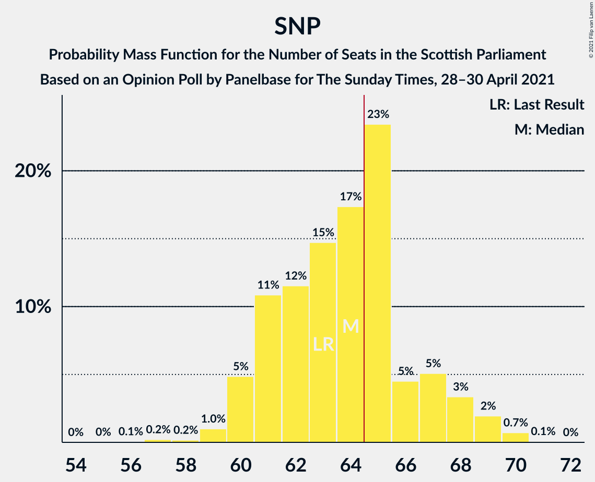

| Number of Seats | Probability | Accumulated | Special Marks |
|:---------------:|:-----------:|:-----------:|:-------------:|
| 56 | 0.1% | 100% |  |
| 57 | 0.2% | 99.9% |  |
| 58 | 0.2% | 99.7% |  |
| 59 | 1.0% | 99.5% |  |
| 60 | 5% | 98% |  |
| 61 | 11% | 94% |  |
| 62 | 12% | 83% |  |
| 63 | 15% | 71% | Last Result |
| 64 | 17% | 57% | Median |
| 65 | 23% | 39% | Majority |
| 66 | 5% | 16% |  |
| 67 | 5% | 11% |  |
| 68 | 3% | 6% |  |
| 69 | 2% | 3% |  |
| 70 | 0.7% | 0.8% |  |
| 71 | 0.1% | 0.1% |  |
| 72 | 0% | 0% |  |

### Scottish Conservative & Unionist Party – Scottish Labour – Scottish Liberal Democrats

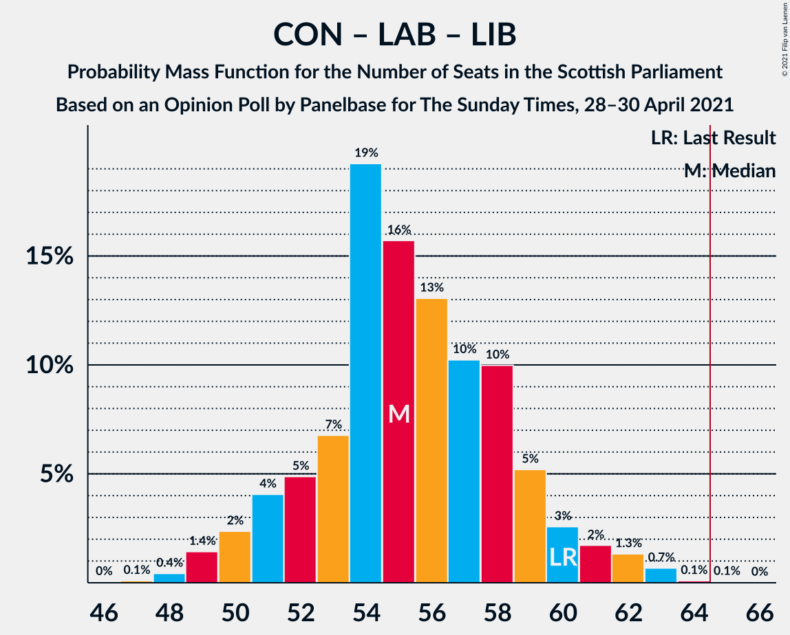

| Number of Seats | Probability | Accumulated | Special Marks |
|:---------------:|:-----------:|:-----------:|:-------------:|
| 46 | 0% | 100% |  |
| 47 | 0.1% | 99.9% |  |
| 48 | 0.4% | 99.8% |  |
| 49 | 1.4% | 99.4% |  |
| 50 | 2% | 98% |  |
| 51 | 4% | 96% |  |
| 52 | 5% | 92% |  |
| 53 | 7% | 87% |  |
| 54 | 19% | 80% | Median |
| 55 | 16% | 61% |  |
| 56 | 13% | 45% |  |
| 57 | 10% | 32% |  |
| 58 | 10% | 22% |  |
| 59 | 5% | 12% |  |
| 60 | 3% | 6% | Last Result |
| 61 | 2% | 4% |  |
| 62 | 1.3% | 2% |  |
| 63 | 0.7% | 0.8% |  |
| 64 | 0.1% | 0.2% |  |
| 65 | 0.1% | 0.1% | Majority |
| 66 | 0% | 0% |  |

### Scottish Conservative & Unionist Party – Scottish Labour

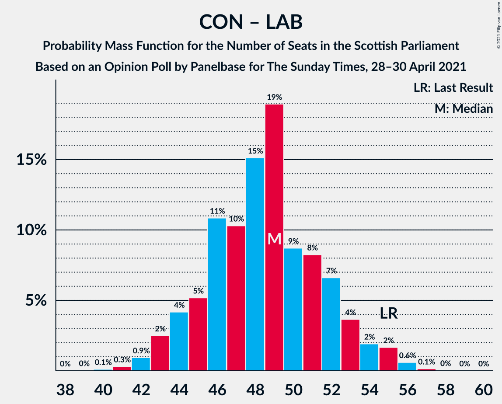

| Number of Seats | Probability | Accumulated | Special Marks |
|:---------------:|:-----------:|:-----------:|:-------------:|
| 40 | 0.1% | 100% |  |
| 41 | 0.3% | 99.9% |  |
| 42 | 0.9% | 99.6% |  |
| 43 | 2% | 98.6% |  |
| 44 | 4% | 96% |  |
| 45 | 5% | 92% |  |
| 46 | 11% | 87% |  |
| 47 | 10% | 76% |  |
| 48 | 15% | 66% | Median |
| 49 | 19% | 51% |  |
| 50 | 9% | 32% |  |
| 51 | 8% | 23% |  |
| 52 | 7% | 15% |  |
| 53 | 4% | 8% |  |
| 54 | 2% | 4% |  |
| 55 | 2% | 2% | Last Result |
| 56 | 0.6% | 0.8% |  |
| 57 | 0.1% | 0.2% |  |
| 58 | 0% | 0.1% |  |
| 59 | 0% | 0% |  |

### Scottish Labour – Scottish Greens – Scottish Liberal Democrats

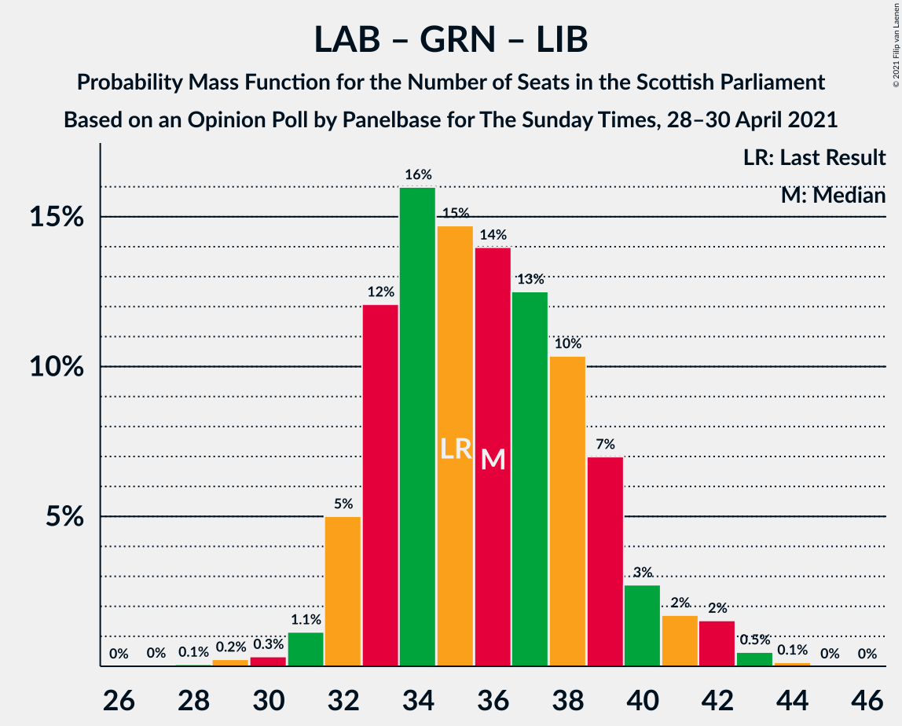

| Number of Seats | Probability | Accumulated | Special Marks |
|:---------------:|:-----------:|:-----------:|:-------------:|
| 28 | 0.1% | 100% |  |
| 29 | 0.2% | 99.9% |  |
| 30 | 0.3% | 99.7% |  |
| 31 | 1.1% | 99.3% |  |
| 32 | 5% | 98% |  |
| 33 | 12% | 93% |  |
| 34 | 16% | 81% |  |
| 35 | 15% | 65% | Last Result, Median |
| 36 | 14% | 50% |  |
| 37 | 13% | 36% |  |
| 38 | 10% | 24% |  |
| 39 | 7% | 14% |  |
| 40 | 3% | 7% |  |
| 41 | 2% | 4% |  |
| 42 | 2% | 2% |  |
| 43 | 0.5% | 0.6% |  |
| 44 | 0.1% | 0.1% |  |
| 45 | 0% | 0% |  |

### Scottish Conservative & Unionist Party – Scottish Liberal Democrats

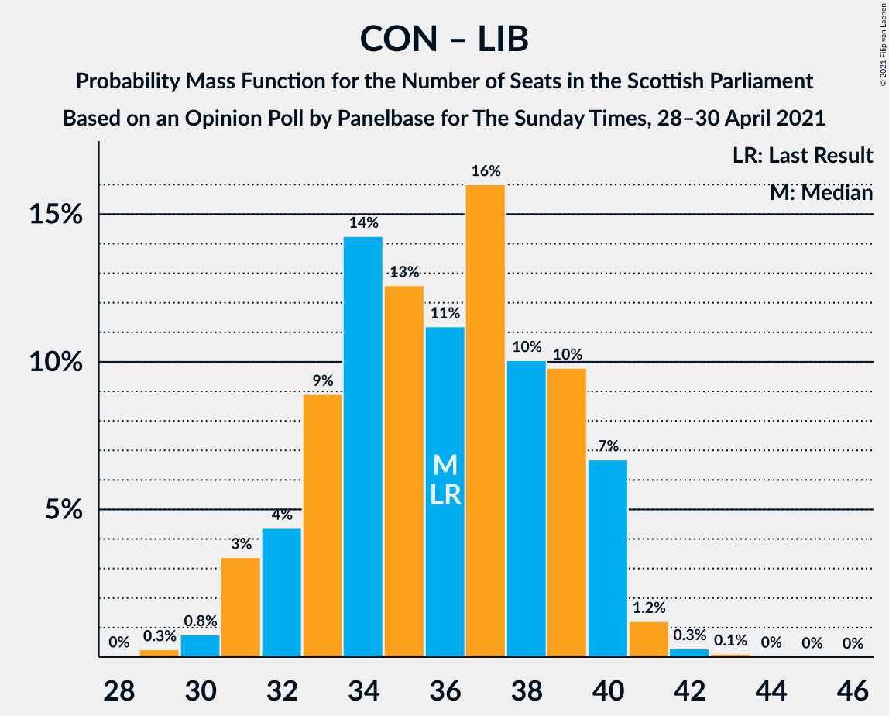

| Number of Seats | Probability | Accumulated | Special Marks |
|:---------------:|:-----------:|:-----------:|:-------------:|
| 28 | 0% | 100% |  |
| 29 | 0.3% | 99.9% |  |
| 30 | 0.8% | 99.7% |  |
| 31 | 3% | 98.9% |  |
| 32 | 4% | 96% |  |
| 33 | 9% | 91% |  |
| 34 | 14% | 82% |  |
| 35 | 13% | 68% | Median |
| 36 | 11% | 55% | Last Result |
| 37 | 16% | 44% |  |
| 38 | 10% | 28% |  |
| 39 | 10% | 18% |  |
| 40 | 7% | 8% |  |
| 41 | 1.2% | 2% |  |
| 42 | 0.3% | 0.5% |  |
| 43 | 0.1% | 0.2% |  |
| 44 | 0% | 0.1% |  |
| 45 | 0% | 0% |  |

### Scottish Labour – Scottish Liberal Democrats

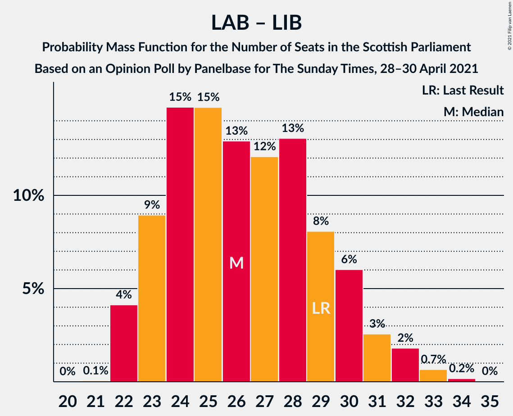

| Number of Seats | Probability | Accumulated | Special Marks |
|:---------------:|:-----------:|:-----------:|:-------------:|
| 21 | 0.1% | 100% |  |
| 22 | 4% | 99.9% |  |
| 23 | 9% | 96% |  |
| 24 | 15% | 87% |  |
| 25 | 15% | 72% | Median |
| 26 | 13% | 57% |  |
| 27 | 12% | 44% |  |
| 28 | 13% | 32% |  |
| 29 | 8% | 19% | Last Result |
| 30 | 6% | 11% |  |
| 31 | 3% | 5% |  |
| 32 | 2% | 3% |  |
| 33 | 0.7% | 0.9% |  |
| 34 | 0.2% | 0.2% |  |
| 35 | 0% | 0% |  |

## Technical Information

### Opinion Poll

+ **Polling firm:** Panelbase
+ **Commissioner(s):** The Sunday Times
+ **Fieldwork period:** 28–30 April 2021

### Calculations

+ **Sample size:** 1096
+ **Simulations done:** 1,048,576
+ **Error estimate:** 0.66%

