# Opinion Poll by Ipsos MORI for STV News, 3 May 2021

<a href="#voting-intentions">Voting Intentions</a> | <a href="#seats">Seats</a> | <a href="#coalitions">Coalitions</a> | <a href="#technical-information">Technical Information</a>

## Voting Intentions

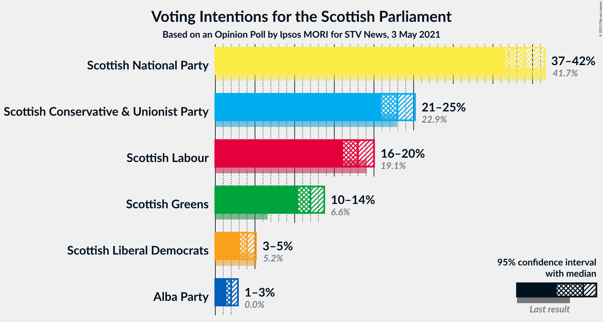

### Confidence Intervals

| Party | Last Result | Poll Result | 80% Confidence Interval | 90% Confidence Interval | 95% Confidence Interval | 99% Confidence Interval |
|:-----:|:-----------:|:-----------:|:-----------------------:|:-----------------------:|:-----------------------:|:-----------------------:|
| Scottish National Party | 41.7% | 39.0% | 37.4–40.6% |37.0–41.1% |36.6–41.5% |35.8–42.3% |
| Scottish Conservative & Unionist Party | 22.9% | 23.0% | 21.6–24.4% |21.2–24.8% |20.9–25.2% |20.3–25.9% |
| Scottish Labour | 19.1% | 18.0% | 16.8–19.3% |16.4–19.7% |16.1–20.0% |15.5–20.7% |
| Scottish Greens | 6.6% | 12.0% | 11.0–13.1% |10.7–13.4% |10.4–13.7% |10.0–14.3% |
| Scottish Liberal Democrats | 5.2% | 4.0% | 3.4–4.7% |3.2–4.9% |3.1–5.1% |2.9–5.5% |
| Alba Party | 0.0% | 2.0% | 1.6–2.5% |1.5–2.7% |1.4–2.9% |1.2–3.1% |

*Note:* The poll result column reflects the actual value used in the calculations. Published results may vary slightly, and in addition be rounded to fewer digits.

## Seats

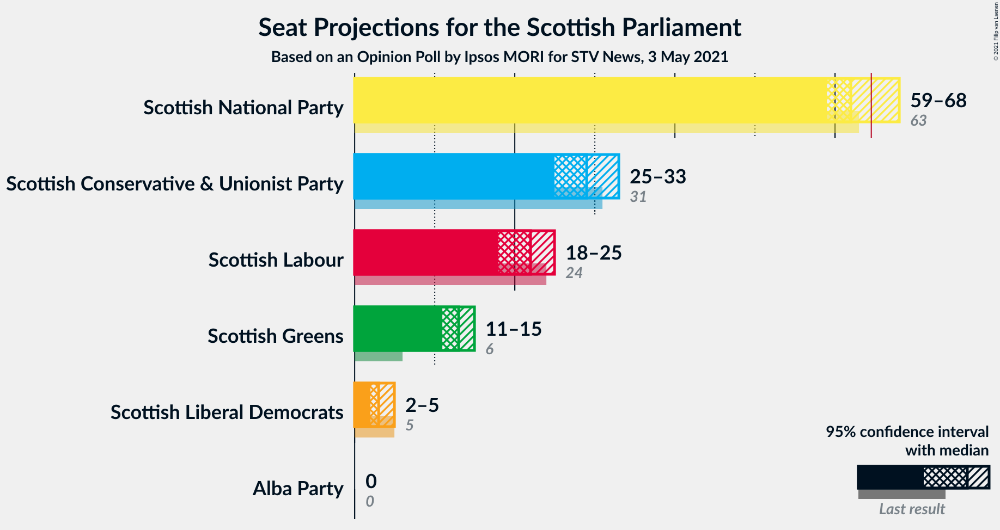

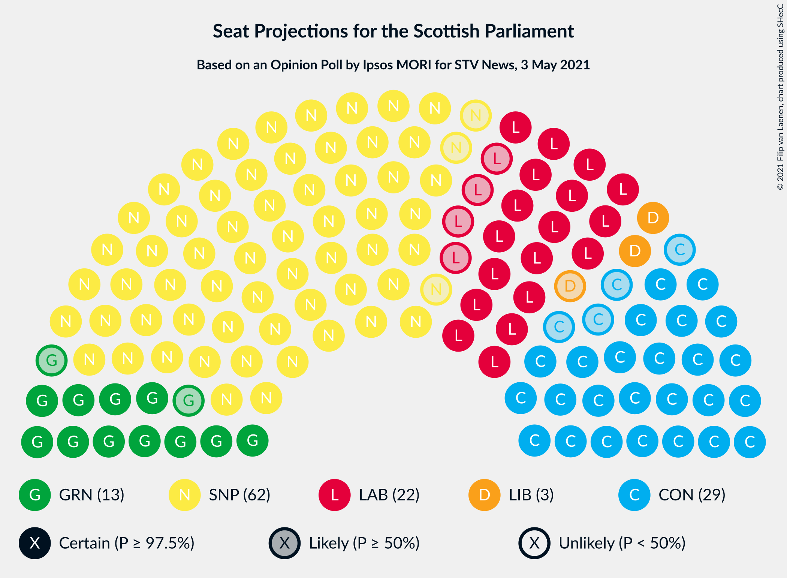

### Confidence Intervals

| Party | Last Result | Median | 80% Confidence Interval | 90% Confidence Interval | 95% Confidence Interval | 99% Confidence Interval |
|:-----:|:-----------:|:------:|:-----------------------:|:-----------------------:|:-----------------------:|:-----------------------:|
| <a href="#scottish-national-party">Scottish National Party</a> | 63 | 62 | 59–66 |59–67 |59–68 |56–69 |
| <a href="#scottish-conservative-&-unionist-party">Scottish Conservative & Unionist Party</a> | 31 | 29 | 26–31 |25–32 |25–33 |24–34 |
| <a href="#scottish-labour">Scottish Labour</a> | 24 | 22 | 19–24 |18–25 |18–25 |17–25 |
| <a href="#scottish-greens">Scottish Greens</a> | 6 | 13 | 11–14 |11–15 |11–15 |10–16 |
| <a href="#scottish-liberal-democrats">Scottish Liberal Democrats</a> | 5 | 3 | 2–4 |2–5 |2–5 |2–5 |
| <a href="#alba-party">Alba Party</a> | 0 | 0 | 0 |0 |0 |0 |

### Scottish National Party

*For a full overview of the results for this party, see the [Scottish National Party](party-scottishnationalparty.html) page.*

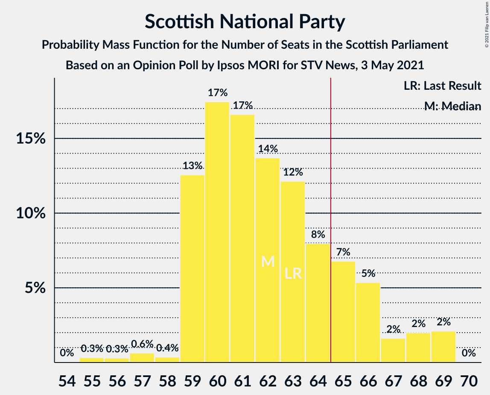

| Number of Seats | Probability | Accumulated | Special Marks |
|:---------------:|:-----------:|:-----------:|:-------------:|
| 55 | 0.3% | 100% |  |
| 56 | 0.3% | 99.6% |  |
| 57 | 0.6% | 99.3% |  |
| 58 | 0.4% | 98.7% |  |
| 59 | 13% | 98% |  |
| 60 | 17% | 86% |  |
| 61 | 17% | 68% |  |
| 62 | 14% | 52% | Median |
| 63 | 12% | 38% | Last Result |
| 64 | 8% | 26% |  |
| 65 | 7% | 18% | Majority |
| 66 | 5% | 11% |  |
| 67 | 2% | 6% |  |
| 68 | 2% | 4% |  |
| 69 | 2% | 2% |  |
| 70 | 0% | 0% |  |

### Scottish Conservative & Unionist Party

*For a full overview of the results for this party, see the [Scottish Conservative & Unionist Party](party-scottishconservativeunionistparty.html) page.*

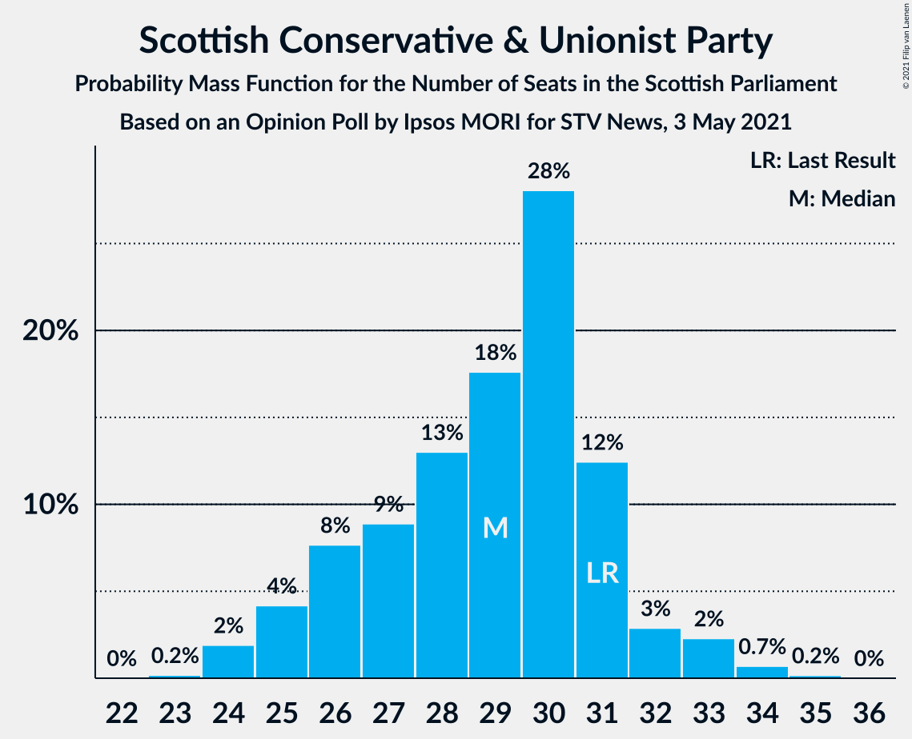

| Number of Seats | Probability | Accumulated | Special Marks |
|:---------------:|:-----------:|:-----------:|:-------------:|
| 23 | 0.2% | 100% |  |
| 24 | 2% | 99.8% |  |
| 25 | 4% | 98% |  |
| 26 | 8% | 94% |  |
| 27 | 9% | 86% |  |
| 28 | 13% | 77% |  |
| 29 | 18% | 64% | Median |
| 30 | 28% | 47% |  |
| 31 | 12% | 18% | Last Result |
| 32 | 3% | 6% |  |
| 33 | 2% | 3% |  |
| 34 | 0.7% | 0.9% |  |
| 35 | 0.2% | 0.2% |  |
| 36 | 0% | 0% |  |

### Scottish Labour

*For a full overview of the results for this party, see the [Scottish Labour](party-scottishlabour.html) page.*

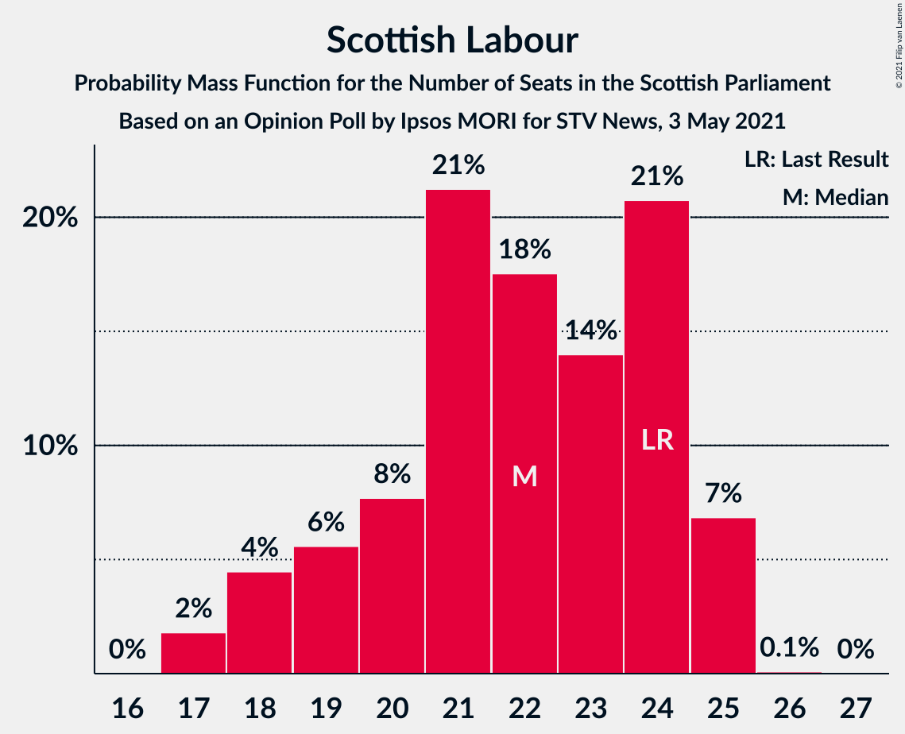

| Number of Seats | Probability | Accumulated | Special Marks |
|:---------------:|:-----------:|:-----------:|:-------------:|
| 17 | 2% | 100% |  |
| 18 | 4% | 98% |  |
| 19 | 6% | 94% |  |
| 20 | 8% | 88% |  |
| 21 | 21% | 80% |  |
| 22 | 18% | 59% | Median |
| 23 | 14% | 42% |  |
| 24 | 21% | 28% | Last Result |
| 25 | 7% | 7% |  |
| 26 | 0.1% | 0.1% |  |
| 27 | 0% | 0% |  |

### Scottish Greens

*For a full overview of the results for this party, see the [Scottish Greens](party-scottishgreens.html) page.*

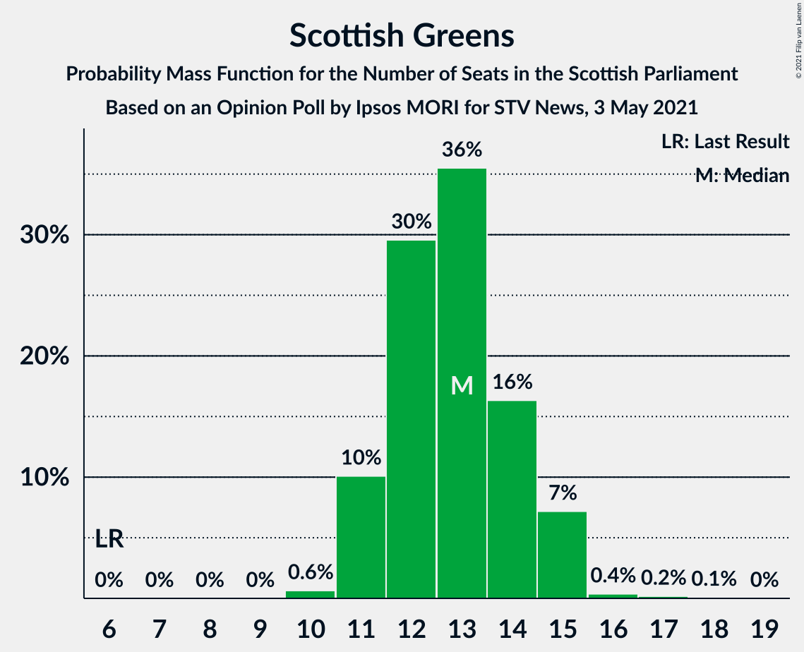

| Number of Seats | Probability | Accumulated | Special Marks |
|:---------------:|:-----------:|:-----------:|:-------------:|
| 6 | 0% | 100% | Last Result |
| 7 | 0% | 100% |  |
| 8 | 0% | 100% |  |
| 9 | 0% | 100% |  |
| 10 | 0.6% | 100% |  |
| 11 | 10% | 99.4% |  |
| 12 | 30% | 89% |  |
| 13 | 36% | 60% | Median |
| 14 | 16% | 24% |  |
| 15 | 7% | 8% |  |
| 16 | 0.4% | 0.7% |  |
| 17 | 0.2% | 0.3% |  |
| 18 | 0.1% | 0.1% |  |
| 19 | 0% | 0% |  |

### Scottish Liberal Democrats

*For a full overview of the results for this party, see the [Scottish Liberal Democrats](party-scottishliberaldemocrats.html) page.*

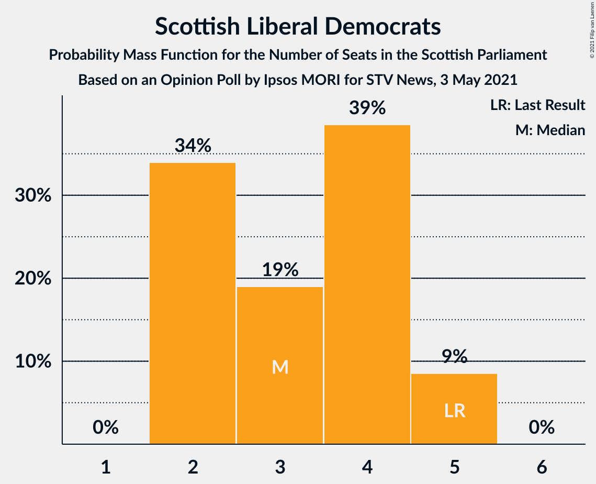

| Number of Seats | Probability | Accumulated | Special Marks |
|:---------------:|:-----------:|:-----------:|:-------------:|
| 2 | 34% | 100% |  |
| 3 | 19% | 66% | Median |
| 4 | 39% | 47% |  |
| 5 | 9% | 9% | Last Result |
| 6 | 0% | 0% |  |

### Alba Party

*For a full overview of the results for this party, see the [Alba Party](party-albaparty.html) page.*

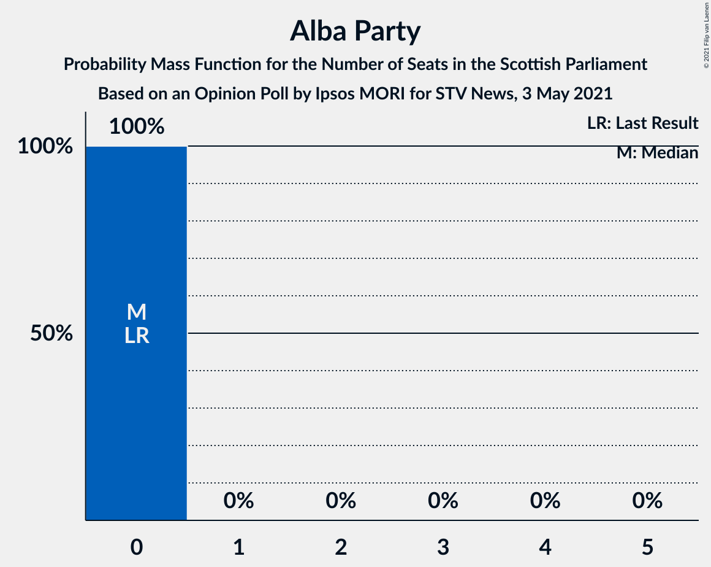

| Number of Seats | Probability | Accumulated | Special Marks |
|:---------------:|:-----------:|:-----------:|:-------------:|
| 0 | 100% | 100% | Last Result, Median |

## Coalitions

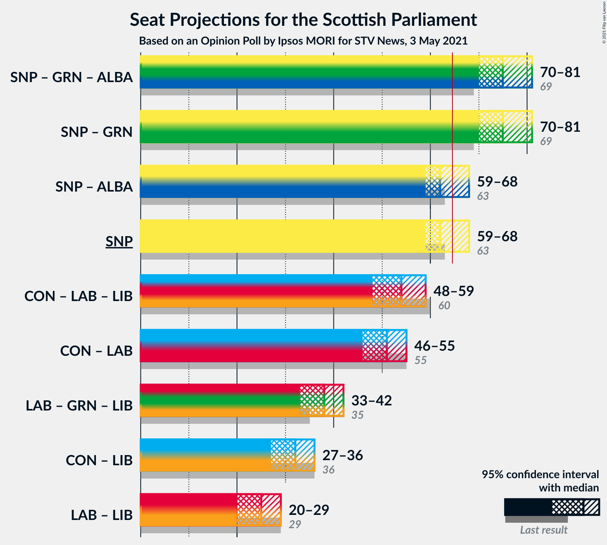

### Confidence Intervals

| Coalition | Last Result | Median | Majority? | 80% Confidence Interval | 90% Confidence Interval | 95% Confidence Interval | 99% Confidence Interval |
|:---------:|:-----------:|:------:|:---------:|:-----------------------:|:-----------------------:|:-----------------------:|:-----------------------:|
| Scottish National Party – Scottish Greens – Alba Party | 69 | 75 | 100% | 72–79 | 71–80 | 70–81 | 69–82 |
| Scottish National Party – Scottish Greens | 69 | 75 | 100% | 72–79 | 71–80 | 70–81 | 69–82 |
| Scottish National Party – Alba Party | 63 | 62 | 18% | 59–66 | 59–67 | 59–68 | 56–69 |
| Scottish National Party | 63 | 62 | 18% | 59–66 | 59–67 | 59–68 | 56–69 |
| Scottish Conservative & Unionist Party – Scottish Labour – Scottish Liberal Democrats | 60 | 54 | 0% | 50–57 | 49–58 | 48–59 | 47–60 |
| Scottish Conservative & Unionist Party – Scottish Labour | 55 | 51 | 0% | 48–54 | 47–54 | 46–55 | 44–56 |
| Scottish Labour – Scottish Greens – Scottish Liberal Democrats | 35 | 38 | 0% | 35–41 | 34–41 | 33–42 | 32–44 |
| Scottish Conservative & Unionist Party – Scottish Liberal Democrats | 36 | 32 | 0% | 29–35 | 28–36 | 27–36 | 26–38 |
| Scottish Labour – Scottish Liberal Democrats | 29 | 25 | 0% | 22–28 | 21–29 | 20–29 | 19–30 |

### Scottish National Party – Scottish Greens – Alba Party

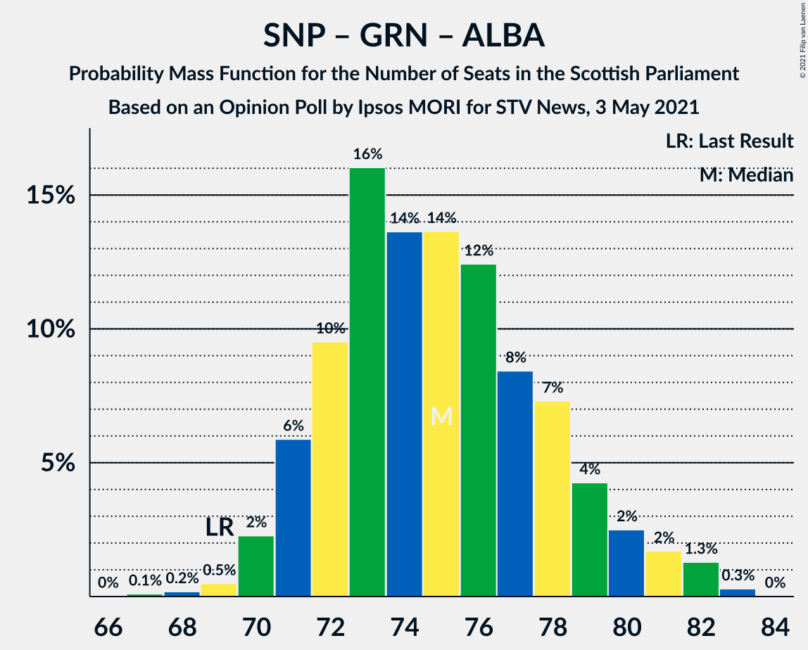

| Number of Seats | Probability | Accumulated | Special Marks |
|:---------------:|:-----------:|:-----------:|:-------------:|
| 67 | 0.1% | 100% |  |
| 68 | 0.2% | 99.9% |  |
| 69 | 0.5% | 99.7% | Last Result |
| 70 | 2% | 99.2% |  |
| 71 | 6% | 97% |  |
| 72 | 10% | 91% |  |
| 73 | 16% | 82% |  |
| 74 | 14% | 65% |  |
| 75 | 14% | 52% | Median |
| 76 | 12% | 38% |  |
| 77 | 8% | 26% |  |
| 78 | 7% | 17% |  |
| 79 | 4% | 10% |  |
| 80 | 2% | 6% |  |
| 81 | 2% | 3% |  |
| 82 | 1.3% | 2% |  |
| 83 | 0.3% | 0.3% |  |
| 84 | 0% | 0% |  |

### Scottish National Party – Scottish Greens

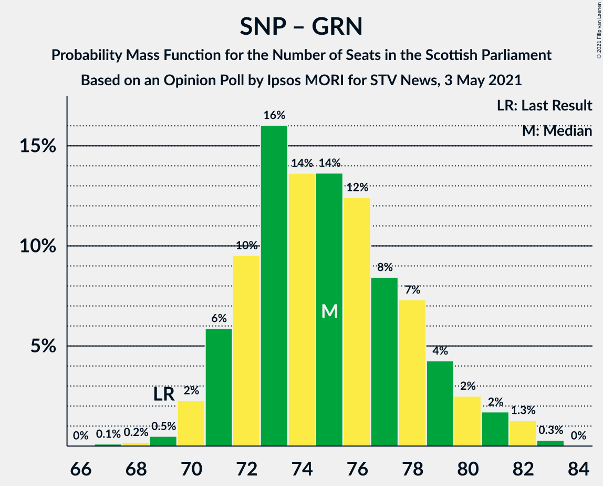

| Number of Seats | Probability | Accumulated | Special Marks |
|:---------------:|:-----------:|:-----------:|:-------------:|
| 67 | 0.1% | 100% |  |
| 68 | 0.2% | 99.9% |  |
| 69 | 0.5% | 99.7% | Last Result |
| 70 | 2% | 99.2% |  |
| 71 | 6% | 97% |  |
| 72 | 10% | 91% |  |
| 73 | 16% | 82% |  |
| 74 | 14% | 65% |  |
| 75 | 14% | 52% | Median |
| 76 | 12% | 38% |  |
| 77 | 8% | 26% |  |
| 78 | 7% | 17% |  |
| 79 | 4% | 10% |  |
| 80 | 2% | 6% |  |
| 81 | 2% | 3% |  |
| 82 | 1.3% | 2% |  |
| 83 | 0.3% | 0.3% |  |
| 84 | 0% | 0% |  |

### Scottish National Party – Alba Party

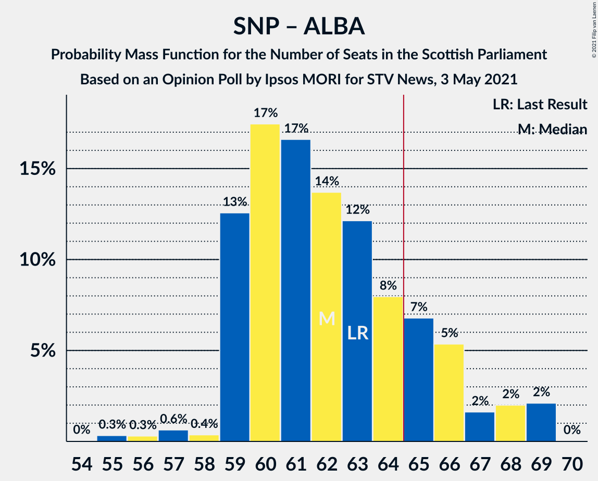

| Number of Seats | Probability | Accumulated | Special Marks |
|:---------------:|:-----------:|:-----------:|:-------------:|
| 55 | 0.3% | 100% |  |
| 56 | 0.3% | 99.6% |  |
| 57 | 0.6% | 99.3% |  |
| 58 | 0.4% | 98.7% |  |
| 59 | 13% | 98% |  |
| 60 | 17% | 86% |  |
| 61 | 17% | 68% |  |
| 62 | 14% | 52% | Median |
| 63 | 12% | 38% | Last Result |
| 64 | 8% | 26% |  |
| 65 | 7% | 18% | Majority |
| 66 | 5% | 11% |  |
| 67 | 2% | 6% |  |
| 68 | 2% | 4% |  |
| 69 | 2% | 2% |  |
| 70 | 0% | 0% |  |

### Scottish National Party

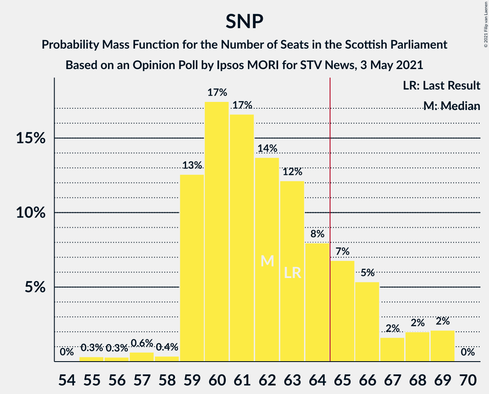

| Number of Seats | Probability | Accumulated | Special Marks |
|:---------------:|:-----------:|:-----------:|:-------------:|
| 55 | 0.3% | 100% |  |
| 56 | 0.3% | 99.6% |  |
| 57 | 0.6% | 99.3% |  |
| 58 | 0.4% | 98.7% |  |
| 59 | 13% | 98% |  |
| 60 | 17% | 86% |  |
| 61 | 17% | 68% |  |
| 62 | 14% | 52% | Median |
| 63 | 12% | 38% | Last Result |
| 64 | 8% | 26% |  |
| 65 | 7% | 18% | Majority |
| 66 | 5% | 11% |  |
| 67 | 2% | 6% |  |
| 68 | 2% | 4% |  |
| 69 | 2% | 2% |  |
| 70 | 0% | 0% |  |

### Scottish Conservative & Unionist Party – Scottish Labour – Scottish Liberal Democrats

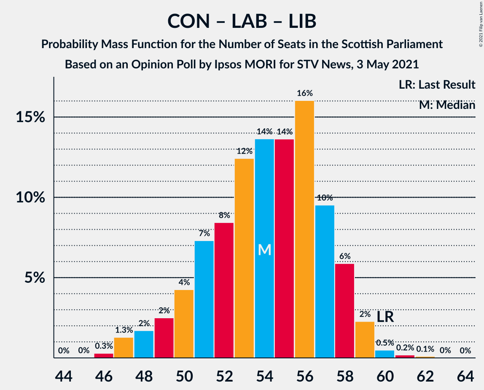

| Number of Seats | Probability | Accumulated | Special Marks |
|:---------------:|:-----------:|:-----------:|:-------------:|
| 46 | 0.3% | 100% |  |
| 47 | 1.3% | 99.7% |  |
| 48 | 2% | 98% |  |
| 49 | 2% | 97% |  |
| 50 | 4% | 94% |  |
| 51 | 7% | 90% |  |
| 52 | 8% | 83% |  |
| 53 | 12% | 74% |  |
| 54 | 14% | 62% | Median |
| 55 | 14% | 48% |  |
| 56 | 16% | 35% |  |
| 57 | 10% | 18% |  |
| 58 | 6% | 9% |  |
| 59 | 2% | 3% |  |
| 60 | 0.5% | 0.8% | Last Result |
| 61 | 0.2% | 0.3% |  |
| 62 | 0.1% | 0.1% |  |
| 63 | 0% | 0% |  |

### Scottish Conservative & Unionist Party – Scottish Labour

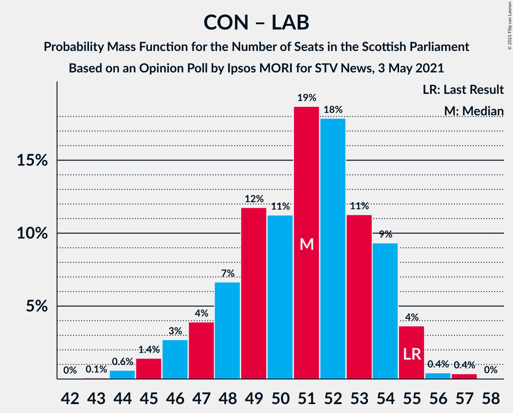

| Number of Seats | Probability | Accumulated | Special Marks |
|:---------------:|:-----------:|:-----------:|:-------------:|
| 43 | 0.1% | 100% |  |
| 44 | 0.6% | 99.9% |  |
| 45 | 1.4% | 99.3% |  |
| 46 | 3% | 98% |  |
| 47 | 4% | 95% |  |
| 48 | 7% | 91% |  |
| 49 | 12% | 85% |  |
| 50 | 11% | 73% |  |
| 51 | 19% | 62% | Median |
| 52 | 18% | 43% |  |
| 53 | 11% | 25% |  |
| 54 | 9% | 14% |  |
| 55 | 4% | 4% | Last Result |
| 56 | 0.4% | 0.8% |  |
| 57 | 0.4% | 0.4% |  |
| 58 | 0% | 0% |  |

### Scottish Labour – Scottish Greens – Scottish Liberal Democrats

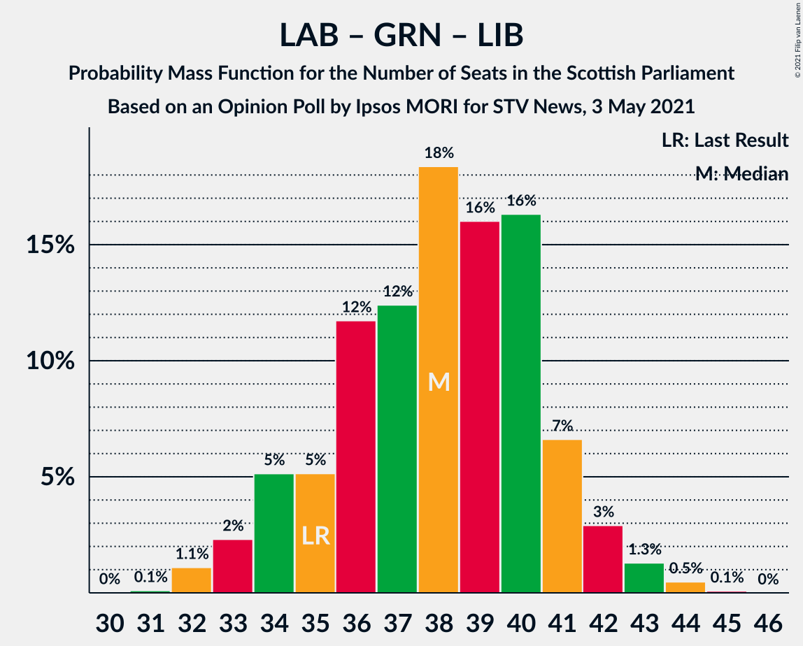

| Number of Seats | Probability | Accumulated | Special Marks |
|:---------------:|:-----------:|:-----------:|:-------------:|
| 31 | 0.1% | 100% |  |
| 32 | 1.1% | 99.9% |  |
| 33 | 2% | 98.8% |  |
| 34 | 5% | 96% |  |
| 35 | 5% | 91% | Last Result |
| 36 | 12% | 86% |  |
| 37 | 12% | 74% |  |
| 38 | 18% | 62% | Median |
| 39 | 16% | 44% |  |
| 40 | 16% | 28% |  |
| 41 | 7% | 11% |  |
| 42 | 3% | 5% |  |
| 43 | 1.3% | 2% |  |
| 44 | 0.5% | 0.6% |  |
| 45 | 0.1% | 0.1% |  |
| 46 | 0% | 0% |  |

### Scottish Conservative & Unionist Party – Scottish Liberal Democrats

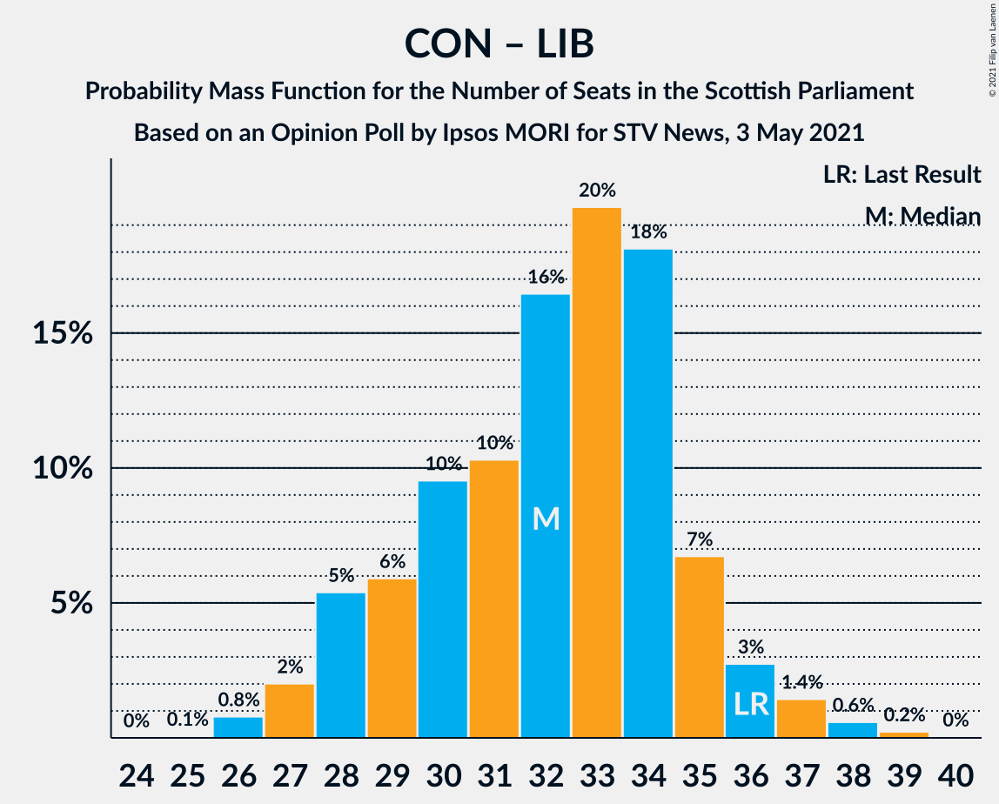

| Number of Seats | Probability | Accumulated | Special Marks |
|:---------------:|:-----------:|:-----------:|:-------------:|
| 25 | 0.1% | 100% |  |
| 26 | 0.8% | 99.9% |  |
| 27 | 2% | 99.1% |  |
| 28 | 5% | 97% |  |
| 29 | 6% | 92% |  |
| 30 | 10% | 86% |  |
| 31 | 10% | 76% |  |
| 32 | 16% | 66% | Median |
| 33 | 20% | 50% |  |
| 34 | 18% | 30% |  |
| 35 | 7% | 12% |  |
| 36 | 3% | 5% | Last Result |
| 37 | 1.4% | 2% |  |
| 38 | 0.6% | 0.9% |  |
| 39 | 0.2% | 0.3% |  |
| 40 | 0% | 0% |  |

### Scottish Labour – Scottish Liberal Democrats

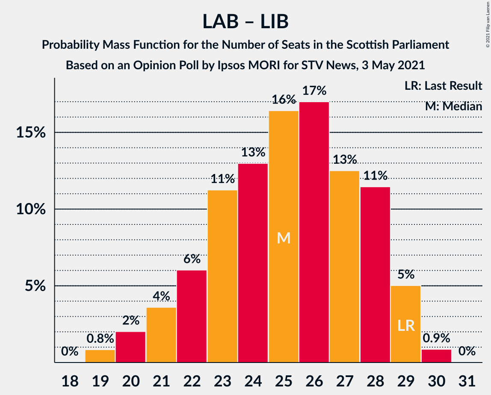

| Number of Seats | Probability | Accumulated | Special Marks |
|:---------------:|:-----------:|:-----------:|:-------------:|
| 19 | 0.8% | 100% |  |
| 20 | 2% | 99.2% |  |
| 21 | 4% | 97% |  |
| 22 | 6% | 94% |  |
| 23 | 11% | 88% |  |
| 24 | 13% | 76% |  |
| 25 | 16% | 63% | Median |
| 26 | 17% | 47% |  |
| 27 | 13% | 30% |  |
| 28 | 11% | 17% |  |
| 29 | 5% | 6% | Last Result |
| 30 | 0.9% | 0.9% |  |
| 31 | 0% | 0% |  |

## Technical Information

### Opinion Poll

+ **Polling firm:** Ipsos MORI
+ **Commissioner(s):** STV News
+ **Fieldwork period:** 3 May 2021

### Calculations

+ **Sample size:** 1502
+ **Simulations done:** 1,048,576
+ **Error estimate:** 0.64%

