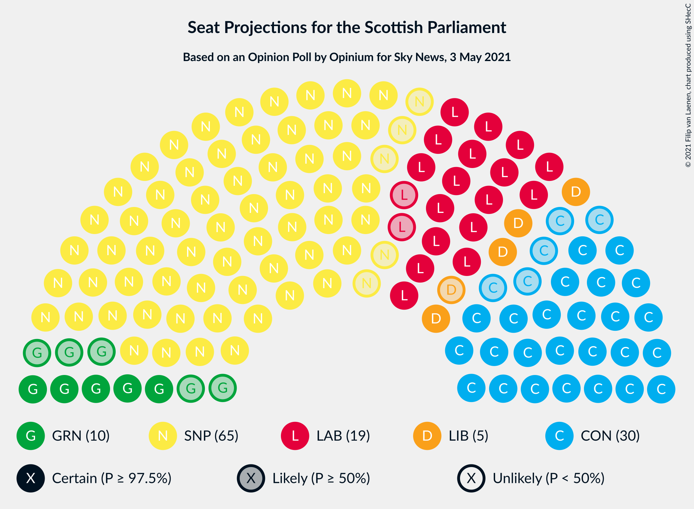
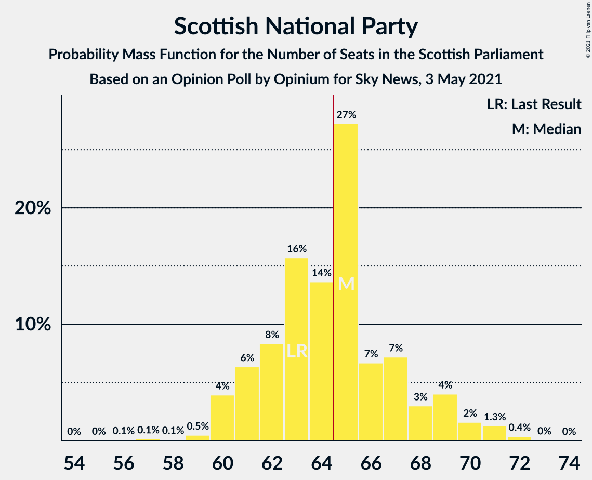
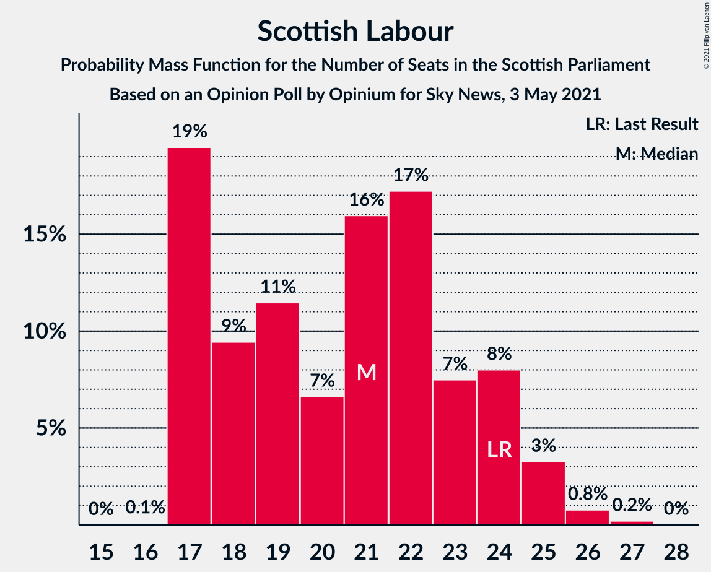
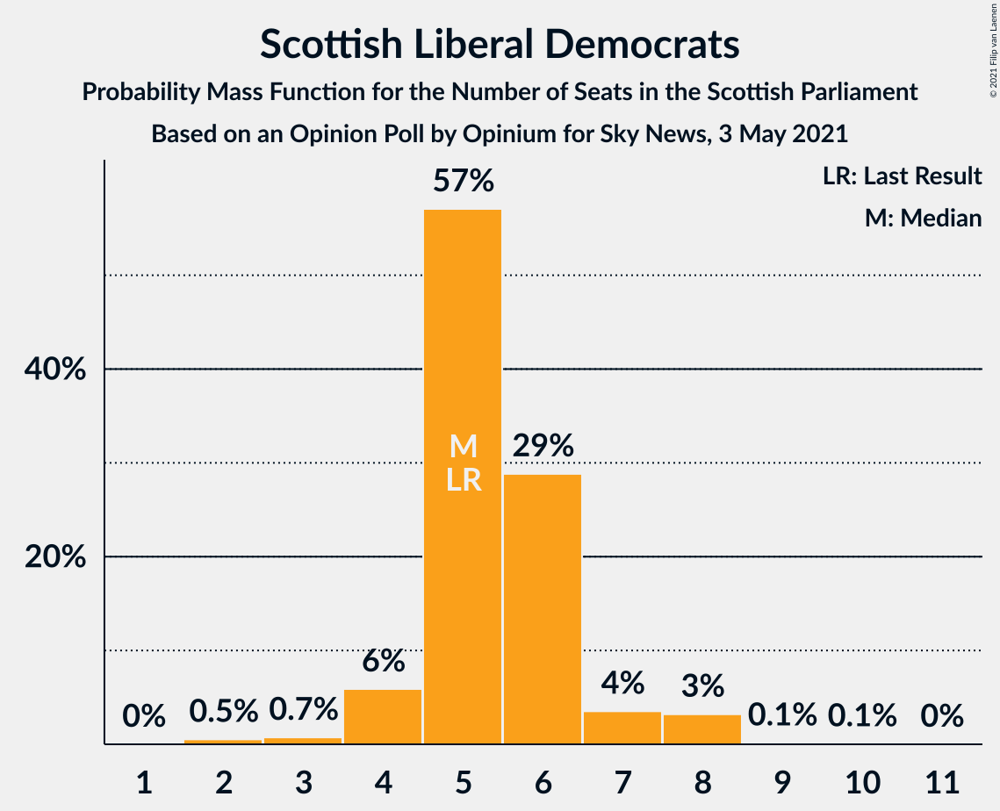

# Opinion Poll by Opinium for Sky News, 3 May 2021

<a href="#voting-intentions">Voting Intentions</a> | <a href="#seats">Seats</a> | <a href="#coalitions">Coalitions</a> | <a href="#technical-information">Technical Information</a>

## Voting Intentions

### Confidence Intervals

| Party | Last Result | Poll Result | 80% Confidence Interval | 90% Confidence Interval | 95% Confidence Interval | 99% Confidence Interval |
|:-----:|:-----------:|:-----------:|:-----------------------:|:-----------------------:|:-----------------------:|:-----------------------:|
| Scottish National Party | 41.7% | 41.0% | 39.0–43.0% |38.5–43.6% |38.0–44.0% |37.1–45.0% |
| Scottish Conservative & Unionist Party | 22.9% | 23.0% | 21.3–24.7% |20.9–25.2% |20.5–25.7% |19.7–26.5% |
| Scottish Labour | 19.1% | 17.0% | 15.6–18.6% |15.2–19.1% |14.8–19.5% |14.2–20.3% |
| Scottish Greens | 6.6% | 8.0% | 7.0–9.2% |6.7–9.5% |6.5–9.8% |6.0–10.4% |
| Scottish Liberal Democrats | 5.2% | 6.0% | 5.2–7.1% |4.9–7.4% |4.7–7.7% |4.3–8.2% |
| Alba Party | 0.0% | 3.0% | 2.4–3.8% |2.2–4.0% |2.1–4.2% |1.8–4.6% |

*Note:* The poll result column reflects the actual value used in the calculations. Published results may vary slightly, and in addition be rounded to fewer digits.

## Seats

### Confidence Intervals

| Party | Last Result | Median | 80% Confidence Interval | 90% Confidence Interval | 95% Confidence Interval | 99% Confidence Interval |
|:-----:|:-----------:|:------:|:-----------------------:|:-----------------------:|:-----------------------:|:-----------------------:|
| <a href="#scottish-national-party">Scottish National Party</a> | 63 | 66 | 63–70 |63–71 |62–72 |62–72 |
| <a href="#scottish-conservative-&-unionist-party">Scottish Conservative & Unionist Party</a> | 31 | 29 | 25–32 |25–32 |24–33 |22–34 |
| <a href="#scottish-labour">Scottish Labour</a> | 24 | 19 | 17–23 |17–24 |17–24 |17–25 |
| <a href="#scottish-greens">Scottish Greens</a> | 6 | 10 | 5–10 |5–10 |4–10 |3–11 |
| <a href="#scottish-liberal-democrats">Scottish Liberal Democrats</a> | 5 | 5 | 4–6 |3–7 |2–7 |2–8 |
| <a href="#alba-party">Alba Party</a> | 0 | 0 | 0 |0 |0 |0 |

### Scottish National Party

*For a full overview of the results for this party, see the [Scottish National Party](party-scottishnationalparty.html) page.*

| Number of Seats | Probability | Accumulated | Special Marks |
|:---------------:|:-----------:|:-----------:|:-------------:|
| 60 | 0.1% | 100% |  |
| 61 | 0.2% | 99.9% |  |
| 62 | 2% | 99.6% |  |
| 63 | 10% | 97% | Last Result |
| 64 | 9% | 88% |  |
| 65 | 7% | 78% | Majority |
| 66 | 23% | 72% | Median |
| 67 | 16% | 49% |  |
| 68 | 7% | 33% |  |
| 69 | 14% | 26% |  |
| 70 | 3% | 12% |  |
| 71 | 7% | 10% |  |
| 72 | 3% | 3% |  |
| 73 | 0.3% | 0.3% |  |
| 74 | 0% | 0% |  |

### Scottish Conservative & Unionist Party

*For a full overview of the results for this party, see the [Scottish Conservative & Unionist Party](party-scottishconservativeunionistparty.html) page.*

| Number of Seats | Probability | Accumulated | Special Marks |
|:---------------:|:-----------:|:-----------:|:-------------:|
| 21 | 0.4% | 100% |  |
| 22 | 0.4% | 99.6% |  |
| 23 | 0.5% | 99.3% |  |
| 24 | 3% | 98.7% |  |
| 25 | 9% | 96% |  |
| 26 | 12% | 87% |  |
| 27 | 9% | 75% |  |
| 28 | 10% | 66% |  |
| 29 | 12% | 56% | Median |
| 30 | 6% | 45% |  |
| 31 | 20% | 38% | Last Result |
| 32 | 16% | 19% |  |
| 33 | 2% | 3% |  |
| 34 | 1.0% | 1.1% |  |
| 35 | 0.1% | 0.2% |  |
| 36 | 0.1% | 0.1% |  |
| 37 | 0% | 0% |  |

### Scottish Labour

*For a full overview of the results for this party, see the [Scottish Labour](party-scottishlabour.html) page.*

| Number of Seats | Probability | Accumulated | Special Marks |
|:---------------:|:-----------:|:-----------:|:-------------:|
| 16 | 0.4% | 100% |  |
| 17 | 23% | 99.6% |  |
| 18 | 14% | 76% |  |
| 19 | 14% | 63% | Median |
| 20 | 6% | 48% |  |
| 21 | 11% | 43% |  |
| 22 | 18% | 32% |  |
| 23 | 8% | 14% |  |
| 24 | 4% | 6% | Last Result |
| 25 | 1.2% | 2% |  |
| 26 | 0.3% | 0.4% |  |
| 27 | 0.1% | 0.1% |  |
| 28 | 0% | 0% |  |

### Scottish Greens

*For a full overview of the results for this party, see the [Scottish Greens](party-scottishgreens.html) page.*

| Number of Seats | Probability | Accumulated | Special Marks |
|:---------------:|:-----------:|:-----------:|:-------------:|
| 3 | 0.9% | 100% |  |
| 4 | 3% | 99.1% |  |
| 5 | 9% | 96% |  |
| 6 | 8% | 87% | Last Result |
| 7 | 8% | 79% |  |
| 8 | 5% | 72% |  |
| 9 | 9% | 67% |  |
| 10 | 56% | 58% | Median |
| 11 | 2% | 2% |  |
| 12 | 0.1% | 0.1% |  |
| 13 | 0% | 0% |  |

### Scottish Liberal Democrats

*For a full overview of the results for this party, see the [Scottish Liberal Democrats](party-scottishliberaldemocrats.html) page.*

| Number of Seats | Probability | Accumulated | Special Marks |
|:---------------:|:-----------:|:-----------:|:-------------:|
| 2 | 3% | 100% |  |
| 3 | 3% | 97% |  |
| 4 | 24% | 94% |  |
| 5 | 33% | 70% | Last Result, Median |
| 6 | 32% | 37% |  |
| 7 | 3% | 5% |  |
| 8 | 2% | 2% |  |
| 9 | 0.1% | 0.2% |  |
| 10 | 0% | 0% |  |

### Alba Party

*For a full overview of the results for this party, see the [Alba Party](party-albaparty.html) page.*

| Number of Seats | Probability | Accumulated | Special Marks |
|:---------------:|:-----------:|:-----------:|:-------------:|
| 0 | 99.6% | 100% | Last Result, Median |
| 1 | 0.3% | 0.4% |  |
| 2 | 0% | 0.1% |  |
| 3 | 0% | 0% |  |

## Coalitions

### Confidence Intervals

| Coalition | Last Result | Median | Majority? | 80% Confidence Interval | 90% Confidence Interval | 95% Confidence Interval | 99% Confidence Interval |
|:---------:|:-----------:|:------:|:---------:|:-----------------------:|:-----------------------:|:-----------------------:|:-----------------------:|
| Scottish National Party – Scottish Greens – Alba Party | 69 | 75 | 100% | 71–79 | 70–80 | 69–81 | 67–82 |
| Scottish National Party – Scottish Greens | 69 | 75 | 100% | 71–79 | 70–80 | 69–81 | 67–82 |
| Scottish National Party – Alba Party | 63 | 66 | 78% | 63–70 | 63–71 | 62–72 | 62–72 |
| Scottish National Party | 63 | 66 | 78% | 63–70 | 63–71 | 62–72 | 62–72 |
| Scottish Conservative & Unionist Party – Scottish Labour – Scottish Liberal Democrats | 60 | 54 | 0% | 50–58 | 49–59 | 48–60 | 47–62 |
| Scottish Conservative & Unionist Party – Scottish Labour | 55 | 49 | 0% | 44–53 | 44–54 | 43–55 | 43–56 |
| Scottish Labour – Scottish Greens – Scottish Liberal Democrats | 35 | 33 | 0% | 31–36 | 30–37 | 30–39 | 28–40 |
| Scottish Conservative & Unionist Party – Scottish Liberal Democrats | 36 | 34 | 0% | 30–37 | 29–38 | 28–38 | 26–40 |
| Scottish Labour – Scottish Liberal Democrats | 29 | 25 | 0% | 22–28 | 21–29 | 21–30 | 20–31 |

### Scottish National Party – Scottish Greens – Alba Party

| Number of Seats | Probability | Accumulated | Special Marks |
|:---------------:|:-----------:|:-----------:|:-------------:|
| 66 | 0.1% | 100% |  |
| 67 | 0.4% | 99.8% |  |
| 68 | 0.8% | 99.5% |  |
| 69 | 3% | 98.6% | Last Result |
| 70 | 2% | 96% |  |
| 71 | 5% | 93% |  |
| 72 | 3% | 88% |  |
| 73 | 11% | 85% |  |
| 74 | 14% | 74% |  |
| 75 | 11% | 60% |  |
| 76 | 16% | 49% | Median |
| 77 | 11% | 33% |  |
| 78 | 4% | 21% |  |
| 79 | 9% | 17% |  |
| 80 | 3% | 8% |  |
| 81 | 2% | 5% |  |
| 82 | 2% | 2% |  |
| 83 | 0.2% | 0.2% |  |
| 84 | 0% | 0% |  |

### Scottish National Party – Scottish Greens

| Number of Seats | Probability | Accumulated | Special Marks |
|:---------------:|:-----------:|:-----------:|:-------------:|
| 66 | 0.1% | 100% |  |
| 67 | 0.4% | 99.8% |  |
| 68 | 0.8% | 99.5% |  |
| 69 | 3% | 98.6% | Last Result |
| 70 | 2% | 96% |  |
| 71 | 5% | 93% |  |
| 72 | 3% | 88% |  |
| 73 | 11% | 85% |  |
| 74 | 14% | 74% |  |
| 75 | 11% | 60% |  |
| 76 | 16% | 49% | Median |
| 77 | 11% | 33% |  |
| 78 | 4% | 21% |  |
| 79 | 9% | 17% |  |
| 80 | 3% | 8% |  |
| 81 | 3% | 5% |  |
| 82 | 2% | 2% |  |
| 83 | 0.2% | 0.2% |  |
| 84 | 0% | 0% |  |

### Scottish National Party – Alba Party

| Number of Seats | Probability | Accumulated | Special Marks |
|:---------------:|:-----------:|:-----------:|:-------------:|
| 60 | 0.1% | 100% |  |
| 61 | 0.2% | 99.9% |  |
| 62 | 2% | 99.6% |  |
| 63 | 10% | 97% | Last Result |
| 64 | 9% | 88% |  |
| 65 | 7% | 78% | Majority |
| 66 | 23% | 72% | Median |
| 67 | 15% | 49% |  |
| 68 | 7% | 33% |  |
| 69 | 14% | 26% |  |
| 70 | 3% | 12% |  |
| 71 | 7% | 10% |  |
| 72 | 3% | 3% |  |
| 73 | 0.3% | 0.3% |  |
| 74 | 0% | 0% |  |

### Scottish National Party

| Number of Seats | Probability | Accumulated | Special Marks |
|:---------------:|:-----------:|:-----------:|:-------------:|
| 60 | 0.1% | 100% |  |
| 61 | 0.2% | 99.9% |  |
| 62 | 2% | 99.6% |  |
| 63 | 10% | 97% | Last Result |
| 64 | 9% | 88% |  |
| 65 | 7% | 78% | Majority |
| 66 | 23% | 72% | Median |
| 67 | 16% | 49% |  |
| 68 | 7% | 33% |  |
| 69 | 14% | 26% |  |
| 70 | 3% | 12% |  |
| 71 | 7% | 10% |  |
| 72 | 3% | 3% |  |
| 73 | 0.3% | 0.3% |  |
| 74 | 0% | 0% |  |

### Scottish Conservative & Unionist Party – Scottish Labour – Scottish Liberal Democrats

| Number of Seats | Probability | Accumulated | Special Marks |
|:---------------:|:-----------:|:-----------:|:-------------:|
| 46 | 0.2% | 100% |  |
| 47 | 2% | 99.8% |  |
| 48 | 2% | 98% |  |
| 49 | 3% | 95% |  |
| 50 | 9% | 92% |  |
| 51 | 4% | 83% |  |
| 52 | 11% | 79% |  |
| 53 | 16% | 67% | Median |
| 54 | 11% | 51% |  |
| 55 | 14% | 40% |  |
| 56 | 11% | 26% |  |
| 57 | 3% | 15% |  |
| 58 | 5% | 12% |  |
| 59 | 2% | 7% |  |
| 60 | 3% | 4% | Last Result |
| 61 | 0.8% | 1.4% |  |
| 62 | 0.4% | 0.5% |  |
| 63 | 0.1% | 0.2% |  |
| 64 | 0% | 0% |  |

### Scottish Conservative & Unionist Party – Scottish Labour

| Number of Seats | Probability | Accumulated | Special Marks |
|:---------------:|:-----------:|:-----------:|:-------------:|
| 42 | 0.2% | 100% |  |
| 43 | 3% | 99.7% |  |
| 44 | 9% | 97% |  |
| 45 | 4% | 88% |  |
| 46 | 7% | 84% |  |
| 47 | 6% | 77% |  |
| 48 | 14% | 71% | Median |
| 49 | 22% | 56% |  |
| 50 | 10% | 34% |  |
| 51 | 8% | 24% |  |
| 52 | 4% | 16% |  |
| 53 | 6% | 12% |  |
| 54 | 3% | 6% |  |
| 55 | 2% | 3% | Last Result |
| 56 | 0.6% | 1.0% |  |
| 57 | 0.2% | 0.3% |  |
| 58 | 0.1% | 0.1% |  |
| 59 | 0% | 0% |  |

### Scottish Labour – Scottish Greens – Scottish Liberal Democrats

| Number of Seats | Probability | Accumulated | Special Marks |
|:---------------:|:-----------:|:-----------:|:-------------:|
| 27 | 0.2% | 100% |  |
| 28 | 0.9% | 99.8% |  |
| 29 | 0.9% | 98.9% |  |
| 30 | 4% | 98% |  |
| 31 | 9% | 94% |  |
| 32 | 20% | 85% |  |
| 33 | 22% | 66% |  |
| 34 | 14% | 44% | Median |
| 35 | 15% | 30% | Last Result |
| 36 | 5% | 15% |  |
| 37 | 6% | 10% |  |
| 38 | 2% | 4% |  |
| 39 | 1.1% | 3% |  |
| 40 | 1.2% | 1.4% |  |
| 41 | 0.2% | 0.2% |  |
| 42 | 0% | 0% |  |

### Scottish Conservative & Unionist Party – Scottish Liberal Democrats

| Number of Seats | Probability | Accumulated | Special Marks |
|:---------------:|:-----------:|:-----------:|:-------------:|
| 25 | 0.3% | 100% |  |
| 26 | 0.2% | 99.7% |  |
| 27 | 0.9% | 99.5% |  |
| 28 | 2% | 98.6% |  |
| 29 | 5% | 97% |  |
| 30 | 4% | 92% |  |
| 31 | 7% | 88% |  |
| 32 | 14% | 81% |  |
| 33 | 13% | 68% |  |
| 34 | 10% | 54% | Median |
| 35 | 8% | 44% |  |
| 36 | 19% | 36% | Last Result |
| 37 | 9% | 18% |  |
| 38 | 7% | 9% |  |
| 39 | 1.0% | 2% |  |
| 40 | 0.7% | 0.9% |  |
| 41 | 0.1% | 0.1% |  |
| 42 | 0.1% | 0.1% |  |
| 43 | 0% | 0% |  |

### Scottish Labour – Scottish Liberal Democrats

| Number of Seats | Probability | Accumulated | Special Marks |
|:---------------:|:-----------:|:-----------:|:-------------:|
| 19 | 0.3% | 100% |  |
| 20 | 1.2% | 99.7% |  |
| 21 | 6% | 98% |  |
| 22 | 14% | 92% |  |
| 23 | 13% | 78% |  |
| 24 | 14% | 64% | Median |
| 25 | 11% | 51% |  |
| 26 | 8% | 40% |  |
| 27 | 12% | 32% |  |
| 28 | 13% | 20% |  |
| 29 | 4% | 7% | Last Result |
| 30 | 2% | 3% |  |
| 31 | 0.7% | 1.0% |  |
| 32 | 0.1% | 0.3% |  |
| 33 | 0.1% | 0.1% |  |
| 34 | 0% | 0% |  |

## Technical Information

### Opinion Poll

+ **Polling firm:** Opinium
+ **Commissioner(s):** Sky News
+ **Fieldwork period:** 3 May 2021

### Calculations

+ **Sample size:** 1015
+ **Simulations done:** 131,072
+ **Error estimate:** 1.30%

