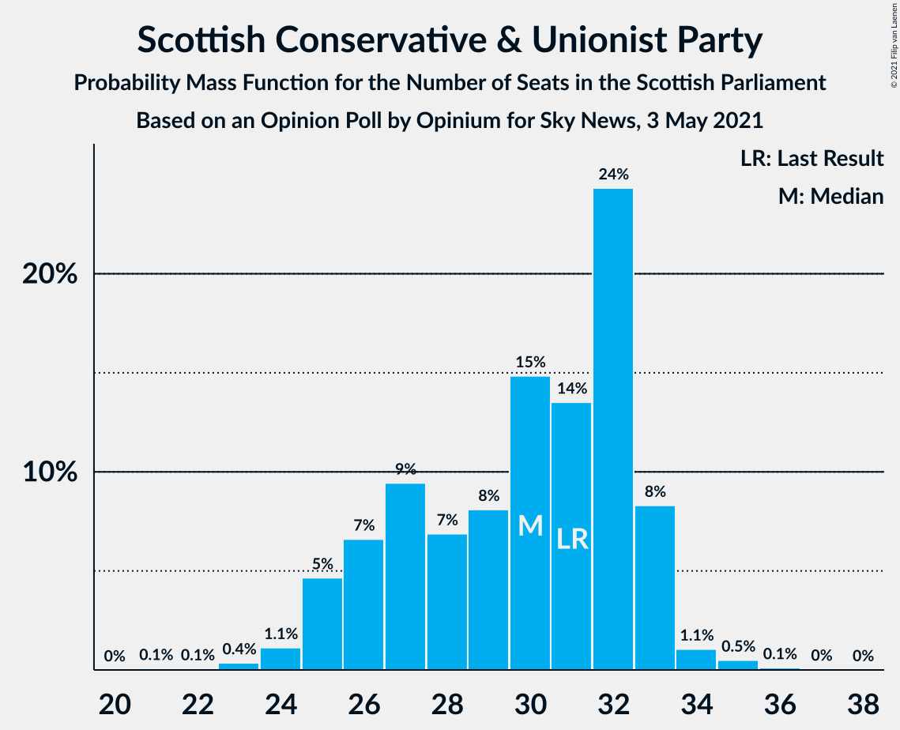
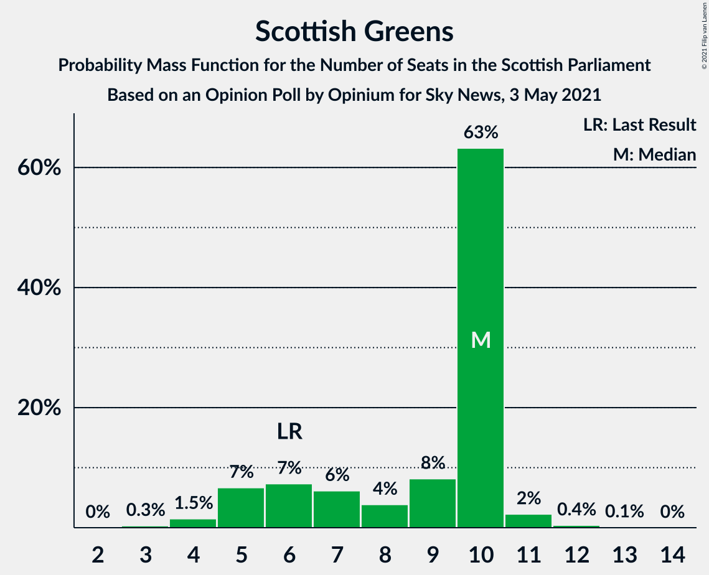
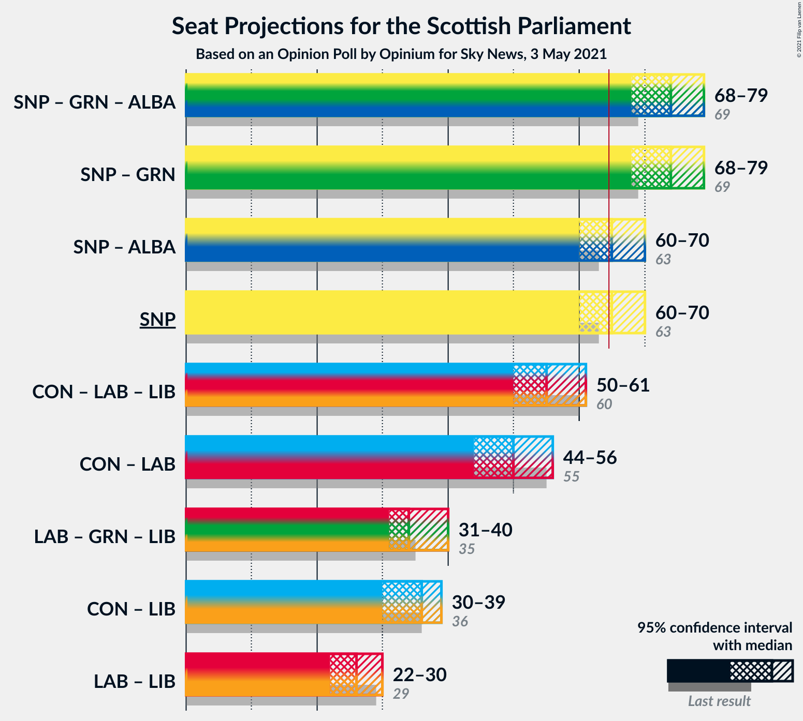
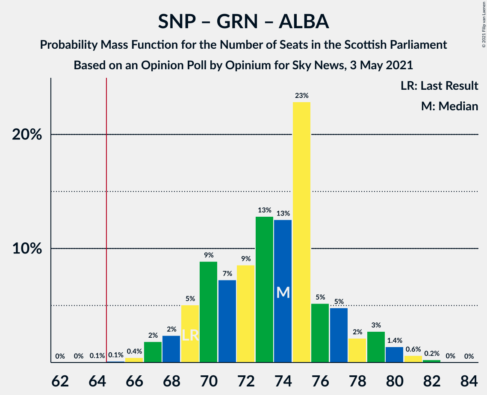

# Opinion Poll by Opinium for Sky News, 3 May 2021

<a href="#voting-intentions">Voting Intentions</a> | <a href="#seats">Seats</a> | <a href="#coalitions">Coalitions</a> | <a href="#technical-information">Technical Information</a>

## Voting Intentions

### Confidence Intervals

| Party | Last Result | Poll Result | 80% Confidence Interval | 90% Confidence Interval | 95% Confidence Interval | 99% Confidence Interval |
|:-----:|:-----------:|:-----------:|:-----------------------:|:-----------------------:|:-----------------------:|:-----------------------:|
| Scottish National Party | 41.7% | 41.0% | 39.0–43.0% |38.5–43.6% |38.0–44.0% |37.1–45.0% |
| Scottish Conservative & Unionist Party | 22.9% | 23.0% | 21.3–24.7% |20.9–25.2% |20.5–25.7% |19.7–26.5% |
| Scottish Labour | 19.1% | 17.0% | 15.6–18.6% |15.2–19.1% |14.8–19.5% |14.2–20.3% |
| Scottish Greens | 6.6% | 8.0% | 7.0–9.2% |6.7–9.5% |6.5–9.8% |6.0–10.4% |
| Scottish Liberal Democrats | 5.2% | 6.0% | 5.2–7.1% |4.9–7.4% |4.7–7.7% |4.3–8.2% |
| Alba Party | 0.0% | 3.0% | 2.4–3.8% |2.2–4.0% |2.1–4.2% |1.8–4.6% |

*Note:* The poll result column reflects the actual value used in the calculations. Published results may vary slightly, and in addition be rounded to fewer digits.

## Seats

### Confidence Intervals

| Party | Last Result | Median | 80% Confidence Interval | 90% Confidence Interval | 95% Confidence Interval | 99% Confidence Interval |
|:-----:|:-----------:|:------:|:-----------------------:|:-----------------------:|:-----------------------:|:-----------------------:|
| <a href="#scottish-national-party">Scottish National Party</a> | 63 | 65 | 62–68 |61–69 |60–71 |59–72 |
| <a href="#scottish-conservative-&-unionist-party">Scottish Conservative & Unionist Party</a> | 31 | 30 | 26–32 |25–33 |25–33 |23–35 |
| <a href="#scottish-labour">Scottish Labour</a> | 24 | 21 | 17–24 |17–24 |17–25 |17–26 |
| <a href="#scottish-greens">Scottish Greens</a> | 6 | 10 | 6–10 |5–10 |5–11 |4–11 |
| <a href="#scottish-liberal-democrats">Scottish Liberal Democrats</a> | 5 | 5 | 4–6 |4–7 |4–8 |2–8 |
| <a href="#alba-party">Alba Party</a> | 0 | 0 | 0 |0 |0 |0 |

### Scottish National Party

*For a full overview of the results for this party, see the [Scottish National Party](party-scottishnationalparty.html) page.*

| Number of Seats | Probability | Accumulated | Special Marks |
|:---------------:|:-----------:|:-----------:|:-------------:|
| 56 | 0% | 100% |  |
| 57 | 0.1% | 99.9% |  |
| 58 | 0.1% | 99.8% |  |
| 59 | 0.4% | 99.8% |  |
| 60 | 4% | 99.4% |  |
| 61 | 5% | 96% |  |
| 62 | 9% | 91% |  |
| 63 | 13% | 82% | Last Result |
| 64 | 12% | 70% |  |
| 65 | 26% | 57% | Median, Majority |
| 66 | 9% | 31% |  |
| 67 | 9% | 22% |  |
| 68 | 4% | 13% |  |
| 69 | 5% | 10% |  |
| 70 | 2% | 4% |  |
| 71 | 2% | 3% |  |
| 72 | 0.7% | 0.8% |  |
| 73 | 0.1% | 0.1% |  |
| 74 | 0% | 0% |  |

### Scottish Conservative & Unionist Party

*For a full overview of the results for this party, see the [Scottish Conservative & Unionist Party](party-scottishconservativeunionistparty.html) page.*

| Number of Seats | Probability | Accumulated | Special Marks |
|:---------------:|:-----------:|:-----------:|:-------------:|
| 21 | 0.1% | 100% |  |
| 22 | 0.1% | 99.9% |  |
| 23 | 0.3% | 99.8% |  |
| 24 | 1.4% | 99.5% |  |
| 25 | 6% | 98% |  |
| 26 | 7% | 93% |  |
| 27 | 9% | 85% |  |
| 28 | 9% | 76% |  |
| 29 | 8% | 67% |  |
| 30 | 13% | 59% | Median |
| 31 | 16% | 46% | Last Result |
| 32 | 22% | 31% |  |
| 33 | 8% | 9% |  |
| 34 | 1.0% | 2% |  |
| 35 | 0.4% | 0.6% |  |
| 36 | 0.1% | 0.2% |  |
| 37 | 0% | 0% |  |

### Scottish Labour

*For a full overview of the results for this party, see the [Scottish Labour](party-scottishlabour.html) page.*

| Number of Seats | Probability | Accumulated | Special Marks |
|:---------------:|:-----------:|:-----------:|:-------------:|
| 16 | 0.1% | 100% |  |
| 17 | 21% | 99.9% |  |
| 18 | 10% | 79% |  |
| 19 | 11% | 69% |  |
| 20 | 7% | 58% |  |
| 21 | 14% | 51% | Median |
| 22 | 18% | 37% |  |
| 23 | 8% | 19% |  |
| 24 | 8% | 11% | Last Result |
| 25 | 3% | 4% |  |
| 26 | 0.8% | 1.0% |  |
| 27 | 0.2% | 0.2% |  |
| 28 | 0% | 0% |  |

### Scottish Greens

*For a full overview of the results for this party, see the [Scottish Greens](party-scottishgreens.html) page.*

| Number of Seats | Probability | Accumulated | Special Marks |
|:---------------:|:-----------:|:-----------:|:-------------:|
| 3 | 0.4% | 100% |  |
| 4 | 2% | 99.6% |  |
| 5 | 7% | 98% |  |
| 6 | 7% | 90% | Last Result |
| 7 | 6% | 84% |  |
| 8 | 4% | 77% |  |
| 9 | 8% | 73% |  |
| 10 | 63% | 65% | Median |
| 11 | 2% | 3% |  |
| 12 | 0.3% | 0.4% |  |
| 13 | 0.1% | 0.1% |  |
| 14 | 0% | 0% |  |

### Scottish Liberal Democrats

*For a full overview of the results for this party, see the [Scottish Liberal Democrats](party-scottishliberaldemocrats.html) page.*

| Number of Seats | Probability | Accumulated | Special Marks |
|:---------------:|:-----------:|:-----------:|:-------------:|
| 2 | 0.9% | 100% |  |
| 3 | 1.1% | 99.1% |  |
| 4 | 9% | 98% |  |
| 5 | 54% | 89% | Last Result, Median |
| 6 | 29% | 36% |  |
| 7 | 4% | 7% |  |
| 8 | 3% | 3% |  |
| 9 | 0.1% | 0.2% |  |
| 10 | 0.1% | 0.1% |  |
| 11 | 0% | 0% |  |

### Alba Party

*For a full overview of the results for this party, see the [Alba Party](party-albaparty.html) page.*

| Number of Seats | Probability | Accumulated | Special Marks |
|:---------------:|:-----------:|:-----------:|:-------------:|
| 0 | 99.6% | 100% | Last Result, Median |
| 1 | 0.3% | 0.4% |  |
| 2 | 0.1% | 0.1% |  |
| 3 | 0% | 0% |  |

## Coalitions

### Confidence Intervals

| Coalition | Last Result | Median | Majority? | 80% Confidence Interval | 90% Confidence Interval | 95% Confidence Interval | 99% Confidence Interval |
|:---------:|:-----------:|:------:|:---------:|:-----------------------:|:-----------------------:|:-----------------------:|:-----------------------:|
| Scottish National Party – Scottish Greens – Alba Party | 69 | 74 | 99.9% | 70–77 | 69–79 | 68–80 | 66–82 |
| Scottish National Party – Scottish Greens | 69 | 74 | 99.9% | 70–77 | 69–79 | 68–80 | 66–82 |
| Scottish National Party – Alba Party | 63 | 65 | 57% | 62–68 | 61–69 | 60–71 | 59–72 |
| Scottish National Party | 63 | 65 | 57% | 62–68 | 61–69 | 60–71 | 59–72 |
| Scottish Conservative & Unionist Party – Scottish Labour – Scottish Liberal Democrats | 60 | 55 | 0.1% | 52–59 | 50–60 | 49–61 | 47–63 |
| Scottish Conservative & Unionist Party – Scottish Labour | 55 | 49 | 0% | 46–54 | 45–55 | 44–56 | 43–57 |
| Scottish Labour – Scottish Greens – Scottish Liberal Democrats | 35 | 34 | 0% | 32–38 | 32–39 | 31–40 | 29–41 |
| Scottish Conservative & Unionist Party – Scottish Liberal Democrats | 36 | 35 | 0% | 31–38 | 30–39 | 29–39 | 28–40 |
| Scottish Labour – Scottish Liberal Democrats | 29 | 26 | 0% | 22–29 | 22–30 | 22–30 | 21–32 |

### Scottish National Party – Scottish Greens – Alba Party

| Number of Seats | Probability | Accumulated | Special Marks |
|:---------------:|:-----------:|:-----------:|:-------------:|
| 64 | 0.1% | 100% |  |
| 65 | 0.1% | 99.9% | Majority |
| 66 | 0.4% | 99.8% |  |
| 67 | 1.4% | 99.4% |  |
| 68 | 3% | 98% |  |
| 69 | 5% | 95% | Last Result |
| 70 | 8% | 91% |  |
| 71 | 6% | 83% |  |
| 72 | 9% | 77% |  |
| 73 | 12% | 68% |  |
| 74 | 12% | 56% |  |
| 75 | 22% | 44% | Median |
| 76 | 6% | 22% |  |
| 77 | 6% | 15% |  |
| 78 | 3% | 9% |  |
| 79 | 4% | 7% |  |
| 80 | 1.5% | 3% |  |
| 81 | 0.9% | 1.5% |  |
| 82 | 0.5% | 0.6% |  |
| 83 | 0.1% | 0.1% |  |
| 84 | 0% | 0% |  |

### Scottish National Party – Scottish Greens

| Number of Seats | Probability | Accumulated | Special Marks |
|:---------------:|:-----------:|:-----------:|:-------------:|
| 64 | 0.1% | 100% |  |
| 65 | 0.1% | 99.9% | Majority |
| 66 | 0.4% | 99.8% |  |
| 67 | 1.4% | 99.4% |  |
| 68 | 3% | 98% |  |
| 69 | 5% | 95% | Last Result |
| 70 | 8% | 91% |  |
| 71 | 6% | 83% |  |
| 72 | 9% | 77% |  |
| 73 | 12% | 68% |  |
| 74 | 12% | 56% |  |
| 75 | 22% | 44% | Median |
| 76 | 6% | 22% |  |
| 77 | 6% | 15% |  |
| 78 | 3% | 9% |  |
| 79 | 4% | 7% |  |
| 80 | 1.5% | 3% |  |
| 81 | 0.9% | 1.5% |  |
| 82 | 0.5% | 0.5% |  |
| 83 | 0.1% | 0.1% |  |
| 84 | 0% | 0% |  |

### Scottish National Party – Alba Party

| Number of Seats | Probability | Accumulated | Special Marks |
|:---------------:|:-----------:|:-----------:|:-------------:|
| 56 | 0% | 100% |  |
| 57 | 0.1% | 99.9% |  |
| 58 | 0.1% | 99.8% |  |
| 59 | 0.4% | 99.8% |  |
| 60 | 4% | 99.4% |  |
| 61 | 5% | 96% |  |
| 62 | 9% | 91% |  |
| 63 | 12% | 82% | Last Result |
| 64 | 12% | 70% |  |
| 65 | 26% | 57% | Median, Majority |
| 66 | 9% | 32% |  |
| 67 | 9% | 23% |  |
| 68 | 4% | 14% |  |
| 69 | 5% | 10% |  |
| 70 | 2% | 4% |  |
| 71 | 2% | 3% |  |
| 72 | 0.7% | 0.8% |  |
| 73 | 0.1% | 0.1% |  |
| 74 | 0% | 0% |  |

### Scottish National Party

| Number of Seats | Probability | Accumulated | Special Marks |
|:---------------:|:-----------:|:-----------:|:-------------:|
| 56 | 0% | 100% |  |
| 57 | 0.1% | 99.9% |  |
| 58 | 0.1% | 99.8% |  |
| 59 | 0.4% | 99.8% |  |
| 60 | 4% | 99.4% |  |
| 61 | 5% | 96% |  |
| 62 | 9% | 91% |  |
| 63 | 13% | 82% | Last Result |
| 64 | 12% | 70% |  |
| 65 | 26% | 57% | Median, Majority |
| 66 | 9% | 31% |  |
| 67 | 9% | 22% |  |
| 68 | 4% | 13% |  |
| 69 | 5% | 10% |  |
| 70 | 2% | 4% |  |
| 71 | 2% | 3% |  |
| 72 | 0.7% | 0.8% |  |
| 73 | 0.1% | 0.1% |  |
| 74 | 0% | 0% |  |

### Scottish Conservative & Unionist Party – Scottish Labour – Scottish Liberal Democrats

| Number of Seats | Probability | Accumulated | Special Marks |
|:---------------:|:-----------:|:-----------:|:-------------:|
| 46 | 0.1% | 100% |  |
| 47 | 0.5% | 99.9% |  |
| 48 | 0.9% | 99.4% |  |
| 49 | 1.5% | 98.5% |  |
| 50 | 4% | 97% |  |
| 51 | 3% | 93% |  |
| 52 | 6% | 91% |  |
| 53 | 6% | 85% |  |
| 54 | 22% | 78% |  |
| 55 | 12% | 56% |  |
| 56 | 12% | 44% | Median |
| 57 | 9% | 32% |  |
| 58 | 6% | 23% |  |
| 59 | 8% | 17% |  |
| 60 | 5% | 9% | Last Result |
| 61 | 3% | 5% |  |
| 62 | 1.4% | 2% |  |
| 63 | 0.4% | 0.6% |  |
| 64 | 0.1% | 0.2% |  |
| 65 | 0.1% | 0.1% | Majority |
| 66 | 0% | 0% |  |

### Scottish Conservative & Unionist Party – Scottish Labour

| Number of Seats | Probability | Accumulated | Special Marks |
|:---------------:|:-----------:|:-----------:|:-------------:|
| 42 | 0.1% | 100% |  |
| 43 | 1.0% | 99.9% |  |
| 44 | 4% | 98.9% |  |
| 45 | 3% | 95% |  |
| 46 | 5% | 92% |  |
| 47 | 3% | 87% |  |
| 48 | 10% | 84% |  |
| 49 | 24% | 74% |  |
| 50 | 10% | 50% |  |
| 51 | 9% | 39% | Median |
| 52 | 10% | 30% |  |
| 53 | 7% | 20% |  |
| 54 | 6% | 13% |  |
| 55 | 4% | 8% | Last Result |
| 56 | 2% | 3% |  |
| 57 | 0.8% | 1.1% |  |
| 58 | 0.2% | 0.3% |  |
| 59 | 0.1% | 0.1% |  |
| 60 | 0% | 0% |  |

### Scottish Labour – Scottish Greens – Scottish Liberal Democrats

| Number of Seats | Probability | Accumulated | Special Marks |
|:---------------:|:-----------:|:-----------:|:-------------:|
| 27 | 0.1% | 100% |  |
| 28 | 0.3% | 99.9% |  |
| 29 | 0.4% | 99.6% |  |
| 30 | 1.3% | 99.3% |  |
| 31 | 3% | 98% |  |
| 32 | 19% | 95% |  |
| 33 | 17% | 76% |  |
| 34 | 14% | 59% |  |
| 35 | 12% | 46% | Last Result |
| 36 | 11% | 34% | Median |
| 37 | 9% | 22% |  |
| 38 | 6% | 13% |  |
| 39 | 4% | 7% |  |
| 40 | 2% | 3% |  |
| 41 | 0.7% | 1.0% |  |
| 42 | 0.2% | 0.3% |  |
| 43 | 0.1% | 0.1% |  |
| 44 | 0% | 0% |  |

### Scottish Conservative & Unionist Party – Scottish Liberal Democrats

| Number of Seats | Probability | Accumulated | Special Marks |
|:---------------:|:-----------:|:-----------:|:-------------:|
| 25 | 0.1% | 100% |  |
| 26 | 0.1% | 99.9% |  |
| 27 | 0.2% | 99.9% |  |
| 28 | 0.5% | 99.6% |  |
| 29 | 2% | 99.1% |  |
| 30 | 3% | 97% |  |
| 31 | 5% | 95% |  |
| 32 | 7% | 89% |  |
| 33 | 12% | 82% |  |
| 34 | 8% | 70% |  |
| 35 | 13% | 62% | Median |
| 36 | 14% | 49% | Last Result |
| 37 | 20% | 35% |  |
| 38 | 10% | 15% |  |
| 39 | 3% | 5% |  |
| 40 | 1.4% | 2% |  |
| 41 | 0.3% | 0.5% |  |
| 42 | 0.1% | 0.1% |  |
| 43 | 0% | 0% |  |

### Scottish Labour – Scottish Liberal Democrats

| Number of Seats | Probability | Accumulated | Special Marks |
|:---------------:|:-----------:|:-----------:|:-------------:|
| 19 | 0.1% | 100% |  |
| 20 | 0.3% | 99.9% |  |
| 21 | 2% | 99.6% |  |
| 22 | 14% | 98% |  |
| 23 | 11% | 84% |  |
| 24 | 11% | 73% |  |
| 25 | 10% | 62% |  |
| 26 | 11% | 52% | Median |
| 27 | 14% | 41% |  |
| 28 | 11% | 27% |  |
| 29 | 10% | 16% | Last Result |
| 30 | 4% | 6% |  |
| 31 | 1.3% | 2% |  |
| 32 | 0.4% | 0.7% |  |
| 33 | 0.2% | 0.2% |  |
| 34 | 0.1% | 0.1% |  |
| 35 | 0% | 0% |  |

## Technical Information

### Opinion Poll

+ **Polling firm:** Opinium
+ **Commissioner(s):** Sky News
+ **Fieldwork period:** 3 May 2021

### Calculations

+ **Sample size:** 1015
+ **Simulations done:** 524,288
+ **Error estimate:** 0.93%

