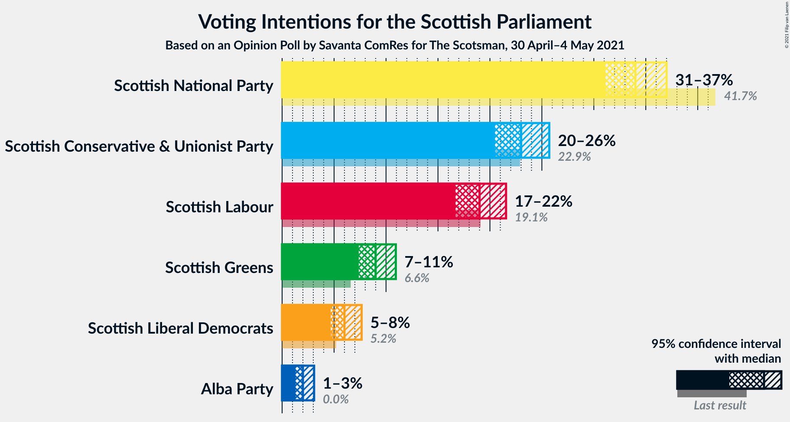
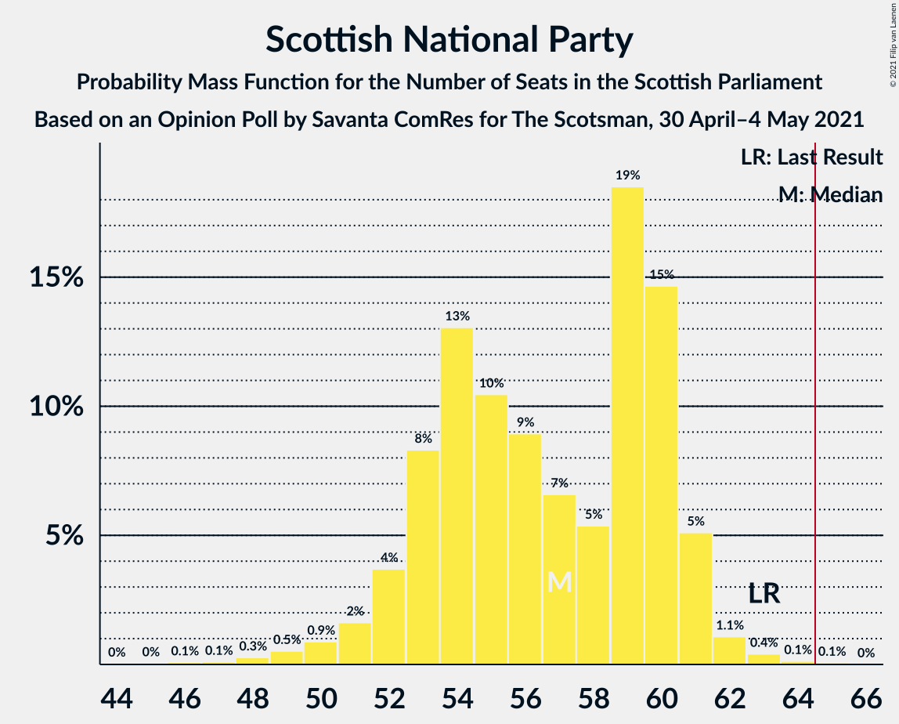

# Opinion Poll by Savanta ComRes for The Scotsman, 30 April–4 May 2021

<a href="#voting-intentions">Voting Intentions</a> | <a href="#seats">Seats</a> | <a href="#coalitions">Coalitions</a> | <a href="#technical-information">Technical Information</a>

## Voting Intentions

### Confidence Intervals

| Party | Last Result | Poll Result | 80% Confidence Interval | 90% Confidence Interval | 95% Confidence Interval | 99% Confidence Interval |
|:-----:|:-----------:|:-----------:|:-----------------------:|:-----------------------:|:-----------------------:|:-----------------------:|
| Scottish National Party | 41.7% | 34.0% | 32.1–36.0% |31.6–36.5% |31.1–37.0% |30.2–38.0% |
| Scottish Conservative & Unionist Party | 22.9% | 23.0% | 21.4–24.8% |20.9–25.3% |20.5–25.7% |19.7–26.6% |
| Scottish Labour | 19.1% | 19.0% | 17.5–20.7% |17.1–21.1% |16.7–21.6% |16.0–22.4% |
| Scottish Greens | 6.6% | 9.0% | 7.9–10.3% |7.6–10.6% |7.4–10.9% |6.9–11.6% |
| Scottish Liberal Democrats | 5.2% | 6.0% | 5.1–7.1% |4.9–7.4% |4.7–7.7% |4.3–8.2% |
| Alba Party | 0.0% | 2.0% | 1.5–2.7% |1.4–2.9% |1.3–3.1% |1.1–3.4% |

*Note:* The poll result column reflects the actual value used in the calculations. Published results may vary slightly, and in addition be rounded to fewer digits.

## Seats

### Confidence Intervals

| Party | Last Result | Median | 80% Confidence Interval | 90% Confidence Interval | 95% Confidence Interval | 99% Confidence Interval |
|:-----:|:-----------:|:------:|:-----------------------:|:-----------------------:|:-----------------------:|:-----------------------:|
| <a href="#scottish-national-party">Scottish National Party</a> | 63 | 57 | 53–60 |52–61 |51–61 |48–63 |
| <a href="#scottish-conservative-&-unionist-party">Scottish Conservative & Unionist Party</a> | 31 | 31 | 28–34 |27–35 |26–35 |25–36 |
| <a href="#scottish-labour">Scottish Labour</a> | 24 | 25 | 23–27 |23–28 |22–30 |19–32 |
| <a href="#scottish-greens">Scottish Greens</a> | 6 | 10 | 9–12 |8–12 |8–13 |7–14 |
| <a href="#scottish-liberal-democrats">Scottish Liberal Democrats</a> | 5 | 6 | 5–7 |5–8 |5–9 |4–10 |
| <a href="#alba-party">Alba Party</a> | 0 | 0 | 0 |0 |0 |0 |

### Scottish National Party

*For a full overview of the results for this party, see the [Scottish National Party](party-scottishnationalparty.html) page.*

| Number of Seats | Probability | Accumulated | Special Marks |
|:---------------:|:-----------:|:-----------:|:-------------:|
| 44 | 0% | 100% |  |
| 45 | 0% | 99.9% |  |
| 46 | 0.1% | 99.9% |  |
| 47 | 0.1% | 99.8% |  |
| 48 | 0.3% | 99.7% |  |
| 49 | 0.5% | 99.4% |  |
| 50 | 0.9% | 98.9% |  |
| 51 | 2% | 98% |  |
| 52 | 4% | 96% |  |
| 53 | 8% | 93% |  |
| 54 | 13% | 84% |  |
| 55 | 10% | 71% |  |
| 56 | 9% | 61% |  |
| 57 | 7% | 52% | Median |
| 58 | 5% | 45% |  |
| 59 | 19% | 40% |  |
| 60 | 15% | 21% |  |
| 61 | 5% | 7% |  |
| 62 | 1.1% | 2% |  |
| 63 | 0.4% | 0.6% | Last Result |
| 64 | 0.1% | 0.2% |  |
| 65 | 0.1% | 0.1% | Majority |
| 66 | 0% | 0% |  |

### Scottish Conservative & Unionist Party

*For a full overview of the results for this party, see the [Scottish Conservative & Unionist Party](party-scottishconservativeunionistparty.html) page.*

| Number of Seats | Probability | Accumulated | Special Marks |
|:---------------:|:-----------:|:-----------:|:-------------:|
| 24 | 0.3% | 100% |  |
| 25 | 1.2% | 99.6% |  |
| 26 | 3% | 98% |  |
| 27 | 4% | 95% |  |
| 28 | 8% | 92% |  |
| 29 | 15% | 84% |  |
| 30 | 13% | 69% |  |
| 31 | 9% | 56% | Last Result, Median |
| 32 | 8% | 47% |  |
| 33 | 24% | 39% |  |
| 34 | 9% | 15% |  |
| 35 | 4% | 6% |  |
| 36 | 2% | 2% |  |
| 37 | 0.3% | 0.5% |  |
| 38 | 0.2% | 0.2% |  |
| 39 | 0% | 0% |  |

### Scottish Labour

*For a full overview of the results for this party, see the [Scottish Labour](party-scottishlabour.html) page.*

| Number of Seats | Probability | Accumulated | Special Marks |
|:---------------:|:-----------:|:-----------:|:-------------:|
| 18 | 0.1% | 100% |  |
| 19 | 0.5% | 99.9% |  |
| 20 | 0.7% | 99.4% |  |
| 21 | 1.0% | 98.7% |  |
| 22 | 3% | 98% |  |
| 23 | 8% | 95% |  |
| 24 | 15% | 87% | Last Result |
| 25 | 32% | 72% | Median |
| 26 | 23% | 39% |  |
| 27 | 9% | 16% |  |
| 28 | 2% | 6% |  |
| 29 | 2% | 4% |  |
| 30 | 0.9% | 3% |  |
| 31 | 1.2% | 2% |  |
| 32 | 0.5% | 0.6% |  |
| 33 | 0% | 0.1% |  |
| 34 | 0% | 0.1% |  |
| 35 | 0% | 0% |  |

### Scottish Greens

*For a full overview of the results for this party, see the [Scottish Greens](party-scottishgreens.html) page.*

| Number of Seats | Probability | Accumulated | Special Marks |
|:---------------:|:-----------:|:-----------:|:-------------:|
| 5 | 0.1% | 100% |  |
| 6 | 0.2% | 99.9% | Last Result |
| 7 | 1.2% | 99.7% |  |
| 8 | 4% | 98.5% |  |
| 9 | 8% | 94% |  |
| 10 | 58% | 87% | Median |
| 11 | 15% | 29% |  |
| 12 | 11% | 14% |  |
| 13 | 2% | 3% |  |
| 14 | 1.0% | 1.0% |  |
| 15 | 0% | 0.1% |  |
| 16 | 0% | 0% |  |

### Scottish Liberal Democrats

*For a full overview of the results for this party, see the [Scottish Liberal Democrats](party-scottishliberaldemocrats.html) page.*

| Number of Seats | Probability | Accumulated | Special Marks |
|:---------------:|:-----------:|:-----------:|:-------------:|
| 3 | 0% | 100% |  |
| 4 | 2% | 99.9% |  |
| 5 | 41% | 98% | Last Result |
| 6 | 45% | 57% | Median |
| 7 | 5% | 12% |  |
| 8 | 4% | 7% |  |
| 9 | 2% | 3% |  |
| 10 | 1.2% | 1.5% |  |
| 11 | 0.2% | 0.3% |  |
| 12 | 0.1% | 0.1% |  |
| 13 | 0% | 0% |  |

### Alba Party

*For a full overview of the results for this party, see the [Alba Party](party-albaparty.html) page.*

| Number of Seats | Probability | Accumulated | Special Marks |
|:---------------:|:-----------:|:-----------:|:-------------:|
| 0 | 100% | 100% | Last Result, Median |

## Coalitions

### Confidence Intervals

| Coalition | Last Result | Median | Majority? | 80% Confidence Interval | 90% Confidence Interval | 95% Confidence Interval | 99% Confidence Interval |
|:---------:|:-----------:|:------:|:---------:|:-----------------------:|:-----------------------:|:-----------------------:|:-----------------------:|
| Scottish National Party – Scottish Greens – Alba Party | 69 | 67 | 76% | 63–71 | 62–71 | 61–72 | 59–73 |
| Scottish National Party – Scottish Greens | 69 | 67 | 76% | 63–71 | 62–71 | 61–72 | 59–73 |
| Scottish Conservative & Unionist Party – Scottish Labour – Scottish Liberal Democrats | 60 | 62 | 24% | 58–66 | 58–67 | 57–68 | 56–70 |
| Scottish Conservative & Unionist Party – Scottish Labour | 55 | 56 | 0.3% | 53–60 | 52–61 | 51–62 | 49–64 |
| Scottish National Party – Alba Party | 63 | 57 | 0.1% | 53–60 | 52–61 | 51–61 | 48–63 |
| Scottish National Party | 63 | 57 | 0.1% | 53–60 | 52–61 | 51–61 | 48–63 |
| Scottish Labour – Scottish Greens – Scottish Liberal Democrats | 35 | 41 | 0% | 39–44 | 38–45 | 37–47 | 35–49 |
| Scottish Conservative & Unionist Party – Scottish Liberal Democrats | 36 | 37 | 0% | 33–40 | 33–41 | 32–42 | 31–43 |
| Scottish Labour – Scottish Liberal Democrats | 29 | 31 | 0% | 29–33 | 28–35 | 27–36 | 25–38 |

### Scottish National Party – Scottish Greens – Alba Party

| Number of Seats | Probability | Accumulated | Special Marks |
|:---------------:|:-----------:|:-----------:|:-------------:|
| 55 | 0% | 100% |  |
| 56 | 0.1% | 99.9% |  |
| 57 | 0.1% | 99.9% |  |
| 58 | 0.2% | 99.8% |  |
| 59 | 0.4% | 99.6% |  |
| 60 | 1.0% | 99.2% |  |
| 61 | 2% | 98% |  |
| 62 | 4% | 97% |  |
| 63 | 8% | 93% |  |
| 64 | 8% | 84% |  |
| 65 | 11% | 76% | Majority |
| 66 | 11% | 66% |  |
| 67 | 9% | 55% | Median |
| 68 | 5% | 46% |  |
| 69 | 16% | 41% | Last Result |
| 70 | 15% | 25% |  |
| 71 | 7% | 11% |  |
| 72 | 2% | 3% |  |
| 73 | 0.8% | 1.2% |  |
| 74 | 0.2% | 0.4% |  |
| 75 | 0.1% | 0.1% |  |
| 76 | 0% | 0% |  |

### Scottish National Party – Scottish Greens

| Number of Seats | Probability | Accumulated | Special Marks |
|:---------------:|:-----------:|:-----------:|:-------------:|
| 55 | 0% | 100% |  |
| 56 | 0.1% | 99.9% |  |
| 57 | 0.1% | 99.9% |  |
| 58 | 0.2% | 99.8% |  |
| 59 | 0.4% | 99.6% |  |
| 60 | 1.0% | 99.2% |  |
| 61 | 2% | 98% |  |
| 62 | 4% | 97% |  |
| 63 | 8% | 93% |  |
| 64 | 8% | 84% |  |
| 65 | 11% | 76% | Majority |
| 66 | 11% | 66% |  |
| 67 | 9% | 55% | Median |
| 68 | 5% | 46% |  |
| 69 | 16% | 41% | Last Result |
| 70 | 15% | 25% |  |
| 71 | 7% | 11% |  |
| 72 | 2% | 3% |  |
| 73 | 0.8% | 1.2% |  |
| 74 | 0.2% | 0.4% |  |
| 75 | 0.1% | 0.1% |  |
| 76 | 0% | 0% |  |

### Scottish Conservative & Unionist Party – Scottish Labour – Scottish Liberal Democrats

| Number of Seats | Probability | Accumulated | Special Marks |
|:---------------:|:-----------:|:-----------:|:-------------:|
| 54 | 0.1% | 100% |  |
| 55 | 0.2% | 99.9% |  |
| 56 | 0.8% | 99.6% |  |
| 57 | 2% | 98.8% |  |
| 58 | 7% | 97% |  |
| 59 | 15% | 89% |  |
| 60 | 16% | 75% | Last Result |
| 61 | 5% | 59% |  |
| 62 | 9% | 54% | Median |
| 63 | 11% | 45% |  |
| 64 | 11% | 34% |  |
| 65 | 8% | 24% | Majority |
| 66 | 8% | 16% |  |
| 67 | 4% | 7% |  |
| 68 | 2% | 3% |  |
| 69 | 1.0% | 2% |  |
| 70 | 0.4% | 0.8% |  |
| 71 | 0.2% | 0.4% |  |
| 72 | 0.1% | 0.2% |  |
| 73 | 0.1% | 0.1% |  |
| 74 | 0% | 0.1% |  |
| 75 | 0% | 0% |  |

### Scottish Conservative & Unionist Party – Scottish Labour

| Number of Seats | Probability | Accumulated | Special Marks |
|:---------------:|:-----------:|:-----------:|:-------------:|
| 48 | 0.1% | 100% |  |
| 49 | 0.4% | 99.9% |  |
| 50 | 1.1% | 99.5% |  |
| 51 | 2% | 98% |  |
| 52 | 5% | 96% |  |
| 53 | 9% | 91% |  |
| 54 | 17% | 82% |  |
| 55 | 10% | 65% | Last Result |
| 56 | 8% | 55% | Median |
| 57 | 10% | 47% |  |
| 58 | 11% | 37% |  |
| 59 | 11% | 27% |  |
| 60 | 9% | 16% |  |
| 61 | 4% | 6% |  |
| 62 | 1.3% | 3% |  |
| 63 | 0.9% | 2% |  |
| 64 | 0.4% | 0.7% |  |
| 65 | 0.2% | 0.3% | Majority |
| 66 | 0.1% | 0.2% |  |
| 67 | 0.1% | 0.1% |  |
| 68 | 0% | 0% |  |

### Scottish National Party – Alba Party

| Number of Seats | Probability | Accumulated | Special Marks |
|:---------------:|:-----------:|:-----------:|:-------------:|
| 44 | 0% | 100% |  |
| 45 | 0% | 99.9% |  |
| 46 | 0.1% | 99.9% |  |
| 47 | 0.1% | 99.8% |  |
| 48 | 0.3% | 99.7% |  |
| 49 | 0.5% | 99.4% |  |
| 50 | 0.9% | 98.9% |  |
| 51 | 2% | 98% |  |
| 52 | 4% | 96% |  |
| 53 | 8% | 93% |  |
| 54 | 13% | 84% |  |
| 55 | 10% | 71% |  |
| 56 | 9% | 61% |  |
| 57 | 7% | 52% | Median |
| 58 | 5% | 45% |  |
| 59 | 19% | 40% |  |
| 60 | 15% | 21% |  |
| 61 | 5% | 7% |  |
| 62 | 1.1% | 2% |  |
| 63 | 0.4% | 0.6% | Last Result |
| 64 | 0.1% | 0.2% |  |
| 65 | 0.1% | 0.1% | Majority |
| 66 | 0% | 0% |  |

### Scottish National Party

| Number of Seats | Probability | Accumulated | Special Marks |
|:---------------:|:-----------:|:-----------:|:-------------:|
| 44 | 0% | 100% |  |
| 45 | 0% | 99.9% |  |
| 46 | 0.1% | 99.9% |  |
| 47 | 0.1% | 99.8% |  |
| 48 | 0.3% | 99.7% |  |
| 49 | 0.5% | 99.4% |  |
| 50 | 0.9% | 98.9% |  |
| 51 | 2% | 98% |  |
| 52 | 4% | 96% |  |
| 53 | 8% | 93% |  |
| 54 | 13% | 84% |  |
| 55 | 10% | 71% |  |
| 56 | 9% | 61% |  |
| 57 | 7% | 52% | Median |
| 58 | 5% | 45% |  |
| 59 | 19% | 40% |  |
| 60 | 15% | 21% |  |
| 61 | 5% | 7% |  |
| 62 | 1.1% | 2% |  |
| 63 | 0.4% | 0.6% | Last Result |
| 64 | 0.1% | 0.2% |  |
| 65 | 0.1% | 0.1% | Majority |
| 66 | 0% | 0% |  |

### Scottish Labour – Scottish Greens – Scottish Liberal Democrats

| Number of Seats | Probability | Accumulated | Special Marks |
|:---------------:|:-----------:|:-----------:|:-------------:|
| 34 | 0.1% | 100% |  |
| 35 | 0.4% | 99.8% | Last Result |
| 36 | 0.6% | 99.5% |  |
| 37 | 2% | 98.9% |  |
| 38 | 4% | 97% |  |
| 39 | 9% | 93% |  |
| 40 | 19% | 83% |  |
| 41 | 22% | 64% | Median |
| 42 | 20% | 42% |  |
| 43 | 11% | 22% |  |
| 44 | 4% | 11% |  |
| 45 | 3% | 7% |  |
| 46 | 1.4% | 4% |  |
| 47 | 1.2% | 3% |  |
| 48 | 0.7% | 1.3% |  |
| 49 | 0.4% | 0.7% |  |
| 50 | 0.2% | 0.3% |  |
| 51 | 0% | 0.1% |  |
| 52 | 0% | 0.1% |  |
| 53 | 0% | 0% |  |

### Scottish Conservative & Unionist Party – Scottish Liberal Democrats

| Number of Seats | Probability | Accumulated | Special Marks |
|:---------------:|:-----------:|:-----------:|:-------------:|
| 29 | 0.1% | 100% |  |
| 30 | 0.4% | 99.9% |  |
| 31 | 1.0% | 99.5% |  |
| 32 | 2% | 98.6% |  |
| 33 | 6% | 96% |  |
| 34 | 9% | 90% |  |
| 35 | 21% | 81% |  |
| 36 | 7% | 60% | Last Result |
| 37 | 8% | 54% | Median |
| 38 | 14% | 45% |  |
| 39 | 15% | 32% |  |
| 40 | 9% | 16% |  |
| 41 | 5% | 8% |  |
| 42 | 2% | 3% |  |
| 43 | 0.6% | 0.9% |  |
| 44 | 0.2% | 0.3% |  |
| 45 | 0.1% | 0.1% |  |
| 46 | 0% | 0% |  |

### Scottish Labour – Scottish Liberal Democrats

| Number of Seats | Probability | Accumulated | Special Marks |
|:---------------:|:-----------:|:-----------:|:-------------:|
| 23 | 0% | 100% |  |
| 24 | 0.1% | 99.9% |  |
| 25 | 0.5% | 99.8% |  |
| 26 | 0.7% | 99.4% |  |
| 27 | 1.5% | 98.6% |  |
| 28 | 4% | 97% |  |
| 29 | 11% | 93% | Last Result |
| 30 | 25% | 82% |  |
| 31 | 24% | 57% | Median |
| 32 | 15% | 33% |  |
| 33 | 10% | 18% |  |
| 34 | 3% | 9% |  |
| 35 | 2% | 6% |  |
| 36 | 1.3% | 3% |  |
| 37 | 1.2% | 2% |  |
| 38 | 0.5% | 0.9% |  |
| 39 | 0.2% | 0.4% |  |
| 40 | 0.1% | 0.1% |  |
| 41 | 0% | 0% |  |

## Technical Information

### Opinion Poll

+ **Polling firm:** Savanta ComRes
+ **Commissioner(s):** The Scotsman
+ **Fieldwork period:** 30 April–4 May 2021

### Calculations

+ **Sample size:** 1000
+ **Simulations done:** 1,048,576
+ **Error estimate:** 0.76%

