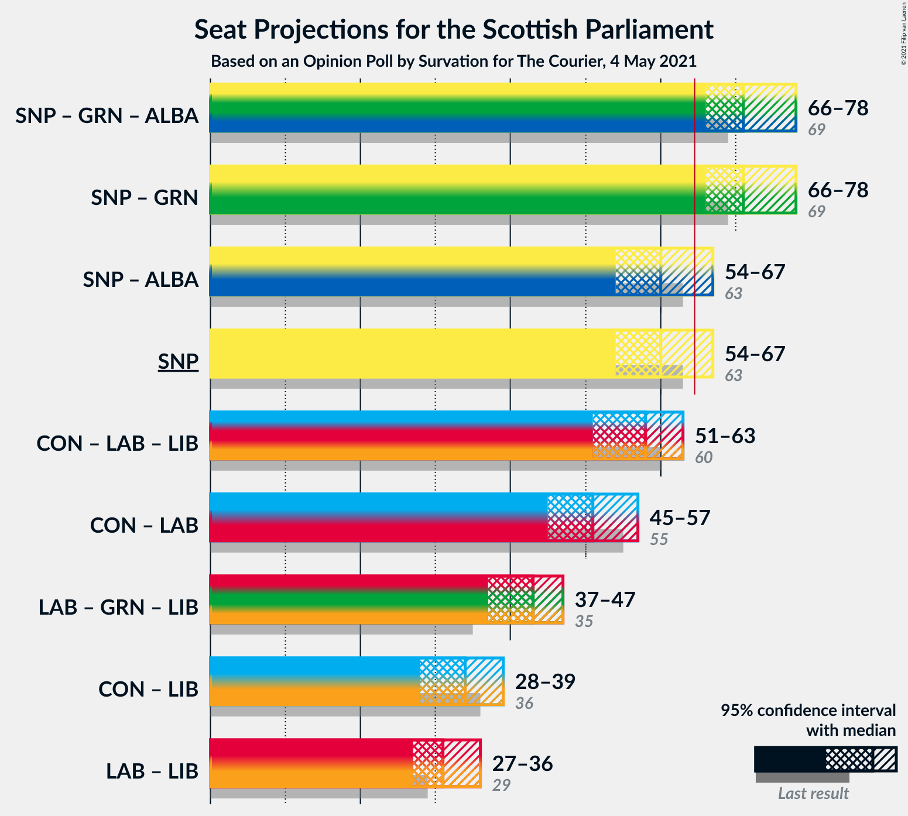
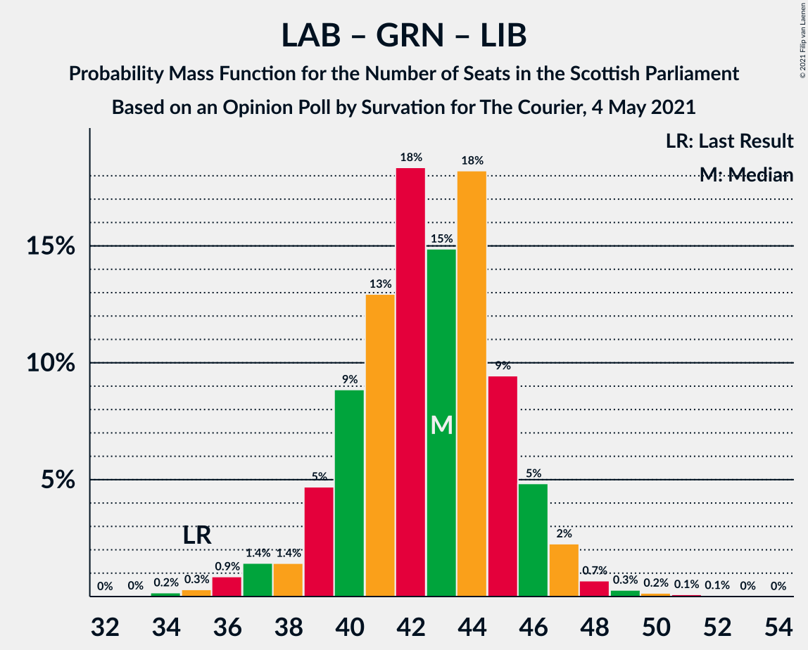

# Opinion Poll by Survation for The Courier, 4 May 2021

<a href="#voting-intentions">Voting Intentions</a> | <a href="#seats">Seats</a> | <a href="#coalitions">Coalitions</a> | <a href="#technical-information">Technical Information</a>

## Voting Intentions

### Confidence Intervals

| Party | Last Result | Poll Result | 80% Confidence Interval | 90% Confidence Interval | 95% Confidence Interval | 99% Confidence Interval |
|:-----:|:-----------:|:-----------:|:-----------------------:|:-----------------------:|:-----------------------:|:-----------------------:|
| Scottish National Party | 41.7% | 36.0% | 34.1–38.0% |33.6–38.5% |33.1–39.0% |32.2–40.0% |
| Scottish Conservative & Unionist Party | 22.9% | 21.0% | 19.4–22.8% |19.0–23.2% |18.6–23.7% |17.9–24.5% |
| Scottish Labour | 19.1% | 19.0% | 17.5–20.7% |17.1–21.2% |16.7–21.6% |16.0–22.4% |
| Scottish Greens | 6.6% | 10.0% | 8.9–11.3% |8.6–11.7% |8.3–12.0% |7.8–12.7% |
| Scottish Liberal Democrats | 5.2% | 7.0% | 6.1–8.2% |5.8–8.5% |5.6–8.8% |5.2–9.4% |
| Alba Party | 0.0% | 3.0% | 2.4–3.8% |2.2–4.0% |2.1–4.2% |1.8–4.6% |

*Note:* The poll result column reflects the actual value used in the calculations. Published results may vary slightly, and in addition be rounded to fewer digits.

## Seats

### Confidence Intervals

| Party | Last Result | Median | 80% Confidence Interval | 90% Confidence Interval | 95% Confidence Interval | 99% Confidence Interval |
|:-----:|:-----------:|:------:|:-----------------------:|:-----------------------:|:-----------------------:|:-----------------------:|
| <a href="#scottish-national-party">Scottish National Party</a> | 63 | 60 | 57–63 |56–66 |54–67 |52–69 |
| <a href="#scottish-conservative-&-unionist-party">Scottish Conservative & Unionist Party</a> | 31 | 26 | 24–29 |23–30 |21–31 |21–33 |
| <a href="#scottish-labour">Scottish Labour</a> | 24 | 24 | 22–26 |21–27 |20–28 |18–31 |
| <a href="#scottish-greens">Scottish Greens</a> | 6 | 11 | 10–13 |10–13 |10–14 |9–15 |
| <a href="#scottish-liberal-democrats">Scottish Liberal Democrats</a> | 5 | 7 | 5–9 |5–10 |5–10 |4–11 |
| <a href="#alba-party">Alba Party</a> | 0 | 0 | 0 |0 |0 |0 |

### Scottish National Party

*For a full overview of the results for this party, see the [Scottish National Party](party-scottishnationalparty.html) page.*

| Number of Seats | Probability | Accumulated | Special Marks |
|:---------------:|:-----------:|:-----------:|:-------------:|
| 49 | 0.1% | 100% |  |
| 50 | 0.1% | 99.9% |  |
| 51 | 0.2% | 99.8% |  |
| 52 | 0.4% | 99.7% |  |
| 53 | 1.2% | 99.3% |  |
| 54 | 1.3% | 98% |  |
| 55 | 1.4% | 97% |  |
| 56 | 2% | 95% |  |
| 57 | 4% | 94% |  |
| 58 | 7% | 90% |  |
| 59 | 20% | 83% |  |
| 60 | 33% | 63% | Median |
| 61 | 11% | 30% |  |
| 62 | 5% | 19% |  |
| 63 | 5% | 14% | Last Result |
| 64 | 3% | 10% |  |
| 65 | 1.4% | 7% | Majority |
| 66 | 1.5% | 5% |  |
| 67 | 2% | 4% |  |
| 68 | 1.3% | 2% |  |
| 69 | 0.3% | 0.6% |  |
| 70 | 0.1% | 0.3% |  |
| 71 | 0.1% | 0.1% |  |
| 72 | 0% | 0% |  |

### Scottish Conservative & Unionist Party

*For a full overview of the results for this party, see the [Scottish Conservative & Unionist Party](party-scottishconservativeunionistparty.html) page.*

| Number of Seats | Probability | Accumulated | Special Marks |
|:---------------:|:-----------:|:-----------:|:-------------:|
| 20 | 0.2% | 100% |  |
| 21 | 2% | 99.8% |  |
| 22 | 2% | 97% |  |
| 23 | 4% | 96% |  |
| 24 | 12% | 92% |  |
| 25 | 18% | 80% |  |
| 26 | 16% | 62% | Median |
| 27 | 17% | 46% |  |
| 28 | 12% | 29% |  |
| 29 | 9% | 18% |  |
| 30 | 5% | 8% |  |
| 31 | 2% | 4% | Last Result |
| 32 | 0.8% | 2% |  |
| 33 | 1.3% | 2% |  |
| 34 | 0.3% | 0.3% |  |
| 35 | 0% | 0.1% |  |
| 36 | 0% | 0% |  |

### Scottish Labour

*For a full overview of the results for this party, see the [Scottish Labour](party-scottishlabour.html) page.*

| Number of Seats | Probability | Accumulated | Special Marks |
|:---------------:|:-----------:|:-----------:|:-------------:|
| 17 | 0.1% | 100% |  |
| 18 | 0.5% | 99.9% |  |
| 19 | 1.3% | 99.4% |  |
| 20 | 1.1% | 98% |  |
| 21 | 3% | 97% |  |
| 22 | 5% | 94% |  |
| 23 | 16% | 89% |  |
| 24 | 23% | 72% | Last Result, Median |
| 25 | 28% | 49% |  |
| 26 | 14% | 22% |  |
| 27 | 4% | 8% |  |
| 28 | 2% | 4% |  |
| 29 | 0.9% | 2% |  |
| 30 | 0.5% | 1.0% |  |
| 31 | 0.4% | 0.5% |  |
| 32 | 0.1% | 0.1% |  |
| 33 | 0% | 0% |  |

### Scottish Greens

*For a full overview of the results for this party, see the [Scottish Greens](party-scottishgreens.html) page.*

| Number of Seats | Probability | Accumulated | Special Marks |
|:---------------:|:-----------:|:-----------:|:-------------:|
| 6 | 0% | 100% | Last Result |
| 7 | 0.1% | 100% |  |
| 8 | 0.2% | 99.9% |  |
| 9 | 0.7% | 99.7% |  |
| 10 | 41% | 99.0% |  |
| 11 | 20% | 58% | Median |
| 12 | 26% | 38% |  |
| 13 | 9% | 12% |  |
| 14 | 2% | 3% |  |
| 15 | 0.5% | 0.6% |  |
| 16 | 0% | 0% |  |

### Scottish Liberal Democrats

*For a full overview of the results for this party, see the [Scottish Liberal Democrats](party-scottishliberaldemocrats.html) page.*

| Number of Seats | Probability | Accumulated | Special Marks |
|:---------------:|:-----------:|:-----------:|:-------------:|
| 3 | 0.1% | 100% |  |
| 4 | 0.9% | 99.9% |  |
| 5 | 13% | 98.9% | Last Result |
| 6 | 32% | 86% |  |
| 7 | 9% | 54% | Median |
| 8 | 30% | 45% |  |
| 9 | 9% | 15% |  |
| 10 | 5% | 6% |  |
| 11 | 1.0% | 1.2% |  |
| 12 | 0.2% | 0.2% |  |
| 13 | 0% | 0% |  |

### Alba Party

*For a full overview of the results for this party, see the [Alba Party](party-albaparty.html) page.*

| Number of Seats | Probability | Accumulated | Special Marks |
|:---------------:|:-----------:|:-----------:|:-------------:|
| 0 | 99.8% | 100% | Last Result, Median |
| 1 | 0.1% | 0.2% |  |
| 2 | 0.1% | 0.1% |  |
| 3 | 0% | 0% |  |

## Coalitions

### Confidence Intervals

| Coalition | Last Result | Median | Majority? | 80% Confidence Interval | 90% Confidence Interval | 95% Confidence Interval | 99% Confidence Interval |
|:---------:|:-----------:|:------:|:---------:|:-----------------------:|:-----------------------:|:-----------------------:|:-----------------------:|
| Scottish National Party – Scottish Greens – Alba Party | 69 | 71 | 98% | 68–74 | 67–77 | 66–78 | 63–79 |
| Scottish National Party – Scottish Greens | 69 | 71 | 98% | 68–74 | 67–77 | 66–78 | 63–79 |
| Scottish National Party – Alba Party | 63 | 60 | 7% | 57–63 | 56–66 | 54–67 | 52–69 |
| Scottish National Party | 63 | 60 | 7% | 57–63 | 56–66 | 54–67 | 52–69 |
| Scottish Conservative & Unionist Party – Scottish Labour – Scottish Liberal Democrats | 60 | 58 | 2% | 55–61 | 52–62 | 51–63 | 50–66 |
| Scottish Conservative & Unionist Party – Scottish Labour | 55 | 51 | 0% | 48–54 | 46–55 | 45–57 | 43–59 |
| Scottish Labour – Scottish Greens – Scottish Liberal Democrats | 35 | 43 | 0% | 40–45 | 39–46 | 37–47 | 35–49 |
| Scottish Conservative & Unionist Party – Scottish Liberal Democrats | 36 | 34 | 0% | 30–36 | 29–37 | 28–39 | 27–41 |
| Scottish Labour – Scottish Liberal Democrats | 29 | 31 | 0% | 29–34 | 28–35 | 27–36 | 25–38 |

### Scottish National Party – Scottish Greens – Alba Party

| Number of Seats | Probability | Accumulated | Special Marks |
|:---------------:|:-----------:|:-----------:|:-------------:|
| 60 | 0% | 100% |  |
| 61 | 0.1% | 99.9% |  |
| 62 | 0.3% | 99.8% |  |
| 63 | 0.4% | 99.5% |  |
| 64 | 0.7% | 99.2% |  |
| 65 | 0.9% | 98% | Majority |
| 66 | 2% | 98% |  |
| 67 | 3% | 96% |  |
| 68 | 4% | 93% |  |
| 69 | 11% | 90% | Last Result |
| 70 | 17% | 78% |  |
| 71 | 20% | 62% | Median |
| 72 | 17% | 42% |  |
| 73 | 10% | 25% |  |
| 74 | 6% | 15% |  |
| 75 | 3% | 9% |  |
| 76 | 1.4% | 7% |  |
| 77 | 2% | 5% |  |
| 78 | 2% | 4% |  |
| 79 | 1.3% | 2% |  |
| 80 | 0.3% | 0.5% |  |
| 81 | 0.2% | 0.2% |  |
| 82 | 0% | 0% |  |

### Scottish National Party – Scottish Greens

| Number of Seats | Probability | Accumulated | Special Marks |
|:---------------:|:-----------:|:-----------:|:-------------:|
| 60 | 0% | 100% |  |
| 61 | 0.1% | 99.9% |  |
| 62 | 0.3% | 99.8% |  |
| 63 | 0.4% | 99.5% |  |
| 64 | 0.8% | 99.2% |  |
| 65 | 0.9% | 98% | Majority |
| 66 | 2% | 98% |  |
| 67 | 3% | 96% |  |
| 68 | 4% | 93% |  |
| 69 | 11% | 90% | Last Result |
| 70 | 17% | 78% |  |
| 71 | 20% | 62% | Median |
| 72 | 17% | 42% |  |
| 73 | 10% | 25% |  |
| 74 | 6% | 15% |  |
| 75 | 3% | 9% |  |
| 76 | 1.4% | 7% |  |
| 77 | 2% | 5% |  |
| 78 | 2% | 4% |  |
| 79 | 1.3% | 2% |  |
| 80 | 0.3% | 0.5% |  |
| 81 | 0.2% | 0.2% |  |
| 82 | 0% | 0% |  |

### Scottish National Party – Alba Party

| Number of Seats | Probability | Accumulated | Special Marks |
|:---------------:|:-----------:|:-----------:|:-------------:|
| 49 | 0.1% | 100% |  |
| 50 | 0.1% | 99.9% |  |
| 51 | 0.2% | 99.8% |  |
| 52 | 0.4% | 99.7% |  |
| 53 | 1.2% | 99.3% |  |
| 54 | 1.3% | 98% |  |
| 55 | 1.4% | 97% |  |
| 56 | 2% | 95% |  |
| 57 | 4% | 94% |  |
| 58 | 7% | 90% |  |
| 59 | 19% | 83% |  |
| 60 | 33% | 63% | Median |
| 61 | 11% | 30% |  |
| 62 | 5% | 19% |  |
| 63 | 5% | 14% | Last Result |
| 64 | 3% | 10% |  |
| 65 | 1.4% | 7% | Majority |
| 66 | 1.5% | 5% |  |
| 67 | 2% | 4% |  |
| 68 | 1.3% | 2% |  |
| 69 | 0.3% | 0.6% |  |
| 70 | 0.1% | 0.3% |  |
| 71 | 0.1% | 0.1% |  |
| 72 | 0% | 0% |  |

### Scottish National Party

| Number of Seats | Probability | Accumulated | Special Marks |
|:---------------:|:-----------:|:-----------:|:-------------:|
| 49 | 0.1% | 100% |  |
| 50 | 0.1% | 99.9% |  |
| 51 | 0.2% | 99.8% |  |
| 52 | 0.4% | 99.7% |  |
| 53 | 1.2% | 99.3% |  |
| 54 | 1.3% | 98% |  |
| 55 | 1.4% | 97% |  |
| 56 | 2% | 95% |  |
| 57 | 4% | 94% |  |
| 58 | 7% | 90% |  |
| 59 | 20% | 83% |  |
| 60 | 33% | 63% | Median |
| 61 | 11% | 30% |  |
| 62 | 5% | 19% |  |
| 63 | 5% | 14% | Last Result |
| 64 | 3% | 10% |  |
| 65 | 1.4% | 7% | Majority |
| 66 | 1.5% | 5% |  |
| 67 | 2% | 4% |  |
| 68 | 1.3% | 2% |  |
| 69 | 0.3% | 0.6% |  |
| 70 | 0.1% | 0.3% |  |
| 71 | 0.1% | 0.1% |  |
| 72 | 0% | 0% |  |

### Scottish Conservative & Unionist Party – Scottish Labour – Scottish Liberal Democrats

| Number of Seats | Probability | Accumulated | Special Marks |
|:---------------:|:-----------:|:-----------:|:-------------:|
| 48 | 0.2% | 100% |  |
| 49 | 0.3% | 99.8% |  |
| 50 | 1.3% | 99.5% |  |
| 51 | 2% | 98% |  |
| 52 | 2% | 96% |  |
| 53 | 1.4% | 95% |  |
| 54 | 3% | 93% |  |
| 55 | 6% | 91% |  |
| 56 | 10% | 85% |  |
| 57 | 17% | 75% | Median |
| 58 | 20% | 58% |  |
| 59 | 17% | 38% |  |
| 60 | 11% | 22% | Last Result |
| 61 | 4% | 10% |  |
| 62 | 3% | 7% |  |
| 63 | 2% | 4% |  |
| 64 | 0.9% | 2% |  |
| 65 | 0.7% | 2% | Majority |
| 66 | 0.4% | 0.8% |  |
| 67 | 0.3% | 0.5% |  |
| 68 | 0.1% | 0.2% |  |
| 69 | 0% | 0.1% |  |
| 70 | 0% | 0% |  |

### Scottish Conservative & Unionist Party – Scottish Labour

| Number of Seats | Probability | Accumulated | Special Marks |
|:---------------:|:-----------:|:-----------:|:-------------:|
| 42 | 0.2% | 100% |  |
| 43 | 0.3% | 99.8% |  |
| 44 | 1.5% | 99.5% |  |
| 45 | 2% | 98% |  |
| 46 | 2% | 96% |  |
| 47 | 4% | 94% |  |
| 48 | 8% | 90% |  |
| 49 | 15% | 82% |  |
| 50 | 16% | 67% | Median |
| 51 | 13% | 52% |  |
| 52 | 13% | 39% |  |
| 53 | 11% | 25% |  |
| 54 | 7% | 14% |  |
| 55 | 3% | 7% | Last Result |
| 56 | 1.3% | 4% |  |
| 57 | 1.4% | 3% |  |
| 58 | 0.6% | 1.2% |  |
| 59 | 0.3% | 0.6% |  |
| 60 | 0.2% | 0.3% |  |
| 61 | 0.1% | 0.1% |  |
| 62 | 0% | 0.1% |  |
| 63 | 0% | 0% |  |

### Scottish Labour – Scottish Greens – Scottish Liberal Democrats

| Number of Seats | Probability | Accumulated | Special Marks |
|:---------------:|:-----------:|:-----------:|:-------------:|
| 34 | 0.2% | 100% |  |
| 35 | 0.3% | 99.8% | Last Result |
| 36 | 0.9% | 99.5% |  |
| 37 | 1.4% | 98.6% |  |
| 38 | 1.4% | 97% |  |
| 39 | 5% | 96% |  |
| 40 | 9% | 91% |  |
| 41 | 13% | 82% |  |
| 42 | 18% | 69% | Median |
| 43 | 15% | 51% |  |
| 44 | 18% | 36% |  |
| 45 | 9% | 18% |  |
| 46 | 5% | 8% |  |
| 47 | 2% | 4% |  |
| 48 | 0.7% | 1.3% |  |
| 49 | 0.3% | 0.6% |  |
| 50 | 0.2% | 0.3% |  |
| 51 | 0.1% | 0.2% |  |
| 52 | 0.1% | 0.1% |  |
| 53 | 0% | 0% |  |

### Scottish Conservative & Unionist Party – Scottish Liberal Democrats

| Number of Seats | Probability | Accumulated | Special Marks |
|:---------------:|:-----------:|:-----------:|:-------------:|
| 25 | 0.3% | 100% |  |
| 26 | 0.1% | 99.7% |  |
| 27 | 2% | 99.6% |  |
| 28 | 1.1% | 98% |  |
| 29 | 3% | 97% |  |
| 30 | 5% | 94% |  |
| 31 | 7% | 89% |  |
| 32 | 13% | 83% |  |
| 33 | 19% | 70% | Median |
| 34 | 21% | 51% |  |
| 35 | 16% | 30% |  |
| 36 | 7% | 14% | Last Result |
| 37 | 3% | 7% |  |
| 38 | 2% | 5% |  |
| 39 | 1.4% | 3% |  |
| 40 | 0.8% | 2% |  |
| 41 | 0.5% | 0.9% |  |
| 42 | 0.3% | 0.4% |  |
| 43 | 0.1% | 0.1% |  |
| 44 | 0% | 0% |  |

### Scottish Labour – Scottish Liberal Democrats

| Number of Seats | Probability | Accumulated | Special Marks |
|:---------------:|:-----------:|:-----------:|:-------------:|
| 23 | 0.1% | 100% |  |
| 24 | 0.3% | 99.9% |  |
| 25 | 0.9% | 99.6% |  |
| 26 | 1.0% | 98.7% |  |
| 27 | 2% | 98% |  |
| 28 | 3% | 96% |  |
| 29 | 10% | 93% | Last Result |
| 30 | 17% | 83% |  |
| 31 | 17% | 66% | Median |
| 32 | 17% | 49% |  |
| 33 | 16% | 32% |  |
| 34 | 9% | 16% |  |
| 35 | 3% | 6% |  |
| 36 | 2% | 3% |  |
| 37 | 1.1% | 2% |  |
| 38 | 0.3% | 0.6% |  |
| 39 | 0.1% | 0.3% |  |
| 40 | 0.1% | 0.2% |  |
| 41 | 0% | 0.1% |  |
| 42 | 0% | 0% |  |

## Technical Information

### Opinion Poll

+ **Polling firm:** Survation
+ **Commissioner(s):** The Courier
+ **Fieldwork period:** 4 May 2021

### Calculations

+ **Sample size:** 1008
+ **Simulations done:** 1,048,576
+ **Error estimate:** 0.52%

