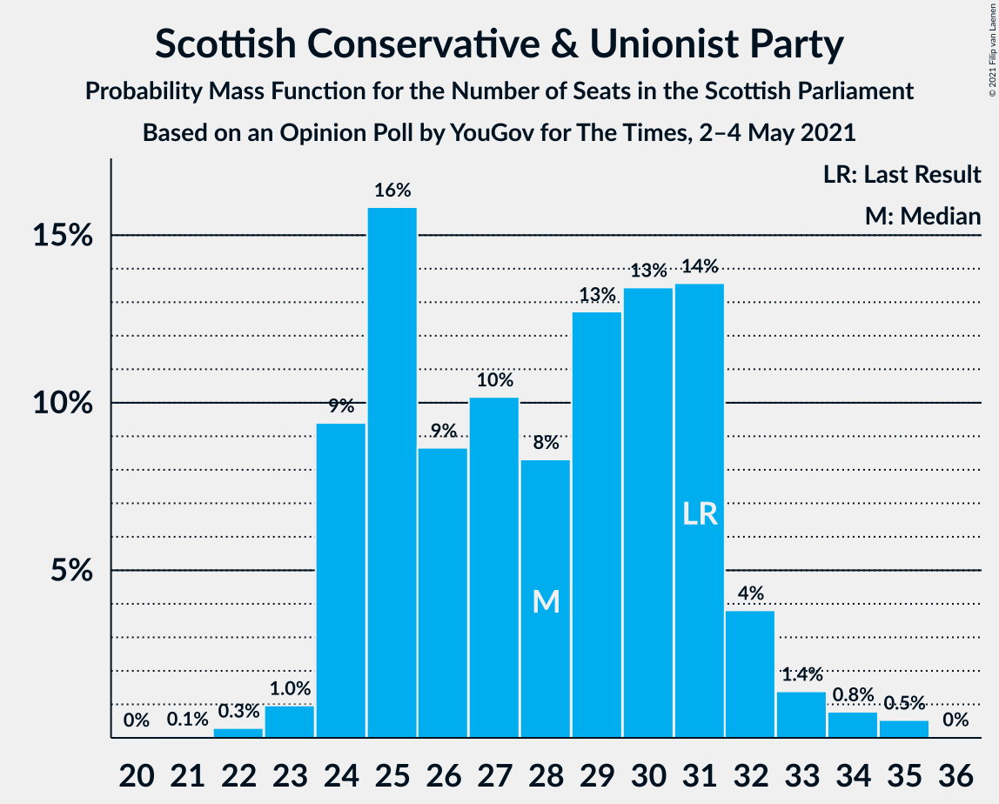
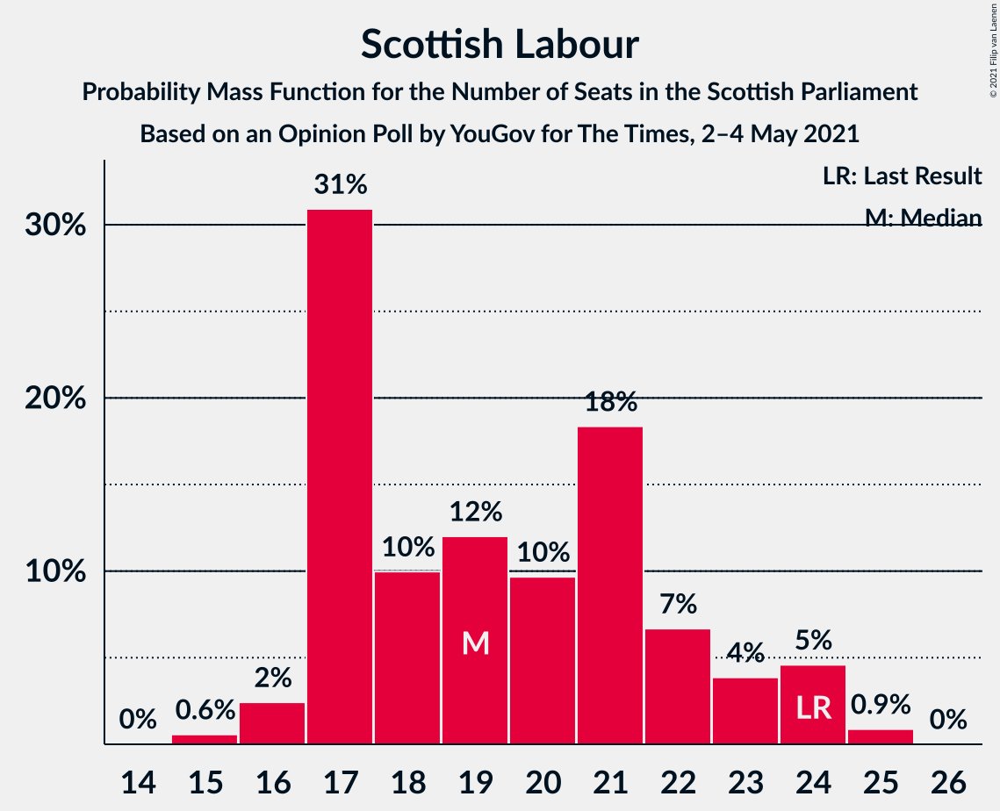
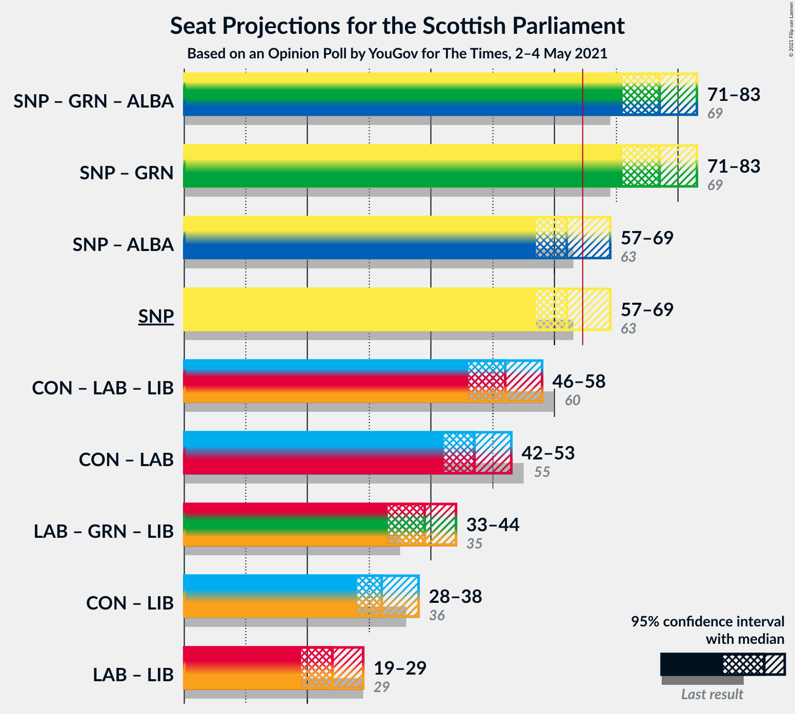
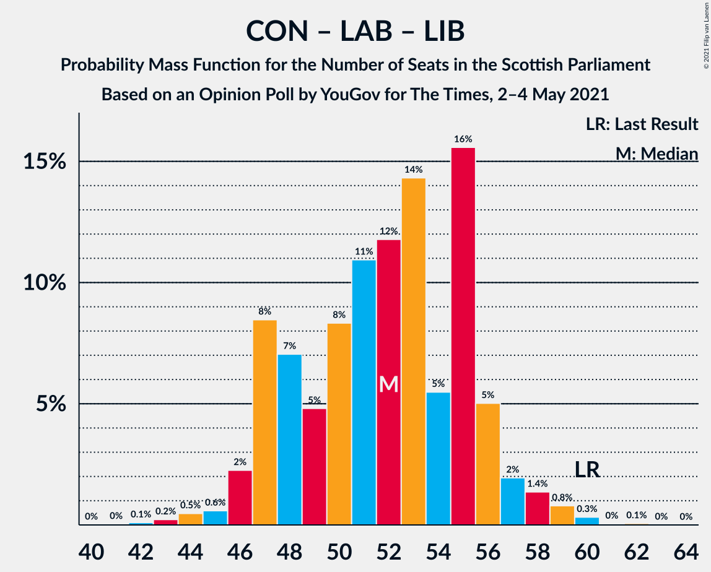

# Opinion Poll by YouGov for The Times, 2–4 May 2021

<a href="#voting-intentions">Voting Intentions</a> | <a href="#seats">Seats</a> | <a href="#coalitions">Coalitions</a> | <a href="#technical-information">Technical Information</a>

## Voting Intentions

### Confidence Intervals

| Party | Last Result | Poll Result | 80% Confidence Interval | 90% Confidence Interval | 95% Confidence Interval | 99% Confidence Interval |
|:-----:|:-----------:|:-----------:|:-----------------------:|:-----------------------:|:-----------------------:|:-----------------------:|
| Scottish National Party | 41.7% | 38.0% | 36.1–40.0% |35.5–40.6% |35.0–41.1% |34.1–42.0% |
| Scottish Conservative & Unionist Party | 22.9% | 22.0% | 20.4–23.7% |19.9–24.2% |19.5–24.7% |18.8–25.5% |
| Scottish Labour | 19.1% | 16.0% | 14.6–17.6% |14.2–18.0% |13.9–18.4% |13.2–19.2% |
| Scottish Greens | 6.6% | 13.0% | 11.7–14.5% |11.4–14.9% |11.1–15.2% |10.5–16.0% |
| Scottish Liberal Democrats | 5.2% | 5.0% | 4.2–6.0% |4.0–6.3% |3.8–6.5% |3.5–7.1% |
| Alba Party | 0.0% | 3.0% | 2.4–3.8% |2.2–4.1% |2.1–4.3% |1.9–4.7% |
| Reform UK | 0.0% | 1.0% | 0.7–1.5% |0.6–1.7% |0.5–1.8% |0.4–2.1% |

*Note:* The poll result column reflects the actual value used in the calculations. Published results may vary slightly, and in addition be rounded to fewer digits.

## Seats

### Confidence Intervals

| Party | Last Result | Median | 80% Confidence Interval | 90% Confidence Interval | 95% Confidence Interval | 99% Confidence Interval |
|:-----:|:-----------:|:------:|:-----------------------:|:-----------------------:|:-----------------------:|:-----------------------:|
| <a href="#scottish-national-party">Scottish National Party</a> | 63 | 64 | 60–69 |60–69 |59–69 |55–69 |
| <a href="#scottish-conservative-&-unionist-party">Scottish Conservative & Unionist Party</a> | 31 | 27 | 25–31 |24–32 |24–32 |22–34 |
| <a href="#scottish-labour">Scottish Labour</a> | 24 | 18 | 17–21 |16–22 |16–23 |15–24 |
| <a href="#scottish-greens">Scottish Greens</a> | 6 | 14 | 13–18 |12–18 |12–19 |11–20 |
| <a href="#scottish-liberal-democrats">Scottish Liberal Democrats</a> | 5 | 4 | 2–5 |2–5 |2–6 |2–6 |
| <a href="#alba-party">Alba Party</a> | 0 | 0 | 0 |0 |0 |0–1 |
| <a href="#reform-uk">Reform UK</a> | 0 | 0 | 0 |0 |0 |0 |

### Scottish National Party

*For a full overview of the results for this party, see the [Scottish National Party](party-scottishnationalparty.html) page.*

| Number of Seats | Probability | Accumulated | Special Marks |
|:---------------:|:-----------:|:-----------:|:-------------:|
| 55 | 0.6% | 100% |  |
| 56 | 0.3% | 99.4% |  |
| 57 | 0.1% | 99.1% |  |
| 58 | 0.7% | 99.0% |  |
| 59 | 3% | 98% |  |
| 60 | 7% | 95% |  |
| 61 | 10% | 88% |  |
| 62 | 5% | 78% |  |
| 63 | 15% | 73% | Last Result |
| 64 | 10% | 58% | Median |
| 65 | 4% | 48% | Majority |
| 66 | 4% | 44% |  |
| 67 | 5% | 40% |  |
| 68 | 19% | 36% |  |
| 69 | 17% | 17% |  |
| 70 | 0.1% | 0.1% |  |
| 71 | 0% | 0% |  |

### Scottish Conservative & Unionist Party

*For a full overview of the results for this party, see the [Scottish Conservative & Unionist Party](party-scottishconservativeunionistparty.html) page.*

| Number of Seats | Probability | Accumulated | Special Marks |
|:---------------:|:-----------:|:-----------:|:-------------:|
| 21 | 0.1% | 100% |  |
| 22 | 0.5% | 99.9% |  |
| 23 | 0.9% | 99.3% |  |
| 24 | 7% | 98% |  |
| 25 | 27% | 92% |  |
| 26 | 8% | 65% |  |
| 27 | 10% | 57% | Median |
| 28 | 12% | 47% |  |
| 29 | 12% | 35% |  |
| 30 | 8% | 23% |  |
| 31 | 9% | 15% | Last Result |
| 32 | 3% | 5% |  |
| 33 | 1.2% | 2% |  |
| 34 | 0.5% | 0.9% |  |
| 35 | 0.4% | 0.4% |  |
| 36 | 0% | 0% |  |

### Scottish Labour

*For a full overview of the results for this party, see the [Scottish Labour](party-scottishlabour.html) page.*

| Number of Seats | Probability | Accumulated | Special Marks |
|:---------------:|:-----------:|:-----------:|:-------------:|
| 15 | 1.3% | 100% |  |
| 16 | 4% | 98.7% |  |
| 17 | 41% | 94% |  |
| 18 | 14% | 54% | Median |
| 19 | 13% | 40% |  |
| 20 | 9% | 26% |  |
| 21 | 10% | 18% |  |
| 22 | 5% | 7% |  |
| 23 | 1.3% | 3% |  |
| 24 | 1.3% | 1.4% | Last Result |
| 25 | 0.1% | 0.1% |  |
| 26 | 0% | 0% |  |

### Scottish Greens

*For a full overview of the results for this party, see the [Scottish Greens](party-scottishgreens.html) page.*

| Number of Seats | Probability | Accumulated | Special Marks |
|:---------------:|:-----------:|:-----------:|:-------------:|
| 6 | 0% | 100% | Last Result |
| 7 | 0% | 100% |  |
| 8 | 0% | 100% |  |
| 9 | 0% | 100% |  |
| 10 | 0% | 100% |  |
| 11 | 2% | 100% |  |
| 12 | 3% | 98% |  |
| 13 | 40% | 95% |  |
| 14 | 18% | 55% | Median |
| 15 | 19% | 37% |  |
| 16 | 5% | 18% |  |
| 17 | 3% | 13% |  |
| 18 | 6% | 10% |  |
| 19 | 3% | 4% |  |
| 20 | 1.1% | 1.4% |  |
| 21 | 0.2% | 0.2% |  |
| 22 | 0% | 0% |  |

### Scottish Liberal Democrats

*For a full overview of the results for this party, see the [Scottish Liberal Democrats](party-scottishliberaldemocrats.html) page.*

| Number of Seats | Probability | Accumulated | Special Marks |
|:---------------:|:-----------:|:-----------:|:-------------:|
| 2 | 12% | 100% |  |
| 3 | 10% | 88% |  |
| 4 | 34% | 77% | Median |
| 5 | 39% | 43% | Last Result |
| 6 | 5% | 5% |  |
| 7 | 0.1% | 0.2% |  |
| 8 | 0.1% | 0.1% |  |
| 9 | 0% | 0% |  |

### Alba Party

*For a full overview of the results for this party, see the [Alba Party](party-albaparty.html) page.*

| Number of Seats | Probability | Accumulated | Special Marks |
|:---------------:|:-----------:|:-----------:|:-------------:|
| 0 | 99.4% | 100% | Last Result, Median |
| 1 | 0.4% | 0.6% |  |
| 2 | 0.1% | 0.1% |  |
| 3 | 0% | 0% |  |

### Reform UK

*For a full overview of the results for this party, see the [Reform UK](party-reformuk.html) page.*

| Number of Seats | Probability | Accumulated | Special Marks |
|:---------------:|:-----------:|:-----------:|:-------------:|
| 0 | 100% | 100% | Last Result, Median |

## Coalitions

### Confidence Intervals

| Coalition | Last Result | Median | Majority? | 80% Confidence Interval | 90% Confidence Interval | 95% Confidence Interval | 99% Confidence Interval |
|:---------:|:-----------:|:------:|:---------:|:-----------------------:|:-----------------------:|:-----------------------:|:-----------------------:|
| Scottish National Party – Scottish Greens – Alba Party | 69 | 79 | 100% | 74–82 | 74–83 | 73–84 | 70–86 |
| Scottish National Party – Scottish Greens | 69 | 79 | 100% | 74–82 | 74–83 | 73–84 | 70–86 |
| Scottish National Party – Alba Party | 63 | 64 | 48% | 60–69 | 60–69 | 59–69 | 55–69 |
| Scottish National Party | 63 | 64 | 48% | 60–69 | 60–69 | 59–69 | 55–69 |
| Scottish Conservative & Unionist Party – Scottish Labour – Scottish Liberal Democrats | 60 | 50 | 0% | 47–55 | 46–55 | 45–56 | 43–59 |
| Scottish Conservative & Unionist Party – Scottish Labour | 55 | 45 | 0% | 43–50 | 42–51 | 41–52 | 40–54 |
| Scottish Labour – Scottish Greens – Scottish Liberal Democrats | 35 | 36 | 0% | 33–41 | 32–42 | 32–43 | 32–44 |
| Scottish Conservative & Unionist Party – Scottish Liberal Democrats | 36 | 31 | 0% | 28–36 | 27–36 | 27–37 | 25–39 |
| Scottish Labour – Scottish Liberal Democrats | 29 | 22 | 0% | 20–26 | 19–26 | 19–27 | 18–29 |

### Scottish National Party – Scottish Greens – Alba Party

| Number of Seats | Probability | Accumulated | Special Marks |
|:---------------:|:-----------:|:-----------:|:-------------:|
| 69 | 0.1% | 100% | Last Result |
| 70 | 0.5% | 99.9% |  |
| 71 | 0.6% | 99.4% |  |
| 72 | 0.5% | 98.8% |  |
| 73 | 1.1% | 98% |  |
| 74 | 9% | 97% |  |
| 75 | 3% | 88% |  |
| 76 | 7% | 85% |  |
| 77 | 7% | 77% |  |
| 78 | 12% | 71% | Median |
| 79 | 11% | 59% |  |
| 80 | 7% | 49% |  |
| 81 | 16% | 42% |  |
| 82 | 19% | 26% |  |
| 83 | 4% | 8% |  |
| 84 | 1.0% | 3% |  |
| 85 | 1.2% | 2% |  |
| 86 | 0.6% | 1.0% |  |
| 87 | 0.3% | 0.4% |  |
| 88 | 0.1% | 0.1% |  |
| 89 | 0% | 0% |  |

### Scottish National Party – Scottish Greens

| Number of Seats | Probability | Accumulated | Special Marks |
|:---------------:|:-----------:|:-----------:|:-------------:|
| 69 | 0.1% | 100% | Last Result |
| 70 | 0.5% | 99.9% |  |
| 71 | 0.6% | 99.4% |  |
| 72 | 0.5% | 98.8% |  |
| 73 | 1.1% | 98% |  |
| 74 | 9% | 97% |  |
| 75 | 3% | 88% |  |
| 76 | 7% | 85% |  |
| 77 | 6% | 77% |  |
| 78 | 12% | 71% | Median |
| 79 | 11% | 59% |  |
| 80 | 7% | 48% |  |
| 81 | 16% | 42% |  |
| 82 | 19% | 26% |  |
| 83 | 4% | 7% |  |
| 84 | 1.0% | 3% |  |
| 85 | 1.2% | 2% |  |
| 86 | 0.6% | 1.0% |  |
| 87 | 0.3% | 0.4% |  |
| 88 | 0.1% | 0.1% |  |
| 89 | 0% | 0% |  |

### Scottish National Party – Alba Party

| Number of Seats | Probability | Accumulated | Special Marks |
|:---------------:|:-----------:|:-----------:|:-------------:|
| 55 | 0.6% | 100% |  |
| 56 | 0.3% | 99.4% |  |
| 57 | 0.1% | 99.1% |  |
| 58 | 0.7% | 99.0% |  |
| 59 | 3% | 98% |  |
| 60 | 7% | 95% |  |
| 61 | 10% | 88% |  |
| 62 | 5% | 78% |  |
| 63 | 15% | 73% | Last Result |
| 64 | 10% | 58% | Median |
| 65 | 4% | 48% | Majority |
| 66 | 4% | 44% |  |
| 67 | 5% | 40% |  |
| 68 | 19% | 36% |  |
| 69 | 17% | 17% |  |
| 70 | 0.2% | 0.2% |  |
| 71 | 0% | 0% |  |

### Scottish National Party

| Number of Seats | Probability | Accumulated | Special Marks |
|:---------------:|:-----------:|:-----------:|:-------------:|
| 55 | 0.6% | 100% |  |
| 56 | 0.3% | 99.4% |  |
| 57 | 0.1% | 99.1% |  |
| 58 | 0.7% | 99.0% |  |
| 59 | 3% | 98% |  |
| 60 | 7% | 95% |  |
| 61 | 10% | 88% |  |
| 62 | 5% | 78% |  |
| 63 | 15% | 73% | Last Result |
| 64 | 10% | 58% | Median |
| 65 | 4% | 48% | Majority |
| 66 | 4% | 44% |  |
| 67 | 5% | 40% |  |
| 68 | 19% | 36% |  |
| 69 | 17% | 17% |  |
| 70 | 0.1% | 0.1% |  |
| 71 | 0% | 0% |  |

### Scottish Conservative & Unionist Party – Scottish Labour – Scottish Liberal Democrats

| Number of Seats | Probability | Accumulated | Special Marks |
|:---------------:|:-----------:|:-----------:|:-------------:|
| 41 | 0.1% | 100% |  |
| 42 | 0.3% | 99.9% |  |
| 43 | 0.6% | 99.6% |  |
| 44 | 1.2% | 99.0% |  |
| 45 | 1.0% | 98% |  |
| 46 | 4% | 97% |  |
| 47 | 19% | 92% |  |
| 48 | 16% | 74% |  |
| 49 | 7% | 58% | Median |
| 50 | 11% | 51% |  |
| 51 | 12% | 41% |  |
| 52 | 7% | 29% |  |
| 53 | 7% | 23% |  |
| 54 | 3% | 15% |  |
| 55 | 9% | 12% |  |
| 56 | 1.1% | 3% |  |
| 57 | 0.5% | 2% |  |
| 58 | 0.6% | 1.2% |  |
| 59 | 0.5% | 0.6% |  |
| 60 | 0.1% | 0.1% | Last Result |
| 61 | 0% | 0% |  |

### Scottish Conservative & Unionist Party – Scottish Labour

| Number of Seats | Probability | Accumulated | Special Marks |
|:---------------:|:-----------:|:-----------:|:-------------:|
| 38 | 0% | 100% |  |
| 39 | 0.3% | 99.9% |  |
| 40 | 1.2% | 99.7% |  |
| 41 | 2% | 98% |  |
| 42 | 5% | 97% |  |
| 43 | 14% | 92% |  |
| 44 | 13% | 78% |  |
| 45 | 17% | 65% | Median |
| 46 | 15% | 48% |  |
| 47 | 6% | 33% |  |
| 48 | 9% | 27% |  |
| 49 | 4% | 18% |  |
| 50 | 6% | 14% |  |
| 51 | 5% | 8% |  |
| 52 | 1.3% | 3% |  |
| 53 | 0.5% | 1.3% |  |
| 54 | 0.6% | 0.8% |  |
| 55 | 0.1% | 0.1% | Last Result |
| 56 | 0% | 0% |  |

### Scottish Labour – Scottish Greens – Scottish Liberal Democrats

| Number of Seats | Probability | Accumulated | Special Marks |
|:---------------:|:-----------:|:-----------:|:-------------:|
| 31 | 0.1% | 100% |  |
| 32 | 6% | 99.9% |  |
| 33 | 5% | 94% |  |
| 34 | 11% | 89% |  |
| 35 | 20% | 78% | Last Result |
| 36 | 8% | 58% | Median |
| 37 | 11% | 50% |  |
| 38 | 9% | 39% |  |
| 39 | 6% | 30% |  |
| 40 | 10% | 24% |  |
| 41 | 7% | 14% |  |
| 42 | 4% | 7% |  |
| 43 | 1.3% | 3% |  |
| 44 | 1.5% | 2% |  |
| 45 | 0.2% | 0.3% |  |
| 46 | 0% | 0% |  |

### Scottish Conservative & Unionist Party – Scottish Liberal Democrats

| Number of Seats | Probability | Accumulated | Special Marks |
|:---------------:|:-----------:|:-----------:|:-------------:|
| 24 | 0.1% | 100% |  |
| 25 | 0.4% | 99.9% |  |
| 26 | 1.0% | 99.4% |  |
| 27 | 3% | 98% |  |
| 28 | 7% | 95% |  |
| 29 | 16% | 88% |  |
| 30 | 11% | 72% |  |
| 31 | 18% | 61% | Median |
| 32 | 8% | 43% |  |
| 33 | 6% | 34% |  |
| 34 | 12% | 28% |  |
| 35 | 6% | 16% |  |
| 36 | 8% | 11% | Last Result |
| 37 | 2% | 3% |  |
| 38 | 1.0% | 2% |  |
| 39 | 0.4% | 0.8% |  |
| 40 | 0.3% | 0.4% |  |
| 41 | 0% | 0% |  |

### Scottish Labour – Scottish Liberal Democrats

| Number of Seats | Probability | Accumulated | Special Marks |
|:---------------:|:-----------:|:-----------:|:-------------:|
| 17 | 0.1% | 100% |  |
| 18 | 0.8% | 99.9% |  |
| 19 | 8% | 99.1% |  |
| 20 | 9% | 91% |  |
| 21 | 11% | 83% |  |
| 22 | 33% | 72% | Median |
| 23 | 7% | 39% |  |
| 24 | 11% | 32% |  |
| 25 | 8% | 21% |  |
| 26 | 8% | 13% |  |
| 27 | 2% | 4% |  |
| 28 | 1.3% | 2% |  |
| 29 | 0.5% | 0.6% | Last Result |
| 30 | 0.1% | 0.1% |  |
| 31 | 0% | 0% |  |

## Technical Information

### Opinion Poll

+ **Polling firm:** YouGov
+ **Commissioner(s):** The Times
+ **Fieldwork period:** 2–4 May 2021

### Calculations

+ **Sample size:** 1000
+ **Simulations done:** 262,144
+ **Error estimate:** 0.94%

