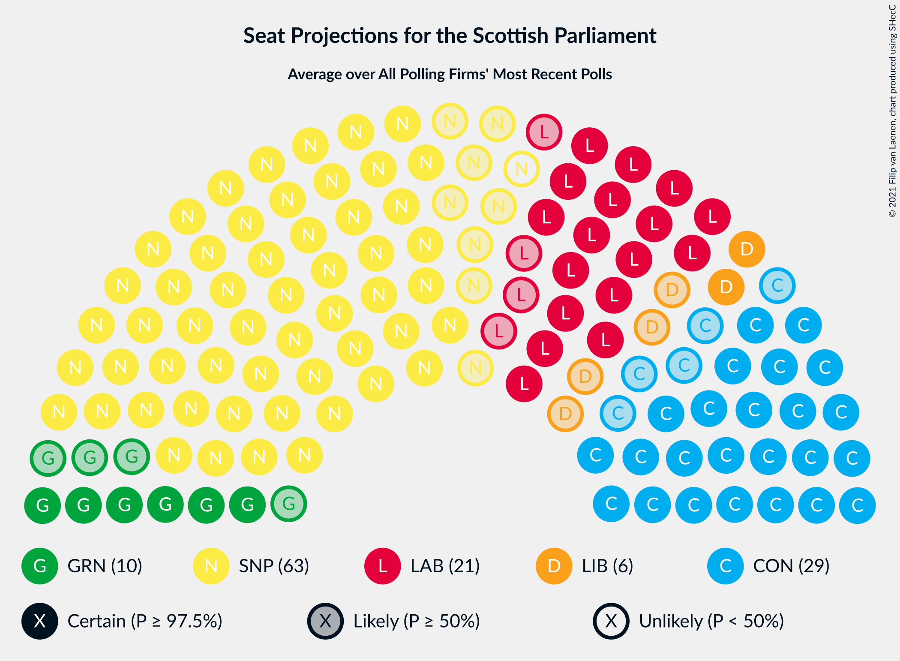

# Poll Average

<a href="#voting-intentions">Voting Intentions</a> | <a href="#seats">Seats</a> | <a href="#coalitions">Coalitions</a> | <a href="#technical-information">Technical Information</a>

## Summary

The table below lists the polls on which the average is based. They are the most recent polls (less than 90 days old) registered and analyzed so far.

| Period     | Polling firm/Commissioner(s) | SNP | CON | LAB | GRN | LIB | ALBA | UKIP | REF | SSP | AFU |
|:----------:|:----------------------------:|:--:|:--:|:--:|:--:|:--:|:--:|:--:|:--:|:--:|:--:|
| 5 May 2016 | General Election | 41.7%   63 | 22.9%   31 | 19.1%   24 | 6.6%   6 | 5.2%   5 | 0.0%   0 | 2.0%   0 | 0.0%   0 | 0.5%   0 | 0.0%   0 |
| N/A | Poll Average | 34–46%   59–71 | 17–24%   19–32 | 15–20%   17–26 | 6–13%   4–15 | 4–9%   3–10 | 2–7%   0–8 | 1–2%   0 | 1–3%   0 | N/A   N/A | N/A   N/A |
| [9–12 April 2021](2021-04-12-Panelbase.html) | Panelbase   Believe in Scotland | 33–39%   54–65 | 19–25%   23–32 | 15–19%   17–25 | 7–11%   7–12 | 5–8%   4–8 | 5–8%   0–8 | N/A   N/A | N/A   N/A | N/A   N/A | N/A   N/A |
| [2–7 April 2021](2021-04-07-SavantaComRes.html) | Savanta ComRes   The Scotsman | 37–43%   60–69 | 18–23%   22–31 | 16–20%   18–26 | 7–11%   8–12 | 6–9%   5–10 | 2–4%   0 | N/A   N/A | N/A   N/A | N/A   N/A | N/A   N/A |
| [1–6 April 2021](2021-04-06-Opinium.html) | Opinium   Sky News | 41–47%   64–73 | 20–25%   24–32 | 15–19%   17–25 | 6–9%   3–10 | 4–7%   2–6 | 1–3%   0 | N/A   N/A | N/A   N/A | N/A   N/A | N/A   N/A |
| [30 March–4 April 2021](2021-04-04-IpsosMORI.html) | Ipsos MORI   STV News | 35–41%   59–69 | 19–24%   22–31 | 16–20%   18–25 | 10–14%   11–16 | 5–8%   4–8 | 2–4%   0 | N/A   N/A | N/A   N/A | N/A   N/A | N/A   N/A |
| [29–30 March 2021](2021-03-30-Survation.html) | Survation   The Courier | 35–41%   60–69 | 16–21%   17–25 | 17–22%   20–27 | 9–13%   10–14 | 6–10%   5–10 | 2–4%   0 | 1–2%   0 | 1–2%   0 | N/A   N/A | N/A   N/A |
| [23–26 March 2021](2021-03-26-FindOutNow.html) | Find Out Now   Daily Express | 39–46%   62–71 | 19–24%   23–32 | 14–19%   17–23 | 9–13%   10–15 | 4–7%   2–6 | N/A   N/A | N/A   N/A | 1–3%   0 | N/A   N/A | N/A   N/A |
| [16–19 March 2021](2021-03-19-BMGResearch.html) | BMG Research   Herald Scotland | 39–45%   61–70 | 20–25%   23–32 | 15–19%   17–24 | 7–10%   4–10 | 7–10%   6–11 | N/A   N/A | N/A   N/A | 1–2%   0 | N/A   N/A | N/A   N/A |
| 5 May 2016 | General Election | 41.7%   63 | 22.9%   31 | 19.1%   24 | 6.6%   6 | 5.2%   5 | 0.0%   0 | 2.0%   0 | 0.0%   0 | 0.5%   0 | 0.0%   0 |

Only polls for which at least the sample size has been published are included in the table above.

**Legend:**
+ **Top half of each row:** Voting intentions (95% confidence interval)
+ **Bottom half of each row:** Seat projections for the Scottish Parliament (95% confidence interval)
+ **SNP:** Scottish National Party
+ **CON:** Scottish Conservative & Unionist Party
+ **LAB:** Scottish Labour
+ **GRN:** Scottish Greens
+ **LIB:** Scottish Liberal Democrats
+ **ALBA:** Alba Party
+ **UKIP:** UK Independence Party
+ **REF:** Reform UK
+ **SSP:** Scottish Socialist Party
+ **AFU:** All For Unity
+ **N/A (single party):** Party not included the published results
+ **N/A (entire row):** Calculation for this opinion poll not started yet

## Voting Intentions

### Confidence Intervals

| Party | Last Result | Median | 80% Confidence Interval | 90% Confidence Interval | 95% Confidence Interval | 99% Confidence Interval |
|:-----:|:-----------:|:------:|:-----------------------:|:-----------------------:|:-----------------------:|:-----------------------:|
| <a href="#scottish-national-party">Scottish National Party</a> | 41.7% | 39.9% | 36.0–44.1% |35.2–45.0% | 34.5–45.6% | 33.3–46.9% |
| <a href="#scottish-conservative-&-unionist-party">Scottish Conservative & Unionist Party</a> | 22.9% | 21.2% | 18.5–23.2% |17.6–23.8% | 16.9–24.2% | 15.9–25.1% |
| <a href="#scottish-labour">Scottish Labour</a> | 19.1% | 17.4% | 15.6–19.4% |15.2–20.0% | 14.8–20.5% | 14.0–21.5% |
| <a href="#scottish-greens">Scottish Greens</a> | 6.6% | 9.6% | 7.2–12.3% |6.7–12.8% | 6.3–13.3% | 5.7–14.1% |
| <a href="#scottish-liberal-democrats">Scottish Liberal Democrats</a> | 5.2% | 6.4% | 4.8–8.5% |4.5–8.9% | 4.2–9.3% | 3.8–10.0% |
| <a href="#uk-independence-party">UK Independence Party</a> | 2.0% | 1.1% | 0.7–1.5% |0.6–1.7% | 0.6–1.8% | 0.4–2.1% |
| <a href="#scottish-socialist-party">Scottish Socialist Party</a> | 0.5% | N/A | N/A |N/A | N/A | N/A |
| <a href="#alba-party">Alba Party</a> | 0.0% | 3.1% | 2.0–6.0% |1.7–6.6% | 1.5–7.0% | 1.3–7.6% |
| <a href="#reform-uk">Reform UK</a> | 0.0% | 1.3% | 0.8–2.4% |0.7–2.6% | 0.6–2.8% | 0.4–3.2% |
| <a href="#all-for-unity">All For Unity</a> | 0.0% | N/A | N/A |N/A | N/A | N/A |

### Scottish National Party

*For a full overview of the results for this party, see the [Scottish National Party](party-scottishnationalparty.html) page.*

| Voting Intentions | Probability | Accumulated | Special Marks |
|:-----------------:|:-----------:|:-----------:|:-------------:|
| 30.5–31.5% | 0% | 100% |  |
| 31.5–32.5% | 0.1% | 100% |  |
| 32.5–33.5% | 0.6% | 99.9% |  |
| 33.5–34.5% | 2% | 99.3% |  |
| 34.5–35.5% | 4% | 97% |  |
| 35.5–36.5% | 7% | 93% |  |
| 36.5–37.5% | 10% | 86% |  |
| 37.5–38.5% | 11% | 76% |  |
| 38.5–39.5% | 11% | 64% |  |
| 39.5–40.5% | 9% | 54% | Median |
| 40.5–41.5% | 10% | 44% |  |
| 41.5–42.5% | 10% | 35% | Last Result |
| 42.5–43.5% | 10% | 24% |  |
| 43.5–44.5% | 8% | 15% |  |
| 44.5–45.5% | 4% | 7% |  |
| 45.5–46.5% | 2% | 3% |  |
| 46.5–47.5% | 0.6% | 0.8% |  |
| 47.5–48.5% | 0.1% | 0.2% |  |
| 48.5–49.5% | 0% | 0% |  |

### Scottish Conservative & Unionist Party

*For a full overview of the results for this party, see the [Scottish Conservative & Unionist Party](party-scottishconservativeunionistparty.html) page.*

| Voting Intentions | Probability | Accumulated | Special Marks |
|:-----------------:|:-----------:|:-----------:|:-------------:|
| 13.5–14.5% | 0% | 100% |  |
| 14.5–15.5% | 0.2% | 100% |  |
| 15.5–16.5% | 1.3% | 99.8% |  |
| 16.5–17.5% | 3% | 98% |  |
| 17.5–18.5% | 6% | 95% |  |
| 18.5–19.5% | 8% | 89% |  |
| 19.5–20.5% | 15% | 81% |  |
| 20.5–21.5% | 23% | 66% | Median |
| 21.5–22.5% | 22% | 42% |  |
| 22.5–23.5% | 13% | 20% | Last Result |
| 23.5–24.5% | 5% | 7% |  |
| 24.5–25.5% | 1.2% | 1.4% |  |
| 25.5–26.5% | 0.2% | 0.2% |  |
| 26.5–27.5% | 0% | 0% |  |

### Scottish Labour

*For a full overview of the results for this party, see the [Scottish Labour](party-scottishlabour.html) page.*

| Voting Intentions | Probability | Accumulated | Special Marks |
|:-----------------:|:-----------:|:-----------:|:-------------:|
| 11.5–12.5% | 0% | 100% |  |
| 12.5–13.5% | 0.1% | 100% |  |
| 13.5–14.5% | 2% | 99.8% |  |
| 14.5–15.5% | 7% | 98% |  |
| 15.5–16.5% | 18% | 91% |  |
| 16.5–17.5% | 26% | 73% | Median |
| 17.5–18.5% | 24% | 47% |  |
| 18.5–19.5% | 15% | 23% | Last Result |
| 19.5–20.5% | 6% | 8% |  |
| 20.5–21.5% | 2% | 2% |  |
| 21.5–22.5% | 0.4% | 0.4% |  |
| 22.5–23.5% | 0% | 0.1% |  |
| 23.5–24.5% | 0% | 0% |  |

### Scottish Greens

*For a full overview of the results for this party, see the [Scottish Greens](party-scottishgreens.html) page.*

| Voting Intentions | Probability | Accumulated | Special Marks |
|:-----------------:|:-----------:|:-----------:|:-------------:|
| 3.5–4.5% | 0% | 100% |  |
| 4.5–5.5% | 0.3% | 100% |  |
| 5.5–6.5% | 4% | 99.7% |  |
| 6.5–7.5% | 11% | 96% | Last Result |
| 7.5–8.5% | 17% | 85% |  |
| 8.5–9.5% | 18% | 68% |  |
| 9.5–10.5% | 14% | 50% | Median |
| 10.5–11.5% | 16% | 36% |  |
| 11.5–12.5% | 13% | 20% |  |
| 12.5–13.5% | 6% | 7% |  |
| 13.5–14.5% | 1.3% | 1.5% |  |
| 14.5–15.5% | 0.2% | 0.2% |  |
| 15.5–16.5% | 0% | 0% |  |

### Scottish Liberal Democrats

*For a full overview of the results for this party, see the [Scottish Liberal Democrats](party-scottishliberaldemocrats.html) page.*

| Voting Intentions | Probability | Accumulated | Special Marks |
|:-----------------:|:-----------:|:-----------:|:-------------:|
| 1.5–2.5% | 0% | 100% |  |
| 2.5–3.5% | 0.2% | 100% |  |
| 3.5–4.5% | 6% | 99.8% |  |
| 4.5–5.5% | 22% | 94% | Last Result |
| 5.5–6.5% | 26% | 71% | Median |
| 6.5–7.5% | 20% | 46% |  |
| 7.5–8.5% | 17% | 26% |  |
| 8.5–9.5% | 7% | 9% |  |
| 9.5–10.5% | 1.3% | 1.4% |  |
| 10.5–11.5% | 0.1% | 0.1% |  |
| 11.5–12.5% | 0% | 0% |  |

### UK Independence Party

*For a full overview of the results for this party, see the [UK Independence Party](party-ukindependenceparty.html) page.*

| Voting Intentions | Probability | Accumulated | Special Marks |
|:-----------------:|:-----------:|:-----------:|:-------------:|
| 0.0–0.5% | 2% | 100% |  |
| 0.5–1.5% | 88% | 98% | Median |
| 1.5–2.5% | 9% | 9% | Last Result |
| 2.5–3.5% | 0% | 0% |  |
| 3.5–4.5% | 0% | 0% |  |

### Alba Party

*For a full overview of the results for this party, see the [Alba Party](party-albaparty.html) page.*

| Voting Intentions | Probability | Accumulated | Special Marks |
|:-----------------:|:-----------:|:-----------:|:-------------:|
| 0.0–0.5% | 0% | 100% | Last Result |
| 0.5–1.5% | 3% | 100% |  |
| 1.5–2.5% | 24% | 97% |  |
| 2.5–3.5% | 42% | 73% | Median |
| 3.5–4.5% | 11% | 31% |  |
| 4.5–5.5% | 5% | 20% |  |
| 5.5–6.5% | 10% | 15% |  |
| 6.5–7.5% | 4% | 5% |  |
| 7.5–8.5% | 0.6% | 0.6% |  |
| 8.5–9.5% | 0% | 0% |  |

### Reform UK

*For a full overview of the results for this party, see the [Reform UK](party-reformuk.html) page.*

| Voting Intentions | Probability | Accumulated | Special Marks |
|:-----------------:|:-----------:|:-----------:|:-------------:|
| 0.0–0.5% | 2% | 100% | Last Result |
| 0.5–1.5% | 62% | 98% | Median |
| 1.5–2.5% | 30% | 36% |  |
| 2.5–3.5% | 6% | 6% |  |
| 3.5–4.5% | 0.1% | 0.1% |  |
| 4.5–5.5% | 0% | 0% |  |

## Seats

### Confidence Intervals

| Party | Last Result | Median | 80% Confidence Interval | 90% Confidence Interval | 95% Confidence Interval | 99% Confidence Interval |
|:-----:|:-----------:|:------:|:-----------------------:|:-----------------------:|:-----------------------:|:-----------------------:|
| <a href="#scottish-national-party">Scottish National Party</a> | 63 | 64 | 60–69 |59–70 | 59–71 | 54–73 |
| <a href="#scottish-conservative-&-unionist-party">Scottish Conservative & Unionist Party</a> | 31 | 26 | 22–30 |20–32 | 19–32 | 18–33 |
| <a href="#scottish-labour">Scottish Labour</a> | 24 | 21 | 18–25 |17–25 | 17–26 | 17–27 |
| <a href="#scottish-greens">Scottish Greens</a> | 6 | 10 | 6–13 |5–14 | 4–15 | 3–16 |
| <a href="#scottish-liberal-democrats">Scottish Liberal Democrats</a> | 5 | 6 | 4–8 |3–9 | 3–10 | 2–11 |
| <a href="#uk-independence-party">UK Independence Party</a> | 0 | 0 | 0 |0 | 0 | 0 |
| <a href="#scottish-socialist-party">Scottish Socialist Party</a> | 0 | N/A | N/A |N/A | N/A | N/A |
| <a href="#alba-party">Alba Party</a> | 0 | 0 | 0–7 |0–8 | 0–8 | 0–8 |
| <a href="#reform-uk">Reform UK</a> | 0 | 0 | 0 |0 | 0 | 0 |
| <a href="#all-for-unity">All For Unity</a> | 0 | N/A | N/A |N/A | N/A | N/A |

### Scottish National Party

*For a full overview of the results for this party, see the [Scottish National Party](party-scottishnationalparty.html) page.*

| Number of Seats | Probability | Accumulated | Special Marks |
|:---------------:|:-----------:|:-----------:|:-------------:|
| 53 | 0.3% | 100% |  |
| 54 | 0.3% | 99.7% |  |
| 55 | 0.3% | 99.4% |  |
| 56 | 0.3% | 99.1% |  |
| 57 | 0.4% | 98.7% |  |
| 58 | 0.7% | 98% |  |
| 59 | 4% | 98% |  |
| 60 | 8% | 94% |  |
| 61 | 10% | 85% |  |
| 62 | 8% | 75% |  |
| 63 | 9% | 67% | Last Result |
| 64 | 9% | 58% | Median |
| 65 | 11% | 49% | Majority |
| 66 | 7% | 38% |  |
| 67 | 10% | 31% |  |
| 68 | 7% | 21% |  |
| 69 | 6% | 14% |  |
| 70 | 3% | 8% |  |
| 71 | 3% | 5% |  |
| 72 | 0.9% | 2% |  |
| 73 | 0.7% | 0.9% |  |
| 74 | 0.2% | 0.2% |  |
| 75 | 0% | 0% |  |

### Scottish Conservative & Unionist Party

*For a full overview of the results for this party, see the [Scottish Conservative & Unionist Party](party-scottishconservativeunionistparty.html) page.*

| Number of Seats | Probability | Accumulated | Special Marks |
|:---------------:|:-----------:|:-----------:|:-------------:|
| 17 | 0.3% | 100% |  |
| 18 | 1.1% | 99.6% |  |
| 19 | 3% | 98.5% |  |
| 20 | 2% | 96% |  |
| 21 | 2% | 94% |  |
| 22 | 3% | 92% |  |
| 23 | 5% | 88% |  |
| 24 | 13% | 84% |  |
| 25 | 13% | 71% |  |
| 26 | 15% | 58% | Median |
| 27 | 12% | 44% |  |
| 28 | 8% | 32% |  |
| 29 | 7% | 23% |  |
| 30 | 7% | 17% |  |
| 31 | 4% | 10% | Last Result |
| 32 | 5% | 6% |  |
| 33 | 0.8% | 1.0% |  |
| 34 | 0.1% | 0.2% |  |
| 35 | 0.1% | 0.1% |  |
| 36 | 0% | 0% |  |

### Scottish Labour

*For a full overview of the results for this party, see the [Scottish Labour](party-scottishlabour.html) page.*

| Number of Seats | Probability | Accumulated | Special Marks |
|:---------------:|:-----------:|:-----------:|:-------------:|
| 16 | 0.3% | 100% |  |
| 17 | 10% | 99.7% |  |
| 18 | 11% | 90% |  |
| 19 | 11% | 79% |  |
| 20 | 8% | 68% |  |
| 21 | 11% | 60% | Median |
| 22 | 15% | 49% |  |
| 23 | 11% | 34% |  |
| 24 | 11% | 23% | Last Result |
| 25 | 9% | 12% |  |
| 26 | 2% | 3% |  |
| 27 | 0.6% | 0.8% |  |
| 28 | 0.2% | 0.2% |  |
| 29 | 0.1% | 0.1% |  |
| 30 | 0% | 0% |  |

### Scottish Greens

*For a full overview of the results for this party, see the [Scottish Greens](party-scottishgreens.html) page.*

| Number of Seats | Probability | Accumulated | Special Marks |
|:---------------:|:-----------:|:-----------:|:-------------:|
| 3 | 0.8% | 100% |  |
| 4 | 2% | 99.1% |  |
| 5 | 5% | 97% |  |
| 6 | 3% | 92% | Last Result |
| 7 | 2% | 90% |  |
| 8 | 2% | 87% |  |
| 9 | 4% | 85% |  |
| 10 | 36% | 81% | Median |
| 11 | 12% | 45% |  |
| 12 | 15% | 33% |  |
| 13 | 10% | 18% |  |
| 14 | 4% | 8% |  |
| 15 | 3% | 4% |  |
| 16 | 0.4% | 0.6% |  |
| 17 | 0.1% | 0.2% |  |
| 18 | 0% | 0.1% |  |
| 19 | 0% | 0% |  |

### Scottish Liberal Democrats

*For a full overview of the results for this party, see the [Scottish Liberal Democrats](party-scottishliberaldemocrats.html) page.*

| Number of Seats | Probability | Accumulated | Special Marks |
|:---------------:|:-----------:|:-----------:|:-------------:|
| 2 | 2% | 100% |  |
| 3 | 3% | 98% |  |
| 4 | 8% | 95% |  |
| 5 | 33% | 87% | Last Result |
| 6 | 23% | 54% | Median |
| 7 | 7% | 31% |  |
| 8 | 15% | 23% |  |
| 9 | 4% | 8% |  |
| 10 | 3% | 4% |  |
| 11 | 0.9% | 1.0% |  |
| 12 | 0.1% | 0.1% |  |
| 13 | 0% | 0% |  |

### UK Independence Party

*For a full overview of the results for this party, see the [UK Independence Party](party-ukindependenceparty.html) page.*

| Number of Seats | Probability | Accumulated | Special Marks |
|:---------------:|:-----------:|:-----------:|:-------------:|
| 0 | 100% | 100% | Last Result, Median |

### Scottish Socialist Party

*For a full overview of the results for this party, see the [Scottish Socialist Party](party-scottishsocialistparty.html) page.*

### Alba Party

*For a full overview of the results for this party, see the [Alba Party](party-albaparty.html) page.*

| Number of Seats | Probability | Accumulated | Special Marks |
|:---------------:|:-----------:|:-----------:|:-------------:|
| 0 | 81% | 100% | Last Result, Median |
| 1 | 0.7% | 19% |  |
| 2 | 0.8% | 18% |  |
| 3 | 0.9% | 18% |  |
| 4 | 1.1% | 17% |  |
| 5 | 1.1% | 16% |  |
| 6 | 3% | 14% |  |
| 7 | 5% | 12% |  |
| 8 | 7% | 7% |  |
| 9 | 0% | 0% |  |

### Reform UK

*For a full overview of the results for this party, see the [Reform UK](party-reformuk.html) page.*

| Number of Seats | Probability | Accumulated | Special Marks |
|:---------------:|:-----------:|:-----------:|:-------------:|
| 0 | 100% | 100% | Last Result, Median |

### All For Unity

*For a full overview of the results for this party, see the [All For Unity](party-allforunity.html) page.*

## Coalitions

### Confidence Intervals

| Coalition | Last Result | Median | Majority? | 80% Confidence Interval | 90% Confidence Interval | 95% Confidence Interval | 99% Confidence Interval |
|:---------:|:-----------:|:------:|:---------:|:-----------------------:|:-----------------------:|:-----------------------:|:-----------------------:|
| Scottish National Party – Scottish Greens – Alba Party | 69 | 76 | 100% | 71–80 | 70–81 | 69–82 | 67–83 |
| Scottish National Party – Scottish Greens | 69 | 75 | 99.4% | 70–80 | 69–81 | 68–82 | 64–83 |
| Scottish National Party – Alba Party | 63 | 65 | 59% | 61–69 | 60–71 | 59–71 | 58–73 |
| Scottish National Party | 63 | 64 | 49% | 60–69 | 59–70 | 59–71 | 54–73 |
| Scottish Conservative & Unionist Party – Scottish Labour – Scottish Liberal Democrats | 60 | 53 | 0% | 49–58 | 48–59 | 47–60 | 46–62 |
| Scottish Conservative & Unionist Party – Scottish Labour | 55 | 47 | 0% | 43–52 | 42–53 | 41–54 | 40–56 |
| Scottish Labour – Scottish Greens – Scottish Liberal Democrats | 35 | 37 | 0% | 32–43 | 32–44 | 30–45 | 28–46 |
| Scottish Conservative & Unionist Party – Scottish Liberal Democrats | 36 | 32 | 0% | 28–36 | 27–37 | 26–38 | 25–40 |
| Scottish Labour – Scottish Liberal Democrats | 29 | 27 | 0% | 23–31 | 22–32 | 22–33 | 20–34 |

### Scottish National Party – Scottish Greens – Alba Party

| Number of Seats | Probability | Accumulated | Special Marks |
|:---------------:|:-----------:|:-----------:|:-------------:|
| 65 | 0% | 100% | Majority |
| 66 | 0.1% | 99.9% |  |
| 67 | 0.3% | 99.8% |  |
| 68 | 0.7% | 99.5% |  |
| 69 | 1.4% | 98.8% | Last Result |
| 70 | 3% | 97% |  |
| 71 | 5% | 94% |  |
| 72 | 6% | 89% |  |
| 73 | 9% | 83% |  |
| 74 | 11% | 74% | Median |
| 75 | 12% | 63% |  |
| 76 | 10% | 52% |  |
| 77 | 11% | 42% |  |
| 78 | 8% | 31% |  |
| 79 | 10% | 23% |  |
| 80 | 6% | 12% |  |
| 81 | 4% | 7% |  |
| 82 | 2% | 3% |  |
| 83 | 0.8% | 1.2% |  |
| 84 | 0.3% | 0.4% |  |
| 85 | 0.1% | 0.1% |  |
| 86 | 0% | 0% |  |

### Scottish National Party – Scottish Greens

| Number of Seats | Probability | Accumulated | Special Marks |
|:---------------:|:-----------:|:-----------:|:-------------:|
| 62 | 0.1% | 100% |  |
| 63 | 0.2% | 99.9% |  |
| 64 | 0.3% | 99.7% |  |
| 65 | 0.3% | 99.4% | Majority |
| 66 | 0.5% | 99.1% |  |
| 67 | 0.8% | 98.6% |  |
| 68 | 1.4% | 98% |  |
| 69 | 3% | 96% | Last Result |
| 70 | 6% | 93% |  |
| 71 | 7% | 87% |  |
| 72 | 7% | 80% |  |
| 73 | 9% | 73% |  |
| 74 | 11% | 64% | Median |
| 75 | 11% | 53% |  |
| 76 | 9% | 43% |  |
| 77 | 9% | 34% |  |
| 78 | 6% | 25% |  |
| 79 | 9% | 19% |  |
| 80 | 5% | 10% |  |
| 81 | 3% | 6% |  |
| 82 | 2% | 3% |  |
| 83 | 0.7% | 1.0% |  |
| 84 | 0.2% | 0.3% |  |
| 85 | 0% | 0.1% |  |
| 86 | 0% | 0% |  |

### Scottish National Party – Alba Party

| Number of Seats | Probability | Accumulated | Special Marks |
|:---------------:|:-----------:|:-----------:|:-------------:|
| 54 | 0% | 100% |  |
| 55 | 0.1% | 99.9% |  |
| 56 | 0.1% | 99.9% |  |
| 57 | 0.1% | 99.8% |  |
| 58 | 0.2% | 99.7% |  |
| 59 | 2% | 99.5% |  |
| 60 | 5% | 97% |  |
| 61 | 8% | 92% |  |
| 62 | 7% | 84% |  |
| 63 | 8% | 77% | Last Result |
| 64 | 9% | 69% | Median |
| 65 | 12% | 59% | Majority |
| 66 | 8% | 47% |  |
| 67 | 12% | 39% |  |
| 68 | 9% | 27% |  |
| 69 | 8% | 18% |  |
| 70 | 4% | 10% |  |
| 71 | 3% | 6% |  |
| 72 | 1.1% | 2% |  |
| 73 | 0.8% | 1.1% |  |
| 74 | 0.2% | 0.2% |  |
| 75 | 0% | 0% |  |

### Scottish National Party

| Number of Seats | Probability | Accumulated | Special Marks |
|:---------------:|:-----------:|:-----------:|:-------------:|
| 53 | 0.3% | 100% |  |
| 54 | 0.3% | 99.7% |  |
| 55 | 0.3% | 99.4% |  |
| 56 | 0.3% | 99.1% |  |
| 57 | 0.4% | 98.7% |  |
| 58 | 0.7% | 98% |  |
| 59 | 4% | 98% |  |
| 60 | 8% | 94% |  |
| 61 | 10% | 85% |  |
| 62 | 8% | 75% |  |
| 63 | 9% | 67% | Last Result |
| 64 | 9% | 58% | Median |
| 65 | 11% | 49% | Majority |
| 66 | 7% | 38% |  |
| 67 | 10% | 31% |  |
| 68 | 7% | 21% |  |
| 69 | 6% | 14% |  |
| 70 | 3% | 8% |  |
| 71 | 3% | 5% |  |
| 72 | 0.9% | 2% |  |
| 73 | 0.7% | 0.9% |  |
| 74 | 0.2% | 0.2% |  |
| 75 | 0% | 0% |  |

### Scottish Conservative & Unionist Party – Scottish Labour – Scottish Liberal Democrats

| Number of Seats | Probability | Accumulated | Special Marks |
|:---------------:|:-----------:|:-----------:|:-------------:|
| 44 | 0.1% | 100% |  |
| 45 | 0.3% | 99.9% |  |
| 46 | 0.8% | 99.6% |  |
| 47 | 2% | 98.8% |  |
| 48 | 4% | 97% |  |
| 49 | 6% | 93% |  |
| 50 | 10% | 88% |  |
| 51 | 8% | 77% |  |
| 52 | 11% | 69% |  |
| 53 | 10% | 58% | Median |
| 54 | 12% | 48% |  |
| 55 | 11% | 37% |  |
| 56 | 9% | 26% |  |
| 57 | 6% | 17% |  |
| 58 | 5% | 11% |  |
| 59 | 3% | 6% |  |
| 60 | 1.4% | 3% | Last Result |
| 61 | 0.7% | 1.2% |  |
| 62 | 0.3% | 0.5% |  |
| 63 | 0.1% | 0.2% |  |
| 64 | 0% | 0.1% |  |
| 65 | 0% | 0% | Majority |

### Scottish Conservative & Unionist Party – Scottish Labour

| Number of Seats | Probability | Accumulated | Special Marks |
|:---------------:|:-----------:|:-----------:|:-------------:|
| 38 | 0% | 100% |  |
| 39 | 0.2% | 99.9% |  |
| 40 | 0.9% | 99.8% |  |
| 41 | 1.4% | 98.9% |  |
| 42 | 3% | 97% |  |
| 43 | 6% | 95% |  |
| 44 | 10% | 89% |  |
| 45 | 9% | 78% |  |
| 46 | 11% | 70% |  |
| 47 | 11% | 59% | Median |
| 48 | 13% | 48% |  |
| 49 | 11% | 35% |  |
| 50 | 8% | 24% |  |
| 51 | 5% | 16% |  |
| 52 | 4% | 10% |  |
| 53 | 2% | 6% |  |
| 54 | 2% | 4% |  |
| 55 | 1.0% | 2% | Last Result |
| 56 | 0.3% | 0.5% |  |
| 57 | 0.1% | 0.2% |  |
| 58 | 0% | 0.1% |  |
| 59 | 0% | 0% |  |

### Scottish Labour – Scottish Greens – Scottish Liberal Democrats

| Number of Seats | Probability | Accumulated | Special Marks |
|:---------------:|:-----------:|:-----------:|:-------------:|
| 25 | 0.1% | 100% |  |
| 26 | 0.1% | 99.9% |  |
| 27 | 0.2% | 99.8% |  |
| 28 | 0.4% | 99.6% |  |
| 29 | 0.9% | 99.2% |  |
| 30 | 1.1% | 98% |  |
| 31 | 2% | 97% |  |
| 32 | 6% | 95% |  |
| 33 | 7% | 89% |  |
| 34 | 9% | 83% |  |
| 35 | 11% | 74% | Last Result |
| 36 | 8% | 63% |  |
| 37 | 7% | 55% | Median |
| 38 | 6% | 48% |  |
| 39 | 7% | 42% |  |
| 40 | 5% | 35% |  |
| 41 | 6% | 30% |  |
| 42 | 8% | 23% |  |
| 43 | 7% | 15% |  |
| 44 | 5% | 8% |  |
| 45 | 2% | 3% |  |
| 46 | 0.8% | 1.1% |  |
| 47 | 0.2% | 0.3% |  |
| 48 | 0.1% | 0.1% |  |
| 49 | 0% | 0% |  |

### Scottish Conservative & Unionist Party – Scottish Liberal Democrats

| Number of Seats | Probability | Accumulated | Special Marks |
|:---------------:|:-----------:|:-----------:|:-------------:|
| 24 | 0.2% | 100% |  |
| 25 | 2% | 99.8% |  |
| 26 | 2% | 98% |  |
| 27 | 3% | 95% |  |
| 28 | 4% | 93% |  |
| 29 | 8% | 88% |  |
| 30 | 10% | 80% |  |
| 31 | 12% | 70% |  |
| 32 | 12% | 58% | Median |
| 33 | 11% | 45% |  |
| 34 | 12% | 35% |  |
| 35 | 8% | 23% |  |
| 36 | 6% | 15% | Last Result |
| 37 | 5% | 9% |  |
| 38 | 2% | 4% |  |
| 39 | 1.1% | 2% |  |
| 40 | 0.6% | 0.8% |  |
| 41 | 0.2% | 0.2% |  |
| 42 | 0% | 0.1% |  |
| 43 | 0% | 0% |  |

### Scottish Labour – Scottish Liberal Democrats

| Number of Seats | Probability | Accumulated | Special Marks |
|:---------------:|:-----------:|:-----------:|:-------------:|
| 19 | 0.4% | 100% |  |
| 20 | 0.5% | 99.6% |  |
| 21 | 2% | 99.1% |  |
| 22 | 7% | 98% |  |
| 23 | 8% | 91% |  |
| 24 | 9% | 83% |  |
| 25 | 8% | 74% |  |
| 26 | 8% | 66% |  |
| 27 | 10% | 58% | Median |
| 28 | 8% | 48% |  |
| 29 | 11% | 39% | Last Result |
| 30 | 9% | 28% |  |
| 31 | 9% | 19% |  |
| 32 | 5% | 10% |  |
| 33 | 3% | 4% |  |
| 34 | 1.2% | 2% |  |
| 35 | 0.2% | 0.4% |  |
| 36 | 0.1% | 0.2% |  |
| 37 | 0% | 0% |  |

## Technical Information

+ **Number of polls included in this average:** 7
+ **Lowest number of simulations done in a poll included in this average:** 1,048,576
+ **Total number of simulations done in the polls included in this average:** 7,340,032
+ **Error estimate:** 1.95%
