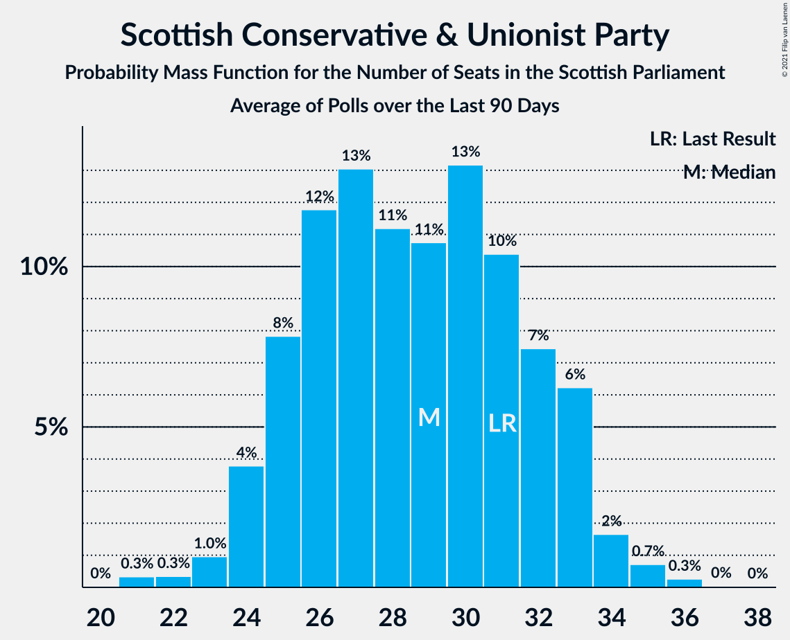

# Poll Average

<a href="#voting-intentions">Voting Intentions</a> | <a href="#seats">Seats</a> | <a href="#coalitions">Coalitions</a> | <a href="#technical-information">Technical Information</a>

## Summary

The table below lists the polls on which the average is based. They are the most recent polls (less than 90 days old) registered and analyzed so far.

| Period     | Polling firm/Commissioner(s) | SNP | CON | LAB | GRN | LIB | ALBA | UKIP | REF | SSP | AFU |
|:----------:|:----------------------------:|:--:|:--:|:--:|:--:|:--:|:--:|:--:|:--:|:--:|:--:|
| 5 May 2016 | General Election | 41.7%   63 | 22.9%   31 | 19.1%   24 | 6.6%   6 | 5.2%   5 | 0.0%   0 | 2.0%   0 | 0.0%   0 | 0.5%   0 | 0.0%   0 |
| N/A | Poll Average | 33–46%   58–71 | 19–24%   20–33 | 15–23%   17–27 | 6–13%   5–15 | 4–8%   2–8 | 1–5%   0–1 | N/A   N/A | 1–3%   0 | N/A   N/A | 1–3%   0 |
| [28–30 April 2021](2021-04-30-Panelbase.html) | Panelbase   The Sunday Times | 36–42%   60–69 | 20–25%   25–33 | 14–18%   17–24 | 7–10%   5–11 | 6–9%   5–10 | 3–5%   0–4 | N/A   N/A | N/A   N/A | N/A   N/A | 1–3%   0 |
| [23–27 April 2021](2021-04-27-SavantaComRes.html) | Savanta ComRes   The Scotsman | 32–38%   54–64 | 19–24%   24–33 | 16–21%   21–29 | 8–12%   10–14 | 4–6%   3–6 | 1–3%   0 | N/A   N/A | N/A   N/A | N/A   N/A | N/A   N/A |
| [20–22 April 2021](2021-04-22-Survation.html) | Survation   The Sunday Post | 33–38%   60–70 | 18–23%   19–26 | 20–25%   23–28 | 8–12%   8–12 | 6–9%   4–8 | 2–4%   0 | N/A   N/A | N/A   N/A | N/A   N/A | N/A   N/A |
| [16–20 April 2021](2021-04-20-YouGov.html) | YouGov   The Times | 37–43%   59–70 | 20–25%   25–33 | 15–20%   17–25 | 9–12%   10–13 | 4–6%   2–6 | 1–3%   0 | N/A   N/A | 1–2%   0 | N/A   N/A | N/A   N/A |
| [7–19 April 2021](2021-04-19-LordAshcroft.html) | Lord Ashcroft | 40–44%   63–69 | 20–24%   26–32 | 14–18%   17–22 | 8–10%   10–11 | 6–8%   5–8 | 1–3%   0 | N/A   N/A | 1–3%   0 | N/A   N/A | N/A   N/A |
| [1–6 April 2021](2021-04-06-Opinium.html) | Opinium   Sky News | 41–47%   64–73 | 20–25%   24–32 | 15–19%   17–25 | 6–9%   3–10 | 4–7%   2–6 | 1–3%   0 | N/A   N/A | N/A   N/A | N/A   N/A | N/A   N/A |
| [30 March–4 April 2021](2021-04-04-IpsosMORI.html) | Ipsos MORI   STV News | 35–41%   59–69 | 19–24%   22–31 | 16–20%   18–25 | 10–14%   11–16 | 5–8%   4–8 | 2–4%   0 | N/A   N/A | N/A   N/A | N/A   N/A | N/A   N/A |
| 5 May 2016 | General Election | 41.7%   63 | 22.9%   31 | 19.1%   24 | 6.6%   6 | 5.2%   5 | 0.0%   0 | 2.0%   0 | 0.0%   0 | 0.5%   0 | 0.0%   0 |

Only polls for which at least the sample size has been published are included in the table above.

**Legend:**
+ **Top half of each row:** Voting intentions (95% confidence interval)
+ **Bottom half of each row:** Seat projections for the Scottish Parliament (95% confidence interval)
+ **SNP:** Scottish National Party
+ **CON:** Scottish Conservative & Unionist Party
+ **LAB:** Scottish Labour
+ **GRN:** Scottish Greens
+ **LIB:** Scottish Liberal Democrats
+ **ALBA:** Alba Party
+ **UKIP:** UK Independence Party
+ **REF:** Reform UK
+ **SSP:** Scottish Socialist Party
+ **AFU:** All For Unity
+ **N/A (single party):** Party not included the published results
+ **N/A (entire row):** Calculation for this opinion poll not started yet

## Voting Intentions

### Confidence Intervals

| Party | Last Result | Median | 80% Confidence Interval | 90% Confidence Interval | 95% Confidence Interval | 99% Confidence Interval |
|:-----:|:-----------:|:------:|:-----------------------:|:-----------------------:|:-----------------------:|:-----------------------:|
| <a href="#scottish-national-party">Scottish National Party</a> | 41.7% | 39.0% | 34.7–43.5% |34.0–44.6% | 33.3–45.5% | 32.2–46.8% |
| <a href="#scottish-conservative-&-unionist-party">Scottish Conservative & Unionist Party</a> | 22.9% | 21.7% | 19.8–23.4% |19.2–23.9% | 18.8–24.3% | 17.9–25.2% |
| <a href="#scottish-labour">Scottish Labour</a> | 19.1% | 17.5% | 15.5–21.6% |15.0–22.7% | 14.7–23.4% | 14.0–24.6% |
| <a href="#scottish-greens">Scottish Greens</a> | 6.6% | 9.5% | 7.2–11.9% |6.7–12.5% | 6.3–13.1% | 5.7–14.0% |
| <a href="#scottish-liberal-democrats">Scottish Liberal Democrats</a> | 5.2% | 6.1% | 4.5–7.6% |4.3–8.0% | 4.0–8.3% | 3.7–8.9% |
| <a href="#uk-independence-party">UK Independence Party</a> | 2.0% | N/A | N/A |N/A | N/A | N/A |
| <a href="#scottish-socialist-party">Scottish Socialist Party</a> | 0.5% | N/A | N/A |N/A | N/A | N/A |
| <a href="#alba-party">Alba Party</a> | 0.0% | 2.4% | 1.7–4.0% |1.5–4.4% | 1.4–4.7% | 1.2–5.3% |
| <a href="#reform-uk">Reform UK</a> | 0.0% | 1.6% | 0.8–2.3% |0.7–2.4% | 0.6–2.6% | 0.5–2.8% |
| <a href="#all-for-unity">All For Unity</a> | 0.0% | 2.1% | 1.6–2.7% |1.4–2.9% | 1.3–3.0% | 1.2–3.4% |

### Scottish National Party

*For a full overview of the results for this party, see the [Scottish National Party](party-scottishnationalparty.html) page.*

| Voting Intentions | Probability | Accumulated | Special Marks |
|:-----------------:|:-----------:|:-----------:|:-------------:|
| 29.5–30.5% | 0% | 100% |  |
| 30.5–31.5% | 0.1% | 100% |  |
| 31.5–32.5% | 0.7% | 99.9% |  |
| 32.5–33.5% | 2% | 99.2% |  |
| 33.5–34.5% | 5% | 97% |  |
| 34.5–35.5% | 8% | 91% |  |
| 35.5–36.5% | 9% | 83% |  |
| 36.5–37.5% | 9% | 74% |  |
| 37.5–38.5% | 10% | 65% |  |
| 38.5–39.5% | 11% | 54% | Median |
| 39.5–40.5% | 10% | 44% |  |
| 40.5–41.5% | 9% | 34% |  |
| 41.5–42.5% | 9% | 25% | Last Result |
| 42.5–43.5% | 7% | 17% |  |
| 43.5–44.5% | 5% | 10% |  |
| 44.5–45.5% | 3% | 5% |  |
| 45.5–46.5% | 2% | 2% |  |
| 46.5–47.5% | 0.6% | 0.7% |  |
| 47.5–48.5% | 0.1% | 0.2% |  |
| 48.5–49.5% | 0% | 0% |  |

### Scottish Conservative & Unionist Party

*For a full overview of the results for this party, see the [Scottish Conservative & Unionist Party](party-scottishconservativeunionistparty.html) page.*

| Voting Intentions | Probability | Accumulated | Special Marks |
|:-----------------:|:-----------:|:-----------:|:-------------:|
| 15.5–16.5% | 0% | 100% |  |
| 16.5–17.5% | 0.2% | 100% |  |
| 17.5–18.5% | 2% | 99.8% |  |
| 18.5–19.5% | 6% | 98% |  |
| 19.5–20.5% | 14% | 92% |  |
| 20.5–21.5% | 25% | 79% |  |
| 21.5–22.5% | 28% | 54% | Median |
| 22.5–23.5% | 18% | 26% | Last Result |
| 23.5–24.5% | 7% | 8% |  |
| 24.5–25.5% | 1.5% | 2% |  |
| 25.5–26.5% | 0.2% | 0.2% |  |
| 26.5–27.5% | 0% | 0% |  |

### Scottish Labour

*For a full overview of the results for this party, see the [Scottish Labour](party-scottishlabour.html) page.*

| Voting Intentions | Probability | Accumulated | Special Marks |
|:-----------------:|:-----------:|:-----------:|:-------------:|
| 11.5–12.5% | 0% | 100% |  |
| 12.5–13.5% | 0.2% | 100% |  |
| 13.5–14.5% | 2% | 99.8% |  |
| 14.5–15.5% | 9% | 98% |  |
| 15.5–16.5% | 19% | 89% |  |
| 16.5–17.5% | 21% | 70% | Median |
| 17.5–18.5% | 18% | 48% |  |
| 18.5–19.5% | 11% | 30% | Last Result |
| 19.5–20.5% | 5% | 20% |  |
| 20.5–21.5% | 4% | 14% |  |
| 21.5–22.5% | 4% | 10% |  |
| 22.5–23.5% | 3% | 6% |  |
| 23.5–24.5% | 2% | 2% |  |
| 24.5–25.5% | 0.5% | 0.5% |  |
| 25.5–26.5% | 0.1% | 0.1% |  |
| 26.5–27.5% | 0% | 0% |  |

### Scottish Greens

*For a full overview of the results for this party, see the [Scottish Greens](party-scottishgreens.html) page.*

| Voting Intentions | Probability | Accumulated | Special Marks |
|:-----------------:|:-----------:|:-----------:|:-------------:|
| 3.5–4.5% | 0% | 100% |  |
| 4.5–5.5% | 0.3% | 100% |  |
| 5.5–6.5% | 4% | 99.7% |  |
| 6.5–7.5% | 10% | 96% | Last Result |
| 7.5–8.5% | 15% | 86% |  |
| 8.5–9.5% | 22% | 71% |  |
| 9.5–10.5% | 22% | 49% | Median |
| 10.5–11.5% | 14% | 27% |  |
| 11.5–12.5% | 8% | 13% |  |
| 12.5–13.5% | 4% | 5% |  |
| 13.5–14.5% | 1.0% | 1.2% |  |
| 14.5–15.5% | 0.1% | 0.1% |  |
| 15.5–16.5% | 0% | 0% |  |

### Scottish Liberal Democrats

*For a full overview of the results for this party, see the [Scottish Liberal Democrats](party-scottishliberaldemocrats.html) page.*

| Voting Intentions | Probability | Accumulated | Special Marks |
|:-----------------:|:-----------:|:-----------:|:-------------:|
| 1.5–2.5% | 0% | 100% |  |
| 2.5–3.5% | 0.3% | 100% |  |
| 3.5–4.5% | 10% | 99.7% |  |
| 4.5–5.5% | 27% | 90% | Last Result |
| 5.5–6.5% | 26% | 63% | Median |
| 6.5–7.5% | 26% | 37% |  |
| 7.5–8.5% | 10% | 11% |  |
| 8.5–9.5% | 1.2% | 1.2% |  |
| 9.5–10.5% | 0.1% | 0.1% |  |
| 10.5–11.5% | 0% | 0% |  |

### Alba Party

*For a full overview of the results for this party, see the [Alba Party](party-albaparty.html) page.*

| Voting Intentions | Probability | Accumulated | Special Marks |
|:-----------------:|:-----------:|:-----------:|:-------------:|
| 0.0–0.5% | 0% | 100% | Last Result |
| 0.5–1.5% | 5% | 100% |  |
| 1.5–2.5% | 49% | 95% | Median |
| 2.5–3.5% | 29% | 46% |  |
| 3.5–4.5% | 14% | 17% |  |
| 4.5–5.5% | 3% | 3% |  |
| 5.5–6.5% | 0.2% | 0.2% |  |
| 6.5–7.5% | 0% | 0% |  |

### All For Unity

*For a full overview of the results for this party, see the [All For Unity](party-allforunity.html) page.*

| Voting Intentions | Probability | Accumulated | Special Marks |
|:-----------------:|:-----------:|:-----------:|:-------------:|
| 0.0–0.5% | 0% | 100% | Last Result |
| 0.5–1.5% | 10% | 100% |  |
| 1.5–2.5% | 76% | 90% | Median |
| 2.5–3.5% | 15% | 15% |  |
| 3.5–4.5% | 0.2% | 0.2% |  |
| 4.5–5.5% | 0% | 0% |  |

### Reform UK

*For a full overview of the results for this party, see the [Reform UK](party-reformuk.html) page.*

| Voting Intentions | Probability | Accumulated | Special Marks |
|:-----------------:|:-----------:|:-----------:|:-------------:|
| 0.0–0.5% | 0.9% | 100% | Last Result |
| 0.5–1.5% | 49% | 99.1% |  |
| 1.5–2.5% | 48% | 51% | Median |
| 2.5–3.5% | 3% | 3% |  |
| 3.5–4.5% | 0% | 0% |  |

## Seats

### Confidence Intervals

| Party | Last Result | Median | 80% Confidence Interval | 90% Confidence Interval | 95% Confidence Interval | 99% Confidence Interval |
|:-----:|:-----------:|:------:|:-----------------------:|:-----------------------:|:-----------------------:|:-----------------------:|
| <a href="#scottish-national-party">Scottish National Party</a> | 63 | 64 | 60–69 |59–70 | 58–71 | 54–73 |
| <a href="#scottish-conservative-&-unionist-party">Scottish Conservative & Unionist Party</a> | 31 | 27 | 22–31 |21–32 | 20–33 | 19–34 |
| <a href="#scottish-labour">Scottish Labour</a> | 24 | 22 | 18–25 |17–26 | 17–27 | 17–29 |
| <a href="#scottish-greens">Scottish Greens</a> | 6 | 10 | 7–13 |5–14 | 5–15 | 3–16 |
| <a href="#scottish-liberal-democrats">Scottish Liberal Democrats</a> | 5 | 5 | 4–7 |3–8 | 2–8 | 2–10 |
| <a href="#uk-independence-party">UK Independence Party</a> | 0 | N/A | N/A |N/A | N/A | N/A |
| <a href="#scottish-socialist-party">Scottish Socialist Party</a> | 0 | N/A | N/A |N/A | N/A | N/A |
| <a href="#alba-party">Alba Party</a> | 0 | 0 | 0 |0 | 0–1 | 0–3 |
| <a href="#reform-uk">Reform UK</a> | 0 | 0 | 0 |0 | 0 | 0 |
| <a href="#all-for-unity">All For Unity</a> | 0 | 0 | 0 |0 | 0 | 0 |

### Scottish National Party

*For a full overview of the results for this party, see the [Scottish National Party](party-scottishnationalparty.html) page.*

| Number of Seats | Probability | Accumulated | Special Marks |
|:---------------:|:-----------:|:-----------:|:-------------:|
| 51 | 0% | 100% |  |
| 52 | 0% | 99.9% |  |
| 53 | 0.1% | 99.9% |  |
| 54 | 0.5% | 99.8% |  |
| 55 | 0.5% | 99.3% |  |
| 56 | 0.4% | 98.7% |  |
| 57 | 0.7% | 98% |  |
| 58 | 0.8% | 98% |  |
| 59 | 7% | 97% |  |
| 60 | 10% | 90% |  |
| 61 | 9% | 80% |  |
| 62 | 6% | 72% |  |
| 63 | 9% | 66% | Last Result |
| 64 | 8% | 56% | Median |
| 65 | 16% | 48% | Majority |
| 66 | 6% | 32% |  |
| 67 | 7% | 26% |  |
| 68 | 6% | 18% |  |
| 69 | 5% | 13% |  |
| 70 | 4% | 8% |  |
| 71 | 3% | 4% |  |
| 72 | 0.8% | 2% |  |
| 73 | 0.7% | 0.8% |  |
| 74 | 0.2% | 0.2% |  |
| 75 | 0% | 0% |  |

### Scottish Conservative & Unionist Party

*For a full overview of the results for this party, see the [Scottish Conservative & Unionist Party](party-scottishconservativeunionistparty.html) page.*

| Number of Seats | Probability | Accumulated | Special Marks |
|:---------------:|:-----------:|:-----------:|:-------------:|
| 18 | 0.2% | 100% |  |
| 19 | 1.2% | 99.8% |  |
| 20 | 3% | 98.6% |  |
| 21 | 3% | 95% |  |
| 22 | 2% | 92% |  |
| 23 | 2% | 90% |  |
| 24 | 7% | 87% |  |
| 25 | 7% | 80% |  |
| 26 | 12% | 73% |  |
| 27 | 14% | 61% | Median |
| 28 | 11% | 47% |  |
| 29 | 8% | 36% |  |
| 30 | 9% | 29% |  |
| 31 | 10% | 19% | Last Result |
| 32 | 6% | 10% |  |
| 33 | 3% | 4% |  |
| 34 | 0.4% | 0.6% |  |
| 35 | 0.1% | 0.2% |  |
| 36 | 0% | 0% |  |

### Scottish Labour

*For a full overview of the results for this party, see the [Scottish Labour](party-scottishlabour.html) page.*

| Number of Seats | Probability | Accumulated | Special Marks |
|:---------------:|:-----------:|:-----------:|:-------------:|
| 16 | 0.2% | 100% |  |
| 17 | 9% | 99.8% |  |
| 18 | 11% | 90% |  |
| 19 | 6% | 79% |  |
| 20 | 6% | 74% |  |
| 21 | 11% | 67% |  |
| 22 | 11% | 57% | Median |
| 23 | 8% | 45% |  |
| 24 | 14% | 37% | Last Result |
| 25 | 15% | 23% |  |
| 26 | 4% | 8% |  |
| 27 | 2% | 3% |  |
| 28 | 0.9% | 2% |  |
| 29 | 0.5% | 0.7% |  |
| 30 | 0.1% | 0.2% |  |
| 31 | 0.1% | 0.1% |  |
| 32 | 0% | 0% |  |

### Scottish Greens

*For a full overview of the results for this party, see the [Scottish Greens](party-scottishgreens.html) page.*

| Number of Seats | Probability | Accumulated | Special Marks |
|:---------------:|:-----------:|:-----------:|:-------------:|
| 3 | 0.8% | 100% |  |
| 4 | 2% | 99.2% |  |
| 5 | 4% | 98% |  |
| 6 | 2% | 93% | Last Result |
| 7 | 1.3% | 91% |  |
| 8 | 1.4% | 90% |  |
| 9 | 3% | 88% |  |
| 10 | 45% | 86% | Median |
| 11 | 15% | 40% |  |
| 12 | 12% | 25% |  |
| 13 | 7% | 13% |  |
| 14 | 3% | 6% |  |
| 15 | 3% | 3% |  |
| 16 | 0.4% | 0.5% |  |
| 17 | 0.1% | 0.2% |  |
| 18 | 0% | 0.1% |  |
| 19 | 0% | 0% |  |

### Scottish Liberal Democrats

*For a full overview of the results for this party, see the [Scottish Liberal Democrats](party-scottishliberaldemocrats.html) page.*

| Number of Seats | Probability | Accumulated | Special Marks |
|:---------------:|:-----------:|:-----------:|:-------------:|
| 2 | 3% | 100% |  |
| 3 | 3% | 97% |  |
| 4 | 13% | 94% |  |
| 5 | 40% | 82% | Last Result, Median |
| 6 | 23% | 41% |  |
| 7 | 8% | 18% |  |
| 8 | 8% | 10% |  |
| 9 | 0.8% | 1.4% |  |
| 10 | 0.5% | 0.6% |  |
| 11 | 0.1% | 0.1% |  |
| 12 | 0% | 0% |  |

### UK Independence Party

*For a full overview of the results for this party, see the [UK Independence Party](party-ukindependenceparty.html) page.*

### Scottish Socialist Party

*For a full overview of the results for this party, see the [Scottish Socialist Party](party-scottishsocialistparty.html) page.*

### Alba Party

*For a full overview of the results for this party, see the [Alba Party](party-albaparty.html) page.*

| Number of Seats | Probability | Accumulated | Special Marks |
|:---------------:|:-----------:|:-----------:|:-------------:|
| 0 | 97% | 100% | Last Result, Median |
| 1 | 2% | 3% |  |
| 2 | 0.7% | 1.5% |  |
| 3 | 0.3% | 0.7% |  |
| 4 | 0.2% | 0.4% |  |
| 5 | 0.1% | 0.2% |  |
| 6 | 0.1% | 0.1% |  |
| 7 | 0% | 0.1% |  |
| 8 | 0% | 0% |  |

### Reform UK

*For a full overview of the results for this party, see the [Reform UK](party-reformuk.html) page.*

| Number of Seats | Probability | Accumulated | Special Marks |
|:---------------:|:-----------:|:-----------:|:-------------:|
| 0 | 100% | 100% | Last Result, Median |

### All For Unity

*For a full overview of the results for this party, see the [All For Unity](party-allforunity.html) page.*

| Number of Seats | Probability | Accumulated | Special Marks |
|:---------------:|:-----------:|:-----------:|:-------------:|
| 0 | 100% | 100% | Last Result, Median |

## Coalitions

### Confidence Intervals

| Coalition | Last Result | Median | Majority? | 80% Confidence Interval | 90% Confidence Interval | 95% Confidence Interval | 99% Confidence Interval |
|:---------:|:-----------:|:------:|:---------:|:-----------------------:|:-----------------------:|:-----------------------:|:-----------------------:|
| Scottish National Party – Scottish Greens – Alba Party | 69 | 75 | 99.8% | 70–79 | 69–80 | 68–81 | 65–82 |
| Scottish National Party – Scottish Greens | 69 | 75 | 99.8% | 70–79 | 69–80 | 68–81 | 65–82 |
| Scottish National Party – Alba Party | 63 | 64 | 49% | 60–69 | 59–70 | 58–71 | 54–73 |
| Scottish National Party | 63 | 64 | 48% | 60–69 | 59–70 | 58–71 | 54–73 |
| Scottish Conservative & Unionist Party – Scottish Labour – Scottish Liberal Democrats | 60 | 54 | 0.2% | 50–59 | 49–60 | 48–61 | 47–64 |
| Scottish Conservative & Unionist Party – Scottish Labour | 55 | 49 | 0% | 45–54 | 44–55 | 43–56 | 42–58 |
| Scottish Labour – Scottish Greens – Scottish Liberal Democrats | 35 | 38 | 0% | 32–42 | 32–44 | 30–44 | 28–46 |
| Scottish Conservative & Unionist Party – Scottish Liberal Democrats | 36 | 33 | 0% | 28–37 | 26–38 | 25–39 | 24–40 |
| Scottish Labour – Scottish Liberal Democrats | 29 | 27 | 0% | 23–31 | 22–32 | 22–33 | 21–35 |

### Scottish National Party – Scottish Greens – Alba Party

| Number of Seats | Probability | Accumulated | Special Marks |
|:---------------:|:-----------:|:-----------:|:-------------:|
| 62 | 0% | 100% |  |
| 63 | 0% | 99.9% |  |
| 64 | 0.1% | 99.9% |  |
| 65 | 0.3% | 99.8% | Majority |
| 66 | 0.6% | 99.5% |  |
| 67 | 0.7% | 98.9% |  |
| 68 | 1.1% | 98% |  |
| 69 | 3% | 97% | Last Result |
| 70 | 6% | 94% |  |
| 71 | 7% | 88% |  |
| 72 | 8% | 81% |  |
| 73 | 10% | 73% |  |
| 74 | 10% | 63% | Median |
| 75 | 17% | 53% |  |
| 76 | 10% | 35% |  |
| 77 | 8% | 26% |  |
| 78 | 6% | 17% |  |
| 79 | 4% | 11% |  |
| 80 | 3% | 7% |  |
| 81 | 3% | 4% |  |
| 82 | 0.8% | 1.0% |  |
| 83 | 0.2% | 0.2% |  |
| 84 | 0% | 0% |  |

### Scottish National Party – Scottish Greens

| Number of Seats | Probability | Accumulated | Special Marks |
|:---------------:|:-----------:|:-----------:|:-------------:|
| 62 | 0% | 100% |  |
| 63 | 0% | 99.9% |  |
| 64 | 0.1% | 99.9% |  |
| 65 | 0.3% | 99.8% | Majority |
| 66 | 0.6% | 99.5% |  |
| 67 | 0.8% | 98.9% |  |
| 68 | 1.1% | 98% |  |
| 69 | 3% | 97% | Last Result |
| 70 | 6% | 94% |  |
| 71 | 7% | 88% |  |
| 72 | 8% | 81% |  |
| 73 | 11% | 73% |  |
| 74 | 10% | 62% | Median |
| 75 | 18% | 52% |  |
| 76 | 9% | 34% |  |
| 77 | 8% | 25% |  |
| 78 | 6% | 17% |  |
| 79 | 4% | 11% |  |
| 80 | 3% | 7% |  |
| 81 | 3% | 4% |  |
| 82 | 0.8% | 1.0% |  |
| 83 | 0.2% | 0.2% |  |
| 84 | 0% | 0% |  |

### Scottish National Party – Alba Party

| Number of Seats | Probability | Accumulated | Special Marks |
|:---------------:|:-----------:|:-----------:|:-------------:|
| 51 | 0% | 100% |  |
| 52 | 0% | 99.9% |  |
| 53 | 0.1% | 99.9% |  |
| 54 | 0.5% | 99.8% |  |
| 55 | 0.5% | 99.3% |  |
| 56 | 0.4% | 98.8% |  |
| 57 | 0.7% | 98% |  |
| 58 | 0.8% | 98% |  |
| 59 | 7% | 97% |  |
| 60 | 10% | 90% |  |
| 61 | 8% | 80% |  |
| 62 | 6% | 72% |  |
| 63 | 9% | 66% | Last Result |
| 64 | 8% | 57% | Median |
| 65 | 16% | 49% | Majority |
| 66 | 7% | 33% |  |
| 67 | 7% | 26% |  |
| 68 | 6% | 19% |  |
| 69 | 5% | 13% |  |
| 70 | 4% | 8% |  |
| 71 | 3% | 5% |  |
| 72 | 0.8% | 2% |  |
| 73 | 0.7% | 0.9% |  |
| 74 | 0.2% | 0.2% |  |
| 75 | 0% | 0% |  |

### Scottish National Party

| Number of Seats | Probability | Accumulated | Special Marks |
|:---------------:|:-----------:|:-----------:|:-------------:|
| 51 | 0% | 100% |  |
| 52 | 0% | 99.9% |  |
| 53 | 0.1% | 99.9% |  |
| 54 | 0.5% | 99.8% |  |
| 55 | 0.5% | 99.3% |  |
| 56 | 0.4% | 98.7% |  |
| 57 | 0.7% | 98% |  |
| 58 | 0.8% | 98% |  |
| 59 | 7% | 97% |  |
| 60 | 10% | 90% |  |
| 61 | 9% | 80% |  |
| 62 | 6% | 72% |  |
| 63 | 9% | 66% | Last Result |
| 64 | 8% | 56% | Median |
| 65 | 16% | 48% | Majority |
| 66 | 6% | 32% |  |
| 67 | 7% | 26% |  |
| 68 | 6% | 18% |  |
| 69 | 5% | 13% |  |
| 70 | 4% | 8% |  |
| 71 | 3% | 4% |  |
| 72 | 0.8% | 2% |  |
| 73 | 0.7% | 0.8% |  |
| 74 | 0.2% | 0.2% |  |
| 75 | 0% | 0% |  |

### Scottish Conservative & Unionist Party – Scottish Labour – Scottish Liberal Democrats

| Number of Seats | Probability | Accumulated | Special Marks |
|:---------------:|:-----------:|:-----------:|:-------------:|
| 46 | 0.2% | 100% |  |
| 47 | 0.8% | 99.8% |  |
| 48 | 3% | 99.0% |  |
| 49 | 3% | 96% |  |
| 50 | 4% | 93% |  |
| 51 | 6% | 89% |  |
| 52 | 8% | 83% |  |
| 53 | 10% | 74% |  |
| 54 | 17% | 65% | Median |
| 55 | 10% | 47% |  |
| 56 | 10% | 37% |  |
| 57 | 8% | 27% |  |
| 58 | 7% | 19% |  |
| 59 | 6% | 12% |  |
| 60 | 3% | 6% | Last Result |
| 61 | 1.1% | 3% |  |
| 62 | 0.7% | 2% |  |
| 63 | 0.6% | 1.1% |  |
| 64 | 0.3% | 0.5% |  |
| 65 | 0.1% | 0.2% | Majority |
| 66 | 0% | 0.1% |  |
| 67 | 0% | 0.1% |  |
| 68 | 0% | 0% |  |

### Scottish Conservative & Unionist Party – Scottish Labour

| Number of Seats | Probability | Accumulated | Special Marks |
|:---------------:|:-----------:|:-----------:|:-------------:|
| 41 | 0.1% | 100% |  |
| 42 | 0.5% | 99.9% |  |
| 43 | 2% | 99.4% |  |
| 44 | 7% | 97% |  |
| 45 | 7% | 90% |  |
| 46 | 8% | 84% |  |
| 47 | 8% | 75% |  |
| 48 | 13% | 68% |  |
| 49 | 14% | 55% | Median |
| 50 | 9% | 41% |  |
| 51 | 8% | 32% |  |
| 52 | 7% | 24% |  |
| 53 | 6% | 18% |  |
| 54 | 6% | 12% |  |
| 55 | 3% | 6% | Last Result |
| 56 | 1.4% | 3% |  |
| 57 | 0.7% | 2% |  |
| 58 | 0.5% | 1.0% |  |
| 59 | 0.3% | 0.5% |  |
| 60 | 0.1% | 0.2% |  |
| 61 | 0% | 0.1% |  |
| 62 | 0% | 0% |  |

### Scottish Labour – Scottish Greens – Scottish Liberal Democrats

| Number of Seats | Probability | Accumulated | Special Marks |
|:---------------:|:-----------:|:-----------:|:-------------:|
| 25 | 0.1% | 100% |  |
| 26 | 0.1% | 99.9% |  |
| 27 | 0.2% | 99.8% |  |
| 28 | 0.4% | 99.6% |  |
| 29 | 0.9% | 99.2% |  |
| 30 | 1.1% | 98% |  |
| 31 | 2% | 97% |  |
| 32 | 6% | 96% |  |
| 33 | 7% | 90% |  |
| 34 | 8% | 83% |  |
| 35 | 7% | 75% | Last Result |
| 36 | 7% | 68% |  |
| 37 | 7% | 60% | Median |
| 38 | 8% | 53% |  |
| 39 | 9% | 46% |  |
| 40 | 9% | 36% |  |
| 41 | 9% | 28% |  |
| 42 | 8% | 18% |  |
| 43 | 5% | 10% |  |
| 44 | 3% | 5% |  |
| 45 | 2% | 2% |  |
| 46 | 0.4% | 0.5% |  |
| 47 | 0.1% | 0.2% |  |
| 48 | 0% | 0.1% |  |
| 49 | 0% | 0% |  |

### Scottish Conservative & Unionist Party – Scottish Liberal Democrats

| Number of Seats | Probability | Accumulated | Special Marks |
|:---------------:|:-----------:|:-----------:|:-------------:|
| 23 | 0.4% | 100% |  |
| 24 | 1.0% | 99.6% |  |
| 25 | 2% | 98.6% |  |
| 26 | 3% | 96% |  |
| 27 | 3% | 93% |  |
| 28 | 3% | 90% |  |
| 29 | 6% | 87% |  |
| 30 | 6% | 81% |  |
| 31 | 9% | 75% |  |
| 32 | 9% | 66% | Median |
| 33 | 13% | 57% |  |
| 34 | 13% | 44% |  |
| 35 | 11% | 31% |  |
| 36 | 6% | 21% | Last Result |
| 37 | 8% | 14% |  |
| 38 | 3% | 6% |  |
| 39 | 2% | 3% |  |
| 40 | 1.1% | 1.4% |  |
| 41 | 0.2% | 0.3% |  |
| 42 | 0% | 0.1% |  |
| 43 | 0% | 0% |  |

### Scottish Labour – Scottish Liberal Democrats

| Number of Seats | Probability | Accumulated | Special Marks |
|:---------------:|:-----------:|:-----------:|:-------------:|
| 19 | 0.2% | 100% |  |
| 20 | 0.3% | 99.8% |  |
| 21 | 0.7% | 99.5% |  |
| 22 | 4% | 98.8% |  |
| 23 | 7% | 94% |  |
| 24 | 9% | 88% |  |
| 25 | 8% | 79% |  |
| 26 | 9% | 71% |  |
| 27 | 13% | 62% | Median |
| 28 | 12% | 49% |  |
| 29 | 13% | 38% | Last Result |
| 30 | 11% | 24% |  |
| 31 | 6% | 13% |  |
| 32 | 4% | 7% |  |
| 33 | 2% | 3% |  |
| 34 | 0.9% | 2% |  |
| 35 | 0.4% | 0.7% |  |
| 36 | 0.2% | 0.2% |  |
| 37 | 0% | 0% |  |

## Technical Information

+ **Number of polls included in this average:** 7
+ **Lowest number of simulations done in a poll included in this average:** 1,048,576
+ **Total number of simulations done in the polls included in this average:** 7,340,032
+ **Error estimate:** 1.28%
