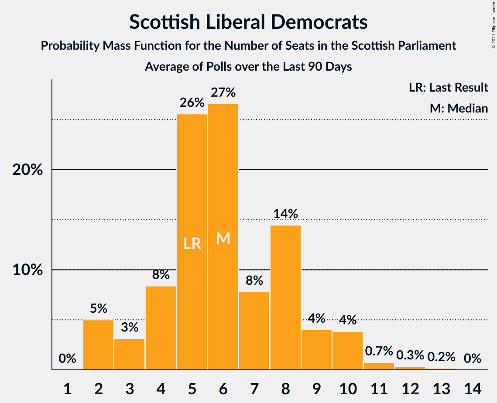

# Poll Average

<a href="#voting-intentions">Voting Intentions</a> | <a href="#seats">Seats</a> | <a href="#coalitions">Coalitions</a> | <a href="#technical-information">Technical Information</a>

## Summary

The table below lists the polls on which the average is based. They are the most recent polls (less than 90 days old) registered and analyzed so far.

| Period     | Polling firm/Commissioner(s) | SNP | CON | LAB | GRN | LIB | ALBA | UKIP | REF | SSP |
|:----------:|:----------------------------:|:--:|:--:|:--:|:--:|:--:|:--:|:--:|:--:|:--:|
| 5 May 2016 | General Election | 0.0%   0 | 0.0%   0 | 0.0%   0 | 0.0%   0 | 0.0%   0 | 0.0%   0 | 0.0%   0 | 0.0%   0 | 0.0%   0 |
| N/A | Poll Average | 35–47%   59–72 | 17–26%   20–33 | 15–21%   17–28 | 5–12%   3–13 | 4–9%   2–10 | 2–4%   0 | N/A   N/A | N/A   N/A | 2–4%   0–2 |
| [29–30 March 2021](2021-03-30-Survation.html) | Survation   The Courier | 34–40%   58–67 | 16–21%   19–25 | 17–22%   21–27 | 9–13%   10–15 | 6–10%   6–12 | 2–4%   0 | N/A   N/A | N/A   N/A | N/A   N/A |
| [23–26 March 2021](2021-03-26-FindOutNow.html) | Find Out Now   Daily Express | N/A   N/A | N/A   N/A | N/A   N/A | N/A   N/A | N/A   N/A | N/A   N/A | N/A   N/A | N/A   N/A | N/A   N/A |
| [16–19 March 2021](2021-03-19-BMGResearch.html) | BMG Research   Herald Scotland | N/A   N/A | N/A   N/A | N/A   N/A | N/A   N/A | N/A   N/A | N/A   N/A | N/A   N/A | N/A   N/A | N/A   N/A |
| [11–16 March 2021](2021-03-16-Opinium.html) | Opinium   Sky News | 40–45%   59–69 | 20–25%   24–33 | 17–22%   21–29 | 6–9%   3–10 | 4–6%   2–6 | N/A   N/A | N/A   N/A | N/A   N/A | N/A   N/A |
| [5–10 March 2021](2021-03-10-SavantaComRes.html) | Savanta ComRes   The Scotsman | 37–43%   60–69 | 21–27%   24–33 | 16–21%   17–25 | 8–12%   9–13 | 5–8%   3–7 | N/A   N/A | N/A   N/A | N/A   N/A | N/A   N/A |
| [4–8 March 2021](2021-03-08-YouGov.html) | YouGov   The Times | 42–48%   65–73 | 19–24%   24–32 | 14–18%   17–24 | 5–8%   3–10 | 4–6%   2–6 | N/A   N/A | N/A   N/A | N/A   N/A | 2–4%   0–2 |
| [3–5 March 2021](2021-03-05-Panelbase.html) | Panelbase   The Sunday Times | 39–45%   59–69 | 20–25%   25–33 | 17–21%   22–29 | 5–8%   2–10 | 6–9%   5–9 | N/A   N/A | N/A   N/A | N/A   N/A | N/A   N/A |
| 5 May 2016 | General Election | 0.0%   0 | 0.0%   0 | 0.0%   0 | 0.0%   0 | 0.0%   0 | 0.0%   0 | 0.0%   0 | 0.0%   0 | 0.0%   0 |

Only polls for which at least the sample size has been published are included in the table above.

**Legend:**
+ **Top half of each row:** Voting intentions (95% confidence interval)
+ **Bottom half of each row:** Seat projections for the Scottish Parliament (95% confidence interval)
+ **SNP:** Scottish National Party
+ **CON:** Scottish Conservative & Unionist Party
+ **LAB:** Scottish Labour
+ **GRN:** Scottish Greens
+ **LIB:** Scottish Liberal Democrats
+ **ALBA:** Alba Party
+ **UKIP:** UK Independence Party
+ **REF:** Reform UK
+ **SSP:** Scottish Socialist Party
+ **N/A (single party):** Party not included the published results
+ **N/A (entire row):** Calculation for this opinion poll not started yet

## Voting Intentions

### Confidence Intervals

| Party | Last Result | Median | 80% Confidence Interval | 90% Confidence Interval | 95% Confidence Interval | 99% Confidence Interval |
|:-----:|:-----------:|:------:|:-----------------------:|:-----------------------:|:-----------------------:|:-----------------------:|
| <a href="#scottish-national-party">Scottish National Party</a> | 0.0% | 41.5% | 36.9–45.2% |36.0–46.1% | 35.3–46.8% | 34.1–48.0% |
| <a href="#scottish-conservative-&-unionist-party">Scottish Conservative & Unionist Party</a> | 0.0% | 21.8% | 18.0–24.4% |17.2–25.1% | 16.7–25.6% | 15.8–26.7% |
| <a href="#scottish-labour">Scottish Labour</a> | 0.0% | 18.4% | 15.9–20.3% |15.3–20.8% | 14.8–21.3% | 14.0–22.1% |
| <a href="#scottish-greens">Scottish Greens</a> | 0.0% | 7.3% | 5.6–11.3% |5.3–11.9% | 5.0–12.3% | 4.6–13.1% |
| <a href="#scottish-liberal-democrats">Scottish Liberal Democrats</a> | 0.0% | 6.1% | 4.6–8.2% |4.3–8.7% | 4.1–9.1% | 3.7–9.9% |
| <a href="#alba-party">Alba Party</a> | 0.0% | 3.1% | 2.4–3.8% |2.2–4.0% | 2.1–4.2% | 1.9–4.7% |
| <a href="#uk-independence-party">UK Independence Party</a> | 0.0% | N/A | N/A |N/A | N/A | N/A |
| <a href="#reform-uk">Reform UK</a> | 0.0% | N/A | N/A |N/A | N/A | N/A |
| <a href="#scottish-socialist-party">Scottish Socialist Party</a> | 0.0% | 3.1% | 2.4–3.8% |2.3–4.0% | 2.1–4.2% | 1.9–4.6% |

### Scottish National Party

*For a full overview of the results for this party, see the [Scottish National Party](party-scottishnationalparty.html) page.*

| Voting Intentions | Probability | Accumulated | Special Marks |
|:-----------------:|:-----------:|:-----------:|:-------------:|
| 0.0–0.5% | 0% | 100% | Last Result |
| 0.5–1.5% | 0% | 100% |  |
| 1.5–2.5% | 0% | 100% |  |
| 2.5–3.5% | 0% | 100% |  |
| 3.5–4.5% | 0% | 100% |  |
| 4.5–5.5% | 0% | 100% |  |
| 5.5–6.5% | 0% | 100% |  |
| 6.5–7.5% | 0% | 100% |  |
| 7.5–8.5% | 0% | 100% |  |
| 8.5–9.5% | 0% | 100% |  |
| 9.5–10.5% | 0% | 100% |  |
| 10.5–11.5% | 0% | 100% |  |
| 11.5–12.5% | 0% | 100% |  |
| 12.5–13.5% | 0% | 100% |  |
| 13.5–14.5% | 0% | 100% |  |
| 14.5–15.5% | 0% | 100% |  |
| 15.5–16.5% | 0% | 100% |  |
| 16.5–17.5% | 0% | 100% |  |
| 17.5–18.5% | 0% | 100% |  |
| 18.5–19.5% | 0% | 100% |  |
| 19.5–20.5% | 0% | 100% |  |
| 20.5–21.5% | 0% | 100% |  |
| 21.5–22.5% | 0% | 100% |  |
| 22.5–23.5% | 0% | 100% |  |
| 23.5–24.5% | 0% | 100% |  |
| 24.5–25.5% | 0% | 100% |  |
| 25.5–26.5% | 0% | 100% |  |
| 26.5–27.5% | 0% | 100% |  |
| 27.5–28.5% | 0% | 100% |  |
| 28.5–29.5% | 0% | 100% |  |
| 29.5–30.5% | 0% | 100% |  |
| 30.5–31.5% | 0% | 100% |  |
| 31.5–32.5% | 0% | 100% |  |
| 32.5–33.5% | 0.2% | 100% |  |
| 33.5–34.5% | 0.8% | 99.8% |  |
| 34.5–35.5% | 2% | 99.0% |  |
| 35.5–36.5% | 4% | 97% |  |
| 36.5–37.5% | 6% | 92% |  |
| 37.5–38.5% | 7% | 86% |  |
| 38.5–39.5% | 8% | 80% |  |
| 39.5–40.5% | 10% | 72% |  |
| 40.5–41.5% | 12% | 62% |  |
| 41.5–42.5% | 13% | 50% | Median |
| 42.5–43.5% | 12% | 36% |  |
| 43.5–44.5% | 10% | 25% |  |
| 44.5–45.5% | 7% | 15% |  |
| 45.5–46.5% | 5% | 8% |  |
| 46.5–47.5% | 2% | 3% |  |
| 47.5–48.5% | 0.7% | 0.9% |  |
| 48.5–49.5% | 0.2% | 0.2% |  |
| 49.5–50.5% | 0% | 0% |  |

### Scottish Conservative & Unionist Party

*For a full overview of the results for this party, see the [Scottish Conservative & Unionist Party](party-scottishconservativeunionistparty.html) page.*

| Voting Intentions | Probability | Accumulated | Special Marks |
|:-----------------:|:-----------:|:-----------:|:-------------:|
| 0.0–0.5% | 0% | 100% | Last Result |
| 0.5–1.5% | 0% | 100% |  |
| 1.5–2.5% | 0% | 100% |  |
| 2.5–3.5% | 0% | 100% |  |
| 3.5–4.5% | 0% | 100% |  |
| 4.5–5.5% | 0% | 100% |  |
| 5.5–6.5% | 0% | 100% |  |
| 6.5–7.5% | 0% | 100% |  |
| 7.5–8.5% | 0% | 100% |  |
| 8.5–9.5% | 0% | 100% |  |
| 9.5–10.5% | 0% | 100% |  |
| 10.5–11.5% | 0% | 100% |  |
| 11.5–12.5% | 0% | 100% |  |
| 12.5–13.5% | 0% | 100% |  |
| 13.5–14.5% | 0% | 100% |  |
| 14.5–15.5% | 0.3% | 100% |  |
| 15.5–16.5% | 2% | 99.7% |  |
| 16.5–17.5% | 5% | 98% |  |
| 17.5–18.5% | 7% | 93% |  |
| 18.5–19.5% | 7% | 86% |  |
| 19.5–20.5% | 10% | 79% |  |
| 20.5–21.5% | 16% | 70% |  |
| 21.5–22.5% | 19% | 54% | Median |
| 22.5–23.5% | 16% | 35% |  |
| 23.5–24.5% | 11% | 19% |  |
| 24.5–25.5% | 6% | 8% |  |
| 25.5–26.5% | 2% | 3% |  |
| 26.5–27.5% | 0.6% | 0.7% |  |
| 27.5–28.5% | 0.1% | 0.1% |  |
| 28.5–29.5% | 0% | 0% |  |

### Scottish Labour

*For a full overview of the results for this party, see the [Scottish Labour](party-scottishlabour.html) page.*

| Voting Intentions | Probability | Accumulated | Special Marks |
|:-----------------:|:-----------:|:-----------:|:-------------:|
| 0.0–0.5% | 0% | 100% | Last Result |
| 0.5–1.5% | 0% | 100% |  |
| 1.5–2.5% | 0% | 100% |  |
| 2.5–3.5% | 0% | 100% |  |
| 3.5–4.5% | 0% | 100% |  |
| 4.5–5.5% | 0% | 100% |  |
| 5.5–6.5% | 0% | 100% |  |
| 6.5–7.5% | 0% | 100% |  |
| 7.5–8.5% | 0% | 100% |  |
| 8.5–9.5% | 0% | 100% |  |
| 9.5–10.5% | 0% | 100% |  |
| 10.5–11.5% | 0% | 100% |  |
| 11.5–12.5% | 0% | 100% |  |
| 12.5–13.5% | 0.2% | 100% |  |
| 13.5–14.5% | 2% | 99.8% |  |
| 14.5–15.5% | 5% | 98% |  |
| 15.5–16.5% | 10% | 93% |  |
| 16.5–17.5% | 14% | 84% |  |
| 17.5–18.5% | 22% | 69% | Median |
| 18.5–19.5% | 24% | 47% |  |
| 19.5–20.5% | 16% | 23% |  |
| 20.5–21.5% | 6% | 8% |  |
| 21.5–22.5% | 1.4% | 2% |  |
| 22.5–23.5% | 0.2% | 0.2% |  |
| 23.5–24.5% | 0% | 0% |  |

### Scottish Greens

*For a full overview of the results for this party, see the [Scottish Greens](party-scottishgreens.html) page.*

| Voting Intentions | Probability | Accumulated | Special Marks |
|:-----------------:|:-----------:|:-----------:|:-------------:|
| 0.0–0.5% | 0% | 100% | Last Result |
| 0.5–1.5% | 0% | 100% |  |
| 1.5–2.5% | 0% | 100% |  |
| 2.5–3.5% | 0% | 100% |  |
| 3.5–4.5% | 0.5% | 100% |  |
| 4.5–5.5% | 9% | 99.5% |  |
| 5.5–6.5% | 25% | 90% |  |
| 6.5–7.5% | 19% | 65% | Median |
| 7.5–8.5% | 7% | 47% |  |
| 8.5–9.5% | 7% | 40% |  |
| 9.5–10.5% | 13% | 33% |  |
| 10.5–11.5% | 13% | 20% |  |
| 11.5–12.5% | 6% | 7% |  |
| 12.5–13.5% | 1.4% | 2% |  |
| 13.5–14.5% | 0.2% | 0.2% |  |
| 14.5–15.5% | 0% | 0% |  |

### Scottish Liberal Democrats

*For a full overview of the results for this party, see the [Scottish Liberal Democrats](party-scottishliberaldemocrats.html) page.*

| Voting Intentions | Probability | Accumulated | Special Marks |
|:-----------------:|:-----------:|:-----------:|:-------------:|
| 0.0–0.5% | 0% | 100% | Last Result |
| 0.5–1.5% | 0% | 100% |  |
| 1.5–2.5% | 0% | 100% |  |
| 2.5–3.5% | 0.2% | 100% |  |
| 3.5–4.5% | 9% | 99.8% |  |
| 4.5–5.5% | 27% | 91% |  |
| 5.5–6.5% | 24% | 65% | Median |
| 6.5–7.5% | 20% | 41% |  |
| 7.5–8.5% | 14% | 21% |  |
| 8.5–9.5% | 6% | 7% |  |
| 9.5–10.5% | 0.9% | 1.0% |  |
| 10.5–11.5% | 0.1% | 0.1% |  |
| 11.5–12.5% | 0% | 0% |  |

### Alba Party

*For a full overview of the results for this party, see the [Alba Party](party-albaparty.html) page.*

| Voting Intentions | Probability | Accumulated | Special Marks |
|:-----------------:|:-----------:|:-----------:|:-------------:|
| 0.0–0.5% | 0% | 100% | Last Result |
| 0.5–1.5% | 0% | 100% |  |
| 1.5–2.5% | 16% | 100% |  |
| 2.5–3.5% | 65% | 84% | Median |
| 3.5–4.5% | 19% | 20% |  |
| 4.5–5.5% | 0.8% | 0.8% |  |
| 5.5–6.5% | 0% | 0% |  |

### Scottish Socialist Party

*For a full overview of the results for this party, see the [Scottish Socialist Party](party-scottishsocialistparty.html) page.*

| Voting Intentions | Probability | Accumulated | Special Marks |
|:-----------------:|:-----------:|:-----------:|:-------------:|
| 0.0–0.5% | 0% | 100% | Last Result |
| 0.5–1.5% | 0% | 100% |  |
| 1.5–2.5% | 15% | 100% |  |
| 2.5–3.5% | 67% | 85% | Median |
| 3.5–4.5% | 18% | 18% |  |
| 4.5–5.5% | 0.6% | 0.6% |  |
| 5.5–6.5% | 0% | 0% |  |

## Seats

### Confidence Intervals

| Party | Last Result | Median | 80% Confidence Interval | 90% Confidence Interval | 95% Confidence Interval | 99% Confidence Interval |
|:-----:|:-----------:|:------:|:-----------------------:|:-----------------------:|:-----------------------:|:-----------------------:|
| <a href="#scottish-national-party">Scottish National Party</a> | 0 | 64 | 61–71 |59–72 | 59–72 | 57–73 |
| <a href="#scottish-conservative-&-unionist-party">Scottish Conservative & Unionist Party</a> | 0 | 28 | 22–32 |21–32 | 20–33 | 19–34 |
| <a href="#scottish-labour">Scottish Labour</a> | 0 | 23 | 19–27 |18–28 | 17–28 | 17–30 |
| <a href="#scottish-greens">Scottish Greens</a> | 0 | 9 | 3–13 |3–13 | 3–13 | 2–15 |
| <a href="#scottish-liberal-democrats">Scottish Liberal Democrats</a> | 0 | 5 | 4–8 |3–10 | 2–10 | 2–12 |
| <a href="#alba-party">Alba Party</a> | 0 | 0 | 0 |0 | 0 | 0 |
| <a href="#uk-independence-party">UK Independence Party</a> | 0 | N/A | N/A |N/A | N/A | N/A |
| <a href="#reform-uk">Reform UK</a> | 0 | N/A | N/A |N/A | N/A | N/A |
| <a href="#scottish-socialist-party">Scottish Socialist Party</a> | 0 | 1 | 0–1 |0–1 | 0–2 | 0–2 |

### Scottish National Party

*For a full overview of the results for this party, see the [Scottish National Party](party-scottishnationalparty.html) page.*

| Number of Seats | Probability | Accumulated | Special Marks |
|:---------------:|:-----------:|:-----------:|:-------------:|
| 0 | 0% | 100% | Last Result |
| 1 | 0% | 100% |  |
| 2 | 0% | 100% |  |
| 3 | 0% | 100% |  |
| 4 | 0% | 100% |  |
| 5 | 0% | 100% |  |
| 6 | 0% | 100% |  |
| 7 | 0% | 100% |  |
| 8 | 0% | 100% |  |
| 9 | 0% | 100% |  |
| 10 | 0% | 100% |  |
| 11 | 0% | 100% |  |
| 12 | 0% | 100% |  |
| 13 | 0% | 100% |  |
| 14 | 0% | 100% |  |
| 15 | 0% | 100% |  |
| 16 | 0% | 100% |  |
| 17 | 0% | 100% |  |
| 18 | 0% | 100% |  |
| 19 | 0% | 100% |  |
| 20 | 0% | 100% |  |
| 21 | 0% | 100% |  |
| 22 | 0% | 100% |  |
| 23 | 0% | 100% |  |
| 24 | 0% | 100% |  |
| 25 | 0% | 100% |  |
| 26 | 0% | 100% |  |
| 27 | 0% | 100% |  |
| 28 | 0% | 100% |  |
| 29 | 0% | 100% |  |
| 30 | 0% | 100% |  |
| 31 | 0% | 100% |  |
| 32 | 0% | 100% |  |
| 33 | 0% | 100% |  |
| 34 | 0% | 100% |  |
| 35 | 0% | 100% |  |
| 36 | 0% | 100% |  |
| 37 | 0% | 100% |  |
| 38 | 0% | 100% |  |
| 39 | 0% | 100% |  |
| 40 | 0% | 100% |  |
| 41 | 0% | 100% |  |
| 42 | 0% | 100% |  |
| 43 | 0% | 100% |  |
| 44 | 0% | 100% |  |
| 45 | 0% | 100% |  |
| 46 | 0% | 100% |  |
| 47 | 0% | 100% |  |
| 48 | 0% | 100% |  |
| 49 | 0% | 100% |  |
| 50 | 0% | 100% |  |
| 51 | 0% | 100% |  |
| 52 | 0% | 100% |  |
| 53 | 0% | 100% |  |
| 54 | 0% | 100% |  |
| 55 | 0% | 99.9% |  |
| 56 | 0.2% | 99.9% |  |
| 57 | 0.4% | 99.7% |  |
| 58 | 0.8% | 99.3% |  |
| 59 | 4% | 98% |  |
| 60 | 5% | 95% |  |
| 61 | 7% | 90% |  |
| 62 | 11% | 84% |  |
| 63 | 15% | 73% |  |
| 64 | 10% | 58% | Median |
| 65 | 13% | 48% | Majority |
| 66 | 7% | 35% |  |
| 67 | 8% | 28% |  |
| 68 | 4% | 20% |  |
| 69 | 3% | 16% |  |
| 70 | 3% | 13% |  |
| 71 | 3% | 10% |  |
| 72 | 6% | 7% |  |
| 73 | 0.8% | 1.3% |  |
| 74 | 0.2% | 0.5% |  |
| 75 | 0.2% | 0.3% |  |
| 76 | 0% | 0.1% |  |
| 77 | 0% | 0% |  |

### Scottish Conservative & Unionist Party

*For a full overview of the results for this party, see the [Scottish Conservative & Unionist Party](party-scottishconservativeunionistparty.html) page.*

| Number of Seats | Probability | Accumulated | Special Marks |
|:---------------:|:-----------:|:-----------:|:-------------:|
| 0 | 0% | 100% | Last Result |
| 1 | 0% | 100% |  |
| 2 | 0% | 100% |  |
| 3 | 0% | 100% |  |
| 4 | 0% | 100% |  |
| 5 | 0% | 100% |  |
| 6 | 0% | 100% |  |
| 7 | 0% | 100% |  |
| 8 | 0% | 100% |  |
| 9 | 0% | 100% |  |
| 10 | 0% | 100% |  |
| 11 | 0% | 100% |  |
| 12 | 0% | 100% |  |
| 13 | 0% | 100% |  |
| 14 | 0% | 100% |  |
| 15 | 0% | 100% |  |
| 16 | 0% | 100% |  |
| 17 | 0.1% | 100% |  |
| 18 | 0.3% | 99.9% |  |
| 19 | 0.9% | 99.6% |  |
| 20 | 3% | 98.7% |  |
| 21 | 3% | 96% |  |
| 22 | 4% | 93% |  |
| 23 | 3% | 89% |  |
| 24 | 8% | 86% |  |
| 25 | 9% | 78% |  |
| 26 | 9% | 70% |  |
| 27 | 7% | 61% |  |
| 28 | 7% | 54% | Median |
| 29 | 11% | 48% |  |
| 30 | 13% | 37% |  |
| 31 | 11% | 24% |  |
| 32 | 10% | 14% |  |
| 33 | 2% | 3% |  |
| 34 | 0.9% | 1.1% |  |
| 35 | 0.2% | 0.3% |  |
| 36 | 0% | 0.1% |  |
| 37 | 0% | 0% |  |

### Scottish Labour

*For a full overview of the results for this party, see the [Scottish Labour](party-scottishlabour.html) page.*

| Number of Seats | Probability | Accumulated | Special Marks |
|:---------------:|:-----------:|:-----------:|:-------------:|
| 0 | 0% | 100% | Last Result |
| 1 | 0% | 100% |  |
| 2 | 0% | 100% |  |
| 3 | 0% | 100% |  |
| 4 | 0% | 100% |  |
| 5 | 0% | 100% |  |
| 6 | 0% | 100% |  |
| 7 | 0% | 100% |  |
| 8 | 0% | 100% |  |
| 9 | 0% | 100% |  |
| 10 | 0% | 100% |  |
| 11 | 0% | 100% |  |
| 12 | 0% | 100% |  |
| 13 | 0% | 100% |  |
| 14 | 0% | 100% |  |
| 15 | 0% | 100% |  |
| 16 | 0% | 100% |  |
| 17 | 5% | 100% |  |
| 18 | 5% | 95% |  |
| 19 | 5% | 90% |  |
| 20 | 3% | 86% |  |
| 21 | 10% | 82% |  |
| 22 | 10% | 72% |  |
| 23 | 16% | 62% | Median |
| 24 | 18% | 46% |  |
| 25 | 11% | 28% |  |
| 26 | 7% | 17% |  |
| 27 | 4% | 10% |  |
| 28 | 4% | 6% |  |
| 29 | 0.9% | 2% |  |
| 30 | 0.6% | 0.7% |  |
| 31 | 0.1% | 0.1% |  |
| 32 | 0% | 0% |  |

### Scottish Greens

*For a full overview of the results for this party, see the [Scottish Greens](party-scottishgreens.html) page.*

| Number of Seats | Probability | Accumulated | Special Marks |
|:---------------:|:-----------:|:-----------:|:-------------:|
| 0 | 0% | 100% | Last Result |
| 1 | 0% | 100% |  |
| 2 | 2% | 100% |  |
| 3 | 16% | 98% |  |
| 4 | 12% | 82% |  |
| 5 | 11% | 70% |  |
| 6 | 4% | 59% |  |
| 7 | 2% | 55% |  |
| 8 | 1.4% | 53% |  |
| 9 | 2% | 52% | Median |
| 10 | 23% | 49% |  |
| 11 | 10% | 27% |  |
| 12 | 7% | 17% |  |
| 13 | 8% | 10% |  |
| 14 | 2% | 2% |  |
| 15 | 0.5% | 0.6% |  |
| 16 | 0.1% | 0.1% |  |
| 17 | 0% | 0% |  |

### Scottish Liberal Democrats

*For a full overview of the results for this party, see the [Scottish Liberal Democrats](party-scottishliberaldemocrats.html) page.*

| Number of Seats | Probability | Accumulated | Special Marks |
|:---------------:|:-----------:|:-----------:|:-------------:|
| 0 | 0% | 100% | Last Result |
| 1 | 0% | 100% |  |
| 2 | 4% | 100% |  |
| 3 | 3% | 96% |  |
| 4 | 13% | 92% |  |
| 5 | 38% | 79% | Median |
| 6 | 12% | 41% |  |
| 7 | 5% | 29% |  |
| 8 | 14% | 24% |  |
| 9 | 4% | 10% |  |
| 10 | 3% | 5% |  |
| 11 | 1.4% | 2% |  |
| 12 | 0.6% | 0.7% |  |
| 13 | 0.1% | 0.1% |  |
| 14 | 0% | 0% |  |

### Alba Party

*For a full overview of the results for this party, see the [Alba Party](party-albaparty.html) page.*

| Number of Seats | Probability | Accumulated | Special Marks |
|:---------------:|:-----------:|:-----------:|:-------------:|
| 0 | 99.6% | 100% | Last Result, Median |
| 1 | 0.2% | 0.4% |  |
| 2 | 0.1% | 0.1% |  |
| 3 | 0% | 0.1% |  |
| 4 | 0% | 0% |  |

### UK Independence Party

*For a full overview of the results for this party, see the [UK Independence Party](party-ukindependenceparty.html) page.*

### Reform UK

*For a full overview of the results for this party, see the [Reform UK](party-reformuk.html) page.*

### Scottish Socialist Party

*For a full overview of the results for this party, see the [Scottish Socialist Party](party-scottishsocialistparty.html) page.*

| Number of Seats | Probability | Accumulated | Special Marks |
|:---------------:|:-----------:|:-----------:|:-------------:|
| 0 | 10% | 100% | Last Result |
| 1 | 85% | 90% | Median |
| 2 | 4% | 5% |  |
| 3 | 0.1% | 0.2% |  |
| 4 | 0% | 0% |  |

## Coalitions

### Confidence Intervals

| Coalition | Last Result | Median | Majority? | 80% Confidence Interval | 90% Confidence Interval | 95% Confidence Interval | 99% Confidence Interval |
|:---------:|:-----------:|:------:|:---------:|:-----------------------:|:-----------------------:|:-----------------------:|:-----------------------:|
| Alba Party – Scottish Greens – Scottish National Party | 0 | 73 | 98% | 68–77 | 66–78 | 65–79 | 63–81 |
| Scottish Greens – Scottish National Party | 0 | 73 | 98% | 68–77 | 66–78 | 65–79 | 63–81 |
| Alba Party – Scottish National Party | 0 | 64 | 48% | 61–71 | 59–72 | 59–72 | 57–73 |
| Scottish National Party | 0 | 64 | 48% | 61–71 | 59–72 | 59–72 | 57–73 |
| Scottish Conservative & Unionist Party – Scottish Labour – Scottish Liberal Democrats | 0 | 56 | 2% | 52–61 | 51–63 | 50–64 | 47–66 |
| Scottish Conservative & Unionist Party – Scottish Labour | 0 | 50 | 0% | 46–56 | 44–57 | 43–58 | 41–59 |
| Scottish Greens – Scottish Labour – Scottish Liberal Democrats | 0 | 36 | 0% | 30–45 | 28–46 | 27–47 | 25–49 |
| Scottish Conservative & Unionist Party – Scottish Liberal Democrats | 0 | 33 | 0% | 29–37 | 28–38 | 28–39 | 26–40 |
| Scottish Labour – Scottish Liberal Democrats | 0 | 29 | 0% | 23–33 | 22–35 | 22–36 | 21–37 |

### Alba Party – Scottish Greens – Scottish National Party

| Number of Seats | Probability | Accumulated | Special Marks |
|:---------------:|:-----------:|:-----------:|:-------------:|
| 0 | 0% | 100% | Last Result |
| 1 | 0% | 100% |  |
| 2 | 0% | 100% |  |
| 3 | 0% | 100% |  |
| 4 | 0% | 100% |  |
| 5 | 0% | 100% |  |
| 6 | 0% | 100% |  |
| 7 | 0% | 100% |  |
| 8 | 0% | 100% |  |
| 9 | 0% | 100% |  |
| 10 | 0% | 100% |  |
| 11 | 0% | 100% |  |
| 12 | 0% | 100% |  |
| 13 | 0% | 100% |  |
| 14 | 0% | 100% |  |
| 15 | 0% | 100% |  |
| 16 | 0% | 100% |  |
| 17 | 0% | 100% |  |
| 18 | 0% | 100% |  |
| 19 | 0% | 100% |  |
| 20 | 0% | 100% |  |
| 21 | 0% | 100% |  |
| 22 | 0% | 100% |  |
| 23 | 0% | 100% |  |
| 24 | 0% | 100% |  |
| 25 | 0% | 100% |  |
| 26 | 0% | 100% |  |
| 27 | 0% | 100% |  |
| 28 | 0% | 100% |  |
| 29 | 0% | 100% |  |
| 30 | 0% | 100% |  |
| 31 | 0% | 100% |  |
| 32 | 0% | 100% |  |
| 33 | 0% | 100% |  |
| 34 | 0% | 100% |  |
| 35 | 0% | 100% |  |
| 36 | 0% | 100% |  |
| 37 | 0% | 100% |  |
| 38 | 0% | 100% |  |
| 39 | 0% | 100% |  |
| 40 | 0% | 100% |  |
| 41 | 0% | 100% |  |
| 42 | 0% | 100% |  |
| 43 | 0% | 100% |  |
| 44 | 0% | 100% |  |
| 45 | 0% | 100% |  |
| 46 | 0% | 100% |  |
| 47 | 0% | 100% |  |
| 48 | 0% | 100% |  |
| 49 | 0% | 100% |  |
| 50 | 0% | 100% |  |
| 51 | 0% | 100% |  |
| 52 | 0% | 100% |  |
| 53 | 0% | 100% |  |
| 54 | 0% | 100% |  |
| 55 | 0% | 100% |  |
| 56 | 0% | 100% |  |
| 57 | 0% | 100% |  |
| 58 | 0% | 100% |  |
| 59 | 0% | 100% |  |
| 60 | 0% | 100% |  |
| 61 | 0.1% | 100% |  |
| 62 | 0.2% | 99.9% |  |
| 63 | 0.4% | 99.7% |  |
| 64 | 0.9% | 99.3% |  |
| 65 | 2% | 98% | Majority |
| 66 | 2% | 96% |  |
| 67 | 3% | 94% |  |
| 68 | 6% | 91% |  |
| 69 | 8% | 85% |  |
| 70 | 6% | 78% |  |
| 71 | 6% | 71% |  |
| 72 | 8% | 65% |  |
| 73 | 14% | 57% | Median |
| 74 | 11% | 43% |  |
| 75 | 14% | 32% |  |
| 76 | 7% | 18% |  |
| 77 | 5% | 11% |  |
| 78 | 2% | 6% |  |
| 79 | 2% | 4% |  |
| 80 | 0.9% | 2% |  |
| 81 | 0.5% | 0.9% |  |
| 82 | 0.4% | 0.4% |  |
| 83 | 0% | 0% |  |

### Scottish Greens – Scottish National Party

| Number of Seats | Probability | Accumulated | Special Marks |
|:---------------:|:-----------:|:-----------:|:-------------:|
| 0 | 0% | 100% | Last Result |
| 1 | 0% | 100% |  |
| 2 | 0% | 100% |  |
| 3 | 0% | 100% |  |
| 4 | 0% | 100% |  |
| 5 | 0% | 100% |  |
| 6 | 0% | 100% |  |
| 7 | 0% | 100% |  |
| 8 | 0% | 100% |  |
| 9 | 0% | 100% |  |
| 10 | 0% | 100% |  |
| 11 | 0% | 100% |  |
| 12 | 0% | 100% |  |
| 13 | 0% | 100% |  |
| 14 | 0% | 100% |  |
| 15 | 0% | 100% |  |
| 16 | 0% | 100% |  |
| 17 | 0% | 100% |  |
| 18 | 0% | 100% |  |
| 19 | 0% | 100% |  |
| 20 | 0% | 100% |  |
| 21 | 0% | 100% |  |
| 22 | 0% | 100% |  |
| 23 | 0% | 100% |  |
| 24 | 0% | 100% |  |
| 25 | 0% | 100% |  |
| 26 | 0% | 100% |  |
| 27 | 0% | 100% |  |
| 28 | 0% | 100% |  |
| 29 | 0% | 100% |  |
| 30 | 0% | 100% |  |
| 31 | 0% | 100% |  |
| 32 | 0% | 100% |  |
| 33 | 0% | 100% |  |
| 34 | 0% | 100% |  |
| 35 | 0% | 100% |  |
| 36 | 0% | 100% |  |
| 37 | 0% | 100% |  |
| 38 | 0% | 100% |  |
| 39 | 0% | 100% |  |
| 40 | 0% | 100% |  |
| 41 | 0% | 100% |  |
| 42 | 0% | 100% |  |
| 43 | 0% | 100% |  |
| 44 | 0% | 100% |  |
| 45 | 0% | 100% |  |
| 46 | 0% | 100% |  |
| 47 | 0% | 100% |  |
| 48 | 0% | 100% |  |
| 49 | 0% | 100% |  |
| 50 | 0% | 100% |  |
| 51 | 0% | 100% |  |
| 52 | 0% | 100% |  |
| 53 | 0% | 100% |  |
| 54 | 0% | 100% |  |
| 55 | 0% | 100% |  |
| 56 | 0% | 100% |  |
| 57 | 0% | 100% |  |
| 58 | 0% | 100% |  |
| 59 | 0% | 100% |  |
| 60 | 0% | 100% |  |
| 61 | 0.1% | 100% |  |
| 62 | 0.2% | 99.9% |  |
| 63 | 0.4% | 99.7% |  |
| 64 | 0.9% | 99.3% |  |
| 65 | 2% | 98% | Majority |
| 66 | 2% | 96% |  |
| 67 | 3% | 94% |  |
| 68 | 6% | 91% |  |
| 69 | 8% | 85% |  |
| 70 | 6% | 78% |  |
| 71 | 6% | 71% |  |
| 72 | 8% | 65% |  |
| 73 | 14% | 57% | Median |
| 74 | 11% | 43% |  |
| 75 | 14% | 32% |  |
| 76 | 7% | 18% |  |
| 77 | 5% | 11% |  |
| 78 | 2% | 6% |  |
| 79 | 2% | 4% |  |
| 80 | 0.9% | 2% |  |
| 81 | 0.5% | 0.9% |  |
| 82 | 0.4% | 0.4% |  |
| 83 | 0% | 0% |  |

### Alba Party – Scottish National Party

| Number of Seats | Probability | Accumulated | Special Marks |
|:---------------:|:-----------:|:-----------:|:-------------:|
| 0 | 0% | 100% | Last Result |
| 1 | 0% | 100% |  |
| 2 | 0% | 100% |  |
| 3 | 0% | 100% |  |
| 4 | 0% | 100% |  |
| 5 | 0% | 100% |  |
| 6 | 0% | 100% |  |
| 7 | 0% | 100% |  |
| 8 | 0% | 100% |  |
| 9 | 0% | 100% |  |
| 10 | 0% | 100% |  |
| 11 | 0% | 100% |  |
| 12 | 0% | 100% |  |
| 13 | 0% | 100% |  |
| 14 | 0% | 100% |  |
| 15 | 0% | 100% |  |
| 16 | 0% | 100% |  |
| 17 | 0% | 100% |  |
| 18 | 0% | 100% |  |
| 19 | 0% | 100% |  |
| 20 | 0% | 100% |  |
| 21 | 0% | 100% |  |
| 22 | 0% | 100% |  |
| 23 | 0% | 100% |  |
| 24 | 0% | 100% |  |
| 25 | 0% | 100% |  |
| 26 | 0% | 100% |  |
| 27 | 0% | 100% |  |
| 28 | 0% | 100% |  |
| 29 | 0% | 100% |  |
| 30 | 0% | 100% |  |
| 31 | 0% | 100% |  |
| 32 | 0% | 100% |  |
| 33 | 0% | 100% |  |
| 34 | 0% | 100% |  |
| 35 | 0% | 100% |  |
| 36 | 0% | 100% |  |
| 37 | 0% | 100% |  |
| 38 | 0% | 100% |  |
| 39 | 0% | 100% |  |
| 40 | 0% | 100% |  |
| 41 | 0% | 100% |  |
| 42 | 0% | 100% |  |
| 43 | 0% | 100% |  |
| 44 | 0% | 100% |  |
| 45 | 0% | 100% |  |
| 46 | 0% | 100% |  |
| 47 | 0% | 100% |  |
| 48 | 0% | 100% |  |
| 49 | 0% | 100% |  |
| 50 | 0% | 100% |  |
| 51 | 0% | 100% |  |
| 52 | 0% | 100% |  |
| 53 | 0% | 100% |  |
| 54 | 0% | 100% |  |
| 55 | 0% | 99.9% |  |
| 56 | 0.2% | 99.9% |  |
| 57 | 0.4% | 99.7% |  |
| 58 | 0.8% | 99.3% |  |
| 59 | 4% | 98% |  |
| 60 | 5% | 95% |  |
| 61 | 7% | 90% |  |
| 62 | 11% | 84% |  |
| 63 | 15% | 73% |  |
| 64 | 10% | 58% | Median |
| 65 | 13% | 48% | Majority |
| 66 | 7% | 35% |  |
| 67 | 8% | 28% |  |
| 68 | 4% | 20% |  |
| 69 | 3% | 16% |  |
| 70 | 3% | 13% |  |
| 71 | 3% | 10% |  |
| 72 | 6% | 7% |  |
| 73 | 0.8% | 1.3% |  |
| 74 | 0.2% | 0.5% |  |
| 75 | 0.2% | 0.3% |  |
| 76 | 0% | 0.1% |  |
| 77 | 0% | 0% |  |

### Scottish National Party

| Number of Seats | Probability | Accumulated | Special Marks |
|:---------------:|:-----------:|:-----------:|:-------------:|
| 0 | 0% | 100% | Last Result |
| 1 | 0% | 100% |  |
| 2 | 0% | 100% |  |
| 3 | 0% | 100% |  |
| 4 | 0% | 100% |  |
| 5 | 0% | 100% |  |
| 6 | 0% | 100% |  |
| 7 | 0% | 100% |  |
| 8 | 0% | 100% |  |
| 9 | 0% | 100% |  |
| 10 | 0% | 100% |  |
| 11 | 0% | 100% |  |
| 12 | 0% | 100% |  |
| 13 | 0% | 100% |  |
| 14 | 0% | 100% |  |
| 15 | 0% | 100% |  |
| 16 | 0% | 100% |  |
| 17 | 0% | 100% |  |
| 18 | 0% | 100% |  |
| 19 | 0% | 100% |  |
| 20 | 0% | 100% |  |
| 21 | 0% | 100% |  |
| 22 | 0% | 100% |  |
| 23 | 0% | 100% |  |
| 24 | 0% | 100% |  |
| 25 | 0% | 100% |  |
| 26 | 0% | 100% |  |
| 27 | 0% | 100% |  |
| 28 | 0% | 100% |  |
| 29 | 0% | 100% |  |
| 30 | 0% | 100% |  |
| 31 | 0% | 100% |  |
| 32 | 0% | 100% |  |
| 33 | 0% | 100% |  |
| 34 | 0% | 100% |  |
| 35 | 0% | 100% |  |
| 36 | 0% | 100% |  |
| 37 | 0% | 100% |  |
| 38 | 0% | 100% |  |
| 39 | 0% | 100% |  |
| 40 | 0% | 100% |  |
| 41 | 0% | 100% |  |
| 42 | 0% | 100% |  |
| 43 | 0% | 100% |  |
| 44 | 0% | 100% |  |
| 45 | 0% | 100% |  |
| 46 | 0% | 100% |  |
| 47 | 0% | 100% |  |
| 48 | 0% | 100% |  |
| 49 | 0% | 100% |  |
| 50 | 0% | 100% |  |
| 51 | 0% | 100% |  |
| 52 | 0% | 100% |  |
| 53 | 0% | 100% |  |
| 54 | 0% | 100% |  |
| 55 | 0% | 99.9% |  |
| 56 | 0.2% | 99.9% |  |
| 57 | 0.4% | 99.7% |  |
| 58 | 0.8% | 99.3% |  |
| 59 | 4% | 98% |  |
| 60 | 5% | 95% |  |
| 61 | 7% | 90% |  |
| 62 | 11% | 84% |  |
| 63 | 15% | 73% |  |
| 64 | 10% | 58% | Median |
| 65 | 13% | 48% | Majority |
| 66 | 7% | 35% |  |
| 67 | 8% | 28% |  |
| 68 | 4% | 20% |  |
| 69 | 3% | 16% |  |
| 70 | 3% | 13% |  |
| 71 | 3% | 10% |  |
| 72 | 6% | 7% |  |
| 73 | 0.8% | 1.3% |  |
| 74 | 0.2% | 0.5% |  |
| 75 | 0.2% | 0.3% |  |
| 76 | 0% | 0.1% |  |
| 77 | 0% | 0% |  |

### Scottish Conservative & Unionist Party – Scottish Labour – Scottish Liberal Democrats

| Number of Seats | Probability | Accumulated | Special Marks |
|:---------------:|:-----------:|:-----------:|:-------------:|
| 0 | 0% | 100% | Last Result |
| 1 | 0% | 100% |  |
| 2 | 0% | 100% |  |
| 3 | 0% | 100% |  |
| 4 | 0% | 100% |  |
| 5 | 0% | 100% |  |
| 6 | 0% | 100% |  |
| 7 | 0% | 100% |  |
| 8 | 0% | 100% |  |
| 9 | 0% | 100% |  |
| 10 | 0% | 100% |  |
| 11 | 0% | 100% |  |
| 12 | 0% | 100% |  |
| 13 | 0% | 100% |  |
| 14 | 0% | 100% |  |
| 15 | 0% | 100% |  |
| 16 | 0% | 100% |  |
| 17 | 0% | 100% |  |
| 18 | 0% | 100% |  |
| 19 | 0% | 100% |  |
| 20 | 0% | 100% |  |
| 21 | 0% | 100% |  |
| 22 | 0% | 100% |  |
| 23 | 0% | 100% |  |
| 24 | 0% | 100% |  |
| 25 | 0% | 100% |  |
| 26 | 0% | 100% |  |
| 27 | 0% | 100% |  |
| 28 | 0% | 100% |  |
| 29 | 0% | 100% |  |
| 30 | 0% | 100% |  |
| 31 | 0% | 100% |  |
| 32 | 0% | 100% |  |
| 33 | 0% | 100% |  |
| 34 | 0% | 100% |  |
| 35 | 0% | 100% |  |
| 36 | 0% | 100% |  |
| 37 | 0% | 100% |  |
| 38 | 0% | 100% |  |
| 39 | 0% | 100% |  |
| 40 | 0% | 100% |  |
| 41 | 0% | 100% |  |
| 42 | 0% | 100% |  |
| 43 | 0% | 100% |  |
| 44 | 0% | 100% |  |
| 45 | 0% | 100% |  |
| 46 | 0.3% | 100% |  |
| 47 | 0.4% | 99.7% |  |
| 48 | 0.6% | 99.3% |  |
| 49 | 0.9% | 98.7% |  |
| 50 | 2% | 98% |  |
| 51 | 3% | 96% |  |
| 52 | 5% | 92% |  |
| 53 | 11% | 87% |  |
| 54 | 10% | 76% |  |
| 55 | 12% | 67% |  |
| 56 | 12% | 54% | Median |
| 57 | 9% | 43% |  |
| 58 | 6% | 34% |  |
| 59 | 6% | 28% |  |
| 60 | 7% | 22% |  |
| 61 | 6% | 14% |  |
| 62 | 3% | 9% |  |
| 63 | 2% | 6% |  |
| 64 | 2% | 4% |  |
| 65 | 0.9% | 2% | Majority |
| 66 | 0.4% | 0.7% |  |
| 67 | 0.2% | 0.3% |  |
| 68 | 0.1% | 0.1% |  |
| 69 | 0% | 0% |  |

### Scottish Conservative & Unionist Party – Scottish Labour

| Number of Seats | Probability | Accumulated | Special Marks |
|:---------------:|:-----------:|:-----------:|:-------------:|
| 0 | 0% | 100% | Last Result |
| 1 | 0% | 100% |  |
| 2 | 0% | 100% |  |
| 3 | 0% | 100% |  |
| 4 | 0% | 100% |  |
| 5 | 0% | 100% |  |
| 6 | 0% | 100% |  |
| 7 | 0% | 100% |  |
| 8 | 0% | 100% |  |
| 9 | 0% | 100% |  |
| 10 | 0% | 100% |  |
| 11 | 0% | 100% |  |
| 12 | 0% | 100% |  |
| 13 | 0% | 100% |  |
| 14 | 0% | 100% |  |
| 15 | 0% | 100% |  |
| 16 | 0% | 100% |  |
| 17 | 0% | 100% |  |
| 18 | 0% | 100% |  |
| 19 | 0% | 100% |  |
| 20 | 0% | 100% |  |
| 21 | 0% | 100% |  |
| 22 | 0% | 100% |  |
| 23 | 0% | 100% |  |
| 24 | 0% | 100% |  |
| 25 | 0% | 100% |  |
| 26 | 0% | 100% |  |
| 27 | 0% | 100% |  |
| 28 | 0% | 100% |  |
| 29 | 0% | 100% |  |
| 30 | 0% | 100% |  |
| 31 | 0% | 100% |  |
| 32 | 0% | 100% |  |
| 33 | 0% | 100% |  |
| 34 | 0% | 100% |  |
| 35 | 0% | 100% |  |
| 36 | 0% | 100% |  |
| 37 | 0% | 100% |  |
| 38 | 0% | 100% |  |
| 39 | 0% | 100% |  |
| 40 | 0.2% | 99.9% |  |
| 41 | 0.4% | 99.8% |  |
| 42 | 0.9% | 99.4% |  |
| 43 | 2% | 98% |  |
| 44 | 2% | 97% |  |
| 45 | 4% | 95% |  |
| 46 | 6% | 91% |  |
| 47 | 7% | 85% |  |
| 48 | 10% | 78% |  |
| 49 | 10% | 68% |  |
| 50 | 12% | 59% |  |
| 51 | 9% | 47% | Median |
| 52 | 7% | 37% |  |
| 53 | 6% | 30% |  |
| 54 | 7% | 24% |  |
| 55 | 6% | 18% |  |
| 56 | 5% | 11% |  |
| 57 | 3% | 7% |  |
| 58 | 2% | 4% |  |
| 59 | 1.2% | 2% |  |
| 60 | 0.3% | 0.5% |  |
| 61 | 0.1% | 0.2% |  |
| 62 | 0% | 0.1% |  |
| 63 | 0% | 0% |  |

### Scottish Greens – Scottish Labour – Scottish Liberal Democrats

| Number of Seats | Probability | Accumulated | Special Marks |
|:---------------:|:-----------:|:-----------:|:-------------:|
| 0 | 0% | 100% | Last Result |
| 1 | 0% | 100% |  |
| 2 | 0% | 100% |  |
| 3 | 0% | 100% |  |
| 4 | 0% | 100% |  |
| 5 | 0% | 100% |  |
| 6 | 0% | 100% |  |
| 7 | 0% | 100% |  |
| 8 | 0% | 100% |  |
| 9 | 0% | 100% |  |
| 10 | 0% | 100% |  |
| 11 | 0% | 100% |  |
| 12 | 0% | 100% |  |
| 13 | 0% | 100% |  |
| 14 | 0% | 100% |  |
| 15 | 0% | 100% |  |
| 16 | 0% | 100% |  |
| 17 | 0% | 100% |  |
| 18 | 0% | 100% |  |
| 19 | 0% | 100% |  |
| 20 | 0% | 100% |  |
| 21 | 0% | 100% |  |
| 22 | 0% | 100% |  |
| 23 | 0% | 100% |  |
| 24 | 0.1% | 100% |  |
| 25 | 0.7% | 99.9% |  |
| 26 | 2% | 99.2% |  |
| 27 | 2% | 98% |  |
| 28 | 2% | 96% |  |
| 29 | 2% | 94% |  |
| 30 | 3% | 91% |  |
| 31 | 5% | 88% |  |
| 32 | 7% | 83% |  |
| 33 | 9% | 76% |  |
| 34 | 7% | 67% |  |
| 35 | 6% | 60% |  |
| 36 | 7% | 54% |  |
| 37 | 9% | 47% | Median |
| 38 | 7% | 38% |  |
| 39 | 4% | 31% |  |
| 40 | 4% | 26% |  |
| 41 | 2% | 23% |  |
| 42 | 2% | 21% |  |
| 43 | 2% | 18% |  |
| 44 | 4% | 16% |  |
| 45 | 4% | 12% |  |
| 46 | 5% | 8% |  |
| 47 | 1.4% | 3% |  |
| 48 | 0.8% | 2% |  |
| 49 | 0.4% | 0.7% |  |
| 50 | 0.2% | 0.4% |  |
| 51 | 0.1% | 0.2% |  |
| 52 | 0% | 0.1% |  |
| 53 | 0% | 0.1% |  |
| 54 | 0% | 0% |  |

### Scottish Conservative & Unionist Party – Scottish Liberal Democrats

| Number of Seats | Probability | Accumulated | Special Marks |
|:---------------:|:-----------:|:-----------:|:-------------:|
| 0 | 0% | 100% | Last Result |
| 1 | 0% | 100% |  |
| 2 | 0% | 100% |  |
| 3 | 0% | 100% |  |
| 4 | 0% | 100% |  |
| 5 | 0% | 100% |  |
| 6 | 0% | 100% |  |
| 7 | 0% | 100% |  |
| 8 | 0% | 100% |  |
| 9 | 0% | 100% |  |
| 10 | 0% | 100% |  |
| 11 | 0% | 100% |  |
| 12 | 0% | 100% |  |
| 13 | 0% | 100% |  |
| 14 | 0% | 100% |  |
| 15 | 0% | 100% |  |
| 16 | 0% | 100% |  |
| 17 | 0% | 100% |  |
| 18 | 0% | 100% |  |
| 19 | 0% | 100% |  |
| 20 | 0% | 100% |  |
| 21 | 0% | 100% |  |
| 22 | 0% | 100% |  |
| 23 | 0% | 100% |  |
| 24 | 0% | 100% |  |
| 25 | 0.2% | 100% |  |
| 26 | 0.5% | 99.7% |  |
| 27 | 0.8% | 99.3% |  |
| 28 | 5% | 98% |  |
| 29 | 6% | 94% |  |
| 30 | 9% | 88% |  |
| 31 | 9% | 79% |  |
| 32 | 10% | 70% |  |
| 33 | 10% | 60% | Median |
| 34 | 12% | 50% |  |
| 35 | 9% | 38% |  |
| 36 | 11% | 29% |  |
| 37 | 12% | 18% |  |
| 38 | 3% | 6% |  |
| 39 | 2% | 3% |  |
| 40 | 0.6% | 1.1% |  |
| 41 | 0.3% | 0.4% |  |
| 42 | 0.1% | 0.1% |  |
| 43 | 0% | 0% |  |

### Scottish Labour – Scottish Liberal Democrats

| Number of Seats | Probability | Accumulated | Special Marks |
|:---------------:|:-----------:|:-----------:|:-------------:|
| 0 | 0% | 100% | Last Result |
| 1 | 0% | 100% |  |
| 2 | 0% | 100% |  |
| 3 | 0% | 100% |  |
| 4 | 0% | 100% |  |
| 5 | 0% | 100% |  |
| 6 | 0% | 100% |  |
| 7 | 0% | 100% |  |
| 8 | 0% | 100% |  |
| 9 | 0% | 100% |  |
| 10 | 0% | 100% |  |
| 11 | 0% | 100% |  |
| 12 | 0% | 100% |  |
| 13 | 0% | 100% |  |
| 14 | 0% | 100% |  |
| 15 | 0% | 100% |  |
| 16 | 0% | 100% |  |
| 17 | 0% | 100% |  |
| 18 | 0% | 100% |  |
| 19 | 0.1% | 100% |  |
| 20 | 0.2% | 99.9% |  |
| 21 | 0.7% | 99.7% |  |
| 22 | 5% | 98.9% |  |
| 23 | 5% | 94% |  |
| 24 | 5% | 89% |  |
| 25 | 6% | 85% |  |
| 26 | 8% | 79% |  |
| 27 | 8% | 71% |  |
| 28 | 11% | 63% | Median |
| 29 | 8% | 52% |  |
| 30 | 10% | 44% |  |
| 31 | 8% | 35% |  |
| 32 | 8% | 26% |  |
| 33 | 9% | 19% |  |
| 34 | 4% | 10% |  |
| 35 | 3% | 5% |  |
| 36 | 2% | 3% |  |
| 37 | 0.6% | 1.0% |  |
| 38 | 0.2% | 0.4% |  |
| 39 | 0.1% | 0.2% |  |
| 40 | 0% | 0.1% |  |
| 41 | 0% | 0% |  |

## Technical Information

+ **Number of polls included in this average:** 7
+ **Lowest number of simulations done in a poll included in this average:** 0
+ **Total number of simulations done in the polls included in this average:** 1,572,864
+ **Error estimate:** 1.51%
