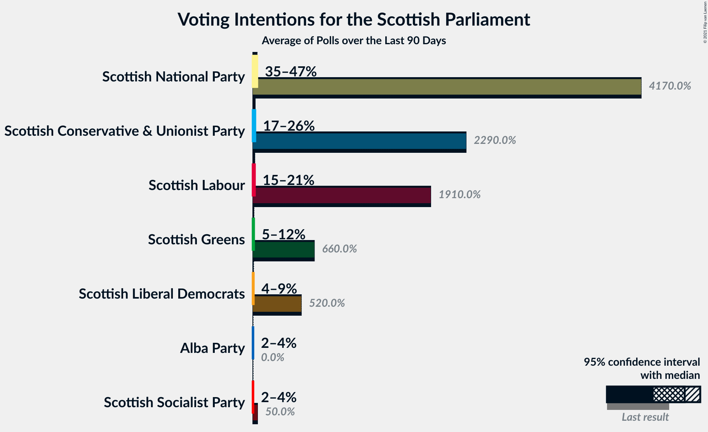
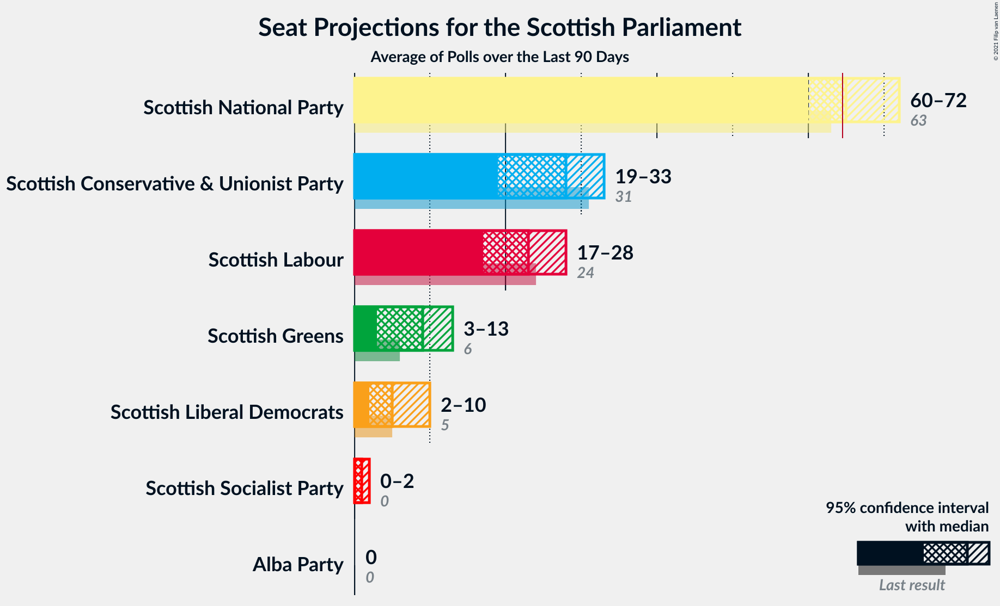
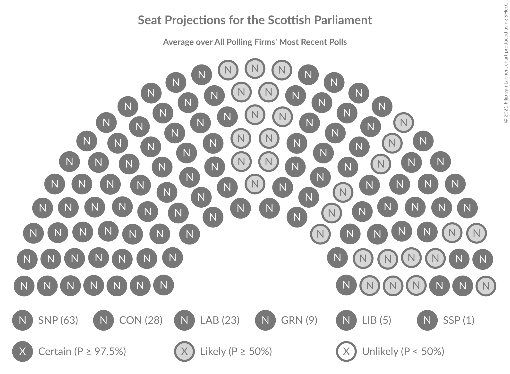
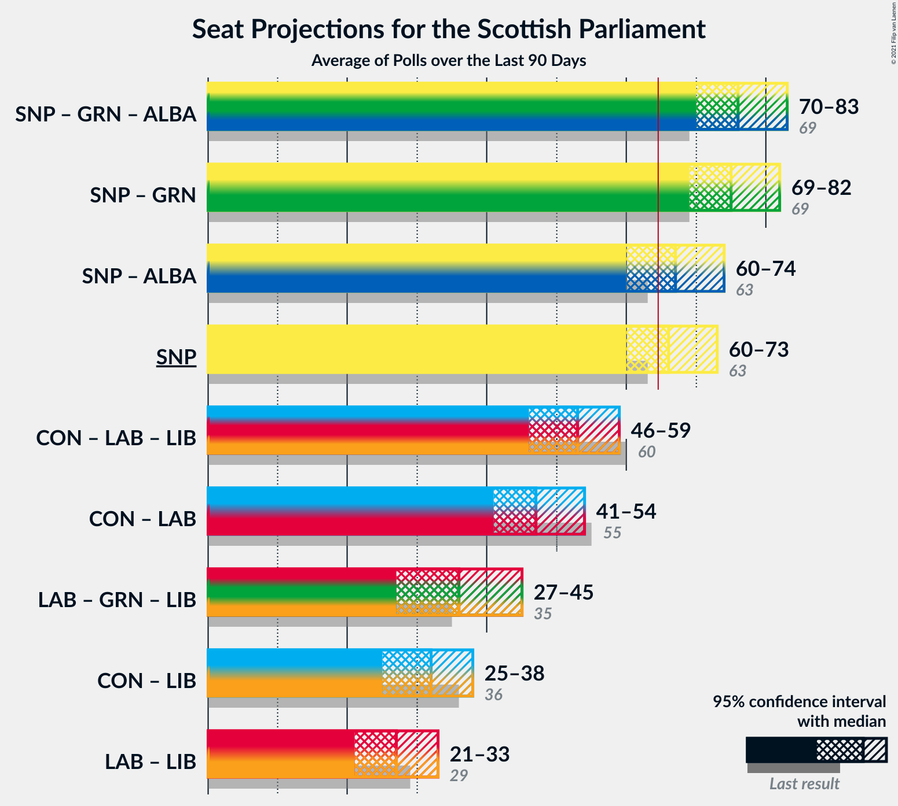

# Overview

The table below lists the most recent polls (less than 90 days old) registered and analyzed so far.

| Period     | Polling firm/Commissioner(s) | SNP | CON | LAB | GRN | LIB | ALBA | UKIP | REF | SSP | AFU |
|:----------:|:----------------------------:|:--:|:--:|:--:|:--:|:--:|:--:|:--:|:--:|:--:|:--:|
| 5 May 2016 | General Election | 41.7%   63 | 22.9%   31 | 19.1%   24 | 6.6%   6 | 5.2%   5 | 0.0%   0 | 2.0%   0 | 0.0%   0 | 0.5%   0 | 0.0%   0 |
| N/A | [Poll Average](average.html) | 33–46%   58–71 | 19–24%   20–33 | 15–23%   17–27 | 6–13%   5–15 | 4–8%   2–8 | 1–5%   0–1 | N/A   N/A | 1–3%   0 | N/A   N/A | 1–3%   0 |
| [28–30 April 2021](2021-04-30-Panelbase.html) | Panelbase   The Sunday Times | 36–42%   60–69 | 20–25%   25–33 | 14–18%   17–24 | 7–10%   5–11 | 6–9%   5–10 | 3–5%   0–4 | N/A   N/A | N/A   N/A | N/A   N/A | 1–3%   0 |
| [23–27 April 2021](2021-04-27-SavantaComRes.html) | Savanta ComRes   The Scotsman | 32–38%   54–64 | 19–24%   24–33 | 16–21%   21–29 | 8–12%   10–14 | 4–6%   3–6 | 1–3%   0 | N/A   N/A | N/A   N/A | N/A   N/A | N/A   N/A |
| [20–22 April 2021](2021-04-22-Survation.html) | Survation   The Sunday Post | 33–38%   60–70 | 18–23%   19–26 | 20–25%   23–28 | 8–12%   8–12 | 6–9%   4–8 | 2–4%   0 | N/A   N/A | N/A   N/A | N/A   N/A | N/A   N/A |
| [16–20 April 2021](2021-04-20-YouGov.html) | YouGov   The Times | 37–43%   59–70 | 20–25%   25–33 | 15–20%   17–25 | 9–12%   10–13 | 4–6%   2–6 | 1–3%   0 | N/A   N/A | 1–2%   0 | N/A   N/A | N/A   N/A |
| [7–19 April 2021](2021-04-19-LordAshcroft.html) | Lord Ashcroft | 40–44%   63–69 | 20–24%   26–32 | 14–18%   17–22 | 8–10%   10–11 | 6–8%   5–8 | 1–3%   0 | N/A   N/A | 1–3%   0 | N/A   N/A | N/A   N/A |
| [1–6 April 2021](2021-04-06-Opinium.html) | Opinium   Sky News | 41–47%   64–73 | 20–25%   24–32 | 15–19%   17–25 | 6–9%   3–10 | 4–7%   2–6 | 1–3%   0 | N/A   N/A | N/A   N/A | N/A   N/A | N/A   N/A |
| [30 March–4 April 2021](2021-04-04-IpsosMORI.html) | Ipsos MORI   STV News | 35–41%   59–69 | 19–24%   22–31 | 16–20%   18–25 | 10–14%   11–16 | 5–8%   4–8 | 2–4%   0 | N/A   N/A | N/A   N/A | N/A   N/A | N/A   N/A |
| 5 May 2016 | General Election | 41.7%   63 | 22.9%   31 | 19.1%   24 | 6.6%   6 | 5.2%   5 | 0.0%   0 | 2.0%   0 | 0.0%   0 | 0.5%   0 | 0.0%   0 |

Only polls for which at least the sample size has been published are included in the table above.

**Legend:**
+ **Top half of each row:** Voting intentions (95% confidence interval)
+ **Bottom half of each row:** Seat projections for the Scottish Parliament (95% confidence interval)
+ **SNP:** Scottish National Party
+ **CON:** Scottish Conservative & Unionist Party
+ **LAB:** Scottish Labour
+ **GRN:** Scottish Greens
+ **LIB:** Scottish Liberal Democrats
+ **ALBA:** Alba Party
+ **UKIP:** UK Independence Party
+ **REF:** Reform UK
+ **SSP:** Scottish Socialist Party
+ **AFU:** All For Unity
+ **N/A (single party):** Party not included the published results
+ **N/A (entire row):** Calculation for this opinion poll not started yet

