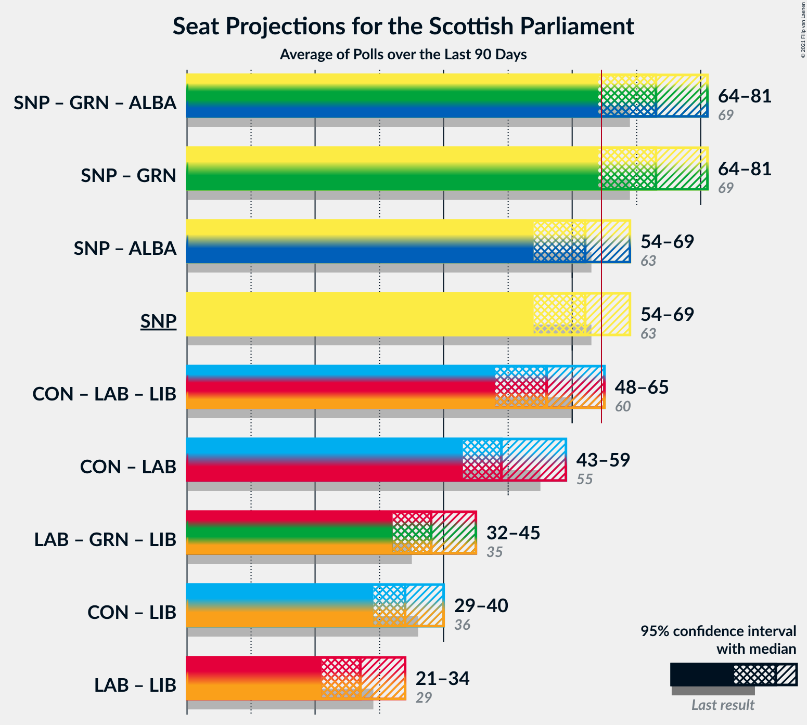

# Overview

The table below lists the most recent polls (less than 90 days old) registered and analyzed so far.

| Period     | Polling firm/Commissioner(s) | SNP | CON | LAB | GRN | LIB | ALBA | UKIP | REF | SSP |
|:----------:|:----------------------------:|:--:|:--:|:--:|:--:|:--:|:--:|:--:|:--:|:--:|
| 5 May 2016 | General Election | 41.7%   63 | 22.9%   31 | 19.1%   24 | 6.6%   6 | 5.2%   5 | 0.0%   0 | 2.0%   0 | 0.0%   0 | 0.5%   0 |
| N/A | [Poll Average](average.html) | 36–46%   59–73 | 17–25%   20–33 | 15–21%   17–27 | 5–12%   3–14 | 4–9%   2–10 | 2–4%   0 | N/A   N/A | 1–3%   0 | 2–4%   0 |
| [29–30 March 2021](2021-03-30-Survation.html) | Survation   The Courier | 34–40%   58–67 | 16–21%   19–25 | 17–22%   21–27 | 9–13%   10–15 | 6–10%   6–12 | 2–4%   0 | N/A   N/A | N/A   N/A | N/A   N/A |
| [23–26 March 2021](2021-03-26-FindOutNow.html) | Find Out Now   Daily Express | 39–46%   62–71 | 19–24%   23–32 | 14–19%   17–23 | 9–13%   10–15 | 4–7%   2–6 | N/A   N/A | N/A   N/A | 1–3%   0 | N/A   N/A |
| [16–19 March 2021](2021-03-19-BMGResearch.html) | BMG Research   Herald Scotland | 39–45%   61–70 | 20–25%   23–32 | 15–19%   17–25 | 7–10%   4–10 | 7–10%   6–11 | N/A   N/A | N/A   N/A | 1–2%   0 | N/A   N/A |
| [11–16 March 2021](2021-03-16-Opinium.html) | Opinium   Sky News | 40–45%   60–70 | 20–25%   24–32 | 17–22%   21–28 | 6–9%   3–10 | 4–6%   2–6 | N/A   N/A | N/A   N/A | N/A   N/A | N/A   N/A |
| [5–10 March 2021](2021-03-10-SavantaComRes.html) | Savanta ComRes   The Scotsman | 37–43%   57–67 | 21–27%   25–34 | 16–21%   17–25 | 8–12%   9–13 | 5–8%   4–7 | N/A   N/A | N/A   N/A | N/A   N/A | N/A   N/A |
| [4–8 March 2021](2021-03-08-YouGov.html) | YouGov   The Times | 42–48%   65–75 | 19–24%   24–32 | 14–18%   17–25 | 5–8%   3–10 | 4–6%   2–6 | N/A   N/A | N/A   N/A | N/A   N/A | 2–4%   0 |
| [3–5 March 2021](2021-03-05-Panelbase.html) | Panelbase   The Sunday Times | 39–45%   60–70 | 20–25%   24–33 | 17–21%   21–29 | 5–8%   2–9 | 6–9%   5–9 | N/A   N/A | N/A   N/A | N/A   N/A | N/A   N/A |
| 5 May 2016 | General Election | 41.7%   63 | 22.9%   31 | 19.1%   24 | 6.6%   6 | 5.2%   5 | 0.0%   0 | 2.0%   0 | 0.0%   0 | 0.5%   0 |

Only polls for which at least the sample size has been published are included in the table above.

**Legend:**
+ **Top half of each row:** Voting intentions (95% confidence interval)
+ **Bottom half of each row:** Seat projections for the Scottish Parliament (95% confidence interval)
+ **SNP:** Scottish National Party
+ **CON:** Scottish Conservative & Unionist Party
+ **LAB:** Scottish Labour
+ **GRN:** Scottish Greens
+ **LIB:** Scottish Liberal Democrats
+ **ALBA:** Alba Party
+ **UKIP:** UK Independence Party
+ **REF:** Reform UK
+ **SSP:** Scottish Socialist Party
+ **N/A (single party):** Party not included the published results
+ **N/A (entire row):** Calculation for this opinion poll not started yet

