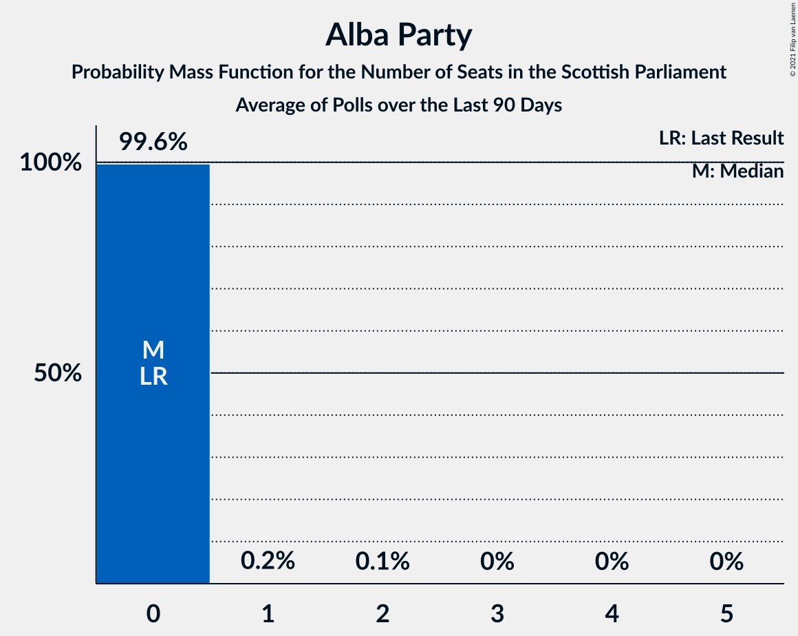

# Alba Party

<a href="#voting-intentions">Voting Intentions</a> | <a href="#seats">Seats</a>

## Voting Intentions

Last result: **0.0%** (General Election of 5 May 2016)

### Confidence Intervals

| Period     | Polling firm/Commissioner(s) | Median | 80% Confidence Interval | 90% Confidence Interval | 95% Confidence Interval | 99% Confidence Interval |
|:----------:|:----------------:|:-----------:|:-----------------------:|:-----------------------:|:-----------------------:|:-----------------------:|
| N/A | [Poll Average](average.html) | 4.5% | 2.6–6.7% | 2.4–7.1% | 2.2–7.4% | 2.0–8.0% |
| [30 March–1 April 2021](2021-04-01-Panelbase.html) | Panelbase   The Sunday Times | 6.0% | 5.2–7.1% | 4.9–7.4% | 4.7–7.7% | 4.3–8.2% |
| [29–30 March 2021](2021-03-30-Survation.html) | Survation   The Courier | 3.0% | 2.4–3.8% | 2.2–4.1% | 2.1–4.3% | 1.9–4.7% |
| [23–26 March 2021](2021-03-26-FindOutNow.html) | Find Out Now   Daily Express | 0.0% | N/A | N/A | N/A | N/A |
| [16–19 March 2021](2021-03-19-BMGResearch.html) | BMG Research   Herald Scotland | 0.0% | N/A | N/A | N/A | N/A |
| [11–18 March 2021](2021-03-18-Survation.html) | Survation   The Courier | 0.0% | N/A | N/A | N/A | N/A |
| [11–16 March 2021](2021-03-16-Opinium.html) | Opinium   Sky News | 0.0% | N/A | N/A | N/A | N/A |
| [9–12 March 2021](2021-03-12-Survation.html) | Survation   Scotland in Union | 0.0% | N/A | N/A | N/A | N/A |
| [5–10 March 2021](2021-03-10-SavantaComRes.html) | Savanta ComRes   The Scotsman | 0.0% | N/A | N/A | N/A | N/A |
| [4–8 March 2021](2021-03-08-YouGov.html) | YouGov   The Times | 0.0% | N/A | N/A | N/A | N/A |
| [3–5 March 2021](2021-03-05-Panelbase.html) | Panelbase   The Sunday Times | 0.0% | N/A | N/A | N/A | N/A |
| [24–25 February 2021](2021-02-25-Survation.html) | Survation   Daily Record | 0.0% | N/A | N/A | N/A | N/A |
| [15–21 February 2021](2021-02-21-IpsosMORI.html) | Ipsos MORI   STV News | 0.0% | N/A | N/A | N/A | N/A |
| [4–9 February 2021](2021-02-09-SavantaComRes.html) | Savanta ComRes   The Scotsman | 0.0% | N/A | N/A | N/A | N/A |
| [19–22 January 2021](2021-01-22-Panelbase.html) | Panelbase   The Sunday Times | 0.0% | N/A | N/A | N/A | N/A |
| [11–13 January 2021](2021-01-13-Survation.html) | Survation   Scot Goes Pop | 0.0% | N/A | N/A | N/A | N/A |
| [8–13 January 2021](2021-01-13-SavantaComRes.html) | Savanta ComRes   The Scotsman | 0.0% | N/A | N/A | N/A | N/A |
| [11–15 December 2020](2020-12-15-SavantaComRes.html) | Savanta ComRes   The Scotsman | 0.0% | N/A | N/A | N/A | N/A |
| [4–9 December 2020](2020-12-09-Survation.html) | Survation | 0.0% | N/A | N/A | N/A | N/A |
| [20–26 November 2020](2020-11-26-IpsosMORI.html) | Ipsos MORI   STV News | 0.0% | N/A | N/A | N/A | N/A |
| [5–11 November 2020](2020-11-11-Panelbase.html) | Panelbase   Scot Goes Pop | 0.0% | N/A | N/A | N/A | N/A |
| [6–10 November 2020](2020-11-10-YouGov.html) | YouGov | 0.0% | N/A | N/A | N/A | N/A |
| [3 November 2020](2020-11-03-Survation.html) | Survation | 0.0% | N/A | N/A | N/A | N/A |
| [9 October 2020](2020-10-09-SavantaComRes.html) | Savanta ComRes | 0.0% | N/A | N/A | N/A | N/A |
| [2–9 October 2020](2020-10-09-IpsosMORI.html) | Ipsos MORI   STV News | 0.0% | N/A | N/A | N/A | N/A |
| [17–21 September 2020](2020-09-21-JLPartners.html) | JL Partners   Politico | 0.0% | N/A | N/A | N/A | N/A |
| [2–7 September 2020](2020-09-07-Survation.html) | Survation | 0.0% | N/A | N/A | N/A | N/A |
| [6–13 August 2020](2020-08-13-SavantaComRes.html) | Savanta ComRes | 0.0% | N/A | N/A | N/A | N/A |
| [6–10 August 2020](2020-08-10-YouGov.html) | YouGov   The Times | 0.0% | N/A | N/A | N/A | N/A |
| [3 July 2020](2020-07-03-Panelbase.html) | Panelbase   The Sunday Times | 0.0% | N/A | N/A | N/A | N/A |
| [1–5 June 2020](2020-06-05-Panelbase.html) | Panelbase   Scot Goes Pop | 0.0% | N/A | N/A | N/A | N/A |
| [1–5 May 2020](2020-05-05-Panelbase.html) | Panelbase   Wings Over Scotland | 0.0% | N/A | N/A | N/A | N/A |
| [24–27 April 2020](2020-04-27-YouGov.html) | YouGov | 0.0% | N/A | N/A | N/A | N/A |
| [24–26 March 2020](2020-03-26-Panelbase.html) | Panelbase   The Sunday Times | 0.0% | N/A | N/A | N/A | N/A |
| [28–31 January 2020](2020-01-31-Panelbase.html) | Panelbase   Scot Goes Pop | 0.0% | N/A | N/A | N/A | N/A |
| [20–22 January 2020](2020-01-22-Survation.html) | Survation   Progress Scotland | 0.0% | N/A | N/A | N/A | N/A |
| [3–6 December 2019](2019-12-06-Panelbase.html) | Panelbase   The Sunday Times | 0.0% | N/A | N/A | N/A | N/A |
| [3 December 2019](2019-12-03-YouGov.html) | YouGov   The Times | 0.0% | N/A | N/A | N/A | N/A |
| [20–22 November 2019](2019-11-22-Panelbase.html) | Panelbase   The Sunday Times | 0.0% | N/A | N/A | N/A | N/A |
| [9–11 October 2019](2019-10-11-Panelbase.html) | Panelbase   The Sunday Times | 0.0% | N/A | N/A | N/A | N/A |
| [3 September 2019](2019-09-03-YouGov.html) | YouGov   The Times | 0.0% | N/A | N/A | N/A | N/A |
| [18–20 June 2019](2019-06-20-Panelbase.html) | Panelbase   The Sunday Times | 0.0% | N/A | N/A | N/A | N/A |
| [14–17 May 2019](2019-05-17-Panelbase.html) | Panelbase   The Sunday Times | 0.0% | N/A | N/A | N/A | N/A |
| [24–26 April 2019](2019-04-26-YouGov.html) | YouGov   The Times | 0.0% | N/A | N/A | N/A | N/A |
| [18–24 April 2019](2019-04-24-Panelbase.html) | Panelbase | 0.0% | N/A | N/A | N/A | N/A |
| [6 March 2019](2019-03-06-Panelbase.html) | Panelbase   Wings Over Scotland | 0.0% | N/A | N/A | N/A | N/A |
| [1–4 March 2019](2019-03-04-Survation.html) | Survation   Scottish Daily Mail | 0.0% | N/A | N/A | N/A | N/A |
| [5 December 2018](2018-12-05-Panelbase.html) | Panelbase   The Sunday Times | 0.0% | N/A | N/A | N/A | N/A |
| [2–7 November 2018](2018-11-07-Panelbase.html) | Panelbase   Constitutional Commission | 0.0% | N/A | N/A | N/A | N/A |
| [18–21 October 2018](2018-10-21-Survation.html) | Survation   Daily Record | 0.0% | N/A | N/A | N/A | N/A |
| [3–5 October 2018](2018-10-05-Survation.html) | Survation   SNP | 0.0% | N/A | N/A | N/A | N/A |
| [4 October 2018](2018-10-04-Panelbase.html) | Panelbase   The Sunday Times | 0.0% | N/A | N/A | N/A | N/A |
| [2 October 2018](2018-10-02-Survation.html) | Survation   The Sunday Post | 0.0% | N/A | N/A | N/A | N/A |
| [5–10 July 2018](2018-07-10-Survation.html) | Survation   Daily Record | 0.0% | N/A | N/A | N/A | N/A |
| [21–27 June 2018](2018-06-27-Panelbase.html) | Panelbase   Wings Over Scotland | 0.0% | N/A | N/A | N/A | N/A |
| [8–13 June 2018](2018-06-13-Panelbase.html) | Panelbase   The Sunday Times | 0.0% | N/A | N/A | N/A | N/A |
| [1–5 June 2018](2018-06-05-YouGov.html) | YouGov   The Times | 0.0% | N/A | N/A | N/A | N/A |
| [24–28 January 2018](2018-01-28-Survation.html) | Survation   Daily Record | 0.0% | N/A | N/A | N/A | N/A |
| [12–16 January 2018](2018-01-16-YouGov.html) | YouGov   The Times | 0.0% | N/A | N/A | N/A | N/A |
| [1–5 December 2017](2017-12-05-Survation.html) | Survation   The Sunday Post | 0.0% | N/A | N/A | N/A | N/A |
| [27–30 November 2017](2017-11-30-Survation.html) | Survation   Daily Record | 0.0% | N/A | N/A | N/A | N/A |
| [2–5 October 2017](2017-10-05-YouGov.html) | YouGov   The Times | 0.0% | N/A | N/A | N/A | N/A |
| [8–12 September 2017](2017-09-12-Survation.html) | Survation   Scottish Daily Mail | 0.0% | N/A | N/A | N/A | N/A |
| [9–14 March 2017](2017-03-14-YouGov.html) | YouGov   The Times | 0.0% | N/A | N/A | N/A | N/A |
| [24–29 November 2016](2016-11-29-YouGov.html) | YouGov   The Times | 0.0% | N/A | N/A | N/A | N/A |
| [4 October 2016](2016-10-04-BMGResearch.html) | BMG Research | 0.0% | N/A | N/A | N/A | N/A |
| [29–31 August 2016](2016-08-31-YouGov.html) | YouGov   The Times | 0.0% | N/A | N/A | N/A | N/A |
| [24–28 June 2016](2016-06-28-Survation.html) | Survation   Scottish Daily Mail | 0.0% | N/A | N/A | N/A | N/A |

### Probability Mass Function

The following table shows the probability mass function per percentage block of voting intentions for the [poll average](average.html) for Alba Party.

| Voting Intentions | Probability | Accumulated | Special Marks |
|:-----------------:|:-----------:|:-----------:|:-------------:|
| 0.0–0.5% | 0% | 100% | Last Result |
| 0.5–1.5% | 0% | 100% |  |
| 1.5–2.5% | 8% | 100% |  |
| 2.5–3.5% | 32% | 92% |  |
| 3.5–4.5% | 10% | 60% |  |
| 4.5–5.5% | 11% | 50% | Median |
| 5.5–6.5% | 25% | 39% |  |
| 6.5–7.5% | 12% | 14% |  |
| 7.5–8.5% | 2% | 2% |  |
| 8.5–9.5% | 0.1% | 0.1% |  |
| 9.5–10.5% | 0% | 0% |  |

## Seats

Last result: **0** seats (General Election of 5 May 2016)

### Confidence Intervals

| Period     | Polling firm/Commissioner(s) | Median | 80% Confidence Interval | 90% Confidence Interval | 95% Confidence Interval | 99% Confidence Interval |
|:----------:|:----------------:|:------:|:-----------------------:|:-----------------------:|:-----------------------:|:-----------------------:|
| N/A | [Poll Average](average.html) | 0 | 0–8 | 0–8 | 0–8 | 0–8 |
| [30 March–1 April 2021](2021-04-01-Panelbase.html) | Panelbase   The Sunday Times | 6 | 3–8 | 2–8 | 0–8 | 0–8 |
| [29–30 March 2021](2021-03-30-Survation.html) | Survation   The Courier | 0 | 0 | 0 | 0 | 0 |
| [23–26 March 2021](2021-03-26-FindOutNow.html) | Find Out Now   Daily Express |  |  |  |  |  |
| [16–19 March 2021](2021-03-19-BMGResearch.html) | BMG Research   Herald Scotland |  |  |  |  |  |
| [11–18 March 2021](2021-03-18-Survation.html) | Survation   The Courier |  |  |  |  |  |
| [11–16 March 2021](2021-03-16-Opinium.html) | Opinium   Sky News |  |  |  |  |  |
| [9–12 March 2021](2021-03-12-Survation.html) | Survation   Scotland in Union |  |  |  |  |  |
| [5–10 March 2021](2021-03-10-SavantaComRes.html) | Savanta ComRes   The Scotsman |  |  |  |  |  |
| [4–8 March 2021](2021-03-08-YouGov.html) | YouGov   The Times |  |  |  |  |  |
| [3–5 March 2021](2021-03-05-Panelbase.html) | Panelbase   The Sunday Times |  |  |  |  |  |
| [24–25 February 2021](2021-02-25-Survation.html) | Survation   Daily Record |  |  |  |  |  |
| [15–21 February 2021](2021-02-21-IpsosMORI.html) | Ipsos MORI   STV News |  |  |  |  |  |
| [4–9 February 2021](2021-02-09-SavantaComRes.html) | Savanta ComRes   The Scotsman |  |  |  |  |  |
| [19–22 January 2021](2021-01-22-Panelbase.html) | Panelbase   The Sunday Times |  |  |  |  |  |
| [11–13 January 2021](2021-01-13-Survation.html) | Survation   Scot Goes Pop |  |  |  |  |  |
| [8–13 January 2021](2021-01-13-SavantaComRes.html) | Savanta ComRes   The Scotsman |  |  |  |  |  |
| [11–15 December 2020](2020-12-15-SavantaComRes.html) | Savanta ComRes   The Scotsman |  |  |  |  |  |
| [4–9 December 2020](2020-12-09-Survation.html) | Survation |  |  |  |  |  |
| [20–26 November 2020](2020-11-26-IpsosMORI.html) | Ipsos MORI   STV News |  |  |  |  |  |
| [5–11 November 2020](2020-11-11-Panelbase.html) | Panelbase   Scot Goes Pop |  |  |  |  |  |
| [6–10 November 2020](2020-11-10-YouGov.html) | YouGov |  |  |  |  |  |
| [3 November 2020](2020-11-03-Survation.html) | Survation |  |  |  |  |  |
| [9 October 2020](2020-10-09-SavantaComRes.html) | Savanta ComRes |  |  |  |  |  |
| [2–9 October 2020](2020-10-09-IpsosMORI.html) | Ipsos MORI   STV News |  |  |  |  |  |
| [17–21 September 2020](2020-09-21-JLPartners.html) | JL Partners   Politico |  |  |  |  |  |
| [2–7 September 2020](2020-09-07-Survation.html) | Survation |  |  |  |  |  |
| [6–13 August 2020](2020-08-13-SavantaComRes.html) | Savanta ComRes |  |  |  |  |  |
| [6–10 August 2020](2020-08-10-YouGov.html) | YouGov   The Times |  |  |  |  |  |
| [3 July 2020](2020-07-03-Panelbase.html) | Panelbase   The Sunday Times |  |  |  |  |  |
| [1–5 June 2020](2020-06-05-Panelbase.html) | Panelbase   Scot Goes Pop |  |  |  |  |  |
| [1–5 May 2020](2020-05-05-Panelbase.html) | Panelbase   Wings Over Scotland |  |  |  |  |  |
| [24–27 April 2020](2020-04-27-YouGov.html) | YouGov |  |  |  |  |  |
| [24–26 March 2020](2020-03-26-Panelbase.html) | Panelbase   The Sunday Times |  |  |  |  |  |
| [28–31 January 2020](2020-01-31-Panelbase.html) | Panelbase   Scot Goes Pop |  |  |  |  |  |
| [20–22 January 2020](2020-01-22-Survation.html) | Survation   Progress Scotland |  |  |  |  |  |
| [3–6 December 2019](2019-12-06-Panelbase.html) | Panelbase   The Sunday Times |  |  |  |  |  |
| [3 December 2019](2019-12-03-YouGov.html) | YouGov   The Times |  |  |  |  |  |
| [20–22 November 2019](2019-11-22-Panelbase.html) | Panelbase   The Sunday Times |  |  |  |  |  |
| [9–11 October 2019](2019-10-11-Panelbase.html) | Panelbase   The Sunday Times |  |  |  |  |  |
| [3 September 2019](2019-09-03-YouGov.html) | YouGov   The Times |  |  |  |  |  |
| [18–20 June 2019](2019-06-20-Panelbase.html) | Panelbase   The Sunday Times |  |  |  |  |  |
| [14–17 May 2019](2019-05-17-Panelbase.html) | Panelbase   The Sunday Times |  |  |  |  |  |
| [24–26 April 2019](2019-04-26-YouGov.html) | YouGov   The Times |  |  |  |  |  |
| [18–24 April 2019](2019-04-24-Panelbase.html) | Panelbase |  |  |  |  |  |
| [6 March 2019](2019-03-06-Panelbase.html) | Panelbase   Wings Over Scotland |  |  |  |  |  |
| [1–4 March 2019](2019-03-04-Survation.html) | Survation   Scottish Daily Mail |  |  |  |  |  |
| [5 December 2018](2018-12-05-Panelbase.html) | Panelbase   The Sunday Times |  |  |  |  |  |
| [2–7 November 2018](2018-11-07-Panelbase.html) | Panelbase   Constitutional Commission |  |  |  |  |  |
| [18–21 October 2018](2018-10-21-Survation.html) | Survation   Daily Record |  |  |  |  |  |
| [3–5 October 2018](2018-10-05-Survation.html) | Survation   SNP |  |  |  |  |  |
| [4 October 2018](2018-10-04-Panelbase.html) | Panelbase   The Sunday Times |  |  |  |  |  |
| [2 October 2018](2018-10-02-Survation.html) | Survation   The Sunday Post |  |  |  |  |  |
| [5–10 July 2018](2018-07-10-Survation.html) | Survation   Daily Record |  |  |  |  |  |
| [21–27 June 2018](2018-06-27-Panelbase.html) | Panelbase   Wings Over Scotland |  |  |  |  |  |
| [8–13 June 2018](2018-06-13-Panelbase.html) | Panelbase   The Sunday Times |  |  |  |  |  |
| [1–5 June 2018](2018-06-05-YouGov.html) | YouGov   The Times |  |  |  |  |  |
| [24–28 January 2018](2018-01-28-Survation.html) | Survation   Daily Record |  |  |  |  |  |
| [12–16 January 2018](2018-01-16-YouGov.html) | YouGov   The Times |  |  |  |  |  |
| [1–5 December 2017](2017-12-05-Survation.html) | Survation   The Sunday Post |  |  |  |  |  |
| [27–30 November 2017](2017-11-30-Survation.html) | Survation   Daily Record |  |  |  |  |  |
| [2–5 October 2017](2017-10-05-YouGov.html) | YouGov   The Times |  |  |  |  |  |
| [8–12 September 2017](2017-09-12-Survation.html) | Survation   Scottish Daily Mail |  |  |  |  |  |
| [9–14 March 2017](2017-03-14-YouGov.html) | YouGov   The Times |  |  |  |  |  |
| [24–29 November 2016](2016-11-29-YouGov.html) | YouGov   The Times |  |  |  |  |  |
| [4 October 2016](2016-10-04-BMGResearch.html) | BMG Research |  |  |  |  |  |
| [29–31 August 2016](2016-08-31-YouGov.html) | YouGov   The Times |  |  |  |  |  |
| [24–28 June 2016](2016-06-28-Survation.html) | Survation   Scottish Daily Mail |  |  |  |  |  |

### Probability Mass Function

The following table shows the probability mass function per seat for the [poll average](average.html) for Alba Party.

| Number of Seats | Probability | Accumulated | Special Marks |
|:---------------:|:-----------:|:-----------:|:-------------:|
| 0 | 51% | 100% | Last Result, Median |
| 1 | 0.4% | 49% |  |
| 2 | 2% | 48% |  |
| 3 | 2% | 47% |  |
| 4 | 5% | 45% |  |
| 5 | 4% | 40% |  |
| 6 | 18% | 36% |  |
| 7 | 7% | 18% |  |
| 8 | 11% | 11% |  |
| 9 | 0% | 0% |  |

