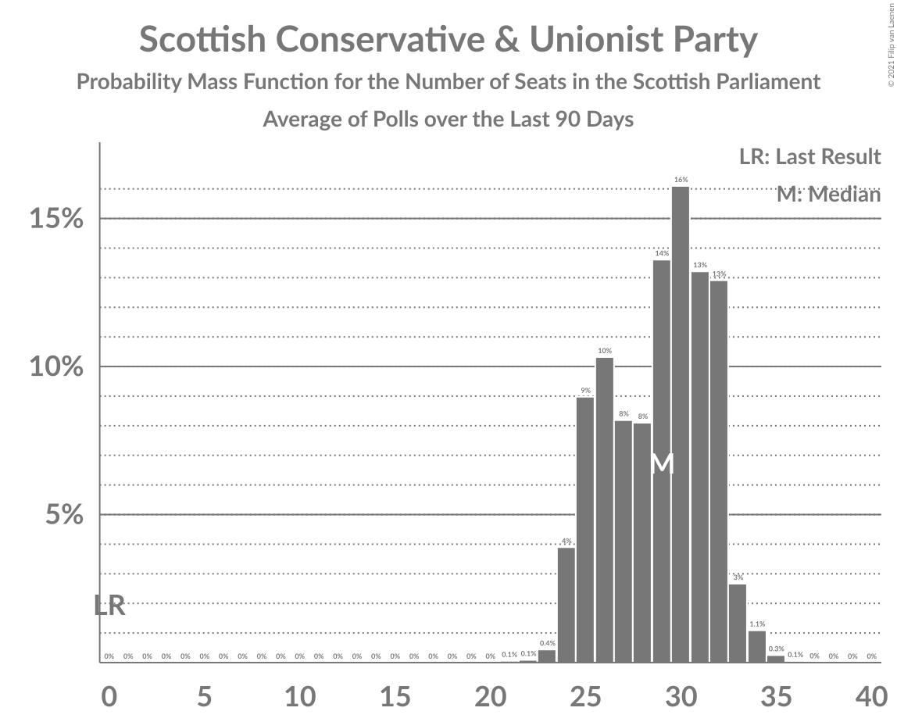

# Scottish Conservative & Unionist Party

<a href="#voting-intentions">Voting Intentions</a> | <a href="#seats">Seats</a>

## Voting Intentions

Last result: **22.9%** (General Election of 5 May 2016)

### Confidence Intervals

| Period     | Polling firm/Commissioner(s) | Median | 80% Confidence Interval | 90% Confidence Interval | 95% Confidence Interval | 99% Confidence Interval |
|:----------:|:----------------:|:-----------:|:-----------------------:|:-----------------------:|:-----------------------:|:-----------------------:|
| N/A | [Poll Average](average.html) | 22.0% | 20.3–23.8% | 19.8–24.3% | 19.4–24.8% | 18.6–25.7% |
| [2–4 May 2021](2021-05-04-YouGov.html) | YouGov   The Times | 22.0% | 20.4–23.7% | 19.9–24.2% | 19.5–24.7% | 18.8–25.5% |
| [3 May 2021](2021-05-03-Opinium.html) | Opinium   Sky News | 23.0% | 21.3–24.7% | 20.9–25.2% | 20.5–25.7% | 19.7–26.5% |
| [28–30 April 2021](2021-04-30-Panelbase.html) | Panelbase   The Sunday Times | 22.0% | 20.4–23.7% | 20.0–24.1% | 19.6–24.5% | 18.9–25.4% |
| [27–30 April 2021](2021-04-30-BMGResearch.html) | BMG Research   The Herald | 22.0% | 20.4–23.7% | 19.9–24.2% | 19.5–24.7% | 18.8–25.5% |
| [23–27 April 2021](2021-04-27-SavantaComRes.html) | Savanta ComRes   The Scotsman | 21.6% | 20.0–23.3% | 19.5–23.8% | 19.1–24.2% | 18.4–25.1% |
| [23–26 April 2021](2021-04-26-Survation.html) | Survation   GMB | 22.4% | 20.8–24.2% | 20.3–24.7% | 20.0–25.1% | 19.2–26.0% |
| [21–26 April 2021](2021-04-26-Panelbase.html) | Panelbase   Scot Goes Pop | 21.0% | 19.5–22.7% | 19.1–23.2% | 18.7–23.6% | 18.0–24.4% |
| [20–22 April 2021](2021-04-22-Survation.html) | Survation   The Sunday Post | 20.2% | 18.6–21.8% | 18.2–22.3% | 17.8–22.7% | 17.1–23.5% |
| [16–20 April 2021](2021-04-20-YouGov.html) | YouGov   The Times | 22.4% | 20.9–24.0% | 20.5–24.5% | 20.1–24.9% | 19.5–25.7% |
| [16–20 April 2021](2021-04-20-SavantaComRes.html) | Savanta ComRes   The Scotsman | 23.5% | 21.8–25.3% | 21.4–25.8% | 20.9–26.2% | 20.2–27.1% |
| [7–19 April 2021](2021-04-19-LordAshcroft.html) | Lord Ashcroft | 22.0% | 20.9–23.2% | 20.5–23.6% | 20.3–23.9% | 19.7–24.5% |
| [9–12 April 2021](2021-04-12-Panelbase.html) | Panelbase   Believe in Scotland | 22.0% | 20.3–23.7% | 19.9–24.2% | 19.5–24.6% | 18.7–25.5% |
| [2–7 April 2021](2021-04-07-SavantaComRes.html) | Savanta ComRes   The Scotsman | 20.8% | 19.2–22.5% | 18.7–23.0% | 18.4–23.4% | 17.6–24.2% |
| [1–6 April 2021](2021-04-06-Opinium.html) | Opinium   Sky News | 22.0% | 20.4–23.7% | 20.0–24.2% | 19.6–24.6% | 18.8–25.5% |
| [30 March–4 April 2021](2021-04-04-IpsosMORI.html) | Ipsos MORI   STV News | 21.0% | 19.4–22.7% | 19.0–23.2% | 18.6–23.6% | 17.9–24.4% |
| [30 March–1 April 2021](2021-04-01-Panelbase.html) | Panelbase   The Sunday Times | 21.0% | 19.4–22.7% | 19.0–23.2% | 18.6–23.6% | 17.8–24.5% |
| [29–30 March 2021](2021-03-30-Survation.html) | Survation   The Courier | 18.0% | 16.5–19.6% | 16.1–20.1% | 15.7–20.5% | 15.0–21.3% |
| [23–26 March 2021](2021-03-26-FindOutNow.html) | Find Out Now   Daily Express | 21.2% | 19.7–23.0% | 19.2–23.4% | 18.8–23.9% | 18.1–24.7% |
| [19–22 March 2021](2021-03-22-YouGov.html) | YouGov   The Times | 23.8% | 22.1–25.5% | 21.6–26.0% | 21.2–26.5% | 20.4–27.4% |
| [16–19 March 2021](2021-03-19-BMGResearch.html) | BMG Research   Herald Scotland | 22.0% | 20.4–23.8% | 20.0–24.3% | 19.6–24.7% | 18.9–25.5% |
| [11–18 March 2021](2021-03-18-Survation.html) | Survation   The Courier | 19.2% | 18.0–20.6% | 17.6–20.9% | 17.3–21.3% | 16.7–21.9% |
| [11–16 March 2021](2021-03-16-Opinium.html) | Opinium   Sky News | 22.3% | 20.7–23.9% | 20.3–24.4% | 19.9–24.8% | 19.2–25.7% |
| [9–12 March 2021](2021-03-12-Survation.html) | Survation   Scotland in Union | 21.0% | 19.4–22.7% | 18.9–23.2% | 18.6–23.6% | 17.8–24.4% |
| [5–10 March 2021](2021-03-10-SavantaComRes.html) | Savanta ComRes   The Scotsman | 24.0% | 22.3–25.8% | 21.8–26.3% | 21.4–26.7% | 20.7–27.6% |
| [4–8 March 2021](2021-03-08-YouGov.html) | YouGov   The Times | 21.0% | 19.5–22.6% | 19.1–23.1% | 18.7–23.5% | 18.0–24.3% |
| [3–5 March 2021](2021-03-05-Panelbase.html) | Panelbase   The Sunday Times | 22.0% | 20.4–23.8% | 20.0–24.2% | 19.6–24.7% | 18.8–25.5% |
| [24–25 February 2021](2021-02-25-Survation.html) | Survation   Daily Record | 21.0% | 19.4–22.7% | 18.9–23.2% | 18.6–23.6% | 17.8–24.4% |
| [15–21 February 2021](2021-02-21-IpsosMORI.html) | Ipsos MORI   STV News | 22.0% | 20.4–23.7% | 20.0–24.2% | 19.6–24.7% | 18.9–25.5% |
| [4–9 February 2021](2021-02-09-SavantaComRes.html) | Savanta ComRes   The Scotsman | 21.0% | 19.4–22.7% | 18.9–23.2% | 18.5–23.6% | 17.8–24.4% |
| [19–22 January 2021](2021-01-22-Panelbase.html) | Panelbase   The Sunday Times | 20.2% | 18.7–21.9% | 18.3–22.3% | 17.9–22.7% | 17.2–23.5% |
| [11–13 January 2021](2021-01-13-Survation.html) | Survation   Scot Goes Pop | 17.0% | 15.5–18.5% | 15.1–19.0% | 14.8–19.4% | 14.1–20.2% |
| [8–13 January 2021](2021-01-13-SavantaComRes.html) | Savanta ComRes   The Scotsman | 16.0% | 14.6–17.6% | 14.3–18.0% | 13.9–18.4% | 13.3–19.2% |
| [11–15 December 2020](2020-12-15-SavantaComRes.html) | Savanta ComRes   The Scotsman | 20.0% | 18.5–21.7% | 18.1–22.2% | 17.7–22.6% | 17.0–23.5% |
| [4–9 December 2020](2020-12-09-Survation.html) | Survation | 18.0% | 16.5–19.6% | 16.1–20.1% | 15.8–20.5% | 15.1–21.3% |
| [20–26 November 2020](2020-11-26-IpsosMORI.html) | Ipsos MORI   STV News | 22.0% | 20.4–23.7% | 19.9–24.2% | 19.5–24.6% | 18.8–25.5% |
| [5–11 November 2020](2020-11-11-Panelbase.html) | Panelbase   Scot Goes Pop | 19.8% | 18.3–21.5% | 17.8–21.9% | 17.5–22.4% | 16.8–23.2% |
| [6–10 November 2020](2020-11-10-YouGov.html) | YouGov | 20.0% | 18.5–21.6% | 18.1–22.1% | 17.7–22.5% | 17.1–23.3% |
| [3 November 2020](2020-11-03-Survation.html) | Survation | 17.0% | 15.6–18.5% | 15.2–19.0% | 14.9–19.4% | 14.2–20.1% |
| [9 October 2020](2020-10-09-SavantaComRes.html) | Savanta ComRes | 21.2% | 19.6–23.0% | 19.2–23.5% | 18.8–23.9% | 18.1–24.7% |
| [2–9 October 2020](2020-10-09-IpsosMORI.html) | Ipsos MORI   STV News | 18.0% | 16.5–19.6% | 16.1–20.0% | 15.8–20.4% | 15.1–21.2% |
| [17–21 September 2020](2020-09-21-JLPartners.html) | JL Partners   Politico | 19.0% | 17.5–20.7% | 17.1–21.1% | 16.7–21.5% | 16.0–22.3% |
| [2–7 September 2020](2020-09-07-Survation.html) | Survation | 18.0% | 16.5–19.6% | 16.1–20.1% | 15.7–20.5% | 15.1–21.3% |
| [6–13 August 2020](2020-08-13-SavantaComRes.html) | Savanta ComRes | 20.8% | 19.3–22.5% | 18.8–23.0% | 18.4–23.5% | 17.7–24.3% |
| [6–10 August 2020](2020-08-10-YouGov.html) | YouGov   The Times | 20.8% | 19.3–22.4% | 18.9–22.8% | 18.5–23.2% | 17.8–24.0% |
| [3 July 2020](2020-07-03-Panelbase.html) | Panelbase   The Sunday Times | 18.2% | 16.8–19.9% | 16.3–20.3% | 16.0–20.7% | 15.3–21.5% |
| [1–5 June 2020](2020-06-05-Panelbase.html) | Panelbase   Scot Goes Pop | 19.0% | 17.5–20.6% | 17.1–21.1% | 16.7–21.5% | 16.0–22.3% |
| [1–5 May 2020](2020-05-05-Panelbase.html) | Panelbase   Wings Over Scotland | 22.2% | 20.6–23.9% | 20.2–24.4% | 19.8–24.8% | 19.1–25.6% |
| [24–27 April 2020](2020-04-27-YouGov.html) | YouGov | 23.0% | 21.4–24.7% | 21.0–25.2% | 20.6–25.6% | 19.9–26.4% |
| [24–26 March 2020](2020-03-26-Panelbase.html) | Panelbase   The Sunday Times | 26.0% | 24.3–27.8% | 23.8–28.3% | 23.4–28.8% | 22.6–29.7% |
| [28–31 January 2020](2020-01-31-Panelbase.html) | Panelbase   Scot Goes Pop | 24.9% | 23.2–26.7% | 22.7–27.2% | 22.3–27.7% | 21.6–28.5% |
| [20–22 January 2020](2020-01-22-Survation.html) | Survation   Progress Scotland | 21.2% | 19.6–22.9% | 19.2–23.4% | 18.8–23.8% | 18.1–24.7% |
| [3–6 December 2019](2019-12-06-Panelbase.html) | Panelbase   The Sunday Times | 26.0% | 24.3–27.8% | 23.8–28.3% | 23.4–28.8% | 22.6–29.7% |
| [3 December 2019](2019-12-03-YouGov.html) | YouGov   The Times | 25.1% | 23.4–27.0% | 23.0–27.5% | 22.6–27.9% | 21.8–28.8% |
| [20–22 November 2019](2019-11-22-Panelbase.html) | Panelbase   The Sunday Times | 25.0% | 23.3–26.8% | 22.8–27.3% | 22.4–27.7% | 21.6–28.6% |
| [9–11 October 2019](2019-10-11-Panelbase.html) | Panelbase   The Sunday Times | 21.3% | 19.7–23.1% | 19.3–23.6% | 18.9–24.0% | 18.2–24.8% |
| [3 September 2019](2019-09-03-YouGov.html) | YouGov   The Times | 19.9% | 18.4–21.6% | 18.0–22.0% | 17.6–22.5% | 16.9–23.3% |
| [18–20 June 2019](2019-06-20-Panelbase.html) | Panelbase   The Sunday Times | 20.3% | 18.8–22.0% | 18.3–22.5% | 18.0–22.9% | 17.2–23.7% |
| [14–17 May 2019](2019-05-17-Panelbase.html) | Panelbase   The Sunday Times | 19.2% | 17.7–20.9% | 17.3–21.3% | 16.9–21.7% | 16.2–22.5% |
| [24–26 April 2019](2019-04-26-YouGov.html) | YouGov   The Times | 19.8% | 18.3–21.5% | 17.9–22.0% | 17.5–22.4% | 16.8–23.2% |
| [18–24 April 2019](2019-04-24-Panelbase.html) | Panelbase | 22.0% | 20.4–23.7% | 20.0–24.2% | 19.6–24.7% | 18.8–25.5% |
| [6 March 2019](2019-03-06-Panelbase.html) | Panelbase   Wings Over Scotland | 26.1% | 24.4–28.0% | 23.9–28.5% | 23.5–29.0% | 22.7–29.9% |
| [1–4 March 2019](2019-03-04-Survation.html) | Survation   Scottish Daily Mail | 22.3% | 20.6–24.0% | 20.2–24.5% | 19.8–24.9% | 19.0–25.8% |
| [5 December 2018](2018-12-05-Panelbase.html) | Panelbase   The Sunday Times | 26.0% | 24.3–27.8% | 23.8–28.3% | 23.4–28.7% | 22.6–29.6% |
| [2–7 November 2018](2018-11-07-Panelbase.html) | Panelbase   Constitutional Commission | 26.2% | 24.5–28.0% | 24.0–28.5% | 23.6–28.9% | 22.8–29.8% |
| [18–21 October 2018](2018-10-21-Survation.html) | Survation   Daily Record | 23.0% | 21.4–24.8% | 20.9–25.3% | 20.5–25.7% | 19.8–26.6% |
| [3–5 October 2018](2018-10-05-Survation.html) | Survation   SNP | 24.8% | 23.1–26.6% | 22.6–27.1% | 22.2–27.5% | 21.4–28.4% |
| [4 October 2018](2018-10-04-Panelbase.html) | Panelbase   The Sunday Times | 26.3% | 24.6–28.1% | 24.1–28.6% | 23.7–29.1% | 22.9–29.9% |
| [2 October 2018](2018-10-02-Survation.html) | Survation   The Sunday Post | 21.1% | 19.6–22.8% | 19.1–23.3% | 18.8–23.7% | 18.0–24.6% |
| [5–10 July 2018](2018-07-10-Survation.html) | Survation   Daily Record | 19.0% | 17.5–20.7% | 17.1–21.2% | 16.7–21.6% | 16.0–22.4% |
| [21–27 June 2018](2018-06-27-Panelbase.html) | Panelbase   Wings Over Scotland | 26.9% | 25.2–28.8% | 24.7–29.3% | 24.3–29.7% | 23.5–30.6% |
| [8–13 June 2018](2018-06-13-Panelbase.html) | Panelbase   The Sunday Times | 26.2% | 24.4–28.0% | 24.0–28.5% | 23.5–28.9% | 22.7–29.8% |
| [1–5 June 2018](2018-06-05-YouGov.html) | YouGov   The Times | 26.2% | 24.6–28.0% | 24.1–28.5% | 23.7–29.0% | 22.9–29.8% |
| [24–28 January 2018](2018-01-28-Survation.html) | Survation   Daily Record | 23.0% | 21.4–24.8% | 21.0–25.3% | 20.6–25.7% | 19.8–26.6% |
| [12–16 January 2018](2018-01-16-YouGov.html) | YouGov   The Times | 24.7% | 23.0–26.5% | 22.5–27.0% | 22.1–27.4% | 21.3–28.3% |
| [1–5 December 2017](2017-12-05-Survation.html) | Survation   The Sunday Post | 20.8% | 19.2–22.5% | 18.8–23.0% | 18.4–23.4% | 17.6–24.2% |
| [27–30 November 2017](2017-11-30-Survation.html) | Survation   Daily Record | 22.1% | 20.5–23.9% | 20.1–24.4% | 19.7–24.8% | 18.9–25.6% |
| [2–5 October 2017](2017-10-05-YouGov.html) | YouGov   The Times | 23.4% | 21.9–25.1% | 21.4–25.6% | 21.1–26.0% | 20.3–26.8% |
| [8–12 September 2017](2017-09-12-Survation.html) | Survation   Scottish Daily Mail | 21.2% | 19.6–22.9% | 19.1–23.4% | 18.8–23.8% | 18.0–24.6% |
| [9–14 March 2017](2017-03-14-YouGov.html) | YouGov   The Times | 25.0% | 23.3–26.8% | 22.8–27.3% | 22.5–27.7% | 21.7–28.6% |
| [24–29 November 2016](2016-11-29-YouGov.html) | YouGov   The Times | 24.2% | 22.6–25.8% | 22.1–26.3% | 21.7–26.7% | 21.0–27.6% |
| [4 October 2016](2016-10-04-BMGResearch.html) | BMG Research | 20.4% | 18.8–22.1% | 18.4–22.6% | 18.0–23.0% | 17.3–23.8% |
| [29–31 August 2016](2016-08-31-YouGov.html) | YouGov   The Times | 21.4% | 19.8–23.1% | 19.4–23.5% | 19.0–24.0% | 18.2–24.8% |
| [24–28 June 2016](2016-06-28-Survation.html) | Survation   Scottish Daily Mail | 19.8% | 18.3–21.5% | 17.9–21.9% | 17.5–22.3% | 16.8–23.1% |

### Probability Mass Function

The following table shows the probability mass function per percentage block of voting intentions for the [poll average](average.html) for Scottish Conservative & Unionist Party.

| Voting Intentions | Probability | Accumulated | Special Marks |
|:-----------------:|:-----------:|:-----------:|:-------------:|
| 16.5–17.5% | 0% | 100% |  |
| 17.5–18.5% | 0.4% | 100% |  |
| 18.5–19.5% | 3% | 99.5% |  |
| 19.5–20.5% | 10% | 97% |  |
| 20.5–21.5% | 23% | 87% |  |
| 21.5–22.5% | 29% | 64% | Median |
| 22.5–23.5% | 21% | 35% | Last Result |
| 23.5–24.5% | 10% | 13% |  |
| 24.5–25.5% | 3% | 4% |  |
| 25.5–26.5% | 0.6% | 0.7% |  |
| 26.5–27.5% | 0.1% | 0.1% |  |
| 27.5–28.5% | 0% | 0% |  |

## Seats

Last result: **31** seats (General Election of 5 May 2016)

### Confidence Intervals

| Period     | Polling firm/Commissioner(s) | Median | 80% Confidence Interval | 90% Confidence Interval | 95% Confidence Interval | 99% Confidence Interval |
|:----------:|:----------------:|:------:|:-----------------------:|:-----------------------:|:-----------------------:|:-----------------------:|
| N/A | [Poll Average](average.html) | 28 | 25–31 | 24–32 | 23–33 | 22–34 |
| [2–4 May 2021](2021-05-04-YouGov.html) | YouGov   The Times | 26 | 25–29 | 24–31 | 24–32 | 22–33 |
| [3 May 2021](2021-05-03-Opinium.html) | Opinium   Sky News | 29 | 25–32 | 25–32 | 24–33 | 22–34 |
| [28–30 April 2021](2021-04-30-Panelbase.html) | Panelbase   The Sunday Times | 29 | 26–32 | 25–33 | 25–33 | 23–34 |
| [27–30 April 2021](2021-04-30-BMGResearch.html) | BMG Research   The Herald | 28 | 25–32 | 24–33 | 24–33 | 22–34 |
| [23–27 April 2021](2021-04-27-SavantaComRes.html) | Savanta ComRes   The Scotsman | 29 | 26–32 | 25–33 | 24–33 | 23–35 |
| [23–26 April 2021](2021-04-26-Survation.html) | Survation   GMB | 28 | 24–30 | 24–32 | 23–33 | 22–34 |
| [21–26 April 2021](2021-04-26-Panelbase.html) | Panelbase   Scot Goes Pop | 25 | 23–29 | 23–30 | 22–30 | 21–32 |
| [20–22 April 2021](2021-04-22-Survation.html) | Survation   The Sunday Post | 21 | 20–24 | 19–25 | 19–26 | 18–27 |
| [16–20 April 2021](2021-04-20-YouGov.html) | YouGov   The Times | 29 | 26–32 | 25–33 | 25–33 | 24–34 |
| [16–20 April 2021](2021-04-20-SavantaComRes.html) | Savanta ComRes   The Scotsman | 32 | 29–34 | 28–35 | 27–36 | 25–37 |
| [7–19 April 2021](2021-04-19-LordAshcroft.html) | Lord Ashcroft | 27 | 26–31 | 26–31 | 26–32 | 25–32 |
| [9–12 April 2021](2021-04-12-Panelbase.html) | Panelbase   Believe in Scotland | 27 | 24–31 | 24–32 | 23–32 | 22–34 |
| [2–7 April 2021](2021-04-07-SavantaComRes.html) | Savanta ComRes   The Scotsman | 26 | 23–29 | 22–30 | 22–31 | 21–33 |
| [1–6 April 2021](2021-04-06-Opinium.html) | Opinium   Sky News | 28 | 25–32 | 25–32 | 24–32 | 23–34 |
| [30 March–4 April 2021](2021-04-04-IpsosMORI.html) | Ipsos MORI   STV News | 25 | 23–29 | 22–30 | 22–31 | 21–32 |
| [30 March–1 April 2021](2021-04-01-Panelbase.html) | Panelbase   The Sunday Times | 25 | 23–27 | 22–29 | 21–30 | 20–32 |
| [29–30 March 2021](2021-03-30-Survation.html) | Survation   The Courier | 21 | 18–24 | 18–25 | 17–25 | 17–26 |
| [23–26 March 2021](2021-03-26-FindOutNow.html) | Find Out Now   Daily Express | 27 | 24–30 | 23–31 | 23–32 | 21–32 |
| [19–22 March 2021](2021-03-22-YouGov.html) | YouGov   The Times | 32 | 27–33 | 26–33 | 26–34 | 25–35 |
| [16–19 March 2021](2021-03-19-BMGResearch.html) | BMG Research   Herald Scotland | 27 | 24–31 | 24–32 | 23–32 | 22–33 |
| [11–18 March 2021](2021-03-18-Survation.html) | Survation   The Courier | 23 | 20–25 | 20–25 | 20–26 | 19–27 |
| [11–16 March 2021](2021-03-16-Opinium.html) | Opinium   Sky News | 29 | 25–32 | 24–32 | 24–32 | 24–34 |
| [9–12 March 2021](2021-03-12-Survation.html) | Survation   Scotland in Union | 25 | 23–27 | 22–28 | 22–29 | 20–30 |
| [5–10 March 2021](2021-03-10-SavantaComRes.html) | Savanta ComRes   The Scotsman | 30 | 27–33 | 26–33 | 25–34 | 24–35 |
| [4–8 March 2021](2021-03-08-YouGov.html) | YouGov   The Times | 27 | 25–32 | 25–32 | 24–32 | 24–34 |
| [3–5 March 2021](2021-03-05-Panelbase.html) | Panelbase   The Sunday Times | 30 | 25–32 | 25–32 | 24–33 | 24–34 |
| [24–25 February 2021](2021-02-25-Survation.html) | Survation   Daily Record | 25 | 23–28 | 22–28 | 21–29 | 20–31 |
| [15–21 February 2021](2021-02-21-IpsosMORI.html) | Ipsos MORI   STV News | 27 | 26–31 | 25–32 | 24–32 | 24–33 |
| [4–9 February 2021](2021-02-09-SavantaComRes.html) | Savanta ComRes   The Scotsman | 25 | 23–28 | 22–30 | 21–30 | 21–32 |
| [19–22 January 2021](2021-01-22-Panelbase.html) | Panelbase   The Sunday Times | 26 | 23–27 | 22–28 | 21–30 | 20–32 |
| [11–13 January 2021](2021-01-13-Survation.html) | Survation   Scot Goes Pop | 20 | 18–22 | 17–23 | 17–24 | 16–25 |
| [8–13 January 2021](2021-01-13-SavantaComRes.html) | Savanta ComRes   The Scotsman | 19 | 17–20 | 16–21 | 16–22 | 16–23 |
| [11–15 December 2020](2020-12-15-SavantaComRes.html) | Savanta ComRes   The Scotsman | 24 | 21–27 | 20–28 | 20–29 | 19–30 |
| [4–9 December 2020](2020-12-09-Survation.html) | Survation | 22 | 19–23 | 19–24 | 18–25 | 17–26 |
| [20–26 November 2020](2020-11-26-IpsosMORI.html) | Ipsos MORI   STV News | 27 | 25–31 | 25–32 | 24–32 | 23–33 |
| [5–11 November 2020](2020-11-11-Panelbase.html) | Panelbase   Scot Goes Pop | 24 | 21–26 | 21–27 | 21–28 | 19–31 |
| [6–10 November 2020](2020-11-10-YouGov.html) | YouGov | 26 | 24–30 | 24–31 | 23–31 | 22–32 |
| [3 November 2020](2020-11-03-Survation.html) | Survation | 20 | 19–23 | 18–23 | 18–23 | 17–25 |
| [9 October 2020](2020-10-09-SavantaComRes.html) | Savanta ComRes | 25 | 23–28 | 22–29 | 21–30 | 20–32 |
| [2–9 October 2020](2020-10-09-IpsosMORI.html) | Ipsos MORI   STV News | 22 | 20–24 | 19–25 | 19–26 | 18–26 |
| [17–21 September 2020](2020-09-21-JLPartners.html) | JL Partners   Politico | 24 | 22–28 | 22–28 | 22–29 | 21–30 |
| [2–7 September 2020](2020-09-07-Survation.html) | Survation | 21 | 19–24 | 19–25 | 19–25 | 18–26 |
| [6–13 August 2020](2020-08-13-SavantaComRes.html) | Savanta ComRes | 25 | 22–28 | 21–29 | 21–30 | 20–32 |
| [6–10 August 2020](2020-08-10-YouGov.html) | YouGov   The Times | 28 | 26–31 | 25–31 | 24–32 | 23–33 |
| [3 July 2020](2020-07-03-Panelbase.html) | Panelbase   The Sunday Times | 23 | 20–25 | 20–26 | 20–26 | 18–27 |
| [1–5 June 2020](2020-06-05-Panelbase.html) | Panelbase   Scot Goes Pop | 24 | 21–26 | 20–26 | 19–27 | 19–29 |
| [1–5 May 2020](2020-05-05-Panelbase.html) | Panelbase   Wings Over Scotland | 27 | 26–31 | 25–32 | 24–32 | 24–33 |
| [24–27 April 2020](2020-04-27-YouGov.html) | YouGov | 30 | 27–33 | 26–33 | 26–34 | 25–35 |
| [24–26 March 2020](2020-03-26-Panelbase.html) | Panelbase   The Sunday Times | 34 | 31–37 | 31–37 | 30–38 | 27–40 |
| [28–31 January 2020](2020-01-31-Panelbase.html) | Panelbase   Scot Goes Pop | 32 | 29–35 | 27–36 | 26–36 | 26–38 |
| [20–22 January 2020](2020-01-22-Survation.html) | Survation   Progress Scotland | 25 | 23–27 | 22–29 | 21–30 | 20–31 |
| [3–6 December 2019](2019-12-06-Panelbase.html) | Panelbase   The Sunday Times | 34 | 31–36 | 31–37 | 30–37 | 28–39 |
| [3 December 2019](2019-12-03-YouGov.html) | YouGov   The Times | 33 | 30–35 | 29–36 | 27–36 | 27–38 |
| [20–22 November 2019](2019-11-22-Panelbase.html) | Panelbase   The Sunday Times | 32 | 31–36 | 30–36 | 29–37 | 26–38 |
| [9–11 October 2019](2019-10-11-Panelbase.html) | Panelbase   The Sunday Times | 27 | 24–31 | 23–31 | 23–31 | 22–32 |
| [3 September 2019](2019-09-03-YouGov.html) | YouGov   The Times | 25 | 22–28 | 21–29 | 21–30 | 20–31 |
| [18–20 June 2019](2019-06-20-Panelbase.html) | Panelbase   The Sunday Times | 24 | 21–26 | 20–28 | 20–29 | 19–31 |
| [14–17 May 2019](2019-05-17-Panelbase.html) | Panelbase   The Sunday Times | 24 | 21–26 | 21–27 | 20–28 | 19–29 |
| [24–26 April 2019](2019-04-26-YouGov.html) | YouGov   The Times | 26 | 23–30 | 22–30 | 21–31 | 20–32 |
| [18–24 April 2019](2019-04-24-Panelbase.html) | Panelbase | 29 | 25–32 | 25–33 | 24–34 | 24–35 |
| [6 March 2019](2019-03-06-Panelbase.html) | Panelbase   Wings Over Scotland | 34 | 31–36 | 31–37 | 30–38 | 28–39 |
| [1–4 March 2019](2019-03-04-Survation.html) | Survation   Scottish Daily Mail | 28 | 24–31 | 24–32 | 23–33 | 22–34 |
| [5 December 2018](2018-12-05-Panelbase.html) | Panelbase   The Sunday Times | 34 | 31–37 | 30–37 | 30–38 | 28–39 |
| [2–7 November 2018](2018-11-07-Panelbase.html) | Panelbase   Constitutional Commission | 35 | 32–37 | 31–38 | 31–38 | 29–40 |
| [18–21 October 2018](2018-10-21-Survation.html) | Survation   Daily Record | 30 | 27–33 | 26–33 | 25–33 | 24–34 |
| [3–5 October 2018](2018-10-05-Survation.html) | Survation   SNP | 32 | 30–34 | 29–35 | 28–36 | 26–37 |
| [4 October 2018](2018-10-04-Panelbase.html) | Panelbase   The Sunday Times | 34 | 31–36 | 30–37 | 29–38 | 27–39 |
| [2 October 2018](2018-10-02-Survation.html) | Survation   The Sunday Post | 27 | 23–30 | 22–30 | 22–31 | 21–33 |
| [5–10 July 2018](2018-07-10-Survation.html) | Survation   Daily Record | 23 | 21–26 | 20–27 | 19–28 | 17–29 |
| [21–27 June 2018](2018-06-27-Panelbase.html) | Panelbase   Wings Over Scotland | 35 | 32–38 | 31–38 | 31–39 | 30–40 |
| [8–13 June 2018](2018-06-13-Panelbase.html) | Panelbase   The Sunday Times | 34 | 31–36 | 30–37 | 29–37 | 28–39 |
| [1–5 June 2018](2018-06-05-YouGov.html) | YouGov   The Times | 34 | 33–37 | 31–38 | 30–39 | 28–40 |
| [24–28 January 2018](2018-01-28-Survation.html) | Survation   Daily Record | 30 | 26–33 | 25–33 | 25–34 | 24–35 |
| [12–16 January 2018](2018-01-16-YouGov.html) | YouGov   The Times | 33 | 30–35 | 29–36 | 28–37 | 26–39 |
| [1–5 December 2017](2017-12-05-Survation.html) | Survation   The Sunday Post | 27 | 23–30 | 23–30 | 22–31 | 21–32 |
| [27–30 November 2017](2017-11-30-Survation.html) | Survation   Daily Record | 28 | 25–32 | 24–32 | 24–33 | 23–34 |
| [2–5 October 2017](2017-10-05-YouGov.html) | YouGov   The Times | 32 | 29–34 | 27–35 | 27–35 | 25–37 |
| [8–12 September 2017](2017-09-12-Survation.html) | Survation   Scottish Daily Mail | 27 | 24–30 | 23–30 | 22–31 | 21–32 |
| [9–14 March 2017](2017-03-14-YouGov.html) | YouGov   The Times | 32 | 30–35 | 30–35 | 29–36 | 27–38 |
| [24–29 November 2016](2016-11-29-YouGov.html) | YouGov   The Times | 31 | 30–34 | 29–35 | 28–36 | 26–37 |
| [4 October 2016](2016-10-04-BMGResearch.html) | BMG Research | 26 | 23–28 | 22–30 | 21–31 | 20–32 |
| [29–31 August 2016](2016-08-31-YouGov.html) | YouGov   The Times | 26 | 25–30 | 24–31 | 24–32 | 21–32 |
| [24–28 June 2016](2016-06-28-Survation.html) | Survation   Scottish Daily Mail | 25 | 22–28 | 21–29 | 20–30 | 19–31 |

### Probability Mass Function

The following table shows the probability mass function per seat for the [poll average](average.html) for Scottish Conservative & Unionist Party.

| Number of Seats | Probability | Accumulated | Special Marks |
|:---------------:|:-----------:|:-----------:|:-------------:|
| 21 | 0.4% | 100% |  |
| 22 | 1.0% | 99.5% |  |
| 23 | 2% | 98.5% |  |
| 24 | 6% | 97% |  |
| 25 | 12% | 91% |  |
| 26 | 14% | 79% |  |
| 27 | 15% | 65% |  |
| 28 | 13% | 50% | Median |
| 29 | 11% | 37% |  |
| 30 | 8% | 26% |  |
| 31 | 9% | 18% | Last Result |
| 32 | 6% | 9% |  |
| 33 | 3% | 3% |  |
| 34 | 0.6% | 0.8% |  |
| 35 | 0.2% | 0.2% |  |
| 36 | 0% | 0.1% |  |
| 37 | 0% | 0% |  |

