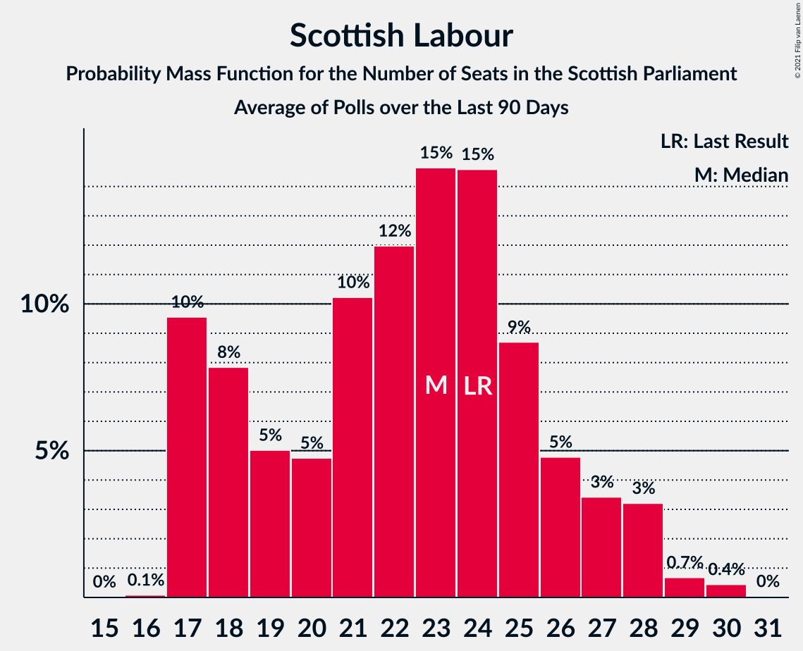

# Scottish Labour

<a href="#voting-intentions">Voting Intentions</a> | <a href="#seats">Seats</a>

## Voting Intentions

Last result: **19.1%** (General Election of 5 May 2016)

### Confidence Intervals

| Period     | Polling firm/Commissioner(s) | Median | 80% Confidence Interval | 90% Confidence Interval | 95% Confidence Interval | 99% Confidence Interval |
|:----------:|:----------------:|:-----------:|:-----------------------:|:-----------------------:|:-----------------------:|:-----------------------:|
| N/A | [Poll Average](average.html) | 17.3% | 15.4–19.3% | 15.0–19.9% | 14.6–20.4% | 13.8–21.4% |
| [2–7 April 2021](2021-04-07-SavantaComRes.html) | Savanta ComRes   The Scotsman | 17.8% | 16.3–19.4% | 15.9–19.9% | 15.5–20.3% | 14.8–21.1% |
| [1–6 April 2021](2021-04-06-Opinium.html) | Opinium   Sky News | 17.0% | 15.6–18.6% | 15.2–19.1% | 14.8–19.4% | 14.2–20.2% |
| [30 March–4 April 2021](2021-04-04-IpsosMORI.html) | Ipsos MORI   STV News | 18.0% | 16.6–19.6% | 16.1–20.1% | 15.8–20.5% | 15.1–21.3% |
| [30 March–1 April 2021](2021-04-01-Panelbase.html) | Panelbase   The Sunday Times | 17.0% | 15.6–18.6% | 15.2–19.1% | 14.8–19.5% | 14.2–20.3% |
| [29–30 March 2021](2021-03-30-Survation.html) | Survation   The Courier | 19.0% | 17.5–20.7% | 17.1–21.1% | 16.7–21.6% | 16.0–22.4% |
| [23–26 March 2021](2021-03-26-FindOutNow.html) | Find Out Now   Daily Express | 16.1% | 14.7–17.7% | 14.3–18.2% | 14.0–18.5% | 13.4–19.3% |
| [16–19 March 2021](2021-03-19-BMGResearch.html) | BMG Research   Herald Scotland | 17.0% | 15.6–18.6% | 15.2–19.1% | 14.9–19.5% | 14.2–20.3% |
| [11–18 March 2021](2021-03-18-Survation.html) | Survation   The Courier | 20.2% | 18.9–21.6% | 18.5–22.0% | 18.2–22.3% | 17.6–23.0% |
| [11–16 March 2021](2021-03-16-Opinium.html) | Opinium   Sky News | 19.2% | 17.7–20.8% | 17.3–21.2% | 16.9–21.6% | 16.3–22.4% |
| [9–12 March 2021](2021-03-12-Survation.html) | Survation   Scotland in Union | 20.0% | 18.4–21.7% | 18.0–22.1% | 17.6–22.6% | 16.9–23.4% |
| [5–10 March 2021](2021-03-10-SavantaComRes.html) | Savanta ComRes   The Scotsman | 18.0% | 16.6–19.7% | 16.1–20.1% | 15.8–20.5% | 15.1–21.3% |
| [4–8 March 2021](2021-03-08-YouGov.html) | YouGov   The Times | 16.0% | 14.6–17.5% | 14.3–17.9% | 13.9–18.3% | 13.3–19.0% |
| [3–5 March 2021](2021-03-05-Panelbase.html) | Panelbase   The Sunday Times | 19.0% | 17.4–20.6% | 17.0–21.1% | 16.7–21.5% | 16.0–22.3% |
| [24–25 February 2021](2021-02-25-Survation.html) | Survation   Daily Record | 20.0% | 18.4–21.7% | 18.0–22.1% | 17.6–22.6% | 16.9–23.4% |
| [15–21 February 2021](2021-02-21-IpsosMORI.html) | Ipsos MORI   STV News | 14.0% | 12.7–15.4% | 12.3–15.9% | 12.0–16.2% | 11.4–16.9% |
| [4–9 February 2021](2021-02-09-SavantaComRes.html) | Savanta ComRes   The Scotsman | 18.0% | 16.5–19.6% | 16.1–20.1% | 15.7–20.5% | 15.0–21.3% |
| [19–22 January 2021](2021-01-22-Panelbase.html) | Panelbase   The Sunday Times | 16.1% | 14.8–17.7% | 14.4–18.1% | 14.1–18.5% | 13.4–19.3% |
| [11–13 January 2021](2021-01-13-Survation.html) | Survation   Scot Goes Pop | 19.0% | 17.5–20.7% | 17.1–21.1% | 16.7–21.6% | 16.0–22.4% |
| [8–13 January 2021](2021-01-13-SavantaComRes.html) | Savanta ComRes   The Scotsman | 18.0% | 16.5–19.6% | 16.1–20.1% | 15.8–20.5% | 15.1–21.3% |
| [11–15 December 2020](2020-12-15-SavantaComRes.html) | Savanta ComRes   The Scotsman | 17.0% | 15.5–18.6% | 15.1–19.0% | 14.8–19.4% | 14.1–20.2% |
| [4–9 December 2020](2020-12-09-Survation.html) | Survation | 20.0% | 18.5–21.7% | 18.0–22.2% | 17.6–22.6% | 16.9–23.4% |
| [20–26 November 2020](2020-11-26-IpsosMORI.html) | Ipsos MORI   STV News | 16.0% | 14.6–17.6% | 14.2–18.0% | 13.9–18.4% | 13.2–19.2% |
| [5–11 November 2020](2020-11-11-Panelbase.html) | Panelbase   Scot Goes Pop | 17.8% | 16.4–19.5% | 16.0–19.9% | 15.6–20.3% | 14.9–21.1% |
| [6–10 November 2020](2020-11-10-YouGov.html) | YouGov | 13.0% | 11.8–14.4% | 11.5–14.8% | 11.2–15.2% | 10.6–15.9% |
| [3 November 2020](2020-11-03-Survation.html) | Survation | 19.0% | 17.5–20.6% | 17.1–21.0% | 16.7–21.4% | 16.0–22.2% |
| [9 October 2020](2020-10-09-SavantaComRes.html) | Savanta ComRes | 18.1% | 16.7–19.8% | 16.2–20.3% | 15.9–20.7% | 15.2–21.5% |
| [2–9 October 2020](2020-10-09-IpsosMORI.html) | Ipsos MORI   STV News | 14.0% | 12.7–15.4% | 12.3–15.9% | 12.0–16.2% | 11.4–16.9% |
| [17–21 September 2020](2020-09-21-JLPartners.html) | JL Partners   Politico | 13.0% | 11.7–14.4% | 11.4–14.8% | 11.1–15.2% | 10.5–15.9% |
| [2–7 September 2020](2020-09-07-Survation.html) | Survation | 18.0% | 16.5–19.6% | 16.1–20.1% | 15.7–20.5% | 15.1–21.3% |
| [6–13 August 2020](2020-08-13-SavantaComRes.html) | Savanta ComRes | 16.9% | 15.4–18.5% | 15.0–18.9% | 14.7–19.3% | 14.0–20.1% |
| [6–10 August 2020](2020-08-10-YouGov.html) | YouGov   The Times | 13.8% | 12.6–15.2% | 12.2–15.6% | 11.9–16.0% | 11.4–16.7% |
| [3 July 2020](2020-07-03-Panelbase.html) | Panelbase   The Sunday Times | 15.1% | 13.7–16.6% | 13.4–17.1% | 13.0–17.4% | 12.4–18.2% |
| [1–5 June 2020](2020-06-05-Panelbase.html) | Panelbase   Scot Goes Pop | 16.0% | 14.6–17.6% | 14.3–18.0% | 13.9–18.4% | 13.3–19.2% |
| [1–5 May 2020](2020-05-05-Panelbase.html) | Panelbase   Wings Over Scotland | 15.2% | 13.9–16.7% | 13.5–17.1% | 13.2–17.5% | 12.6–18.2% |
| [24–27 April 2020](2020-04-27-YouGov.html) | YouGov | 12.0% | 10.8–13.3% | 10.5–13.7% | 10.2–14.0% | 9.6–14.7% |
| [24–26 March 2020](2020-03-26-Panelbase.html) | Panelbase   The Sunday Times | 13.0% | 11.7–14.4% | 11.4–14.8% | 11.1–15.2% | 10.5–15.9% |
| [28–31 January 2020](2020-01-31-Panelbase.html) | Panelbase   Scot Goes Pop | 14.0% | 12.7–15.5% | 12.3–15.9% | 12.0–16.2% | 11.4–17.0% |
| [20–22 January 2020](2020-01-22-Survation.html) | Survation   Progress Scotland | 19.1% | 17.6–20.8% | 17.2–21.3% | 16.8–21.7% | 16.1–22.5% |
| [3–6 December 2019](2019-12-06-Panelbase.html) | Panelbase   The Sunday Times | 18.0% | 16.6–19.7% | 16.2–20.1% | 15.8–20.5% | 15.1–21.3% |
| [3 December 2019](2019-12-03-YouGov.html) | YouGov   The Times | 14.1% | 12.7–15.6% | 12.4–16.0% | 12.1–16.4% | 11.4–17.1% |
| [20–22 November 2019](2019-11-22-Panelbase.html) | Panelbase   The Sunday Times | 17.0% | 15.6–18.7% | 15.2–19.1% | 14.8–19.5% | 14.2–20.3% |
| [9–11 October 2019](2019-10-11-Panelbase.html) | Panelbase   The Sunday Times | 18.2% | 16.8–19.9% | 16.3–20.4% | 16.0–20.8% | 15.3–21.6% |
| [3 September 2019](2019-09-03-YouGov.html) | YouGov   The Times | 11.0% | 9.8–12.3% | 9.5–12.7% | 9.2–13.0% | 8.7–13.6% |
| [18–20 June 2019](2019-06-20-Panelbase.html) | Panelbase   The Sunday Times | 16.2% | 14.8–17.8% | 14.4–18.2% | 14.1–18.6% | 13.4–19.4% |
| [14–17 May 2019](2019-05-17-Panelbase.html) | Panelbase   The Sunday Times | 18.2% | 16.7–19.8% | 16.3–20.3% | 16.0–20.7% | 15.3–21.5% |
| [24–26 April 2019](2019-04-26-YouGov.html) | YouGov   The Times | 14.9% | 13.5–16.4% | 13.1–16.8% | 12.8–17.2% | 12.2–17.9% |
| [18–24 April 2019](2019-04-24-Panelbase.html) | Panelbase | 19.0% | 17.5–20.6% | 17.0–21.1% | 16.7–21.5% | 16.0–22.3% |
| [6 March 2019](2019-03-06-Panelbase.html) | Panelbase   Wings Over Scotland | 19.2% | 17.6–20.8% | 17.2–21.3% | 16.8–21.7% | 16.1–22.5% |
| [1–4 March 2019](2019-03-04-Survation.html) | Survation   Scottish Daily Mail | 19.2% | 17.7–20.9% | 17.2–21.3% | 16.9–21.7% | 16.2–22.6% |
| [5 December 2018](2018-12-05-Panelbase.html) | Panelbase   The Sunday Times | 22.0% | 20.4–23.7% | 19.9–24.2% | 19.6–24.6% | 18.8–25.5% |
| [2–7 November 2018](2018-11-07-Panelbase.html) | Panelbase   Constitutional Commission | 22.2% | 20.6–23.9% | 20.2–24.4% | 19.8–24.8% | 19.0–25.7% |
| [18–21 October 2018](2018-10-21-Survation.html) | Survation   Daily Record | 23.0% | 21.4–24.8% | 20.9–25.3% | 20.5–25.7% | 19.8–26.6% |
| [3–5 October 2018](2018-10-05-Survation.html) | Survation   SNP | 21.8% | 20.2–23.5% | 19.8–24.0% | 19.4–24.5% | 18.6–25.3% |
| [4 October 2018](2018-10-04-Panelbase.html) | Panelbase   The Sunday Times | 20.2% | 18.7–21.9% | 18.2–22.4% | 17.9–22.8% | 17.1–23.6% |
| [2 October 2018](2018-10-02-Survation.html) | Survation   The Sunday Post | 23.2% | 21.5–24.9% | 21.1–25.4% | 20.7–25.8% | 19.9–26.7% |
| [5–10 July 2018](2018-07-10-Survation.html) | Survation   Daily Record | 21.0% | 19.4–22.7% | 19.0–23.2% | 18.6–23.7% | 17.9–24.5% |
| [21–27 June 2018](2018-06-27-Panelbase.html) | Panelbase   Wings Over Scotland | 23.0% | 21.4–24.8% | 20.9–25.2% | 20.5–25.7% | 19.7–26.5% |
| [8–13 June 2018](2018-06-13-Panelbase.html) | Panelbase   The Sunday Times | 23.2% | 21.6–25.0% | 21.1–25.5% | 20.7–25.9% | 20.0–26.8% |
| [1–5 June 2018](2018-06-05-YouGov.html) | YouGov   The Times | 21.1% | 19.6–22.8% | 19.1–23.3% | 18.8–23.7% | 18.1–24.5% |
| [24–28 January 2018](2018-01-28-Survation.html) | Survation   Daily Record | 23.0% | 21.4–24.8% | 21.0–25.3% | 20.6–25.7% | 19.8–26.6% |
| [12–16 January 2018](2018-01-16-YouGov.html) | YouGov   The Times | 21.8% | 20.1–23.5% | 19.7–24.0% | 19.3–24.4% | 18.6–25.3% |
| [1–5 December 2017](2017-12-05-Survation.html) | Survation   The Sunday Post | 23.8% | 22.1–25.5% | 21.6–26.0% | 21.2–26.5% | 20.5–27.4% |
| [27–30 November 2017](2017-11-30-Survation.html) | Survation   Daily Record | 25.2% | 23.5–27.0% | 23.0–27.5% | 22.6–27.9% | 21.8–28.8% |
| [2–5 October 2017](2017-10-05-YouGov.html) | YouGov   The Times | 24.4% | 22.8–26.1% | 22.4–26.6% | 22.0–27.0% | 21.2–27.8% |
| [8–12 September 2017](2017-09-12-Survation.html) | Survation   Scottish Daily Mail | 25.2% | 23.5–27.0% | 23.0–27.5% | 22.6–28.0% | 21.8–28.9% |
| [9–14 March 2017](2017-03-14-YouGov.html) | YouGov   The Times | 14.0% | 12.7–15.5% | 12.3–15.9% | 12.0–16.3% | 11.4–17.0% |
| [24–29 November 2016](2016-11-29-YouGov.html) | YouGov   The Times | 14.1% | 12.8–15.5% | 12.5–15.9% | 12.2–16.3% | 11.6–17.0% |
| [4 October 2016](2016-10-04-BMGResearch.html) | BMG Research | 16.3% | 14.9–17.9% | 14.5–18.4% | 14.2–18.7% | 13.5–19.5% |
| [29–31 August 2016](2016-08-31-YouGov.html) | YouGov   The Times | 15.3% | 13.9–16.8% | 13.6–17.3% | 13.2–17.6% | 12.6–18.4% |
| [24–28 June 2016](2016-06-28-Survation.html) | Survation   Scottish Daily Mail | 15.8% | 14.5–17.4% | 14.1–17.8% | 13.7–18.2% | 13.1–18.9% |

### Probability Mass Function

The following table shows the probability mass function per percentage block of voting intentions for the [poll average](average.html) for Scottish Labour.

| Voting Intentions | Probability | Accumulated | Special Marks |
|:-----------------:|:-----------:|:-----------:|:-------------:|
| 11.5–12.5% | 0% | 100% |  |
| 12.5–13.5% | 0.2% | 100% |  |
| 13.5–14.5% | 2% | 99.8% |  |
| 14.5–15.5% | 9% | 98% |  |
| 15.5–16.5% | 20% | 88% |  |
| 16.5–17.5% | 26% | 68% | Median |
| 17.5–18.5% | 22% | 43% |  |
| 18.5–19.5% | 13% | 20% | Last Result |
| 19.5–20.5% | 5% | 7% |  |
| 20.5–21.5% | 2% | 2% |  |
| 21.5–22.5% | 0.3% | 0.4% |  |
| 22.5–23.5% | 0% | 0% |  |
| 23.5–24.5% | 0% | 0% |  |

## Seats

Last result: **24** seats (General Election of 5 May 2016)

### Confidence Intervals

| Period     | Polling firm/Commissioner(s) | Median | 80% Confidence Interval | 90% Confidence Interval | 95% Confidence Interval | 99% Confidence Interval |
|:----------:|:----------------:|:------:|:-----------------------:|:-----------------------:|:-----------------------:|:-----------------------:|
| N/A | [Poll Average](average.html) | 21 | 17–25 | 17–25 | 17–26 | 17–27 |
| [2–7 April 2021](2021-04-07-SavantaComRes.html) | Savanta ComRes   The Scotsman | 22 | 19–25 | 18–26 | 18–26 | 17–27 |
| [1–6 April 2021](2021-04-06-Opinium.html) | Opinium   Sky News | 22 | 17–24 | 17–24 | 17–25 | 17–27 |
| [30 March–4 April 2021](2021-04-04-IpsosMORI.html) | Ipsos MORI   STV News | 23 | 19–25 | 18–25 | 18–25 | 17–27 |
| [30 March–1 April 2021](2021-04-01-Panelbase.html) | Panelbase   The Sunday Times | 19 | 17–23 | 17–24 | 17–24 | 16–26 |
| [29–30 March 2021](2021-03-30-Survation.html) | Survation   The Courier | 24 | 21–25 | 21–26 | 20–27 | 18–28 |
| [23–26 March 2021](2021-03-26-FindOutNow.html) | Find Out Now   Daily Express | 18 | 17–22 | 17–23 | 17–23 | 17–25 |
| [16–19 March 2021](2021-03-19-BMGResearch.html) | BMG Research   Herald Scotland | 20 | 17–23 | 17–24 | 17–24 | 16–26 |
| [11–18 March 2021](2021-03-18-Survation.html) | Survation   The Courier | 25 | 24–27 | 23–27 | 23–28 | 21–29 |
| [11–16 March 2021](2021-03-16-Opinium.html) | Opinium   Sky News | 24 | 22–27 | 21–27 | 20–28 | 18–30 |
| [9–12 March 2021](2021-03-12-Survation.html) | Survation   Scotland in Union | 25 | 22–26 | 22–27 | 21–27 | 19–29 |
| [5–10 March 2021](2021-03-10-SavantaComRes.html) | Savanta ComRes   The Scotsman | 22 | 18–24 | 17–25 | 17–25 | 17–26 |
| [4–8 March 2021](2021-03-08-YouGov.html) | YouGov   The Times | 22 | 17–24 | 17–24 | 17–25 | 17–26 |
| [3–5 March 2021](2021-03-05-Panelbase.html) | Panelbase   The Sunday Times | 24 | 22–27 | 22–28 | 21–29 | 19–30 |
| [24–25 February 2021](2021-02-25-Survation.html) | Survation   Daily Record | 25 | 23–27 | 22–28 | 21–29 | 19–30 |
| [15–21 February 2021](2021-02-21-IpsosMORI.html) | Ipsos MORI   STV News | 17 | 16–17 | 15–18 | 14–19 | 13–22 |
| [4–9 February 2021](2021-02-09-SavantaComRes.html) | Savanta ComRes   The Scotsman | 22 | 18–25 | 18–25 | 17–25 | 17–26 |
| [19–22 January 2021](2021-01-22-Panelbase.html) | Panelbase   The Sunday Times | 18 | 17–22 | 17–23 | 17–23 | 17–24 |
| [11–13 January 2021](2021-01-13-Survation.html) | Survation   Scot Goes Pop | 23 | 21–26 | 21–26 | 20–27 | 19–29 |
| [8–13 January 2021](2021-01-13-SavantaComRes.html) | Savanta ComRes   The Scotsman | 22 | 19–25 | 19–25 | 18–26 | 17–27 |
| [11–15 December 2020](2020-12-15-SavantaComRes.html) | Savanta ComRes   The Scotsman | 19 | 17–23 | 17–23 | 17–24 | 16–25 |
| [4–9 December 2020](2020-12-09-Survation.html) | Survation | 25 | 23–27 | 22–28 | 21–29 | 19–30 |
| [20–26 November 2020](2020-11-26-IpsosMORI.html) | Ipsos MORI   STV News | 18 | 17–22 | 17–22 | 17–23 | 16–24 |
| [5–11 November 2020](2020-11-11-Panelbase.html) | Panelbase   Scot Goes Pop | 22 | 18–24 | 17–24 | 17–24 | 17–26 |
| [6–10 November 2020](2020-11-10-YouGov.html) | YouGov | 17 | 15–17 | 14–18 | 13–19 | 12–21 |
| [3 November 2020](2020-11-03-Survation.html) | Survation | 24 | 22–26 | 21–26 | 20–28 | 18–29 |
| [9 October 2020](2020-10-09-SavantaComRes.html) | Savanta ComRes | 21 | 19–24 | 18–24 | 17–24 | 17–25 |
| [2–9 October 2020](2020-10-09-IpsosMORI.html) | Ipsos MORI   STV News | 16 | 16–17 | 16–19 | 15–19 | 13–21 |
| [17–21 September 2020](2020-09-21-JLPartners.html) | JL Partners   Politico | 17 | 14–18 | 13–18 | 12–18 | 12–19 |
| [2–7 September 2020](2020-09-07-Survation.html) | Survation | 22 | 19–25 | 19–25 | 18–26 | 17–27 |
| [6–13 August 2020](2020-08-13-SavantaComRes.html) | Savanta ComRes | 19 | 17–22 | 17–22 | 17–23 | 17–24 |
| [6–10 August 2020](2020-08-10-YouGov.html) | YouGov   The Times | 17 | 16–19 | 16–20 | 16–21 | 14–22 |
| [3 July 2020](2020-07-03-Panelbase.html) | Panelbase   The Sunday Times | 17 | 17–20 | 17–21 | 17–22 | 15–23 |
| [1–5 June 2020](2020-06-05-Panelbase.html) | Panelbase   Scot Goes Pop | 20 | 17–22 | 17–22 | 16–23 | 16–24 |
| [1–5 May 2020](2020-05-05-Panelbase.html) | Panelbase   Wings Over Scotland | 17 | 17–21 | 16–22 | 16–22 | 15–23 |
| [24–27 April 2020](2020-04-27-YouGov.html) | YouGov | 16 | 12–17 | 12–17 | 11–17 | 11–17 |
| [24–26 March 2020](2020-03-26-Panelbase.html) | Panelbase   The Sunday Times | 17 | 13–17 | 12–17 | 12–18 | 11–19 |
| [28–31 January 2020](2020-01-31-Panelbase.html) | Panelbase   Scot Goes Pop | 17 | 16–17 | 14–18 | 13–20 | 13–21 |
| [20–22 January 2020](2020-01-22-Survation.html) | Survation   Progress Scotland | 23 | 21–26 | 20–26 | 19–27 | 18–28 |
| [3–6 December 2019](2019-12-06-Panelbase.html) | Panelbase   The Sunday Times | 22 | 21–25 | 21–27 | 20–27 | 18–27 |
| [3 December 2019](2019-12-03-YouGov.html) | YouGov   The Times | 16 | 16–18 | 16–19 | 16–20 | 15–21 |
| [20–22 November 2019](2019-11-22-Panelbase.html) | Panelbase   The Sunday Times | 22 | 20–24 | 18–25 | 17–25 | 16–26 |
| [9–11 October 2019](2019-10-11-Panelbase.html) | Panelbase   The Sunday Times | 23 | 21–26 | 20–26 | 19–27 | 17–28 |
| [3 September 2019](2019-09-03-YouGov.html) | YouGov   The Times | 13 | 10–15 | 10–16 | 10–17 | 10–17 |
| [18–20 June 2019](2019-06-20-Panelbase.html) | Panelbase   The Sunday Times | 19 | 17–22 | 16–23 | 16–23 | 15–24 |
| [14–17 May 2019](2019-05-17-Panelbase.html) | Panelbase   The Sunday Times | 23 | 19–25 | 18–26 | 18–26 | 17–27 |
| [24–26 April 2019](2019-04-26-YouGov.html) | YouGov   The Times | 18 | 17–21 | 17–23 | 16–23 | 16–24 |
| [18–24 April 2019](2019-04-24-Panelbase.html) | Panelbase | 25 | 22–27 | 22–28 | 21–29 | 18–30 |
| [6 March 2019](2019-03-06-Panelbase.html) | Panelbase   Wings Over Scotland | 24 | 22–27 | 22–27 | 21–27 | 20–28 |
| [1–4 March 2019](2019-03-04-Survation.html) | Survation   Scottish Daily Mail | 23 | 21–26 | 21–28 | 20–29 | 18–31 |
| [5 December 2018](2018-12-05-Panelbase.html) | Panelbase   The Sunday Times | 27 | 26–31 | 25–32 | 25–32 | 23–34 |
| [2–7 November 2018](2018-11-07-Panelbase.html) | Panelbase   Constitutional Commission | 28 | 26–32 | 25–33 | 25–34 | 24–35 |
| [18–21 October 2018](2018-10-21-Survation.html) | Survation   Daily Record | 31 | 26–34 | 25–35 | 24–36 | 23–38 |
| [3–5 October 2018](2018-10-05-Survation.html) | Survation   SNP | 27 | 26–30 | 25–31 | 25–32 | 23–34 |
| [4 October 2018](2018-10-04-Panelbase.html) | Panelbase   The Sunday Times | 25 | 23–27 | 22–28 | 22–29 | 20–32 |
| [2 October 2018](2018-10-02-Survation.html) | Survation   The Sunday Post | 30 | 26–35 | 25–36 | 25–37 | 23–39 |
| [5–10 July 2018](2018-07-10-Survation.html) | Survation   Daily Record | 26 | 23–30 | 23–31 | 22–33 | 21–35 |
| [21–27 June 2018](2018-06-27-Panelbase.html) | Panelbase   Wings Over Scotland | 29 | 26–33 | 26–34 | 25–35 | 24–36 |
| [8–13 June 2018](2018-06-13-Panelbase.html) | Panelbase   The Sunday Times | 29 | 26–32 | 26–33 | 26–34 | 25–35 |
| [1–5 June 2018](2018-06-05-YouGov.html) | YouGov   The Times | 26 | 24–30 | 23–31 | 23–32 | 21–34 |
| [24–28 January 2018](2018-01-28-Survation.html) | Survation   Daily Record | 27 | 26–31 | 25–32 | 25–33 | 24–34 |
| [12–16 January 2018](2018-01-16-YouGov.html) | YouGov   The Times | 29 | 25–33 | 25–34 | 24–35 | 23–36 |
| [1–5 December 2017](2017-12-05-Survation.html) | Survation   The Sunday Post | 33 | 29–37 | 27–38 | 26–39 | 24–41 |
| [27–30 November 2017](2017-11-30-Survation.html) | Survation   Daily Record | 34 | 30–37 | 29–38 | 28–39 | 26–42 |
| [2–5 October 2017](2017-10-05-YouGov.html) | YouGov   The Times | 32 | 30–36 | 29–36 | 28–37 | 26–40 |
| [8–12 September 2017](2017-09-12-Survation.html) | Survation   Scottish Daily Mail | 30 | 28–33 | 27–34 | 27–34 | 25–36 |
| [9–14 March 2017](2017-03-14-YouGov.html) | YouGov   The Times | 17 | 16–17 | 15–18 | 15–19 | 13–20 |
| [24–29 November 2016](2016-11-29-YouGov.html) | YouGov   The Times | 17 | 16–17 | 16–18 | 15–19 | 14–21 |
| [4 October 2016](2016-10-04-BMGResearch.html) | BMG Research | 19 | 17–23 | 17–23 | 17–24 | 16–25 |
| [29–31 August 2016](2016-08-31-YouGov.html) | YouGov   The Times | 17 | 17–19 | 17–19 | 16–21 | 16–23 |
| [24–28 June 2016](2016-06-28-Survation.html) | Survation   Scottish Daily Mail | 18 | 17–22 | 17–23 | 17–23 | 16–24 |

### Probability Mass Function

The following table shows the probability mass function per seat for the [poll average](average.html) for Scottish Labour.

| Number of Seats | Probability | Accumulated | Special Marks |
|:---------------:|:-----------:|:-----------:|:-------------:|
| 16 | 0.3% | 100% |  |
| 17 | 11% | 99.7% |  |
| 18 | 12% | 89% |  |
| 19 | 9% | 77% |  |
| 20 | 8% | 68% |  |
| 21 | 11% | 61% | Median |
| 22 | 17% | 50% |  |
| 23 | 12% | 33% |  |
| 24 | 10% | 21% | Last Result |
| 25 | 8% | 11% |  |
| 26 | 2% | 3% |  |
| 27 | 0.5% | 0.7% |  |
| 28 | 0.1% | 0.2% |  |
| 29 | 0% | 0.1% |  |
| 30 | 0% | 0% |  |

