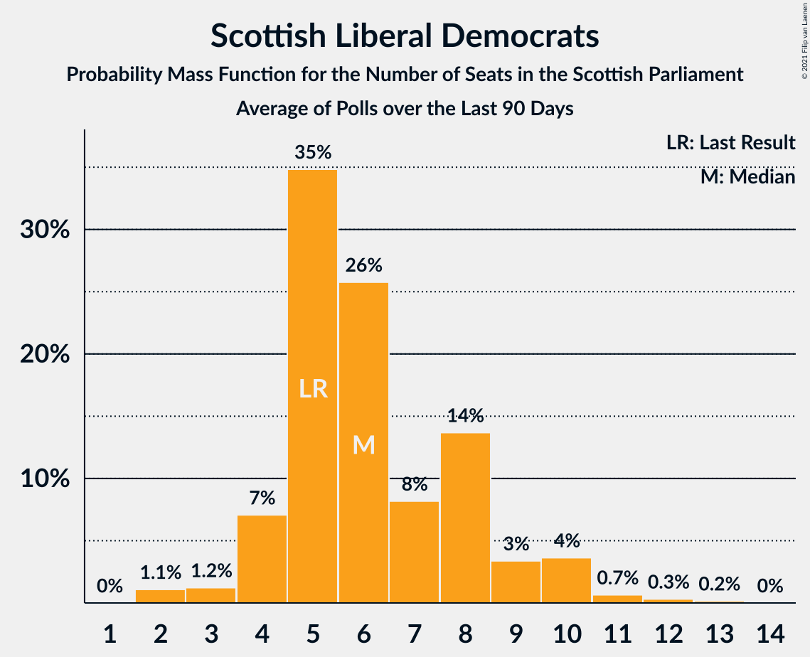

# Scottish Liberal Democrats

<a href="#voting-intentions">Voting Intentions</a> | <a href="#seats">Seats</a>

## Voting Intentions

Last result: **5.2%** (General Election of 5 May 2016)

### Confidence Intervals

| Period     | Polling firm/Commissioner(s) | Median | 80% Confidence Interval | 90% Confidence Interval | 95% Confidence Interval | 99% Confidence Interval |
|:----------:|:----------------:|:-----------:|:-----------------------:|:-----------------------:|:-----------------------:|:-----------------------:|
| N/A | [Poll Average](average.html) | 5.7% | 4.5–7.2% | 4.3–7.6% | 4.1–8.0% | 3.7–8.7% |
| [21–26 April 2021](2021-04-26-Panelbase.html) | Panelbase   Scot Goes Pop | 6.0% | 5.2–7.1% | 5.0–7.4% | 4.8–7.6% | 4.4–8.2% |
| [20–22 April 2021](2021-04-22-Survation.html) | Survation   The Sunday Post | 7.0% | 6.1–8.2% | 5.9–8.5% | 5.6–8.8% | 5.2–9.3% |
| [16–20 April 2021](2021-04-20-YouGov.html) | YouGov   The Times | 5.1% | 4.3–6.0% | 4.1–6.2% | 4.0–6.5% | 3.6–6.9% |
| [16–20 April 2021](2021-04-20-SavantaComRes.html) | Savanta ComRes   The Scotsman | 5.1% | 4.3–6.1% | 4.1–6.4% | 3.9–6.6% | 3.6–7.2% |
| [9–12 April 2021](2021-04-12-Panelbase.html) | Panelbase   Believe in Scotland | 6.0% | 5.1–7.1% | 4.9–7.4% | 4.7–7.6% | 4.3–8.2% |
| [2–7 April 2021](2021-04-07-SavantaComRes.html) | Savanta ComRes   The Scotsman | 7.0% | 6.0–8.1% | 5.8–8.4% | 5.5–8.7% | 5.1–9.3% |
| [1–6 April 2021](2021-04-06-Opinium.html) | Opinium   Sky News | 5.0% | 4.2–6.0% | 4.0–6.2% | 3.8–6.5% | 3.5–7.0% |
| [30 March–4 April 2021](2021-04-04-IpsosMORI.html) | Ipsos MORI   STV News | 6.0% | 5.1–7.0% | 4.9–7.3% | 4.7–7.6% | 4.3–8.1% |
| [30 March–1 April 2021](2021-04-01-Panelbase.html) | Panelbase   The Sunday Times | 5.0% | 4.2–5.9% | 3.9–6.2% | 3.8–6.5% | 3.4–7.0% |
| [29–30 March 2021](2021-03-30-Survation.html) | Survation   The Courier | 8.0% | 7.0–9.2% | 6.7–9.6% | 6.5–9.9% | 6.0–10.5% |
| [23–26 March 2021](2021-03-26-FindOutNow.html) | Find Out Now   Daily Express | 5.1% | 4.3–6.1% | 4.1–6.4% | 3.9–6.6% | 3.6–7.1% |
| [19–22 March 2021](2021-03-22-YouGov.html) | YouGov   The Times | 5.0% | 4.2–6.0% | 4.0–6.3% | 3.8–6.5% | 3.5–7.0% |
| [16–19 March 2021](2021-03-19-BMGResearch.html) | BMG Research   Herald Scotland | 8.0% | 7.0–9.2% | 6.8–9.6% | 6.5–9.9% | 6.1–10.5% |
| [11–18 March 2021](2021-03-18-Survation.html) | Survation   The Courier | 7.1% | 6.3–8.0% | 6.1–8.2% | 5.9–8.5% | 5.5–8.9% |
| [11–16 March 2021](2021-03-16-Opinium.html) | Opinium   Sky News | 5.0% | 4.3–6.0% | 4.1–6.2% | 3.9–6.5% | 3.5–7.0% |
| [9–12 March 2021](2021-03-12-Survation.html) | Survation   Scotland in Union | 8.0% | 7.0–9.2% | 6.7–9.6% | 6.5–9.9% | 6.0–10.5% |
| [5–10 March 2021](2021-03-10-SavantaComRes.html) | Savanta ComRes   The Scotsman | 6.0% | 5.2–7.1% | 4.9–7.4% | 4.7–7.7% | 4.3–8.2% |
| [4–8 March 2021](2021-03-08-YouGov.html) | YouGov   The Times | 5.0% | 4.3–6.0% | 4.0–6.2% | 3.9–6.5% | 3.5–7.0% |
| [3–5 March 2021](2021-03-05-Panelbase.html) | Panelbase   The Sunday Times | 7.0% | 6.1–8.2% | 5.8–8.5% | 5.6–8.8% | 5.2–9.3% |
| [24–25 February 2021](2021-02-25-Survation.html) | Survation   Daily Record | 7.0% | 6.1–8.2% | 5.8–8.5% | 5.6–8.8% | 5.2–9.3% |
| [15–21 February 2021](2021-02-21-IpsosMORI.html) | Ipsos MORI   STV News | 6.0% | 5.2–7.1% | 4.9–7.4% | 4.7–7.6% | 4.3–8.2% |
| [4–9 February 2021](2021-02-09-SavantaComRes.html) | Savanta ComRes   The Scotsman | 6.0% | 5.1–7.1% | 4.9–7.4% | 4.7–7.6% | 4.3–8.2% |
| [19–22 January 2021](2021-01-22-Panelbase.html) | Panelbase   The Sunday Times | 6.0% | 5.2–7.1% | 5.0–7.4% | 4.8–7.7% | 4.4–8.2% |
| [11–13 January 2021](2021-01-13-Survation.html) | Survation   Scot Goes Pop | 9.0% | 8.0–10.3% | 7.7–10.6% | 7.4–10.9% | 6.9–11.6% |
| [8–13 January 2021](2021-01-13-SavantaComRes.html) | Savanta ComRes   The Scotsman | 8.0% | 7.0–9.2% | 6.7–9.5% | 6.5–9.8% | 6.0–10.4% |
| [11–15 December 2020](2020-12-15-SavantaComRes.html) | Savanta ComRes   The Scotsman | 7.0% | 6.1–8.2% | 5.8–8.5% | 5.6–8.8% | 5.2–9.3% |
| [4–9 December 2020](2020-12-09-Survation.html) | Survation | 7.0% | 6.1–8.2% | 5.8–8.5% | 5.6–8.8% | 5.2–9.4% |
| [20–26 November 2020](2020-11-26-IpsosMORI.html) | Ipsos MORI   STV News | 6.0% | 5.1–7.0% | 4.9–7.3% | 4.7–7.6% | 4.3–8.2% |
| [5–11 November 2020](2020-11-11-Panelbase.html) | Panelbase   Scot Goes Pop | 6.0% | 5.1–7.0% | 4.9–7.3% | 4.7–7.6% | 4.3–8.2% |
| [6–10 November 2020](2020-11-10-YouGov.html) | YouGov | 6.0% | 5.1–7.0% | 4.9–7.3% | 4.7–7.5% | 4.3–8.1% |
| [3 November 2020](2020-11-03-Survation.html) | Survation | 7.0% | 6.1–8.1% | 5.8–8.4% | 5.6–8.7% | 5.2–9.3% |
| [9 October 2020](2020-10-09-SavantaComRes.html) | Savanta ComRes | 7.1% | 6.1–8.2% | 5.9–8.6% | 5.6–8.8% | 5.2–9.4% |
| [2–9 October 2020](2020-10-09-IpsosMORI.html) | Ipsos MORI   STV News | 8.0% | 7.0–9.2% | 6.8–9.6% | 6.5–9.8% | 6.1–10.4% |
| [17–21 September 2020](2020-09-21-JLPartners.html) | JL Partners   Politico | 8.0% | 7.0–9.2% | 6.7–9.5% | 6.5–9.8% | 6.0–10.4% |
| [2–7 September 2020](2020-09-07-Survation.html) | Survation | 8.0% | 7.0–9.2% | 6.7–9.5% | 6.4–9.8% | 6.0–10.4% |
| [6–13 August 2020](2020-08-13-SavantaComRes.html) | Savanta ComRes | 7.9% | 6.9–9.1% | 6.7–9.5% | 6.4–9.8% | 6.0–10.4% |
| [6–10 August 2020](2020-08-10-YouGov.html) | YouGov   The Times | 6.9% | 6.0–8.0% | 5.8–8.3% | 5.6–8.6% | 5.2–9.1% |
| [3 July 2020](2020-07-03-Panelbase.html) | Panelbase   The Sunday Times | 6.0% | 5.2–7.1% | 4.9–7.4% | 4.7–7.7% | 4.4–8.2% |
| [1–5 June 2020](2020-06-05-Panelbase.html) | Panelbase   Scot Goes Pop | 8.0% | 7.0–9.2% | 6.7–9.6% | 6.5–9.9% | 6.1–10.5% |
| [1–5 May 2020](2020-05-05-Panelbase.html) | Panelbase   Wings Over Scotland | 6.1% | 5.2–7.1% | 5.0–7.4% | 4.8–7.7% | 4.4–8.2% |
| [24–27 April 2020](2020-04-27-YouGov.html) | YouGov | 7.0% | 6.1–8.1% | 5.9–8.4% | 5.7–8.7% | 5.3–9.3% |
| [24–26 March 2020](2020-03-26-Panelbase.html) | Panelbase   The Sunday Times | 6.0% | 5.1–7.0% | 4.9–7.3% | 4.7–7.6% | 4.3–8.1% |
| [28–31 January 2020](2020-01-31-Panelbase.html) | Panelbase   Scot Goes Pop | 7.0% | 6.1–8.1% | 5.8–8.4% | 5.6–8.7% | 5.2–9.3% |
| [20–22 January 2020](2020-01-22-Survation.html) | Survation   Progress Scotland | 9.0% | 8.0–10.3% | 7.7–10.6% | 7.4–11.0% | 6.9–11.6% |
| [3–6 December 2019](2019-12-06-Panelbase.html) | Panelbase   The Sunday Times | 9.0% | 8.0–10.3% | 7.7–10.6% | 7.4–10.9% | 6.9–11.6% |
| [3 December 2019](2019-12-03-YouGov.html) | YouGov   The Times | 10.1% | 8.9–11.4% | 8.6–11.8% | 8.4–12.1% | 7.8–12.8% |
| [20–22 November 2019](2019-11-22-Panelbase.html) | Panelbase   The Sunday Times | 9.0% | 8.0–10.3% | 7.7–10.6% | 7.4–11.0% | 6.9–11.6% |
| [9–11 October 2019](2019-10-11-Panelbase.html) | Panelbase   The Sunday Times | 11.2% | 10.0–12.5% | 9.6–12.9% | 9.4–13.3% | 8.8–14.0% |
| [3 September 2019](2019-09-03-YouGov.html) | YouGov   The Times | 12.9% | 11.7–14.4% | 11.3–14.8% | 11.1–15.1% | 10.5–15.8% |
| [18–20 June 2019](2019-06-20-Panelbase.html) | Panelbase   The Sunday Times | 10.2% | 9.0–11.5% | 8.7–11.8% | 8.4–12.2% | 7.9–12.8% |
| [14–17 May 2019](2019-05-17-Panelbase.html) | Panelbase   The Sunday Times | 8.1% | 7.1–9.3% | 6.8–9.7% | 6.6–10.0% | 6.1–10.6% |
| [24–26 April 2019](2019-04-26-YouGov.html) | YouGov   The Times | 6.9% | 6.0–8.0% | 5.7–8.3% | 5.5–8.6% | 5.1–9.2% |
| [18–24 April 2019](2019-04-24-Panelbase.html) | Panelbase | 7.0% | 6.1–8.1% | 5.8–8.4% | 5.6–8.7% | 5.2–9.3% |
| [6 March 2019](2019-03-06-Panelbase.html) | Panelbase   Wings Over Scotland | 9.1% | 8.0–10.3% | 7.7–10.7% | 7.5–11.0% | 7.0–11.7% |
| [1–4 March 2019](2019-03-04-Survation.html) | Survation   Scottish Daily Mail | 11.1% | 9.9–12.5% | 9.6–12.8% | 9.3–13.2% | 8.7–13.9% |
| [5 December 2018](2018-12-05-Panelbase.html) | Panelbase   The Sunday Times | 7.0% | 6.1–8.1% | 5.8–8.5% | 5.6–8.7% | 5.2–9.3% |
| [2–7 November 2018](2018-11-07-Panelbase.html) | Panelbase   Constitutional Commission | 6.0% | 5.2–7.1% | 4.9–7.3% | 4.7–7.6% | 4.3–8.1% |
| [18–21 October 2018](2018-10-21-Survation.html) | Survation   Daily Record | 9.0% | 8.0–10.3% | 7.7–10.7% | 7.4–11.0% | 7.0–11.6% |
| [3–5 October 2018](2018-10-05-Survation.html) | Survation   SNP | 7.9% | 6.9–9.1% | 6.6–9.4% | 6.4–9.7% | 5.9–10.3% |
| [4 October 2018](2018-10-04-Panelbase.html) | Panelbase   The Sunday Times | 8.1% | 7.1–9.3% | 6.8–9.6% | 6.6–10.0% | 6.1–10.5% |
| [2 October 2018](2018-10-02-Survation.html) | Survation   The Sunday Post | 8.1% | 7.1–9.3% | 6.8–9.6% | 6.6–9.9% | 6.1–10.5% |
| [5–10 July 2018](2018-07-10-Survation.html) | Survation   Daily Record | 10.0% | 8.8–11.3% | 8.5–11.6% | 8.2–12.0% | 7.7–12.6% |
| [21–27 June 2018](2018-06-27-Panelbase.html) | Panelbase   Wings Over Scotland | 7.0% | 6.1–8.1% | 5.8–8.4% | 5.6–8.7% | 5.2–9.3% |
| [8–13 June 2018](2018-06-13-Panelbase.html) | Panelbase   The Sunday Times | 6.1% | 5.2–7.1% | 5.0–7.5% | 4.8–7.7% | 4.4–8.3% |
| [1–5 June 2018](2018-06-05-YouGov.html) | YouGov   The Times | 7.1% | 6.2–8.2% | 5.9–8.5% | 5.7–8.8% | 5.3–9.3% |
| [24–28 January 2018](2018-01-28-Survation.html) | Survation   Daily Record | 8.0% | 7.0–9.2% | 6.7–9.5% | 6.5–9.8% | 6.0–10.4% |
| [12–16 January 2018](2018-01-16-YouGov.html) | YouGov   The Times | 6.9% | 6.0–8.0% | 5.7–8.4% | 5.5–8.6% | 5.1–9.2% |
| [1–5 December 2017](2017-12-05-Survation.html) | Survation   The Sunday Post | 9.9% | 8.8–11.2% | 8.5–11.6% | 8.2–11.9% | 7.7–12.6% |
| [27–30 November 2017](2017-11-30-Survation.html) | Survation   Daily Record | 8.1% | 7.1–9.3% | 6.8–9.6% | 6.5–9.9% | 6.1–10.5% |
| [2–5 October 2017](2017-10-05-YouGov.html) | YouGov   The Times | 6.1% | 5.3–7.1% | 5.0–7.4% | 4.8–7.6% | 4.5–8.1% |
| [8–12 September 2017](2017-09-12-Survation.html) | Survation   Scottish Daily Mail | 10.0% | 8.9–11.4% | 8.6–11.7% | 8.3–12.1% | 7.8–12.7% |
| [9–14 March 2017](2017-03-14-YouGov.html) | YouGov   The Times | 5.0% | 4.2–5.9% | 4.0–6.2% | 3.8–6.5% | 3.4–7.0% |
| [24–29 November 2016](2016-11-29-YouGov.html) | YouGov   The Times | 6.1% | 5.3–7.1% | 5.0–7.4% | 4.8–7.6% | 4.5–8.2% |
| [4 October 2016](2016-10-04-BMGResearch.html) | BMG Research | 7.1% | 6.2–8.3% | 5.9–8.6% | 5.7–8.9% | 5.3–9.5% |
| [29–31 August 2016](2016-08-31-YouGov.html) | YouGov   The Times | 6.1% | 5.2–7.1% | 5.0–7.4% | 4.8–7.7% | 4.4–8.2% |
| [24–28 June 2016](2016-06-28-Survation.html) | Survation   Scottish Daily Mail | 6.9% | 6.0–8.0% | 5.7–8.3% | 5.5–8.6% | 5.1–9.2% |

### Probability Mass Function

The following table shows the probability mass function per percentage block of voting intentions for the [poll average](average.html) for Scottish Liberal Democrats.

| Voting Intentions | Probability | Accumulated | Special Marks |
|:-----------------:|:-----------:|:-----------:|:-------------:|
| 1.5–2.5% | 0% | 100% |  |
| 2.5–3.5% | 0.3% | 100% |  |
| 3.5–4.5% | 10% | 99.7% |  |
| 4.5–5.5% | 35% | 90% | Last Result |
| 5.5–6.5% | 33% | 55% | Median |
| 6.5–7.5% | 17% | 22% |  |
| 7.5–8.5% | 5% | 6% |  |
| 8.5–9.5% | 0.7% | 0.7% |  |
| 9.5–10.5% | 0% | 0% |  |
| 10.5–11.5% | 0% | 0% |  |

## Seats

Last result: **5** seats (General Election of 5 May 2016)

### Confidence Intervals

| Period     | Polling firm/Commissioner(s) | Median | 80% Confidence Interval | 90% Confidence Interval | 95% Confidence Interval | 99% Confidence Interval |
|:----------:|:----------------:|:------:|:-----------------------:|:-----------------------:|:-----------------------:|:-----------------------:|
| N/A | [Poll Average](average.html) | 5 | 4–6 | 3–7 | 2–7 | 2–8 |
| [21–26 April 2021](2021-04-26-Panelbase.html) | Panelbase   Scot Goes Pop | 5 | 4–6 | 4–7 | 4–8 | 4–9 |
| [20–22 April 2021](2021-04-22-Survation.html) | Survation   The Sunday Post | 6 | 4–7 | 4–7 | 4–8 | 3–8 |
| [16–20 April 2021](2021-04-20-YouGov.html) | YouGov   The Times | 5 | 3–5 | 3–5 | 2–6 | 2–6 |
| [16–20 April 2021](2021-04-20-SavantaComRes.html) | Savanta ComRes   The Scotsman | 5 | 4–5 | 3–6 | 3–6 | 2–7 |
| [9–12 April 2021](2021-04-12-Panelbase.html) | Panelbase   Believe in Scotland | 5 | 5–6 | 4–7 | 4–8 | 3–9 |
| [2–7 April 2021](2021-04-07-SavantaComRes.html) | Savanta ComRes   The Scotsman | 6 | 5–8 | 5–9 | 5–10 | 4–10 |
| [1–6 April 2021](2021-04-06-Opinium.html) | Opinium   Sky News | 5 | 2–5 | 2–5 | 2–6 | 2–6 |
| [30 March–4 April 2021](2021-04-04-IpsosMORI.html) | Ipsos MORI   STV News | 5 | 5–7 | 4–8 | 4–8 | 3–8 |
| [30 March–1 April 2021](2021-04-01-Panelbase.html) | Panelbase   The Sunday Times | 3 | 2–5 | 2–5 | 2–6 | 2–6 |
| [29–30 March 2021](2021-03-30-Survation.html) | Survation   The Courier | 8 | 6–10 | 6–10 | 5–10 | 4–11 |
| [23–26 March 2021](2021-03-26-FindOutNow.html) | Find Out Now   Daily Express | 5 | 3–5 | 2–5 | 2–6 | 2–6 |
| [19–22 March 2021](2021-03-22-YouGov.html) | YouGov   The Times | 5 | 2–5 | 2–5 | 2–5 | 2–6 |
| [16–19 March 2021](2021-03-19-BMGResearch.html) | BMG Research   Herald Scotland | 8 | 6–10 | 6–10 | 6–11 | 5–12 |
| [11–18 March 2021](2021-03-18-Survation.html) | Survation   The Courier | 7 | 5–8 | 5–8 | 5–8 | 4–9 |
| [11–16 March 2021](2021-03-16-Opinium.html) | Opinium   Sky News | 5 | 3–5 | 2–5 | 2–6 | 2–6 |
| [9–12 March 2021](2021-03-12-Survation.html) | Survation   Scotland in Union | 8 | 6–10 | 6–10 | 5–11 | 5–12 |
| [5–10 March 2021](2021-03-10-SavantaComRes.html) | Savanta ComRes   The Scotsman | 5 | 5–6 | 4–6 | 4–7 | 3–8 |
| [4–8 March 2021](2021-03-08-YouGov.html) | YouGov   The Times | 5 | 3–5 | 2–5 | 2–6 | 2–7 |
| [3–5 March 2021](2021-03-05-Panelbase.html) | Panelbase   The Sunday Times | 7 | 5–8 | 5–9 | 5–9 | 5–11 |
| [24–25 February 2021](2021-02-25-Survation.html) | Survation   Daily Record | 6 | 5–8 | 5–9 | 5–9 | 4–10 |
| [15–21 February 2021](2021-02-21-IpsosMORI.html) | Ipsos MORI   STV News | 5 | 5–6 | 4–7 | 4–8 | 2–8 |
| [4–9 February 2021](2021-02-09-SavantaComRes.html) | Savanta ComRes   The Scotsman | 5 | 5–6 | 4–6 | 4–7 | 2–8 |
| [19–22 January 2021](2021-01-22-Panelbase.html) | Panelbase   The Sunday Times | 5 | 5–6 | 4–6 | 4–7 | 3–8 |
| [11–13 January 2021](2021-01-13-Survation.html) | Survation   Scot Goes Pop | 10 | 8–12 | 7–12 | 7–13 | 6–14 |
| [8–13 January 2021](2021-01-13-SavantaComRes.html) | Savanta ComRes   The Scotsman | 8 | 6–10 | 6–11 | 5–11 | 5–11 |
| [11–15 December 2020](2020-12-15-SavantaComRes.html) | Savanta ComRes   The Scotsman | 6 | 5–8 | 5–8 | 5–9 | 4–10 |
| [4–9 December 2020](2020-12-09-Survation.html) | Survation | 7 | 5–8 | 5–8 | 4–9 | 4–11 |
| [20–26 November 2020](2020-11-26-IpsosMORI.html) | Ipsos MORI   STV News | 5 | 5–6 | 4–7 | 3–8 | 2–8 |
| [5–11 November 2020](2020-11-11-Panelbase.html) | Panelbase   Scot Goes Pop | 5 | 5–6 | 4–6 | 3–7 | 3–8 |
| [6–10 November 2020](2020-11-10-YouGov.html) | YouGov | 5 | 5–7 | 5–8 | 4–8 | 3–9 |
| [3 November 2020](2020-11-03-Survation.html) | Survation | 6 | 5–8 | 5–9 | 5–9 | 4–11 |
| [9 October 2020](2020-10-09-SavantaComRes.html) | Savanta ComRes | 6 | 5–8 | 5–8 | 5–9 | 4–10 |
| [2–9 October 2020](2020-10-09-IpsosMORI.html) | Ipsos MORI   STV News | 9 | 6–10 | 6–11 | 5–11 | 5–12 |
| [17–21 September 2020](2020-09-21-JLPartners.html) | JL Partners   Politico | 8 | 6–10 | 5–11 | 5–12 | 5–12 |
| [2–7 September 2020](2020-09-07-Survation.html) | Survation | 8 | 6–10 | 6–11 | 5–11 | 5–11 |
| [6–13 August 2020](2020-08-13-SavantaComRes.html) | Savanta ComRes | 8 | 6–10 | 6–10 | 5–11 | 5–11 |
| [6–10 August 2020](2020-08-10-YouGov.html) | YouGov   The Times | 7 | 5–9 | 5–9 | 5–9 | 5–10 |
| [3 July 2020](2020-07-03-Panelbase.html) | Panelbase   The Sunday Times | 5 | 4–6 | 4–7 | 4–8 | 3–9 |
| [1–5 June 2020](2020-06-05-Panelbase.html) | Panelbase   Scot Goes Pop | 8 | 6–10 | 5–11 | 5–11 | 5–12 |
| [1–5 May 2020](2020-05-05-Panelbase.html) | Panelbase   Wings Over Scotland | 5 | 5–6 | 4–7 | 4–8 | 2–8 |
| [24–27 April 2020](2020-04-27-YouGov.html) | YouGov | 7 | 5–9 | 5–9 | 5–9 | 5–9 |
| [24–26 March 2020](2020-03-26-Panelbase.html) | Panelbase   The Sunday Times | 5 | 5–7 | 4–8 | 3–8 | 2–9 |
| [28–31 January 2020](2020-01-31-Panelbase.html) | Panelbase   Scot Goes Pop | 6 | 5–8 | 5–8 | 5–9 | 5–10 |
| [20–22 January 2020](2020-01-22-Survation.html) | Survation   Progress Scotland | 9 | 8–12 | 7–13 | 6–13 | 6–13 |
| [3–6 December 2019](2019-12-06-Panelbase.html) | Panelbase   The Sunday Times | 10 | 8–13 | 8–13 | 7–13 | 6–13 |
| [3 December 2019](2019-12-03-YouGov.html) | YouGov   The Times | 13 | 10–13 | 9–14 | 8–14 | 7–15 |
| [20–22 November 2019](2019-11-22-Panelbase.html) | Panelbase   The Sunday Times | 10 | 8–13 | 8–13 | 7–13 | 6–14 |
| [9–11 October 2019](2019-10-11-Panelbase.html) | Panelbase   The Sunday Times | 13 | 12–14 | 11–15 | 10–15 | 9–17 |
| [3 September 2019](2019-09-03-YouGov.html) | YouGov   The Times | 15 | 14–18 | 13–19 | 13–20 | 12–21 |
| [18–20 June 2019](2019-06-20-Panelbase.html) | Panelbase   The Sunday Times | 11 | 9–13 | 9–14 | 8–14 | 7–14 |
| [14–17 May 2019](2019-05-17-Panelbase.html) | Panelbase   The Sunday Times | 8 | 6–10 | 6–11 | 6–12 | 5–13 |
| [24–26 April 2019](2019-04-26-YouGov.html) | YouGov   The Times | 7 | 5–9 | 5–10 | 5–10 | 5–11 |
| [18–24 April 2019](2019-04-24-Panelbase.html) | Panelbase | 7 | 5–9 | 5–9 | 5–10 | 5–11 |
| [6 March 2019](2019-03-06-Panelbase.html) | Panelbase   Wings Over Scotland | 11 | 8–13 | 8–13 | 7–13 | 6–13 |
| [1–4 March 2019](2019-03-04-Survation.html) | Survation   Scottish Daily Mail | 13 | 11–14 | 11–15 | 10–16 | 9–17 |
| [5 December 2018](2018-12-05-Panelbase.html) | Panelbase   The Sunday Times | 6 | 5–8 | 5–10 | 5–10 | 5–11 |
| [2–7 November 2018](2018-11-07-Panelbase.html) | Panelbase   Constitutional Commission | 5 | 5–6 | 5–7 | 5–8 | 4–9 |
| [18–21 October 2018](2018-10-21-Survation.html) | Survation   Daily Record | 12 | 10–13 | 9–14 | 8–14 | 6–15 |
| [3–5 October 2018](2018-10-05-Survation.html) | Survation   SNP | 8 | 6–10 | 6–10 | 5–11 | 5–12 |
| [4 October 2018](2018-10-04-Panelbase.html) | Panelbase   The Sunday Times | 9 | 6–12 | 6–12 | 6–12 | 5–13 |
| [2 October 2018](2018-10-02-Survation.html) | Survation   The Sunday Post | 10 | 7–12 | 6–12 | 6–12 | 5–13 |
| [5–10 July 2018](2018-07-10-Survation.html) | Survation   Daily Record | 12 | 10–13 | 9–14 | 9–14 | 8–15 |
| [21–27 June 2018](2018-06-27-Panelbase.html) | Panelbase   Wings Over Scotland | 6 | 5–9 | 5–10 | 5–10 | 5–12 |
| [8–13 June 2018](2018-06-13-Panelbase.html) | Panelbase   The Sunday Times | 5 | 5–6 | 5–7 | 4–8 | 4–9 |
| [1–5 June 2018](2018-06-05-YouGov.html) | YouGov   The Times | 6 | 6–10 | 6–11 | 5–12 | 5–12 |
| [24–28 January 2018](2018-01-28-Survation.html) | Survation   Daily Record | 9 | 6–12 | 6–12 | 6–12 | 5–13 |
| [12–16 January 2018](2018-01-16-YouGov.html) | YouGov   The Times | 6 | 6–10 | 5–11 | 5–12 | 5–12 |
| [1–5 December 2017](2017-12-05-Survation.html) | Survation   The Sunday Post | 12 | 11–13 | 10–14 | 9–14 | 9–15 |
| [27–30 November 2017](2017-11-30-Survation.html) | Survation   Daily Record | 9 | 6–12 | 6–12 | 6–12 | 6–13 |
| [2–5 October 2017](2017-10-05-YouGov.html) | YouGov   The Times | 5 | 5–7 | 5–8 | 5–8 | 4–10 |
| [8–12 September 2017](2017-09-12-Survation.html) | Survation   Scottish Daily Mail | 12 | 11–13 | 10–14 | 10–14 | 8–15 |
| [9–14 March 2017](2017-03-14-YouGov.html) | YouGov   The Times | 5 | 3–5 | 2–5 | 2–5 | 2–6 |
| [24–29 November 2016](2016-11-29-YouGov.html) | YouGov   The Times | 5 | 5–7 | 5–7 | 4–8 | 4–8 |
| [4 October 2016](2016-10-04-BMGResearch.html) | BMG Research | 6 | 5–8 | 5–9 | 5–9 | 4–11 |
| [29–31 August 2016](2016-08-31-YouGov.html) | YouGov   The Times | 5 | 5–6 | 5–6 | 4–7 | 2–8 |
| [24–28 June 2016](2016-06-28-Survation.html) | Survation   Scottish Daily Mail | 6 | 5–8 | 5–8 | 5–9 | 4–10 |

### Probability Mass Function

The following table shows the probability mass function per seat for the [poll average](average.html) for Scottish Liberal Democrats.

| Number of Seats | Probability | Accumulated | Special Marks |
|:---------------:|:-----------:|:-----------:|:-------------:|
| 2 | 3% | 100% |  |
| 3 | 4% | 97% |  |
| 4 | 16% | 93% |  |
| 5 | 52% | 78% | Last Result, Median |
| 6 | 19% | 26% |  |
| 7 | 5% | 7% |  |
| 8 | 2% | 2% |  |
| 9 | 0.3% | 0.3% |  |
| 10 | 0.1% | 0.1% |  |
| 11 | 0% | 0% |  |

