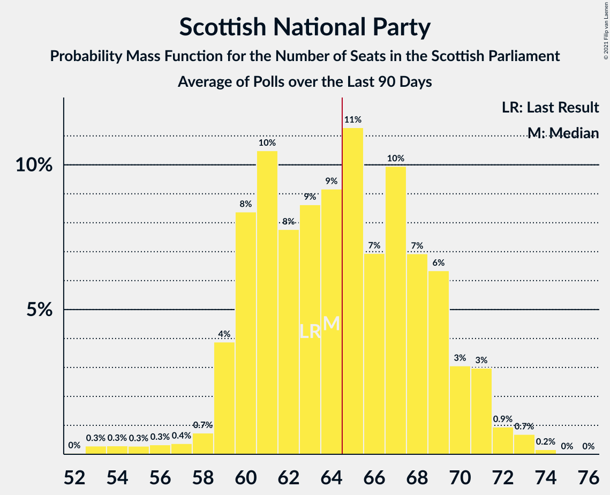

# Scottish National Party

<a href="#voting-intentions">Voting Intentions</a> | <a href="#seats">Seats</a>

## Voting Intentions

Last result: **41.7%** (General Election of 5 May 2016)

### Confidence Intervals

| Period     | Polling firm/Commissioner(s) | Median | 80% Confidence Interval | 90% Confidence Interval | 95% Confidence Interval | 99% Confidence Interval |
|:----------:|:----------------:|:-----------:|:-----------------------:|:-----------------------:|:-----------------------:|:-----------------------:|
| N/A | [Poll Average](average.html) | 38.9% | 35.1–43.9% | 34.3–44.9% | 33.7–45.6% | 32.5–46.9% |
| [20–22 April 2021](2021-04-22-Survation.html) | Survation   The Sunday Post | 35.4% | 33.5–37.3% | 33.0–37.9% | 32.5–38.4% | 31.6–39.3% |
| [16–20 April 2021](2021-04-20-YouGov.html) | YouGov   The Times | 39.8% | 38.0–41.6% | 37.5–42.1% | 37.1–42.6% | 36.2–43.5% |
| [16–20 April 2021](2021-04-20-SavantaComRes.html) | Savanta ComRes   The Scotsman | 38.8% | 36.8–40.8% | 36.3–41.3% | 35.8–41.8% | 34.9–42.8% |
| [9–12 April 2021](2021-04-12-Panelbase.html) | Panelbase   Believe in Scotland | 36.0% | 34.1–38.0% | 33.6–38.6% | 33.1–39.1% | 32.2–40.0% |
| [2–7 April 2021](2021-04-07-SavantaComRes.html) | Savanta ComRes   The Scotsman | 39.6% | 37.7–41.6% | 37.1–42.2% | 36.6–42.7% | 35.7–43.7% |
| [1–6 April 2021](2021-04-06-Opinium.html) | Opinium   Sky News | 44.0% | 42.0–46.0% | 41.5–46.6% | 41.0–47.1% | 40.0–48.0% |
| [30 March–4 April 2021](2021-04-04-IpsosMORI.html) | Ipsos MORI   STV News | 38.0% | 36.0–39.9% | 35.5–40.5% | 35.1–41.0% | 34.1–41.9% |
| [30 March–1 April 2021](2021-04-01-Panelbase.html) | Panelbase   The Sunday Times | 39.0% | 37.1–41.0% | 36.5–41.6% | 36.0–42.1% | 35.1–43.0% |
| [29–30 March 2021](2021-03-30-Survation.html) | Survation   The Courier | 38.0% | 36.1–40.0% | 35.5–40.6% | 35.0–41.1% | 34.1–42.0% |
| [23–26 March 2021](2021-03-26-FindOutNow.html) | Find Out Now   Daily Express | 42.5% | 40.5–44.5% | 39.9–45.0% | 39.5–45.5% | 38.5–46.5% |
| [19–22 March 2021](2021-03-22-YouGov.html) | YouGov   The Times | 45.5% | 43.5–47.5% | 42.9–48.1% | 42.4–48.6% | 41.5–49.6% |
| [16–19 March 2021](2021-03-19-BMGResearch.html) | BMG Research   Herald Scotland | 42.0% | 40.1–44.0% | 39.5–44.6% | 39.0–45.1% | 38.1–46.0% |
| [11–18 March 2021](2021-03-18-Survation.html) | Survation   The Courier | 39.4% | 37.8–41.0% | 37.4–41.5% | 37.0–41.9% | 36.2–42.7% |
| [11–16 March 2021](2021-03-16-Opinium.html) | Opinium   Sky News | 42.4% | 40.5–44.4% | 40.0–44.9% | 39.5–45.4% | 38.6–46.3% |
| [9–12 March 2021](2021-03-12-Survation.html) | Survation   Scotland in Union | 39.0% | 37.0–41.0% | 36.5–41.5% | 36.0–42.0% | 35.1–43.0% |
| [5–10 March 2021](2021-03-10-SavantaComRes.html) | Savanta ComRes   The Scotsman | 40.0% | 38.1–42.1% | 37.5–42.6% | 37.1–43.1% | 36.1–44.1% |
| [4–8 March 2021](2021-03-08-YouGov.html) | YouGov   The Times | 45.0% | 43.1–46.9% | 42.5–47.5% | 42.1–48.0% | 41.2–48.9% |
| [3–5 March 2021](2021-03-05-Panelbase.html) | Panelbase   The Sunday Times | 42.0% | 40.0–44.0% | 39.4–44.5% | 38.9–45.0% | 38.0–46.0% |
| [24–25 February 2021](2021-02-25-Survation.html) | Survation   Daily Record | 38.0% | 36.0–40.0% | 35.5–40.5% | 35.0–41.0% | 34.1–42.0% |
| [15–21 February 2021](2021-02-21-IpsosMORI.html) | Ipsos MORI   STV News | 47.0% | 45.1–49.0% | 44.5–49.6% | 44.0–50.1% | 43.1–51.1% |
| [4–9 February 2021](2021-02-09-SavantaComRes.html) | Savanta ComRes   The Scotsman | 43.0% | 41.0–45.0% | 40.5–45.6% | 40.0–46.1% | 39.0–47.1% |
| [19–22 January 2021](2021-01-22-Panelbase.html) | Panelbase   The Sunday Times | 46.5% | 44.5–48.4% | 43.9–49.0% | 43.5–49.5% | 42.5–50.4% |
| [11–13 January 2021](2021-01-13-Survation.html) | Survation   Scot Goes Pop | 40.0% | 38.1–42.0% | 37.5–42.6% | 37.0–43.0% | 36.1–44.0% |
| [8–13 January 2021](2021-01-13-SavantaComRes.html) | Savanta ComRes   The Scotsman | 44.0% | 42.0–46.0% | 41.5–46.6% | 41.0–47.1% | 40.0–48.0% |
| [11–15 December 2020](2020-12-15-SavantaComRes.html) | Savanta ComRes   The Scotsman | 42.0% | 40.0–44.0% | 39.4–44.5% | 38.9–45.0% | 38.0–46.0% |
| [4–9 December 2020](2020-12-09-Survation.html) | Survation | 41.0% | 39.0–43.0% | 38.5–43.6% | 38.0–44.1% | 37.1–45.0% |
| [20–26 November 2020](2020-11-26-IpsosMORI.html) | Ipsos MORI   STV News | 47.0% | 45.0–49.0% | 44.4–49.6% | 43.9–50.1% | 43.0–51.1% |
| [5–11 November 2020](2020-11-11-Panelbase.html) | Panelbase   Scot Goes Pop | 45.6% | 43.6–47.6% | 43.0–48.2% | 42.5–48.7% | 41.6–49.6% |
| [6–10 November 2020](2020-11-10-YouGov.html) | YouGov | 47.0% | 45.1–49.0% | 44.5–49.5% | 44.1–50.0% | 43.1–50.9% |
| [3 November 2020](2020-11-03-Survation.html) | Survation | 43.0% | 41.1–45.0% | 40.6–45.6% | 40.1–46.0% | 39.2–47.0% |
| [9 October 2020](2020-10-09-SavantaComRes.html) | Savanta ComRes | 41.4% | 39.4–43.4% | 38.8–44.0% | 38.4–44.5% | 37.4–45.4% |
| [2–9 October 2020](2020-10-09-IpsosMORI.html) | Ipsos MORI   STV News | 48.0% | 46.1–50.0% | 45.5–50.6% | 45.0–51.1% | 44.1–52.0% |
| [17–21 September 2020](2020-09-21-JLPartners.html) | JL Partners   Politico | 53.0% | 50.9–55.0% | 50.4–55.5% | 49.9–56.0% | 48.9–57.0% |
| [2–7 September 2020](2020-09-07-Survation.html) | Survation | 41.8% | 39.9–43.8% | 39.3–44.4% | 38.9–44.9% | 37.9–45.9% |
| [6–13 August 2020](2020-08-13-SavantaComRes.html) | Savanta ComRes | 42.6% | 40.6–44.6% | 40.0–45.1% | 39.5–45.6% | 38.6–46.6% |
| [6–10 August 2020](2020-08-10-YouGov.html) | YouGov   The Times | 46.5% | 44.6–48.4% | 44.1–48.9% | 43.6–49.4% | 42.7–50.3% |
| [3 July 2020](2020-07-03-Panelbase.html) | Panelbase   The Sunday Times | 50.5% | 48.5–52.5% | 47.9–53.1% | 47.4–53.5% | 46.5–54.5% |
| [1–5 June 2020](2020-06-05-Panelbase.html) | Panelbase   Scot Goes Pop | 48.0% | 46.0–50.1% | 45.5–50.6% | 45.0–51.1% | 44.0–52.1% |
| [1–5 May 2020](2020-05-05-Panelbase.html) | Panelbase   Wings Over Scotland | 48.5% | 46.6–50.5% | 46.0–51.0% | 45.6–51.5% | 44.6–52.4% |
| [24–27 April 2020](2020-04-27-YouGov.html) | YouGov | 45.0% | 43.1–47.0% | 42.6–47.5% | 42.1–48.0% | 41.2–48.9% |
| [24–26 March 2020](2020-03-26-Panelbase.html) | Panelbase   The Sunday Times | 48.0% | 46.0–50.0% | 45.4–50.6% | 44.9–51.1% | 44.0–52.0% |
| [28–31 January 2020](2020-01-31-Panelbase.html) | Panelbase   Scot Goes Pop | 46.9% | 44.8–48.9% | 44.3–49.4% | 43.8–49.9% | 42.8–50.9% |
| [20–22 January 2020](2020-01-22-Survation.html) | Survation   Progress Scotland | 38.3% | 36.4–40.3% | 35.8–40.8% | 35.3–41.3% | 34.4–42.3% |
| [3–6 December 2019](2019-12-06-Panelbase.html) | Panelbase   The Sunday Times | 38.0% | 36.1–40.0% | 35.6–40.6% | 35.1–41.1% | 34.2–42.0% |
| [3 December 2019](2019-12-03-YouGov.html) | YouGov   The Times | 37.2% | 35.3–39.2% | 34.8–39.8% | 34.3–40.3% | 33.4–41.2% |
| [20–22 November 2019](2019-11-22-Panelbase.html) | Panelbase   The Sunday Times | 39.0% | 37.1–41.0% | 36.5–41.6% | 36.1–42.1% | 35.2–43.1% |
| [9–11 October 2019](2019-10-11-Panelbase.html) | Panelbase   The Sunday Times | 38.6% | 36.6–40.6% | 36.1–41.2% | 35.6–41.6% | 34.7–42.6% |
| [3 September 2019](2019-09-03-YouGov.html) | YouGov   The Times | 38.9% | 37.0–40.9% | 36.5–41.4% | 36.0–41.9% | 35.1–42.8% |
| [18–20 June 2019](2019-06-20-Panelbase.html) | Panelbase   The Sunday Times | 39.6% | 37.6–41.5% | 37.1–42.1% | 36.6–42.6% | 35.7–43.5% |
| [14–17 May 2019](2019-05-17-Panelbase.html) | Panelbase   The Sunday Times | 37.4% | 35.5–39.4% | 35.0–39.9% | 34.5–40.4% | 33.6–41.4% |
| [24–26 April 2019](2019-04-26-YouGov.html) | YouGov   The Times | 36.6% | 34.7–38.6% | 34.2–39.2% | 33.7–39.6% | 32.8–40.6% |
| [18–24 April 2019](2019-04-24-Panelbase.html) | Panelbase | 37.0% | 35.1–39.0% | 34.6–39.6% | 34.1–40.1% | 33.2–41.0% |
| [6 March 2019](2019-03-06-Panelbase.html) | Panelbase   Wings Over Scotland | 36.2% | 34.3–38.2% | 33.8–38.8% | 33.3–39.3% | 32.4–40.2% |
| [1–4 March 2019](2019-03-04-Survation.html) | Survation   Scottish Daily Mail | 32.3% | 30.5–34.3% | 30.0–34.8% | 29.5–35.3% | 28.7–36.2% |
| [5 December 2018](2018-12-05-Panelbase.html) | Panelbase   The Sunday Times | 37.9% | 36.0–39.9% | 35.5–40.5% | 35.0–41.0% | 34.1–41.9% |
| [2–7 November 2018](2018-11-07-Panelbase.html) | Panelbase   Constitutional Commission | 37.2% | 35.3–39.2% | 34.8–39.7% | 34.4–40.2% | 33.5–41.2% |
| [18–21 October 2018](2018-10-21-Survation.html) | Survation   Daily Record | 32.0% | 30.1–33.9% | 29.6–34.4% | 29.2–34.9% | 28.3–35.8% |
| [3–5 October 2018](2018-10-05-Survation.html) | Survation   SNP | 39.6% | 37.6–41.6% | 37.1–42.1% | 36.6–42.6% | 35.7–43.6% |
| [4 October 2018](2018-10-04-Panelbase.html) | Panelbase   The Sunday Times | 35.4% | 33.5–37.3% | 32.9–37.9% | 32.5–38.3% | 31.6–39.3% |
| [2 October 2018](2018-10-02-Survation.html) | Survation   The Sunday Post | 32.2% | 30.4–34.1% | 29.9–34.7% | 29.5–35.2% | 28.6–36.1% |
| [5–10 July 2018](2018-07-10-Survation.html) | Survation   Daily Record | 33.0% | 31.1–34.9% | 30.6–35.5% | 30.1–35.9% | 29.2–36.9% |
| [21–27 June 2018](2018-06-27-Panelbase.html) | Panelbase   Wings Over Scotland | 36.0% | 34.0–37.9% | 33.5–38.5% | 33.1–39.0% | 32.2–39.9% |
| [8–13 June 2018](2018-06-13-Panelbase.html) | Panelbase   The Sunday Times | 36.2% | 34.3–38.2% | 33.8–38.8% | 33.3–39.2% | 32.4–40.2% |
| [1–5 June 2018](2018-06-05-YouGov.html) | YouGov   The Times | 32.3% | 30.5–34.2% | 30.0–34.7% | 29.5–35.1% | 28.7–36.0% |
| [24–28 January 2018](2018-01-28-Survation.html) | Survation   Daily Record | 33.0% | 31.2–35.0% | 30.7–35.5% | 30.2–36.0% | 29.4–36.9% |
| [12–16 January 2018](2018-01-16-YouGov.html) | YouGov   The Times | 31.6% | 29.8–33.6% | 29.3–34.1% | 28.8–34.6% | 28.0–35.5% |
| [1–5 December 2017](2017-12-05-Survation.html) | Survation   The Sunday Post | 31.7% | 29.9–33.6% | 29.4–34.2% | 28.9–34.7% | 28.0–35.6% |
| [27–30 November 2017](2017-11-30-Survation.html) | Survation   Daily Record | 33.2% | 31.4–35.2% | 30.8–35.7% | 30.4–36.2% | 29.5–37.1% |
| [2–5 October 2017](2017-10-05-YouGov.html) | YouGov   The Times | 35.6% | 33.8–37.4% | 33.3–38.0% | 32.9–38.4% | 32.0–39.3% |
| [8–12 September 2017](2017-09-12-Survation.html) | Survation   Scottish Daily Mail | 31.2% | 29.4–33.1% | 28.9–33.7% | 28.4–34.1% | 27.6–35.1% |
| [9–14 March 2017](2017-03-14-YouGov.html) | YouGov   The Times | 40.0% | 38.0–42.0% | 37.5–42.5% | 37.0–43.0% | 36.1–44.0% |
| [24–29 November 2016](2016-11-29-YouGov.html) | YouGov   The Times | 39.3% | 37.5–41.2% | 37.0–41.7% | 36.5–42.2% | 35.7–43.1% |
| [4 October 2016](2016-10-04-BMGResearch.html) | BMG Research | 43.9% | 41.9–45.9% | 41.3–46.5% | 40.8–46.9% | 39.9–47.9% |
| [29–31 August 2016](2016-08-31-YouGov.html) | YouGov   The Times | 45.8% | 43.8–47.8% | 43.3–48.4% | 42.8–48.9% | 41.9–49.8% |
| [24–28 June 2016](2016-06-28-Survation.html) | Survation   Scottish Daily Mail | 40.6% | 38.7–42.5% | 38.1–43.1% | 37.6–43.6% | 36.7–44.5% |

### Probability Mass Function

The following table shows the probability mass function per percentage block of voting intentions for the [poll average](average.html) for Scottish National Party.

| Voting Intentions | Probability | Accumulated | Special Marks |
|:-----------------:|:-----------:|:-----------:|:-------------:|
| 29.5–30.5% | 0% | 100% |  |
| 30.5–31.5% | 0.1% | 100% |  |
| 31.5–32.5% | 0.4% | 99.9% |  |
| 32.5–33.5% | 2% | 99.5% |  |
| 33.5–34.5% | 4% | 98% |  |
| 34.5–35.5% | 7% | 93% |  |
| 35.5–36.5% | 10% | 86% |  |
| 36.5–37.5% | 11% | 76% |  |
| 37.5–38.5% | 11% | 65% |  |
| 38.5–39.5% | 11% | 54% | Median |
| 39.5–40.5% | 9% | 43% |  |
| 40.5–41.5% | 8% | 34% |  |
| 41.5–42.5% | 7% | 26% | Last Result |
| 42.5–43.5% | 7% | 19% |  |
| 43.5–44.5% | 6% | 12% |  |
| 44.5–45.5% | 4% | 6% |  |
| 45.5–46.5% | 2% | 3% |  |
| 46.5–47.5% | 0.6% | 0.8% |  |
| 47.5–48.5% | 0.1% | 0.2% |  |
| 48.5–49.5% | 0% | 0% |  |

## Seats

Last result: **63** seats (General Election of 5 May 2016)

### Confidence Intervals

| Period     | Polling firm/Commissioner(s) | Median | 80% Confidence Interval | 90% Confidence Interval | 95% Confidence Interval | 99% Confidence Interval |
|:----------:|:----------------:|:------:|:-----------------------:|:-----------------------:|:-----------------------:|:-----------------------:|
| N/A | [Poll Average](average.html) | 64 | 60–69 | 59–70 | 58–71 | 54–73 |
| [20–22 April 2021](2021-04-22-Survation.html) | Survation   The Sunday Post | 67 | 62–70 | 61–70 | 60–70 | 59–71 |
| [16–20 April 2021](2021-04-20-YouGov.html) | YouGov   The Times | 63 | 60–67 | 59–69 | 59–70 | 57–71 |
| [16–20 April 2021](2021-04-20-SavantaComRes.html) | Savanta ComRes   The Scotsman | 63 | 60–65 | 59–66 | 57–67 | 56–68 |
| [9–12 April 2021](2021-04-12-Panelbase.html) | Panelbase   Believe in Scotland | 61 | 58–63 | 55–64 | 54–65 | 53–67 |
| [2–7 April 2021](2021-04-07-SavantaComRes.html) | Savanta ComRes   The Scotsman | 64 | 61–67 | 60–69 | 60–69 | 59–71 |
| [1–6 April 2021](2021-04-06-Opinium.html) | Opinium   Sky News | 68 | 65–72 | 64–73 | 64–73 | 63–74 |
| [30 March–4 April 2021](2021-04-04-IpsosMORI.html) | Ipsos MORI   STV News | 61 | 59–67 | 59–68 | 59–69 | 56–69 |
| [30 March–1 April 2021](2021-04-01-Panelbase.html) | Panelbase   The Sunday Times | 66 | 62–68 | 61–69 | 61–69 | 60–70 |
| [29–30 March 2021](2021-03-30-Survation.html) | Survation   The Courier | 65 | 61–68 | 61–68 | 60–69 | 59–69 |
| [23–26 March 2021](2021-03-26-FindOutNow.html) | Find Out Now   Daily Express | 66 | 64–70 | 63–70 | 62–71 | 60–72 |
| [19–22 March 2021](2021-03-22-YouGov.html) | YouGov   The Times | 67 | 66–71 | 66–72 | 65–72 | 62–73 |
| [16–19 March 2021](2021-03-19-BMGResearch.html) | BMG Research   Herald Scotland | 65 | 62–69 | 61–69 | 61–70 | 60–70 |
| [11–18 March 2021](2021-03-18-Survation.html) | Survation   The Courier | 63 | 60–65 | 60–67 | 59–68 | 58–69 |
| [11–16 March 2021](2021-03-16-Opinium.html) | Opinium   Sky News | 65 | 62–68 | 61–70 | 61–70 | 59–72 |
| [9–12 March 2021](2021-03-12-Survation.html) | Survation   Scotland in Union | 61 | 59–64 | 58–65 | 58–66 | 55–68 |
| [5–10 March 2021](2021-03-10-SavantaComRes.html) | Savanta ComRes   The Scotsman | 61 | 59–65 | 58–65 | 56–67 | 55–69 |
| [4–8 March 2021](2021-03-08-YouGov.html) | YouGov   The Times | 71 | 67–73 | 65–74 | 65–75 | 65–76 |
| [3–5 March 2021](2021-03-05-Panelbase.html) | Panelbase   The Sunday Times | 65 | 62–68 | 61–69 | 61–70 | 60–71 |
| [24–25 February 2021](2021-02-25-Survation.html) | Survation   Daily Record | 60 | 58–64 | 58–66 | 57–67 | 53–68 |
| [15–21 February 2021](2021-02-21-IpsosMORI.html) | Ipsos MORI   STV News | 71 | 67–72 | 65–73 | 65–74 | 65–75 |
| [4–9 February 2021](2021-02-09-SavantaComRes.html) | Savanta ComRes   The Scotsman | 66 | 63–69 | 63–70 | 62–71 | 61–71 |
| [19–22 January 2021](2021-01-22-Panelbase.html) | Panelbase   The Sunday Times | 70 | 69–73 | 67–73 | 66–73 | 65–75 |
| [11–13 January 2021](2021-01-13-Survation.html) | Survation   Scot Goes Pop | 63 | 62–68 | 61–68 | 60–69 | 59–69 |
| [8–13 January 2021](2021-01-13-SavantaComRes.html) | Savanta ComRes   The Scotsman | 68 | 65–71 | 64–71 | 63–72 | 62–73 |
| [11–15 December 2020](2020-12-15-SavantaComRes.html) | Savanta ComRes   The Scotsman | 66 | 62–70 | 61–70 | 61–71 | 60–72 |
| [4–9 December 2020](2020-12-09-Survation.html) | Survation | 65 | 63–69 | 62–70 | 61–71 | 59–71 |
| [20–26 November 2020](2020-11-26-IpsosMORI.html) | Ipsos MORI   STV News | 71 | 67–73 | 65–74 | 65–74 | 65–76 |
| [5–11 November 2020](2020-11-11-Panelbase.html) | Panelbase   Scot Goes Pop | 70 | 67–71 | 66–72 | 65–73 | 64–74 |
| [6–10 November 2020](2020-11-10-YouGov.html) | YouGov | 72 | 70–75 | 70–76 | 69–76 | 67–78 |
| [3 November 2020](2020-11-03-Survation.html) | Survation | 67 | 64–69 | 63–70 | 63–70 | 63–72 |
| [9 October 2020](2020-10-09-SavantaComRes.html) | Savanta ComRes | 64 | 60–68 | 60–69 | 60–69 | 59–71 |
| [2–9 October 2020](2020-10-09-IpsosMORI.html) | Ipsos MORI   STV News | 72 | 70–73 | 70–74 | 70–75 | 69–76 |
| [17–21 September 2020](2020-09-21-JLPartners.html) | JL Partners   Politico | 78 | 74–81 | 73–81 | 73–82 | 72–84 |
| [2–7 September 2020](2020-09-07-Survation.html) | Survation | 67 | 63–70 | 63–71 | 62–71 | 60–72 |
| [6–13 August 2020](2020-08-13-SavantaComRes.html) | Savanta ComRes | 67 | 63–69 | 61–70 | 61–70 | 60–71 |
| [6–10 August 2020](2020-08-10-YouGov.html) | YouGov   The Times | 72 | 70–74 | 69–75 | 68–76 | 66–77 |
| [3 July 2020](2020-07-03-Panelbase.html) | Panelbase   The Sunday Times | 74 | 72–76 | 71–76 | 70–77 | 69–79 |
| [1–5 June 2020](2020-06-05-Panelbase.html) | Panelbase   Scot Goes Pop | 71 | 69–73 | 69–75 | 69–75 | 67–77 |
| [1–5 May 2020](2020-05-05-Panelbase.html) | Panelbase   Wings Over Scotland | 71 | 68–74 | 67–74 | 66–75 | 65–76 |
| [24–27 April 2020](2020-04-27-YouGov.html) | YouGov | 67 | 65–71 | 65–72 | 64–73 | 63–74 |
| [24–26 March 2020](2020-03-26-Panelbase.html) | Panelbase   The Sunday Times | 69 | 66–73 | 65–74 | 65–75 | 64–76 |
| [28–31 January 2020](2020-01-31-Panelbase.html) | Panelbase   Scot Goes Pop | 67 | 65–71 | 64–71 | 64–72 | 62–73 |
| [20–22 January 2020](2020-01-22-Survation.html) | Survation   Progress Scotland | 61 | 59–65 | 58–67 | 57–68 | 55–70 |
| [3–6 December 2019](2019-12-06-Panelbase.html) | Panelbase   The Sunday Times | 59 | 55–62 | 55–63 | 54–63 | 53–64 |
| [3 December 2019](2019-12-03-YouGov.html) | YouGov   The Times | 58 | 55–62 | 54–63 | 54–63 | 53–64 |
| [20–22 November 2019](2019-11-22-Panelbase.html) | Panelbase   The Sunday Times | 61 | 57–64 | 56–64 | 55–65 | 55–65 |
| [9–11 October 2019](2019-10-11-Panelbase.html) | Panelbase   The Sunday Times | 61 | 59–63 | 58–64 | 58–65 | 56–68 |
| [3 September 2019](2019-09-03-YouGov.html) | YouGov   The Times | 62 | 60–66 | 60–67 | 60–68 | 57–68 |
| [18–20 June 2019](2019-06-20-Panelbase.html) | Panelbase   The Sunday Times | 63 | 60–67 | 60–67 | 59–67 | 58–68 |
| [14–17 May 2019](2019-05-17-Panelbase.html) | Panelbase   The Sunday Times | 62 | 60–65 | 59–66 | 59–67 | 57–68 |
| [24–26 April 2019](2019-04-26-YouGov.html) | YouGov   The Times | 62 | 60–66 | 59–67 | 59–68 | 57–69 |
| [18–24 April 2019](2019-04-24-Panelbase.html) | Panelbase | 61 | 58–63 | 57–64 | 55–65 | 54–66 |
| [6 March 2019](2019-03-06-Panelbase.html) | Panelbase   Wings Over Scotland | 56 | 54–60 | 53–60 | 52–61 | 50–62 |
| [1–4 March 2019](2019-03-04-Survation.html) | Survation   Scottish Daily Mail | 53 | 48–58 | 46–59 | 45–60 | 43–62 |
| [5 December 2018](2018-12-05-Panelbase.html) | Panelbase   The Sunday Times | 58 | 54–61 | 53–61 | 51–62 | 50–63 |
| [2–7 November 2018](2018-11-07-Panelbase.html) | Panelbase   Constitutional Commission | 57 | 53–60 | 52–61 | 51–61 | 48–62 |
| [18–21 October 2018](2018-10-21-Survation.html) | Survation   Daily Record | 47 | 42–53 | 42–55 | 41–56 | 39–58 |
| [3–5 October 2018](2018-10-05-Survation.html) | Survation   SNP | 60 | 58–62 | 56–63 | 55–64 | 52–65 |
| [4 October 2018](2018-10-04-Panelbase.html) | Panelbase   The Sunday Times | 55 | 52–59 | 51–60 | 49–60 | 46–61 |
| [2 October 2018](2018-10-02-Survation.html) | Survation   The Sunday Post | 49 | 43–57 | 42–59 | 41–59 | 38–61 |
| [5–10 July 2018](2018-07-10-Survation.html) | Survation   Daily Record | 55 | 48–59 | 46–60 | 44–61 | 42–63 |
| [21–27 June 2018](2018-06-27-Panelbase.html) | Panelbase   Wings Over Scotland | 54 | 50–58 | 48–59 | 47–60 | 45–61 |
| [8–13 June 2018](2018-06-13-Panelbase.html) | Panelbase   The Sunday Times | 54 | 50–58 | 48–60 | 47–60 | 45–61 |
| [1–5 June 2018](2018-06-05-YouGov.html) | YouGov   The Times | 51 | 45–54 | 43–55 | 43–56 | 41–59 |
| [24–28 January 2018](2018-01-28-Survation.html) | Survation   Daily Record | 50 | 44–57 | 43–59 | 42–60 | 41–62 |
| [12–16 January 2018](2018-01-16-YouGov.html) | YouGov   The Times | 49 | 43–53 | 42–55 | 42–56 | 40–59 |
| [1–5 December 2017](2017-12-05-Survation.html) | Survation   The Sunday Post | 46 | 42–52 | 41–55 | 40–56 | 39–59 |
| [27–30 November 2017](2017-11-30-Survation.html) | Survation   Daily Record | 48 | 43–55 | 42–57 | 41–58 | 40–60 |
| [2–5 October 2017](2017-10-05-YouGov.html) | YouGov   The Times | 54 | 50–59 | 48–60 | 48–61 | 46–63 |
| [8–12 September 2017](2017-09-12-Survation.html) | Survation   Scottish Daily Mail | 44 | 40–52 | 40–54 | 39–58 | 36–59 |
| [9–14 March 2017](2017-03-14-YouGov.html) | YouGov   The Times | 62 | 59–65 | 58–65 | 57–66 | 56–69 |
| [24–29 November 2016](2016-11-29-YouGov.html) | YouGov   The Times | 62 | 59–64 | 58–65 | 57–65 | 55–67 |
| [4 October 2016](2016-10-04-BMGResearch.html) | BMG Research | 69 | 65–71 | 65–71 | 64–72 | 62–73 |
| [29–31 August 2016](2016-08-31-YouGov.html) | YouGov   The Times | 70 | 66–71 | 65–72 | 65–73 | 64–73 |
| [24–28 June 2016](2016-06-28-Survation.html) | Survation   Scottish Daily Mail | 66 | 62–69 | 61–69 | 61–70 | 60–70 |

### Probability Mass Function

The following table shows the probability mass function per seat for the [poll average](average.html) for Scottish National Party.

| Number of Seats | Probability | Accumulated | Special Marks |
|:---------------:|:-----------:|:-----------:|:-------------:|
| 53 | 0.3% | 100% |  |
| 54 | 0.3% | 99.7% |  |
| 55 | 0.4% | 99.4% |  |
| 56 | 0.4% | 99.0% |  |
| 57 | 0.7% | 98.6% |  |
| 58 | 1.0% | 98% |  |
| 59 | 5% | 97% |  |
| 60 | 10% | 92% |  |
| 61 | 10% | 82% |  |
| 62 | 7% | 71% |  |
| 63 | 10% | 64% | Last Result |
| 64 | 9% | 54% | Median |
| 65 | 10% | 45% | Majority |
| 66 | 7% | 34% |  |
| 67 | 6% | 28% |  |
| 68 | 7% | 22% |  |
| 69 | 5% | 15% |  |
| 70 | 4% | 9% |  |
| 71 | 3% | 5% |  |
| 72 | 1.0% | 2% |  |
| 73 | 0.7% | 0.9% |  |
| 74 | 0.2% | 0.2% |  |
| 75 | 0% | 0% |  |

